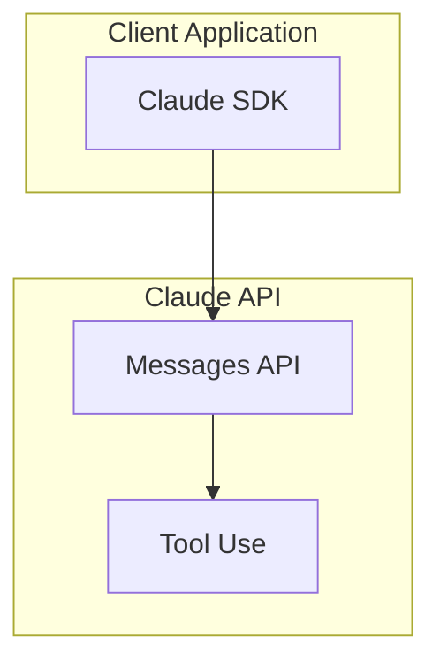

# Anthropic News Reporter Skill <!-- omit in toc -->

## 目次

- [目次](#目次)
- [情報ソース](#情報ソース)
- [ワークフロー](#ワークフロー)
  - [0. 現在時刻の確認](#0-現在時刻の確認)
  - [1. ニュースソースから最新情報を取得](#1-ニュースソースから最新情報を取得)
  - [2. 期間フィルタリング (デフォルト: 過去 7 日間)](#2-期間フィルタリングデフォルト-過去-7-日間)
  - [3. 重複チェック](#3-重複チェック)
  - [4. 詳細情報の取得](#4-詳細情報の取得)
  - [5. レポート作成](#5-レポート作成)
  - [6. アーキテクチャ図の作成 (必要に応じて)](#6-アーキテクチャ図の作成必要に応じて)
- [出力形式](#出力形式)
- [実行例](#実行例)
- [注意事項](#注意事項)


Anthropic News、Claude API リリースノート、Claude Code Changelog から最新情報を取得し、構造化されたレポートを作成する。

## 情報ソース

1. **Anthropic News**: https://www.anthropic.com/news
   - 公式発表、新機能、研究成果
   - HTML ページをパースして取得

2. **Claude Developer Platform Release Notes**: https://platform.claude.com/docs/en/release-notes/overview
   - Claude API の更新情報
   - Messages API、SDK、新機能など

3. **Claude Code Changelog**: https://github.com/anthropics/claude-code/blob/main/CHANGELOG.md
   - Claude Code CLI の更新履歴
   - バージョンごとの変更内容

4. **Claude Apps Release Notes**: https://support.claude.com/en/articles/12138966-release-notes
   - Claude.ai の更新情報
   - ユーザー向け機能の変更

## ワークフロー

### 0. 現在時刻の確認

**重要**: 作業を開始する前に、必ず現在時刻を確認する。

```bash
date "+%Y-%m-%d %H:%M:%S %Z"
```

### 1. ニュースソースから最新情報を取得

**重要**: 各ソースは**1 回だけ**取得する。複数回リクエストしない。

#### Anthropic News の取得

**WebFetch ツールを使用** (Next.js サイトのため curl では取得不可):

```
WebFetch を使用して https://www.anthropic.com/news から最新ニュースを取得。
プロンプト: "最新のニュース記事を20件、以下の形式でJSON配列として抽出:
[{\"title\": \"タイトル\", \"date\": \"YYYY-MM-DD\", \"link\": \"URL\", \"description\": \"説明\"}]"
```

#### Claude API Release Notes の取得

**WebFetch ツールを使用**:

```
WebFetch を使用して https://platform.claude.com/docs/en/release-notes/overview から取得。
プロンプト: "過去30日間のリリースノートを日付ごとに抽出。
各エントリは {\"date\": \"YYYY-MM-DD\", \"items\": [\"変更内容1\", \"変更内容2\"]} 形式で。"
```

#### Claude Code Changelog の取得

```bash
# Changelog を取得 (Markdown なので curl で取得可能)
curl -sL "https://raw.githubusercontent.com/anthropics/claude-code/main/CHANGELOG.md" > /tmp/claude_code_changelog.md

# パーサースクリプトで JSON に変換
python3 .claude/skills/anthropic-news-summary/scripts/parse_claude_code_changelog.py --days 7 --feed /tmp/claude_code_changelog.md
```

**パーサースクリプトのオプション:**

- `--days DAYS`: 取得する期間 (デフォルト: 7)
- `--feed PATH`: 入力ファイルのパス

### 2. 期間フィルタリング (デフォルト: 過去 7 日間)

パーサースクリプトの `--days` オプションで期間を指定。デフォルトは 7 日間。

```bash
# 過去 14 日間のアイテムを取得
python3 .claude/skills/anthropic-news-summary/scripts/parse_anthropic_news.py --days 14
```

### 3. 重複チェック

既存のレポートと重複しないか確認する。

```bash
# 既存レポートのリストを取得
ls reports/*/
```

出力ファイル名は `YYYY-MM-DD-<slug>.md` 形式。同じ日付とスラッグの組み合わせが存在する場合はスキップ。

### 4. 詳細情報の取得

各ニュースアイテムについて、詳細ページから追加情報を取得する。

#### Anthropic News の詳細

```bash
# 詳細ページを取得 (例)
curl -sL "https://www.anthropic.com/news/claude-opus-4-6" > /tmp/news_detail.html
```

#### Claude API ドキュメント

リリースノートに記載されているドキュメントリンクを参照して詳細を確認。

### 5. レポート作成

以下のテンプレートに従ってレポートを作成する。

**ファイル名規則**: `reports/YYYY/YYYY-MM-DD-<slug>.md`

- `YYYY`: 年
- `MM-DD`: 月日
- `slug`: タイトルから生成した URL フレンドリーな文字列

**レポートテンプレート**: `report_template.md` を参照

### 6. アーキテクチャ図の作成 (必要に応じて)

技術的な内容の場合、Mermaid 形式でアーキテクチャ図を追加する。



### 7. インフォグラフィックの作成

レポート作成後、対応するインフォグラフィックを生成する。

**参照**: `#[[file:../creating-infographic/SKILL.md]]`

#### インフォグラフィック生成ワークフロー

1. **レポートを読み込む**: `reports/YYYY/YYYY-MM-DD-<slug>.md`
2. **テーマを選択**: `anthropic-news` テーマを使用
3. **コンテンツを構成**:
   - 概要 (キーポイント、Before/After)
   - 主要機能カード
   - 技術詳細 (Mermaid 図、コードサンプル)
   - ユースケース
4. **HTML を生成**: `infographic/YYYY-MM-DD-<slug>.html`

#### 必須セクション

| セクション | 内容 |
|-----------|------|
| ヘッダー | タイトル、日付、カテゴリバッジ |
| 概要 | キーポイント (3-5 個) |
| 主要機能 | 機能カード (3-5 個) |
| 技術詳細 | アーキテクチャ図、コードサンプル |
| ユースケース | 2-3 個の具体例 |
| フッター | 出典 URL |

#### 追加セクション (情報がある場合)

- **Before/After 比較**: 変更前後の比較
- **統計情報**: パフォーマンス数値、改善率
- **API 変更点**: 新しいエンドポイント、パラメータ
- **料金情報**: コスト比較

#### 出力先

```
infographic/
├── 2026-03-07-claude-sonnet-4-6.html
├── 2026-03-05-claude-code-v2-1-70.html
└── ...
```

## 出力形式

### ディレクトリ構造

```
reports/
├── 2026/
│   ├── 2026-03-07-claude-sonnet-4-6.md
│   ├── 2026-03-05-claude-opus-4-6.md
│   └── ...
├── index.md
└── README.md
```

### レポートファイル形式

各レポートは以下の構造を持つ:

1. **タイトル**: アップデートの要約
2. **メタデータ**: 日付、ソース、カテゴリ
3. **概要**: 1-2 段落での要約
4. **詳細**: 技術的な説明
5. **影響**: 開発者への影響
6. **関連リンク**: 公式ドキュメントへのリンク

## 実行例

### 例 1: デフォルト実行 (過去 7 日間のアップデート)

```
Anthropic の最新ニュースをレポートしてください
```

### 例 2: 期間指定

```
過去 14 日間の Anthropic アップデートをレポートしてください
```

### 例 3: 特定トピック

```
Claude API の最新変更をレポートしてください
```

### 例 4: Claude Code

```
Claude Code の最新アップデートをレポートしてください
```

## 注意事項

1. **レート制限**: 各ソースへのリクエストは 1 回のみ
2. **キャッシュ**: 取得したデータは一時ファイルに保存
3. **日本語**: レポートは日本語で作成
4. **図表**: 必要に応じて Mermaid 図を追加
5. **リンク**: 公式ドキュメントへのリンクを必ず含める
