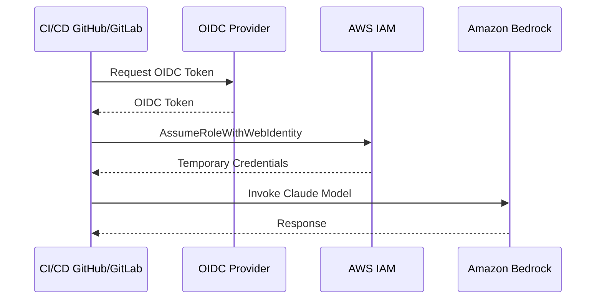

# CI/CD セットアップガイド <!-- omit in toc -->

[← README に戻る](../README.md)

このガイドでは、OpenID Connect (OIDC) 認証を使用して GitHub Actions で Anthropic News Summary の自動化を設定する方法を説明する。

- [概要](#概要)
- [前提条件](#前提条件)
- [パート 1: AWS セットアップ (共通)](#パート-1-aws-セットアップ-共通)
  - [Amazon Bedrock モデルアクセスを有効化](#amazon-bedrock-モデルアクセスを有効化)
- [パート 2: GitHub Actions 向けセットアップ](#パート-2-github-actions-向けセットアップ)
  - [ステップ 1: OIDC プロバイダーと IAM ロールを作成](#ステップ-1-oidc-プロバイダーと-iam-ロールを作成)
  - [ステップ 2: GitHub リポジトリシークレットを設定](#ステップ-2-github-リポジトリシークレットを設定)
  - [ステップ 3: GitHub Pages を有効化](#ステップ-3-github-pages-を有効化)
  - [ステップ 4: ワークフローをテスト](#ステップ-4-ワークフローをテスト)
- [パート 3: GitLab CI 向けセットアップ](#パート-3-gitlab-ci-向けセットアップ)
  - [ステップ 1: OIDC プロバイダーと IAM ロールを作成](#ステップ-1-oidc-プロバイダーと-iam-ロールを作成-1)
  - [ステップ 2: GitLab CI/CD 変数を設定](#ステップ-2-gitlab-cicd-変数を設定)
- [トラブルシューティング](#トラブルシューティング)
  - [よくある問題](#よくある問題)
  - [OIDC トークンクレームの確認](#oidc-トークンクレームの確認)
- [参考資料](#参考資料)


## 概要

GitHub Actions と GitLab CI は両方とも AWS との OIDC 認証をサポートしており、長期間有効な AWS 認証情報を保存せずに CI/CD パイプラインで IAM ロールを引き受けることができる。これはセキュリティ上推奨されるアプローチである。



## 前提条件

- Amazon Bedrock アクセスが有効な AWS アカウント
- IAM ID プロバイダーとロールを作成する権限
- GitHub リポジトリまたは GitLab プロジェクト

## パート 1: AWS セットアップ (共通)

### Amazon Bedrock モデルアクセスを有効化

1. [Amazon Bedrock コンソール](https://console.aws.amazon.com/bedrock/) を開く
2. 左サイドバーで **Model access** に移動
3. **Modify model access** をクリック
4. 以下のモデルへのアクセスを有効化する。
   - `Anthropic Claude Opus 4.5`
   - `Anthropic Claude Sonnet 4.5` (フォールバック用)
5. **Save changes** をクリック

## パート 2: GitHub Actions 向けセットアップ

### ステップ 1: OIDC プロバイダーと IAM ロールを作成

以下のスクリプトで、GitHub OIDC プロバイダー、Bedrock 用 IAM ポリシー、IAM ロールを CloudFormation スタックとして一括作成できる。

```bash
./scripts/deploy-iam.sh -p github -o <OWNER>
```

- `<OWNER>`: GitHub リポジトリのオーナー/org (例: `takech9203`)

リポジトリ名はデフォルトで `anthropic-news-summary` が使用されます。別のリポジトリ名を使用する場合は `-r` オプションで指定できます。

**自動検出機能**: スクリプトは自動的に既存の GitHub Actions OIDC プロバイダーを検出します。既存のプロバイダーが見つかった場合は、それを使用します (新規作成をスキップ)。見つからない場合は、新しいプロバイダーを作成します。

オプションの詳細は `./scripts/deploy-iam.sh --help` を参照。

**作成されるリソース**:

| リソース | 名前 | 説明 |
|---------|------|------|
| CloudFormation スタック | `anthropic-news-summary-github-iam` | すべてのリソースを管理 |
| OIDC プロバイダー | `token.actions.githubusercontent.com` | GitHub Actions 認証用 |
| IAM Managed Policy | `GitHubActions-AnthropicNewsSummary-BedrockInvoke` | Bedrock モデル呼び出し権限 |
| IAM ロール | `GitHubActions-AnthropicNewsSummary` | GitHub Actions が引き受けるロール |

**カスタマイズオプション**:

```bash
# カスタムリポジトリ名を指定
./scripts/deploy-iam.sh -p github -o myorg -r my-custom-repo

# カスタムロール名とリージョンを指定
./scripts/deploy-iam.sh -p github -o myorg \
  -n MyCustomRole -R us-west-2

# カスタムスタック名を指定
./scripts/deploy-iam.sh -p github -o myorg \
  -s my-custom-stack

# 明示的に OIDC プロバイダー ARN を指定 (自動検出をオーバーライド)
./scripts/deploy-iam.sh -p github -o myorg \
  -O arn:aws:iam::123456789012:oidc-provider/token.actions.githubusercontent.com
```

<details>
<summary>作成される IAM ポリシーの内容</summary>

このポリシーは [Global cross-Region inference](https://docs.aws.amazon.com/bedrock/latest/userguide/global-cross-region-inference.html) に対応しており、`global.*` inference profile 経由でのモデル呼び出しを許可する。

```json
{
    "Version": "2012-10-17",
    "Statement": [
        {
            "Sid": "BedrockInvokeModel",
            "Effect": "Allow",
            "Action": [
                "bedrock:InvokeModel",
                "bedrock:InvokeModelWithResponseStream"
            ],
            "Resource": [
                "arn:aws:bedrock:*:*:inference-profile/global.anthropic.claude-*",
                "arn:aws:bedrock:*::foundation-model/anthropic.claude-*",
                "arn:aws:bedrock:*::foundation-model/us.anthropic.claude-*",
                "arn:aws:bedrock:::foundation-model/anthropic.claude-*"
            ]
        }
    ]
}
```

各 Resource ARN の役割は以下の通り。

- `inference-profile/global.anthropic.claude-*`: `global.*` inference profile 自体へのアクセス
- `bedrock:*::foundation-model/anthropic.claude-*`: リクエスト元リージョンの Foundation Model へのアクセス
- `bedrock:*::foundation-model/us.anthropic.claude-*`: US リージョン固有の Foundation Model へのアクセス
- `bedrock:::foundation-model/anthropic.claude-*`: グローバルルーティング先の Foundation Model へのアクセス (リージョン・アカウント指定なし)

</details>

<details>
<summary>手動で設定する場合</summary>

#### OIDC プロバイダーの作成

**AWS CLI を使用する場合:**

```bash
aws iam create-open-id-connect-provider \
    --url https://token.actions.githubusercontent.com \
    --client-id-list sts.amazonaws.com
```

**AWS コンソールを使用する場合:**

1. [IAM コンソール - Identity providers](https://console.aws.amazon.com/iam/home#/identity_providers) を開く
2. **Add provider** をクリック
3. 以下を設定する。
   - **Provider type**: OpenID Connect
   - **Provider URL**: `https://token.actions.githubusercontent.com`
   - **Audience**: `sts.amazonaws.com`
4. **Get thumbprint** をクリック
5. **Add provider** をクリック

#### IAM ロールの作成

1. [IAM コンソール - Roles](https://console.aws.amazon.com/iam/home#/roles) を開き、[Create role](https://console.aws.amazon.com/iam/home#/roles/create) をクリック
2. **Custom trust policy** を選択
3. 以下の信頼ポリシーを貼り付ける (プレースホルダーを置換)。

```json
{
    "Version": "2012-10-17",
    "Statement": [
        {
            "Effect": "Allow",
            "Principal": {
                "Federated": "arn:aws:iam::<AWS_ACCOUNT_ID>:oidc-provider/token.actions.githubusercontent.com"
            },
            "Action": "sts:AssumeRoleWithWebIdentity",
            "Condition": {
                "StringEquals": {
                    "token.actions.githubusercontent.com:aud": "sts.amazonaws.com"
                },
                "StringLike": {
                    "token.actions.githubusercontent.com:sub": "repo:<OWNER>/<REPO>:*"
                }
            }
        }
    ]
}
```

4. **Next** をクリックし、Bedrock 用 IAM ポリシー (上記「作成される IAM ポリシーの内容」参照) を手動で作成してアタッチ
5. ロール名を入力 (例: `GitHubActions-AnthropicNewsSummary`)
6. **Create role** をクリック

置換する値は以下の通り。
- `<AWS_ACCOUNT_ID>`: AWS アカウント ID
- `<OWNER>/<REPO>`: GitHub リポジトリ (例: `takech9203/anthropic-news-summary`)

</details>

### ステップ 2: GitHub リポジトリシークレットを設定

1. リポジトリ → **Settings** → **Secrets and variables** → **Actions** に移動
2. **Secrets** タブ → **New repository secret** をクリック
3. 以下のシークレットを追加する。

| 名前 | 値 | 説明 |
|------|-----|------|
| `AWS_ROLE_ARN` | `arn:aws:iam::<ACCOUNT_ID>:role/GitHubActions-AnthropicNewsSummary` | IAM ロール ARN (スクリプト実行後の出力を使用) |

### ステップ 3: GitHub Pages を有効化

1. リポジトリ → **Settings** → **Pages** に移動
2. **Source** を **GitHub Actions** に設定
3. **Save** をクリック

設定後、以下の URL でサイトが公開される。

- **メインページ**: `https://<OWNER>.github.io/anthropic-news-summary/`
- **レポート**: `https://<OWNER>.github.io/anthropic-news-summary/reports/`
- **インフォグラフィック**: `https://<OWNER>.github.io/anthropic-news-summary/infographic/`

### ステップ 4: ワークフローをテスト

1. リポジトリの **Actions** タブに移動
2. **Daily Anthropic News Report** ワークフローを選択
3. **Run workflow** → **Run workflow** をクリック

## パート 3: GitLab CI 向けセットアップ

### ステップ 1: OIDC プロバイダーと IAM ロールを作成

以下のスクリプトで、GitLab OIDC プロバイダー、Bedrock 用 IAM ポリシー、IAM ロールを CloudFormation スタックとして一括作成できる。

```bash
./scripts/deploy-iam.sh -p gitlab -g <GROUP>
```

- `<GROUP>`: GitLab グループ/namespace (例: `mygroup`)

プロジェクト名はデフォルトで `anthropic-news-summary` が使用されます。別のプロジェクト名を使用する場合は `-r` オプションで指定できます。

**作成されるリソース**:

| リソース | 名前 | 説明 |
|---------|------|------|
| CloudFormation スタック | `anthropic-news-summary-gitlab-iam` | すべてのリソースを管理 |
| OIDC プロバイダー | `gitlab.com` | GitLab CI 認証用 |
| IAM Managed Policy | `GitLabCI-AnthropicNewsSummary-BedrockInvoke` | Bedrock モデル呼び出し権限 |
| IAM ロール | `GitLabCI-AnthropicNewsSummary` | GitLab CI が引き受けるロール |

### ステップ 2: GitLab CI/CD 変数を設定

1. プロジェクト → **Settings** → **CI/CD** に移動
2. **Variables** セクションを展開
3. **Add variable** をクリックして以下を追加する。

| キー | 値 | フラグ | 必須 |
|------|-----|--------|------|
| `AWS_ROLE_ARN` | `arn:aws:iam::<ACCOUNT_ID>:role/GitLabCI-AnthropicNewsSummary` | Protected, Masked | ✅ |
| `AWS_DEFAULT_REGION` | `us-east-1` | - | ⚠️ 推奨 |

## トラブルシューティング

### よくある問題

#### "Not authorized to perform sts:AssumeRoleWithWebIdentity"

以下を確認する。

- 信頼ポリシーの条件がリポジトリ/プロジェクトパスと正確に一致している
- OIDC プロバイダー URL が一致している (末尾のスラッシュなし)
- Audience が正しく設定されている

#### Bedrock で "Access denied"

以下を確認する。

- IAM ロールに `BedrockInvokePolicy` がアタッチされている
- Bedrock コンソールでモデルアクセスが有効になっている
- サポートされているリージョン (例: `us-east-1`) を使用している

#### GitHub Pages が表示されない

以下を確認する。

- **Settings** → **Pages** で Source が **GitHub Actions** に設定されている
- **Deploy to GitHub Pages** ワークフローが正常に完了している
- `reports/` と `infographic/` ディレクトリにファイルが存在する

#### レポートが生成されない

以下を確認する。

- `run.py` が正しく実行されている
- Claude Agent SDK が正しくインストールされている
- Bedrock へのアクセス権限がある

### OIDC トークンクレームの確認

**GitHub Actions**:
```yaml
- name: Debug OIDC
  run: |
    echo "Subject: $GITHUB_REPOSITORY:$GITHUB_REF"
```

**GitLab CI**:
```yaml
debug_oidc:
  script:
    - echo "Subject: project_path:$CI_PROJECT_PATH:ref_type:$CI_COMMIT_REF_TYPE:ref:$CI_COMMIT_REF_NAME"
```

## 参考資料

### GitHub Actions

- [aws-actions/configure-aws-credentials](https://github.com/aws-actions/configure-aws-credentials) - GitHub Actions で AWS 認証情報を設定するための公式アクション
- [AWS での OpenID Connect の設定](https://docs.github.com/en/actions/security-for-github-actions/security-hardening-your-deployments/configuring-openid-connect-in-amazon-web-services)
- [GitHub Actions のワークフロー構文](https://docs.github.com/en/actions/reference/workflow-syntax-for-github-actions)

### GitLab CI

- [AWS での OpenID Connect の設定による一時認証情報の取得](https://docs.gitlab.com/ci/cloud_services/aws/)

### AWS

- [OpenID Connect (OIDC) ID プロバイダーの作成](https://docs.aws.amazon.com/IAM/latest/UserGuide/id_roles_providers_create_oidc.html)
- [Amazon Bedrock ユーザーガイド](https://docs.aws.amazon.com/bedrock/latest/userguide/)
- [Global cross-Region inference](https://docs.aws.amazon.com/bedrock/latest/userguide/global-cross-region-inference.html)

### Anthropic

- [Claude API ドキュメント](https://docs.anthropic.com/)
- [Claude Agent SDK](https://github.com/anthropics/claude-agent-sdk)
