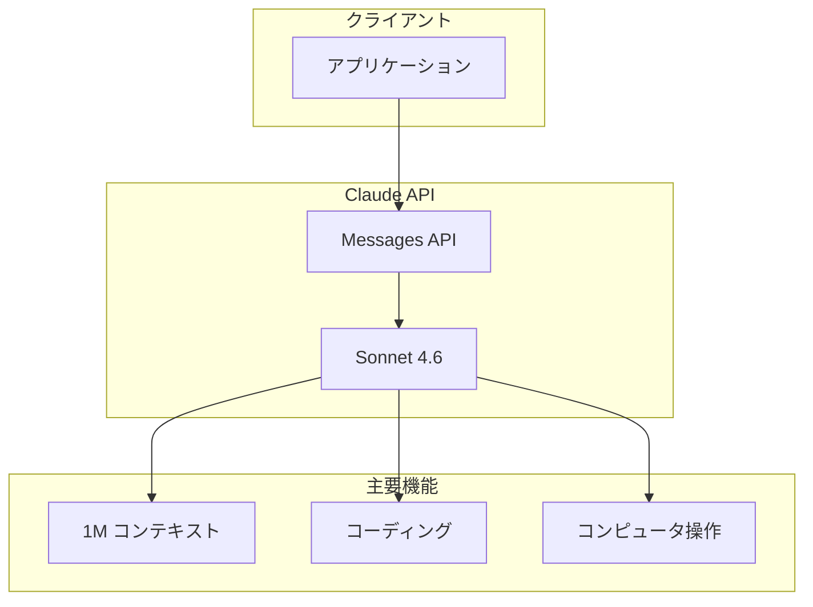

# Claude Sonnet 4.6 発表: フロンティアレベルの性能をより手頃な価格で

## メタデータ

| 項目 | 内容 |
|------|------|
| 発表日 | 2026-02-17 |
| ソース | Anthropic News |
| カテゴリ | モデルリリース |
| 公式リンク | https://www.anthropic.com/news/claude-sonnet-4-6 |

## 概要

Anthropic は 2026 年 2 月 17 日、Claude Sonnet 4.6 をリリースしました。このモデルは、コーディング、コンピュータ操作、長文脈推論、エージェント計画など、複数の領域にわたる包括的なアップグレードを実現しています。

Sonnet 4.6 は **1M トークンのコンテキストウィンドウ**を備え、前モデル (Sonnet 4.5) から大幅な改善を示しています。特に注目すべきは、Opus レベルの知性に近づきながらも、より費用対効果の高い価格帯で提供されている点です。

## 主な特徴・改善点

Sonnet 4.6 では以下の点が改善されています。

- **1M トークンコンテキストウィンドウ**: 長大なドキュメントや複雑なコードベースの処理が可能
- **コーディング能力の向上**: より正確で効率的なコード生成
- **コンピュータ操作の改善**: OSWorld ベンチマークで高いスコアを達成
- **長期的推論の強化**: 複数ステップにわたるタスクでの一貫性向上
- **指示遵守の改善**: より正確に指示に従った出力を生成
- **ハルシネーションの低減**: 事実に基づいた回答の精度向上
- **ドキュメント理解・財務分析**: 複雑なタスクでのパフォーマンス向上

## 技術的な詳細

### ベンチマーク結果

Sonnet 4.6 は複数の評価指標で改善を示しています。

- **OSWorld**: コンピュータ操作ベンチマークで高性能
- **Vending-Bench Arena**: 高度な戦略開発能力を実証
- **長文脈理解**: 1M トークンまでの文脈を効果的に処理

### モデル仕様

| 項目 | 値 |
|------|-----|
| コンテキストウィンドウ | 1,000,000 トークン |
| 入力価格 | $3 / 100 万トークン |
| 出力価格 | $15 / 100 万トークン |

## 開発者への影響

### 利用可能なプラットフォーム

Sonnet 4.6 は以下で利用可能です。

- **claude.ai**: Free および Pro プランで利用可能
- **Claude Cowork**: デフォルトモデルとして設定
- **Claude API**: Messages API 経由でアクセス

### 価格

価格は Sonnet 4.5 と同じままです。

- 入力: $3 / 100 万トークン
- 出力: $15 / 100 万トークン

### 推奨ユースケース

Sonnet 4.6 は以下のタスクに適しています。

- 大規模コードベースの分析・生成
- 長文ドキュメントの要約・分析
- エージェントワークフローの構築
- コンピュータ操作の自動化

## アーキテクチャ

## 関連リンク

- [Claude 価格ページ](https://claude.com/pricing)
- [Claude.ai](https://claude.ai)
- [Sonnet 4.6 システムカード](https://anthropic.com/claude-sonnet-4-6-system-card)
- [Claude API ドキュメント](https://platform.claude.com/docs)

## まとめ

Claude Sonnet 4.6 は、Anthropic のモデルラインナップにおける重要なアップグレードです。1M トークンのコンテキストウィンドウ、改善されたコーディング能力、強化されたコンピュータ操作機能を備え、Opus レベルの知性に近づきながらもコスト効率の高い選択肢を提供しています。日常的なタスクから複雑なエージェントワークフローまで、幅広い用途に対応する汎用性の高いモデルとなっています。
