# Claude Code v2.1.63: メモリリーク大量修正と HTTP Hooks の導入

## メタデータ

| 項目 | 内容 |
|------|------|
| 発表日 | 2026-02-28 |
| ソース | Claude Code Changelog |
| カテゴリ | Claude Code アップデート |
| 公式リンク | [Claude Code CHANGELOG.md](https://github.com/anthropics/claude-code/blob/main/CHANGELOG.md) |

## 概要

Claude Code v2.1.63 がリリースされた。本リリースでは合計 26 件の変更が行われ、そのうち 10 件以上がメモリリークおよびリスナーリークの修正に充てられている。長時間セッションでのメモリ使用量が無制限に増加する複数の問題が解消され、安定性が大幅に向上した。新機能としては `/simplify` および `/batch` バンドルスラッシュコマンドの追加、シェルコマンドの代わりに HTTP エンドポイントへ JSON を送受信できる HTTP Hooks 機能、Git ワークツリー間でのプロジェクト設定共有などが含まれる。

## 詳細

### 背景

Claude Code は Anthropic が提供するターミナルベースの AI コーディングアシスタントである。v2.1.63 は安定性を重視したリリースであり、長時間動作するセッションやチームメイト機能で蓄積されるメモリリークの修正が中心となっている。従来、長時間セッションではメモリ使用量が徐々に増加し、最終的にパフォーマンス低下や予期しない動作を引き起こす可能性があった。本リリースではこれらの根本原因が体系的に特定・修正された。

### 主な変更点

#### 新機能 (5 件)

- `/simplify` および `/batch` バンドルスラッシュコマンドが追加された
- `ENABLE_CLAUDEAI_MCP_SERVERS=false` 環境変数が追加され、claude.ai の MCP サーバーを利用しないよう設定可能になった
- HTTP Hooks が追加された。シェルコマンドの代わりに URL へ JSON を POST し、JSON レスポンスを受け取ることができる
- MCP OAuth 認証時に手動 URL 貼り付けフォールバックが追加された。ローカルホストへの自動リダイレクトが動作しない場合、コールバック URL を貼り付けて認証を完了できる
- `/copy` ピッカーに「Always copy full response」オプションが追加された。選択すると、以降の `/copy` コマンドでコードブロックピッカーをスキップし、レスポンス全体を直接コピーする

#### 改善 (3 件)

- `/model` コマンドがスラッシュコマンドメニューに現在のアクティブモデルを表示するようになった
- プロジェクト設定と自動メモリが同じリポジトリの Git ワークツリー間で共有されるようになった
- サブエージェントを使用する長時間セッションで、コンテキストコンパクション時に重いプログレスメッセージペイロードを除去し、メモリ使用量が改善された

#### メモリリーク・リスナーリーク修正 (14 件)

**リスナーリーク修正**

- ブリッジポーリングループでのリスナーリークを修正
- MCP OAuth フロークリーンアップでのリスナーリークを修正
- 自動承認時のインタラクティブパーミッションハンドラーでのリスナーリークを修正
- WebSocket トランスポート再接続時のリスナーリークを修正

**キャッシュ関連のメモリリーク修正**

- Bash コマンドプレフィックスキャッシュでのメモリリークを修正
- MCP サーバー再接続時のツール/リソースキャッシュリークを修正
- IDE ホスト IP 検出キャッシュがポート間で結果を誤って共有する問題を修正
- Git ルート検出キャッシュでのメモリリークを修正。長時間セッションで無制限に増加する可能性があった
- JSON パースキャッシュが長時間セッションで無制限に増加するメモリリークを修正
- MCP サーバーの fetch キャッシュが切断時にクリアされず、頻繁に再接続するサーバーでメモリ使用量が増加する問題を修正

**その他の修正**

- ローカルスラッシュコマンドの出力 (/cost など) が UI でユーザー送信メッセージとして表示される問題を修正
- ファイルカウントキャッシュが glob ignore パターンを無視する問題を修正
- REPL ブリッジで初期接続フラッシュ時に新しいメッセージと過去メッセージがインターリーブするレースコンディションを修正
- 長時間動作するチームメイトがコンパクション後も AppState に全メッセージを保持するメモリリークを修正
- `/clear` がキャッシュされたスキルをリセットせず、新しい会話で古いスキル内容が持続する問題を修正

#### VS Code 拡張機能 (2 件)

- リモートセッションが会話履歴に表示されない問題を修正
- セッションリストにセッションのリネームおよび削除アクションが追加された

### 技術的な詳細

本リリースの技術的な注目点は以下の 3 つである。

**HTTP Hooks アーキテクチャ**: 従来の Hooks はシェルコマンドを実行する方式であったが、HTTP Hooks では指定した URL に JSON ペイロードを POST し、JSON レスポンスを受け取る方式が追加された。これにより、外部サービスとの統合がよりセキュアかつ柔軟になる。シェルアクセスが制限された環境やコンテナ化された環境でも Hooks を活用できるようになった。

**体系的なメモリリーク修正**: 10 件以上のメモリリークが修正されたが、これらは主に 3 つのカテゴリに分類される。(1) イベントリスナーの解除漏れ (WebSocket、ブリッジ、OAuth フロー)、(2) キャッシュの無制限増加 (Git ルート検出、JSON パース、Bash プレフィックス)、(3) オブジェクト参照の保持 (チームメイトの AppState、MCP サーバーの fetch キャッシュ)。特に長時間セッションで顕著だった問題が解消された。

**Git ワークツリー間の設定共有**: 同じリポジトリの複数のワークツリーで作業する場合、プロジェクト設定 (`.claude/settings.json`) と自動メモリが共有されるようになった。これにより、ワークツリーごとに設定を個別に管理する必要がなくなった。

## 開発者への影響

### 対象

- Claude Code を日常的に使用する開発者
- 長時間セッションで Claude Code を使用する開発者
- Git ワークツリーを活用する開発者
- Hooks 機能を使用してワークフローを自動化する開発者
- VS Code 統合で Claude Code を使用する開発者

### 必要なアクション

1. Claude Code を v2.1.63 に更新する

```bash
npm install -g @anthropic-ai/claude-code@latest
```

2. 長時間セッションを頻繁に使用する場合、メモリ使用量の改善を確認する
3. Hooks を使用している場合、HTTP Hooks への移行を検討する
4. Git ワークツリーを使用している場合、設定が正しく共有されていることを確認する

### 移行ガイド (該当する場合)

- **Hooks 利用者**: 既存のシェルベースの Hooks はそのまま動作する。HTTP Hooks は新しいオプションとして追加されたため、段階的に移行可能である
- **claude.ai MCP サーバー利用者**: claude.ai の MCP サーバーを使用しない場合は `ENABLE_CLAUDEAI_MCP_SERVERS=false` を設定する
- **`/copy` コマンド利用者**: 「Always copy full response」を選択すると、以降の `/copy` でコードブロックピッカーが省略される

## コード例

```bash
# HTTP Hooks の設定例 (settings.json)
# シェルコマンドの代わりに HTTP エンドポイントを指定
{
  "hooks": {
    "on_tool_call": {
      "url": "https://your-service.example.com/hooks/tool-call",
      "method": "POST"
    }
  }
}

# claude.ai MCP サーバーを無効化
export ENABLE_CLAUDEAI_MCP_SERVERS=false

# 新しいバンドルスラッシュコマンドの使用
# /simplify - コードの簡素化を支援
# /batch - バッチ処理を支援
```

## アーキテクチャ図

### HTTP Hooks アーキテクチャ

```mermaid
flowchart LR
    subgraph ClaudeCode["🖥️ Claude Code"]
        direction TB
        Event["📡 イベント発生<br/>ツール呼び出し等"]
        HookEngine["⚙️ Hook エンジン"]
        Event --> HookEngine
    end

    subgraph HookTypes["🔀 Hook 実行方式"]
        direction TB
        Shell["🐚 シェル Hook<br/>従来方式"]
        HTTP["🌐 HTTP Hook<br/>v2.1.63 新機能"]
        Shell ~~~ HTTP
    end

    subgraph External["🏢 外部サービス"]
        direction TB
        Webhook["📨 Webhook エンドポイント"]
        Logging["📊 ログ収集"]
        CI["🔄 CI/CD パイプライン"]
        Webhook ~~~ Logging ~~~ CI
    end

    HookEngine -->|"コマンド実行"| Shell
    HookEngine -->|"POST JSON"| HTTP
    HTTP -->|"JSON レスポンス"| Webhook
    Webhook -.->|"連携"| Logging
    Webhook -.->|"連携"| CI

    classDef platform fill:none,stroke:#CCCCCC,stroke-width:2px,color:#666666
    classDef process fill:#FFFFFF,stroke:#4A90E2,stroke-width:2px,color:#333333
    classDef internal fill:#E8F1FF,stroke:#4A90E2,stroke-width:2px,color:#333333
    classDef newFeature fill:#E9F7EC,stroke:#66BB6A,stroke-width:2px,color:#333333
    classDef external fill:#FFF3E0,stroke:#FF9800,stroke-width:2px,color:#333333

    class ClaudeCode,HookTypes,External platform
    class Event,HookEngine process
    class Shell internal
    class HTTP newFeature
    class Webhook,Logging,CI external
```



### メモリリーク修正の分類

```mermaid
flowchart TD
    subgraph ListenerLeaks["🔊 リスナーリーク 4 件"]
        direction LR
        Bridge["📡 ブリッジ<br/>ポーリング"]
        OAuth["🔑 MCP OAuth<br/>フロー"]
        Permission["🛡️ パーミッション<br/>ハンドラー"]
        WS["🔌 WebSocket<br/>再接続"]
        Bridge ~~~ OAuth ~~~ Permission ~~~ WS
    end

    subgraph CacheLeaks["💾 キャッシュリーク 6 件"]
        direction LR
        BashCache["🐚 Bash<br/>プレフィックス"]
        MCPCache["🔗 MCP ツール<br/>リソース"]
        GitCache["📂 Git ルート<br/>検出"]
        JSONCache["📄 JSON<br/>パース"]
        BashCache ~~~ MCPCache ~~~ GitCache ~~~ JSONCache
    end

    subgraph ObjectLeaks["📦 オブジェクト保持 3 件"]
        direction LR
        Teammate["🤝 チームメイト<br/>AppState"]
        MCPFetch["🌐 MCP Fetch<br/>キャッシュ"]
        Skill["⚡ スキル<br/>キャッシュ"]
        Teammate ~~~ MCPFetch ~~~ Skill
    end

    Root(["🔧 v2.1.63 メモリ修正"]) --> ListenerLeaks
    Root --> CacheLeaks
    Root --> ObjectLeaks

    classDef platform fill:none,stroke:#CCCCCC,stroke-width:2px,color:#666666
    classDef fix fill:#FFEBEE,stroke:#F44336,stroke-width:2px,color:#333333
    classDef cache fill:#E8F1FF,stroke:#4A90E2,stroke-width:2px,color:#333333
    classDef object fill:#FFF3E0,stroke:#FF9800,stroke-width:2px,color:#333333
    classDef root fill:#E9F7EC,stroke:#66BB6A,stroke-width:2px,color:#1565C0

    class ListenerLeaks,CacheLeaks,ObjectLeaks platform
    class Bridge,OAuth,Permission,WS fix
    class BashCache,MCPCache,GitCache,JSONCache cache
    class Teammate,MCPFetch,Skill object
    class Root root
```



## 関連リンク

- [Claude Code CHANGELOG.md](https://github.com/anthropics/claude-code/blob/main/CHANGELOG.md)
- [Claude Code GitHub リポジトリ](https://github.com/anthropics/claude-code)
- [Claude Code v2.1.70 リリースレポート](./2026-03-05-claude-code-v2-1-70.md)

## まとめ

Claude Code v2.1.63 は 26 件の変更を含むリリースであり、長時間セッションの安定性向上に大きく貢献するメモリリーク修正が中心となっている。リスナーリーク 4 件、キャッシュ関連のメモリリーク 6 件、オブジェクト保持によるメモリリーク 3 件を含む合計 13 件以上のメモリ関連修正により、長時間動作するセッションやチームメイト機能の信頼性が大幅に向上した。新機能としては HTTP Hooks が特筆に値し、シェルコマンドに依存しない外部サービス連携が可能になった。また `/simplify` と `/batch` バンドルスラッシュコマンドの追加、Git ワークツリー間での設定共有、MCP OAuth の手動フォールバックなど、開発者の利便性を向上させる機能も多数含まれている。すべての Claude Code ユーザー、特に長時間セッションを頻繁に使用する開発者に早期のアップデートを推奨する。
