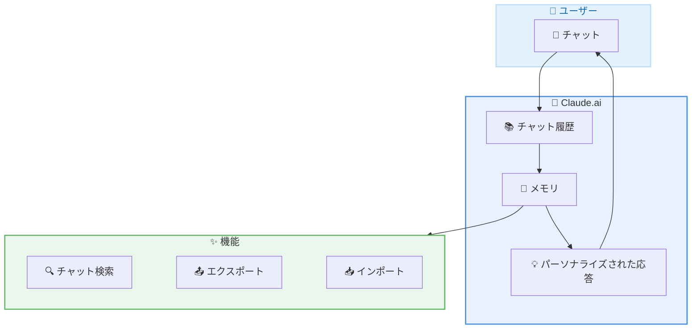

# Claude の「チャット履歴からのメモリ」機能が全ユーザーに開放

## メタデータ

| 項目 | 内容 |
|------|------|
| 発表日 | 2026-03-02 |
| ソース | Claude Apps Release Notes |
| カテゴリ | 製品アップデート |
| 公式リンク | https://support.claude.com/en/articles/12138966-release-notes |

## 概要

Anthropic は 2026 年 3 月 2 日、Claude.ai の「チャット履歴からのメモリ」機能を無料ユーザーを含む全ユーザーに開放しました。これまで有料プラン (Pro、Max) 限定だったこの機能により、Claude はユーザーとの過去の会話から学習し、よりパーソナライズされた応答を提供できるようになります。

## 主な特徴

### メモリ機能の概要

Claude のメモリ機能は以下の特徴を持っています。

- **自動学習**: チャット履歴から自動的にコンテキストを学習
- **パーソナライゼーション**: ユーザーの好みや文脈に基づいた応答
- **継続的な会話体験**: セッション間での情報の引き継ぎ

### 利用可能なプラン

メモリ機能は以下の全プランで利用可能になりました。

| プラン | 利用可否 |
|--------|----------|
| Free | ✅ 利用可能 |
| Pro | ✅ 利用可能 |
| Max | ✅ 利用可能 |
| Team | ✅ 利用可能 |

## 関連機能

### チャット検索

メモリ機能と合わせて、以下の関連機能も利用できます。

- **チャット検索**: 過去の会話を検索可能
- **メモリのインポート/エクスポート**: メモリデータの管理機能

## アーキテクチャ

## ユーザーへの影響

### 無料ユーザーへのメリット

この機能開放により、無料ユーザーは以下のメリットを得られます。

- **一貫した会話体験**: セッションを跨いでも文脈が維持される
- **効率的な対話**: 毎回同じ情報を説明する必要がなくなる
- **パーソナライズ**: 個人の好みに合わせた応答

### プライバシーとコントロール

ユーザーは自身のメモリデータを完全にコントロールできます。

- メモリの有効化/無効化が可能
- メモリ内容の確認と削除が可能
- インポート/エクスポート機能でデータの移行が可能

## 技術的背景

### メモリの仕組み

Claude のメモリ機能は以下のプロセスで動作します。

1. **コンテキスト抽出**: 会話から重要な情報を抽出
2. **情報の構造化**: 抽出した情報を構造化して保存
3. **取得と活用**: 関連する会話時にメモリを参照
4. **継続的な更新**: 新しい会話から学習を継続

## 関連リンク

- [Claude.ai](https://claude.ai)
- [Claude Help Center](https://support.claude.com)
- [メモリ機能について](https://support.claude.com/en/articles/memory)

## まとめ

Claude のメモリ機能の全ユーザー開放は、Anthropic がより多くのユーザーに高度な AI 体験を提供するという姿勢を示す重要なアップデートです。無料ユーザーでもパーソナライズされた会話体験が可能になり、Claude の利便性が大幅に向上しました。

プライバシーを重視した設計により、ユーザーは自身のメモリデータを完全にコントロールできる点も特筆すべきポイントです。
