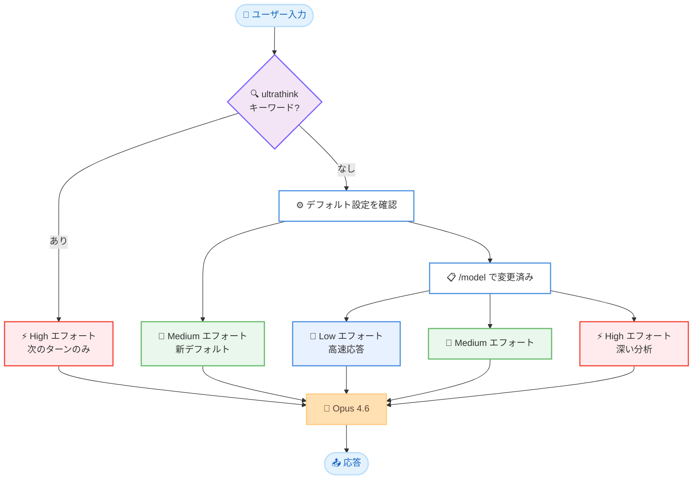

# Claude Code v2.1.68 -- Opus 4.6 デフォルトエフォートレベルの変更

## メタデータ

| 項目 | 内容 |
|------|------|
| 発表日 | 2026-03-04 |
| ソース | Claude Code Changelog |
| カテゴリ | Claude Code アップデート |
| 公式リンク | [CHANGELOG.md](https://github.com/anthropics/claude-code/blob/main/CHANGELOG.md) |

## 概要

Claude Code v2.1.68 では、Max および Team サブスクライバー向けに Opus 4.6 のデフォルトエフォートレベルが「medium」に変更された。これにより、速度と精度のバランスが最適化され、多くのタスクで効率的な動作が期待できる。また「ultrathink」キーワードが再導入され、必要に応じて高エフォートモードを即座に有効化できるようになった。同日リリースの v2.1.66 では、不要なエラーログの削減が行われている。

## 詳細

### 背景

Opus 4.6 はこれまでデフォルトで高エフォート (high effort) モードで動作していたが、多くの日常的なタスクではそこまでの計算リソースが不要であった。今回のアップデートでは、速度と精度の最適なバランスポイントである「medium」をデフォルトに設定することで、ユーザー体験の向上を図っている。

また、Opus 4 および Opus 4.1 はファーストパーティ API から削除され、これらのモデルをピン留めしていたユーザーは自動的に Opus 4.6 へ移行される。

### 主な変更点

#### v2.1.68

1. **Opus 4.6 デフォルトエフォートレベルの変更**: Max および Team サブスクライバー向けに、エフォートレベルが「medium」に変更された。`/model` コマンドでいつでも変更可能。

2. **ultrathink キーワードの再導入**: 次のターンで高エフォートモードを有効化する「ultrathink」キーワードが再導入された。特に複雑なタスクや深い分析が必要な場面で活用できる。

3. **旧モデルの削除**: Opus 4 および Opus 4.1 がファーストパーティ API の Claude Code から削除された。これらのモデルをピン留めしていたユーザーは自動的に Opus 4.6 へ移行される。

#### v2.1.66

1. **不要なエラーログの削減**: スプリアスなエラーログ出力が削減され、ログの可読性が向上した。

### 技術的な詳細

エフォートレベルシステムは 3 段階で構成されている。

| エフォートレベル | 説明 | 用途 |
|-----------------|------|------|
| Low | 最小限の計算リソースで高速応答 | 単純な質問、軽微な修正 |
| Medium (新デフォルト) | 速度と精度のバランスが最適 | 一般的な開発タスク全般 |
| High | 最大限の計算リソースで深い分析 | 複雑な問題解決、大規模リファクタリング |

エフォートレベルの変更方法は以下の通り。

- `/model` コマンドでデフォルトのエフォートレベルを変更
- 「ultrathink」キーワードで次のターンのみ高エフォートを有効化

## 開発者への影響

### 対象

- Claude Code を利用する Max プランおよび Team プランのサブスクライバー
- Opus 4 または Opus 4.1 をピン留めしていたユーザー
- ファーストパーティ API で Claude Code を利用する全ユーザー

### 必要なアクション

1. **エフォートレベルの確認**: デフォルトが「medium」に変更されたため、常に高エフォートが必要なワークフローでは `/model` コマンドで設定を調整する
2. **ultrathink の活用**: 複雑なタスクでは「ultrathink」キーワードを入力して、そのターンのみ高エフォートモードを有効化する
3. **モデル設定の確認**: Opus 4 または Opus 4.1 をピン留めしていた場合、自動的に Opus 4.6 に移行されているため、動作に問題がないか確認する

### 移行ガイド (該当する場合)

Opus 4 または Opus 4.1 をピン留めしていたユーザーは自動的に Opus 4.6 へ移行される。手動での操作は不要だが、以下の点を確認することを推奨する。

- Opus 4.6 でのタスク実行結果に問題がないか
- エフォートレベルのデフォルト変更による影響がワークフローに及んでいないか

## コード例

```bash
# エフォートレベルを確認・変更する
/model

# 次のターンのみ高エフォートモードを有効化する
ultrathink この複雑なバグを調査して修正してください

# 通常の使用 (medium エフォートがデフォルト)
このファイルのリファクタリングを提案してください
```

## アーキテクチャ図 (該当する場合)



## 関連リンク

- [Claude Code Changelog](https://github.com/anthropics/claude-code/blob/main/CHANGELOG.md)
- [Claude Code ドキュメント](https://docs.anthropic.com/en/docs/claude-code)

## まとめ

Claude Code v2.1.68 は、Opus 4.6 のデフォルトエフォートレベルを「medium」に変更する重要なアップデートである。この変更により、速度と精度のバランスが最適化され、日常的な開発タスクでの体験が向上する。複雑なタスクに対しては「ultrathink」キーワードで即座に高エフォートモードを有効化でき、柔軟な使い分けが可能である。また、Opus 4 および Opus 4.1 の削除により、モデルラインナップが Opus 4.6 に統一され、シンプルな構成となった。
