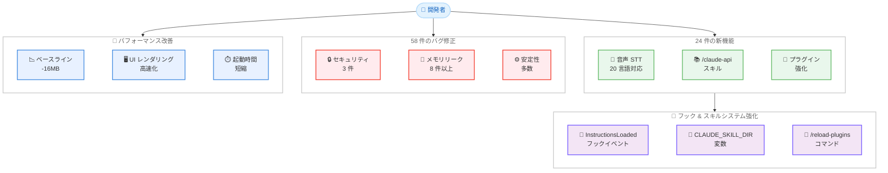

# Claude Code v2.1.69: 103 件の変更を含む大型アップデート

## メタデータ

| 項目 | 内容 |
|------|------|
| 発表日 | 2026-03-04 |
| ソース | Claude Code Changelog |
| カテゴリ | ツール更新 |
| 公式リンク | [Claude Code CHANGELOG.md](https://github.com/anthropics/claude-code/blob/main/CHANGELOG.md) |

## 概要

Claude Code v2.1.69 がリリースされた。24 件の新機能追加、58 件のバグ修正、21 件の改善を含む合計 103 件の変更が行われた大型アップデートとなっている。音声入力の多言語対応拡大、セキュリティ修正、メモリリークの大幅な改善、新しいスキルシステムの強化が主な特徴である。同時期にリリースされた v2.1.66 から v2.1.68 の変更も含めて報告する。

## 詳細

### 背景

Claude Code は Anthropic が提供するターミナルベースの AI コーディングアシスタントである。v2.1.69 は v2.1.63 以降で最大規模のリリースとなり、特にメモリ管理の改善とプラグインエコシステムの安定化に重点が置かれている。

### 主な変更点

#### 新機能 (24 件)

**音声入力の多言語対応拡大**

Voice STT (Speech-to-Text) が 10 言語追加され、合計 20 言語をサポートするようになった。新たに対応した言語は以下の通りである。

- ロシア語、ポーランド語、トルコ語、オランダ語、ウクライナ語
- ギリシャ語、チェコ語、デンマーク語、スウェーデン語、ノルウェー語

**`/claude-api` スキルの追加**

Claude API と Anthropic SDK を使用したアプリケーション構築を支援する新しいビルトインスキルが追加された。

**スキルシステムの強化**

- `${CLAUDE_SKILL_DIR}` 変数が追加され、スキルが自身のディレクトリを参照可能になった
- `/reload-plugins` コマンドでプラグインの変更を再起動なしに反映可能になった
- `InstructionsLoaded` フックイベントが追加され、CLAUDE.md やルールファイルの読み込みを検知可能になった

**フックとプラグインの改善**

- `agent_id` と `agent_type` がフックイベントに追加された
- `worktree` フィールドがステータスラインフックコマンドに追加された
- プラグインソースタイプ `git-subdir` が追加され、Git リポジトリのサブディレクトリを指定可能になった

**その他の新機能**

- `sandbox.enableWeakerNetworkIsolation` 設定が追加され、macOS 上で `gh`、`gcloud`、`terraform` などの TLS 証明書検証が可能になった
- `includeGitInstructions` 設定でシステムプロンプトからビルトインの Git 指示を除外可能になった
- テンキーでの選択肢入力に対応
- `/remote-control` にカスタムセッション名の設定が可能になった
- エフォートレベルがロゴとスピナーに表示されるようになった

#### バグ修正 (58 件) - 主要なもの

**セキュリティ修正**

- ネストされたスキル検出が `node_modules` などの gitignore 対象ディレクトリからスキルを読み込む問題を修正
- トラストダイアログが初回実行時にすべての `.mcp.json` サーバーを暗黙的に有効化する問題を修正
- シンボリックリンクを経由してワーキングディレクトリの外にファイルを書き込める脆弱性を修正

**メモリリークの修正 (8 件以上)**

- SDK/CCR セッションでの会話メッセージの不要な保持を修正
- React Compiler の `memoCache` で古いメッセージ配列が蓄積する問題を修正
- REPL レンダースコープが蓄積する問題を修正 (1,000 ターンで約 35MB)
- インプロセスチームメイトで親の会話履歴全体が保持される問題を修正
- フックイベントが長時間セッションで無制限に蓄積する問題を修正
- 大きな未追跡バイナリファイルがある場合のコミット時のマルチ GB メモリスパイクを修正

**安定性の改善**

- `claude remote-control` が npm インストールで即座にクラッシュする問題を修正
- `--model claude-opus-4-0` と `claude-opus-4-1` が非推奨バージョンに解決される問題を修正
- macOS キーチェーンが複数の OAuth MCP サーバー使用時に破損する問題を修正
- 破損した `--mcp-config` ファイルを指定した際のハングを修正

#### パフォーマンス改善

- スピナーアニメーションループを分離し、レンダリングと CPU オーバーヘッドを削減
- React Compiler によるネイティブバイナリの UI レンダリングパフォーマンスを改善
- Yoga WASM プリロードの遅延によりベースラインメモリを約 16MB 削減
- MCP `-p` 起動時のパイプライン化と並行プールの導入
- ファイル存在チェックでのファイル内容読み込みを回避 (6 箇所)

#### その他の変更

- Sonnet 4.5 ユーザー (Pro/Max/Team Premium) が自動的に Sonnet 4.6 に移行
- `/resume` ピッカーが最新のプロンプトを表示するように変更
- MCP バイナリコンテンツの処理が改善され、PDF やオフィスドキュメント、オーディオが正しいファイル拡張子でディスクに保存されるようになった

### v2.1.66 - v2.1.68 の変更点

**v2.1.68**

- Opus 4.6 が Max と Team サブスクライバーでデフォルトの medium エフォートに変更
- "ultrathink" キーワードで次のターンの high エフォートを有効化する機能が再導入
- Opus 4 と 4.1 がファーストパーティ API から削除され、ユーザーは自動的に Opus 4.6 に移行

**v2.1.66**

- npm パッケージを特定の esbuild バージョンに固定
- 不要なエラーログを削減

### 技術的な詳細

v2.1.69 ではメモリ管理に関する広範な改善が行われている。特に長時間セッションにおけるメモリリークが複数箇所で修正され、React Compiler の `memoCache`、REPL レンダースコープ、フックイベント、チームメイト間のメッセージ保持など、多角的にメモリ使用量が最適化された。

プラグインシステムでは、`git-subdir` ソースタイプの追加により Git リポジトリ内のサブディレクトリをプラグインソースとして指定できるようになった。また `InstructionsLoaded` フックイベントにより、設定ファイルの読み込みタイミングをフックで捕捉できるようになっている。

## 開発者への影響

### 対象

- Claude Code を日常的に使用する開発者
- Claude Code SDK/CCR を利用したアプリケーション開発者
- MCP サーバーを活用するプラグイン開発者
- 企業環境で Claude Code を管理する IT 管理者

### 必要なアクション

1. Claude Code を v2.1.69 に更新する

```bash
npm install -g @anthropic-ai/claude-code@latest
```

2. Opus 4 または 4.1 を明示的に指定していた場合、自動的に Opus 4.6 に移行されるため、動作を確認する
3. Sonnet 4.5 を使用していた Pro/Max/Team Premium ユーザーは Sonnet 4.6 への自動移行を確認する
4. プラグイン開発者は `InstructionsLoaded` フックや `${CLAUDE_SKILL_DIR}` 変数の活用を検討する

### 移行ガイド (該当する場合)

- **モデル移行**: `--model claude-opus-4-0` や `--model claude-opus-4-1` を使用していた場合、v2.1.69 では正しく現行バージョンに解決されるようになった。v2.1.68 では Opus 4/4.1 がファーストパーティ API から完全に削除されている
- **プラグイン開発者**: `pluginTrustMessage` を managed settings で設定することで、組織固有のコンテキストをプラグイン信頼警告に追加可能になった

## アーキテクチャ図



## 関連リンク

- [Claude Code CHANGELOG.md](https://github.com/anthropics/claude-code/blob/main/CHANGELOG.md)
- [Claude Code GitHub リポジトリ](https://github.com/anthropics/claude-code)
- [Issue #28334 - remote-control クラッシュ修正](https://github.com/anthropics/claude-code/issues/28334)
- [Issue #30185 - credentials.json 修正](https://github.com/anthropics/claude-code/issues/30185)

## まとめ

Claude Code v2.1.69 は 103 件の変更を含む大型リリースであり、音声入力の 20 言語対応、`/claude-api` スキルの追加、プラグインシステムの大幅な強化が行われた。特にメモリ管理の改善は 8 件以上のメモリリーク修正とベースラインメモリの 16MB 削減を含み、長時間セッションの安定性が大幅に向上している。セキュリティ面では gitignore ディレクトリからのスキル読み込みやシンボリックリンクバイパスなど重要な脆弱性が修正された。v2.1.68 では Opus 4.6 のデフォルトエフォート設定変更と旧 Opus モデルの廃止が行われており、すべての開発者に早期のアップデートを推奨する。
