# Claude Code v2.1.70: 安定性とパフォーマンスの大幅改善

## メタデータ

| 項目 | 内容 |
|------|------|
| 発表日 | 2026-03-05 |
| ソース | Claude Code Changelog |
| カテゴリ | Claude Code アップデート |
| 公式リンク | [Claude Code CHANGELOG.md](https://github.com/anthropics/claude-code/blob/main/CHANGELOG.md) |

## 概要

Claude Code v2.1.70 がリリースされた。前バージョン v2.1.69 の大型アップデートに続き、本リリースでは 14 件のバグ修正、8 件の改善、3 件の VS Code 拡張機能の新機能を含む合計 25 件の変更が行われた。サードパーティゲートウェイ経由での API エラー修正、Windows/WSL 環境の安定化、プロンプト入力のレンダリング性能 74% 改善、Remote Control のサーバー負荷 300 倍削減など、品質と効率に重点を置いたリリースとなっている。

## 詳細

### 背景

Claude Code は Anthropic が提供するターミナルベースの AI コーディングアシスタントである。v2.1.70 は v2.1.69 の翌日にリリースされたフォローアップバージョンであり、前バージョンで報告された問題の修正と、日常的な開発体験の改善に焦点が当てられている。特に Windows/WSL 環境での安定性向上と、VS Code 統合の強化が目立つ。

### 主な変更点

#### バグ修正 (14 件)

**API 互換性の修正**

- `ANTHROPIC_BASE_URL` でサードパーティゲートウェイを使用した際の API 400 エラーを修正。ツール検索がプロキシエンドポイントを正しく検出し、`tool_reference` ブロックを無効化するようになった
- カスタム Bedrock 推論プロファイルや標準の Claude 命名パターンに一致しないモデル識別子を使用した際の `effort` パラメータ未対応エラーを修正
- `ToolSearch` 直後にモデルの応答が空になる問題を修正。サーバーがシステムプロンプト形式のタグをプロンプト末尾にレンダリングし、モデルが早期停止する問題に対処した
- `instructions` を持つ MCP サーバーが最初のターン後に接続した際のプロンプトキャッシュ破棄を修正

**Windows/WSL 環境の修正**

- Windows/WSL でクリップボードが非 ASCII テキスト (CJK、絵文字) を破損する問題を修正。PowerShell の `Set-Clipboard` を使用するように変更された
- Windows の VS Code 統合ターミナルから実行した際に余分な VS Code ウィンドウが起動時に開く問題を修正
- Windows ネイティブバイナリで音声モードが "native audio module could not be loaded" エラーで失敗する問題を修正

**入力・UI の修正**

- 低速な SSH 接続でタイピング中に Enter キーが送信ではなく改行を挿入する問題を修正
- 設定で `voiceEnabled: true` が設定されている場合にセッション開始時にプッシュトゥトークが有効化されない問題を修正
- `#NNN` 参照を含む Markdown リンクがリンク先 URL ではなく現在のリポジトリを誤って指す問題を修正

**プラグイン・コマンドの修正**

- プラグインが `/plugin` で不正確にインストール済みと表示される問題を修正
- プラグインが初回起動時に "not found in marketplace" エラーを表示する問題を修正。マーケットプレースインストール後に自動更新されるようになった
- `/security-review` コマンドが古い Git バージョンで `unknown option merge-base` エラーで失敗する問題を修正
- `/color` コマンドでデフォルトカラーに戻す方法がなかった問題を修正。`/color default`、`/color gray`、`/color reset`、`/color none` でデフォルトに復元可能になった

#### パフォーマンス改善 (5 件)

- プロンプト入力のターン中の再レンダリングを約 74% 削減
- カスタム CA 証明書を使用しないユーザーの起動時メモリを約 426KB 削減
- Remote Control の `/poll` レートを接続中は 10 分に 1 回に削減 (従来は 1-2 秒)。サーバー負荷を約 300 倍削減。トランスポート切断時は即座に高速ポーリングに復帰する
- `AskUserQuestion` プレビューダイアログでノート入力のキーストロークごとに Markdown レンダリングが再実行されるパフォーマンス劣化を修正
- 起動初期に読み込まれたフィーチャーフラグのディスクキャッシュが更新されず、古い値がセッション間で持続する問題を修正

#### その他の改善 (3 件)

- コンパクション処理が要約リクエストで画像を保持するようになり、プロンプトキャッシュの再利用が可能になった。これにより、コンパクションがより高速かつ低コストになった
- `/rename` がモデル処理中でも動作するようになった (従来はサイレントにキューイングされていた)
- マイクが無音をキャプチャした際のエラーメッセージが改善され、"no speech detected" との区別が可能になった
- `--resume` 時にスキルリストの再注入を抑制し、再開ごとに約 600 トークンを節約
- `permissions.defaultMode` の `acceptEdits` または `plan` 以外の値が Claude Code Remote 環境で適用されないよう変更 (無効な値は無視される)
- `.claude/settings.json` にレガシーの Opus モデル文字列が固定されている場合に "Model updated to Opus 4.6" 通知が繰り返し表示される問題を修正
- VS Code テレポートセッションでテレポートマーカーがレンダリングされない問題を修正

#### VS Code 拡張機能 (3 件)

- VS Code アクティビティバーにスパークアイコンが追加され、すべての Claude Code セッションを一覧表示可能になった。セッションはフルエディタとして開ける
- VS Code でプランのフル Markdown ドキュメントビューが追加された。コメントを追加してフィードバックを提供する機能もサポートされている
- ネイティブ MCP サーバー管理ダイアログが追加された。チャットパネルで `/mcp` を使用してサーバーの有効化・無効化、再接続、OAuth 認証管理がターミナルに切り替えることなく可能になった

### 技術的な詳細

本リリースの技術的な注目点は以下の 3 つである。

**ToolSearch のプロンプト互換性修正**: `ToolSearch` 機能ではサーバー側がツールスキーマをシステムプロンプト形式のタグとしてプロンプト末尾にレンダリングする。これがモデルに「応答終了」と誤認させ、空の応答を返す原因となっていた。v2.1.70 ではこのレンダリング方式が改善された。

**Remote Control ポーリング最適化**: Remote Control の `/poll` エンドポイントへのリクエスト頻度が、接続中は 1-2 秒間隔から 10 分間隔に変更された。これによりサーバー負荷が約 300 倍削減される。トランスポートロス (WebSocket 切断など) の場合は即座に高速ポーリングに切り替わるため、再接続性能には影響しない。

**プロンプト入力レンダリングの最適化**: ターン中のプロンプト入力再レンダリングが約 74% 削減された。これは React のレンダリングサイクルの最適化によるもので、特に長いセッションでの UI 応答性が向上する。

## 開発者への影響

### 対象

- Claude Code を日常的に使用する開発者
- サードパーティ API ゲートウェイ経由で Claude を利用する開発者
- Windows/WSL 環境で Claude Code を使用する開発者
- VS Code 統合で Claude Code を使用する開発者
- Claude Code Remote を運用するインフラ管理者

### 必要なアクション

1. Claude Code を v2.1.70 に更新する

```bash
npm install -g @anthropic-ai/claude-code@latest
```

2. `ANTHROPIC_BASE_URL` でサードパーティゲートウェイを使用している場合、API 400 エラーが解消されていることを確認する
3. Windows/WSL 環境で CJK テキストのクリップボード操作を使用している場合、文字化けが解消されていることを確認する
4. VS Code ユーザーは拡張機能を更新し、新しいセッション一覧機能と MCP 管理ダイアログを試す

### 移行ガイド (該当する場合)

- **Remote Control 利用者**: ポーリング間隔が大幅に変更されたが、再接続動作には影響しない。サーバー側のレート制限設定を見直す場合は、新しい 10 分間隔を考慮する
- **カスタム Bedrock プロファイル利用者**: `effort` パラメータのエラーが解消されたため、カスタムモデル識別子を使用した設定が正常に動作するようになった
- **`/color` コマンド利用者**: デフォルトカラーへのリセットが `/color default` または `/color reset` で可能になった

## アーキテクチャ図

```mermaid
flowchart TD
    subgraph BugFixes["14 件のバグ修正"]
        direction LR
        API["🔌 API 互換性<br/>4 件"]
        Windows["🪟 Windows/WSL<br/>3 件"]
        UIUX["🖥️ 入力 / UI<br/>4 件"]
        PluginFix["🔧 プラグイン<br/>3 件"]
        API ~~~ Windows ~~~ UIUX ~~~ PluginFix
    end

    subgraph Performance["🚀 パフォーマンス改善"]
        direction LR
        Render["📉 再レンダリング<br/>-74%"]
        Memory["🧠 起動メモリ<br/>-426KB"]
        Poll["📡 ポーリング負荷<br/>-300x"]
        Render ~~~ Memory ~~~ Poll
    end

    subgraph VSCode["VS Code 拡張機能"]
        direction LR
        Sessions["✨ セッション一覧<br/>アクティビティバー"]
        Plans["📋 プランビュー<br/>コメント機能"]
        MCP["🔗 MCP 管理<br/>ダイアログ"]
        Sessions ~~~ Plans ~~~ MCP
    end

    subgraph Other["その他の改善"]
        direction LR
        Compact["📦 コンパクション<br/>キャッシュ改善"]
        Resume["💾 --resume<br/>-600 トークン"]
        Rename["✏️ /rename<br/>処理中も動作"]
        Compact ~~~ Resume ~~~ Rename
    end

    User(["👤 開発者"]) --> BugFixes
    User --> Performance
    User --> VSCode
    User --> Other

    classDef platform fill:none,stroke:#CCCCCC,stroke-width:2px,color:#666666
    classDef fix fill:#FFEBEE,stroke:#F44336,stroke-width:2px,color:#333333
    classDef perf fill:#E8F1FF,stroke:#4A90E2,stroke-width:2px,color:#333333
    classDef vscode fill:#E9F7EC,stroke:#66BB6A,stroke-width:2px,color:#333333
    classDef other fill:#FFF3E0,stroke:#FF9800,stroke-width:2px,color:#333333
    classDef user fill:#E3F2FD,stroke:#BBDEFB,stroke-width:2px,color:#1565C0

    class BugFixes,Performance,VSCode,Other platform
    class API,Windows,UIUX,PluginFix fix
    class Render,Memory,Poll perf
    class Sessions,Plans,MCP vscode
    class Compact,Resume,Rename other
    class User user
```



## 関連リンク

- [Claude Code CHANGELOG.md](https://github.com/anthropics/claude-code/blob/main/CHANGELOG.md)
- [Claude Code GitHub リポジトリ](https://github.com/anthropics/claude-code)
- [Claude Code v2.1.69 リリースレポート](./2026-03-04-claude-code-v2-1-69.md)
- [Claude Code v2.1.71 リリースレポート](./2026-03-06-claude-code-v2-1-71.md)

## まとめ

Claude Code v2.1.70 は 25 件の変更を含むリリースであり、前バージョン v2.1.69 で報告された問題の修正と開発体験の向上に焦点を当てている。特に `ANTHROPIC_BASE_URL` を使用したサードパーティゲートウェイでの API 400 エラー修正、Windows/WSL 環境での CJK テキストのクリップボード破損修正、`ToolSearch` 後の空応答修正など、実用上重要なバグが多数修正された。パフォーマンス面ではプロンプト入力の再レンダリング 74% 削減と Remote Control のサーバー負荷 300 倍削減が特筆される。VS Code 拡張機能ではセッション一覧、プランビュー、MCP サーバー管理ダイアログの 3 つの新機能が追加され、IDE 統合がさらに強化された。すべての Claude Code ユーザー、特にサードパーティゲートウェイや Windows/WSL 環境を使用する開発者に早期のアップデートを推奨する。
