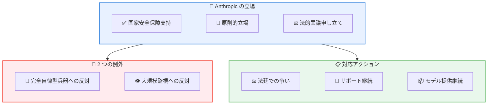

# Anthropic CEO Dario Amodei による Department of War との関係についての声明

## メタデータ

| 項目 | 内容 |
|------|------|
| 発表日 | 2026-03-05 |
| ソース | Anthropic News |
| カテゴリ | 公式声明・政策 |
| 公式リンク | https://www.anthropic.com/news/where-stand-department-war |

## 概要

Anthropic の CEO Dario Amodei は 2026 年 3 月 5 日、Department of War (米国国防総省) との関係について公式声明を発表しました。Anthropic が「アメリカの国家安全保障に対するサプライチェーンリスク」として指定されたことを受け、この指定に対する法的異議申し立てを行う方針を表明しています。

声明では、Anthropic が国家安全保障を支持し続ける姿勢と、AI の軍事利用に関する原則的な立場を明確にしています。

## 主な内容

### Department of War からの通知

Anthropic は Department of War から以下の通知を受け取りました。

- 「アメリカの国家安全保障に対するサプライチェーンリスク」としての指定
- この指定の範囲は主に Department of War との直接契約に影響

### Anthropic の対応

Anthropic は以下の対応を発表しています。

- **法的異議申し立て**: 指定は法的に妥当ではないと判断し、法廷で争う方針
- **継続的なサポート**: 許可される限り、移行期間のサポートを継続
- **モデル提供**: Department of War に対して名目コストでモデルを提供継続

## Anthropic の原則的立場

### AI 軍事利用に関する 2 つの例外

Anthropic は国家安全保障を支持する一方で、以下の 2 つの狭い例外を設けています。

1. **完全自律型兵器への反対**: 人間の判断を介さない兵器システムへの反対
2. **国内大規模監視への反対**: 国内での大規模監視システムへの反対

### 作戦上の意思決定への関与

Anthropic は以下の立場を明確にしています。

- 作戦上の軍事的意思決定への直接関与は望まない
- 国家安全保障の支援は継続

## アーキテクチャ

## 記事全文 (日本語訳)

以下は Dario Amodei による声明「Where things stand with the Department of War」の完全な日本語訳です。

---

### Department of War との現状について

2026 年 3 月 5 日

*Dario Amodei による声明*

昨日 (3 月 4 日)、Anthropic は Department of War から、当社がアメリカの国家安全保障に対するサプライチェーンリスクとして指定されたことを確認する書簡を受け取りました。

[金曜日に記載した](https://www.anthropic.com/news/statement-comments-secretary-war)通り、私たちはこの措置が法的に妥当であるとは考えておらず、法廷で争う以外に選択肢はないと考えています。

Department of War が書簡で使用した文言は (仮に法的に妥当であったとしても)、サプライチェーンリスク指定によって当社の顧客の大多数は影響を受けないという金曜日の当社の声明と一致しています。顧客に関しては、この指定は Department of War との契約の*直接の一部として* Claude を使用する顧客にのみ適用されることが明らかであり、そのような契約を持つ顧客による Claude のすべての使用に適用されるわけではありません。

Department の書簡は範囲が狭く、これは関連する法律 ([10 USC 3252](https://uscode.house.gov/view.xhtml?req=granuleid:USC-prelim-title10-section3252&num=0&edition=prelim)) も範囲が狭いためです。この法律はサプライヤーを罰するためではなく、政府を保護するために存在します。実際、この法律は Secretary of War に対し、サプライチェーンを保護するという目標を達成するために*必要最小限の制限的手段*を使用することを要求しています。Department of War の契約業者であっても、サプライチェーンリスク指定は、Claude の使用や Anthropic とのビジネス関係が特定の Department of War 契約と無関係である場合、それらを制限するものではありません (また、制限することもできません)。

ここ数日間、私たちは Department of War と生産的な会話を続けてきたことを改めて申し上げたいと思います。その会話は、当社の 2 つの狭い例外を遵守しながら Department にサービスを提供する方法と、それが不可能な場合にスムーズな移行を確保する方法の両方についてでした。[木曜日に記載した](https://www.anthropic.com/news/statement-department-of-war)通り、私たちは Department と共に行ってきた仕事を非常に誇りに思っています。情報分析、モデリングとシミュレーション、作戦計画、サイバー作戦などのアプリケーションで最前線の戦闘員を支援してきました。

[先週金曜日に述べた](https://www.anthropic.com/news/statement-comments-secretary-war)通り、私たちは Anthropic やいかなる民間企業も作戦上の意思決定に関与することが役割であるとは考えていませんし、これまでも考えたことはありません。それは軍の役割です。私たちの唯一の懸念は、完全自律型兵器と国内大規模監視に関する例外であり、これらは高レベルの使用領域に関するものであって、作戦上の意思決定に関するものではありません。

また、昨日報道機関に流出した社内投稿について、直接謝罪したいと思います。Anthropic はこの投稿を流出させておらず、他の誰かにそうするよう指示したこともありません。この状況をエスカレートさせることは当社の利益にはなりません。その特定の投稿は、大統領の [Truth Social 投稿](https://truthsocial.com/@realDonaldTrump/posts/116144552969293195) (Anthropic をすべての連邦システムから削除すると発表)、Secretary of War の [X 投稿](https://x.com/SecWar/status/2027507717469049070?s=20) (サプライチェーンリスク指定を発表)、そして Pentagon と OpenAI 間の取引の発表 (OpenAI 自身が後に紛らわしいと特徴づけた) から数時間以内に書かれたものでした。会社にとって困難な日であり、その投稿のトーンについてお詫び申し上げます。それは私の慎重に、または熟慮された見解を反映していません。また、6 日前に書かれたものであり、現在の状況についての古い評価です。

現在の私たちの最も重要な優先事項は、主要な戦闘作戦の最中に、戦闘員や国家安全保障の専門家が重要なツールを奪われないようにすることです。Anthropic は、その移行を実現するために必要な限り、また許可される限り、Department of War と国家安全保障コミュニティに対して、名目上のコストで、エンジニアからの継続的なサポートとともにモデルを提供します。

Anthropic は Department of War と違いよりも共通点の方がはるかに多いのです。私たちは両者とも米国の国家安全保障の推進とアメリカ国民の防衛にコミットしており、政府全体に AI を適用することの緊急性について合意しています。私たちの将来のすべての決定は、その共有された前提から流れるものです。

---

## CEO からのメッセージ

Dario Amodei は声明の中で以下の点を強調しています。

### 共通の目標

> "Our most important priority right now is making sure that our warfighters and national security experts are not deprived of important tools."
>
> (私たちの最も重要な優先事項は現在、私たちの戦闘員や国家安全保障の専門家が重要なツールを奪われないようにすることです)

> "Anthropic has much more in common with the Department of War than we have differences. We both are committed to advancing US national security and defending the American people."
>
> (Anthropic は Department of War と違いよりも共通点の方がはるかに多い。私たちは両者とも米国の国家安全保障の推進とアメリカ国民の防衛にコミットしています)

### 謝罪

Amodei は、流出した内部投稿について謝罪し、それが「困難な日に書かれた古い評価」であり、彼の「慎重に検討された見解を反映していない」と説明しました。

## 今後の展望

### 短期的な対応

- 法的手続きの開始
- 移行サポートの継続
- ステークホルダーとのコミュニケーション継続

### 長期的な方針

- 国家安全保障支援の継続
- 原則に基づいた AI 開発の維持
- 透明性のある対話の継続

## 関連する背景

この声明は、以下の一連の出来事に続くものです。

| 日付 | 出来事 |
|------|--------|
| 2026-02-26 | Department of War との議論に関する声明 |
| 2026-02-27 | Secretary of War のコメントに関する声明 |
| 2026-03-05 | 現在の状況についての声明 (本記事) |

## 関連リンク

- [Anthropic News](https://www.anthropic.com/news)
- [Anthropic について](https://www.anthropic.com/company)
- [Anthropic の安全性へのアプローチ](https://www.anthropic.com/safety)

## まとめ

Anthropic の CEO Dario Amodei による本声明は、AI 企業と政府機関との複雑な関係を示す重要な出来事です。Anthropic は国家安全保障を支持しながらも、完全自律型兵器と大規模監視という 2 つの明確な例外を設けており、この原則的立場を維持しながら法的手続きを進める方針を示しています。

この事例は、AI 技術の軍事・政府利用に関する倫理的・法的な議論が今後も続くことを示唆しています。
