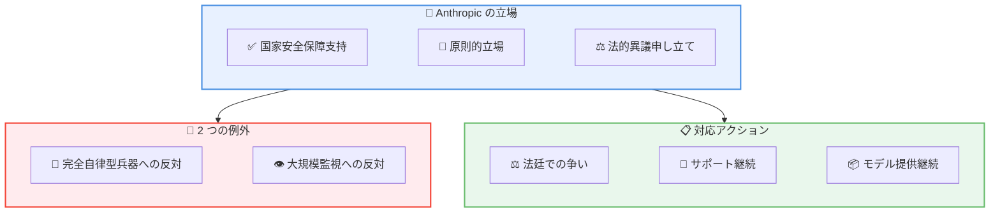

# Anthropic CEO Dario Amodei による Department of War との関係についての声明

## メタデータ

| 項目 | 内容 |
|------|------|
| 発表日 | 2026-03-05 |
| ソース | Anthropic News |
| カテゴリ | 公式声明・政策 |
| 公式リンク | https://www.anthropic.com/news/where-stand-department-war |

## 概要

Anthropic の CEO Dario Amodei は 2026 年 3 月 5 日、Department of War (米国国防総省) との関係について公式声明を発表しました。Anthropic が「アメリカの国家安全保障に対するサプライチェーンリスク」として指定されたことを受け、この指定に対する法的異議申し立てを行う方針を表明しています。

声明では、Anthropic が国家安全保障を支持し続ける姿勢と、AI の軍事利用に関する原則的な立場を明確にしています。

## 主な内容

### Department of War からの通知

Anthropic は Department of War から以下の通知を受け取りました。

- 「アメリカの国家安全保障に対するサプライチェーンリスク」としての指定
- この指定の範囲は主に Department of War との直接契約に影響

### Anthropic の対応

Anthropic は以下の対応を発表しています。

- **法的異議申し立て**: 指定は法的に妥当ではないと判断し、法廷で争う方針
- **継続的なサポート**: 許可される限り、移行期間のサポートを継続
- **モデル提供**: Department of War に対して名目コストでモデルを提供継続

## Anthropic の原則的立場

### AI 軍事利用に関する 2 つの例外

Anthropic は国家安全保障を支持する一方で、以下の 2 つの狭い例外を設けています。

1. **完全自律型兵器への反対**: 人間の判断を介さない兵器システムへの反対
2. **国内大規模監視への反対**: 国内での大規模監視システムへの反対

### 作戦上の意思決定への関与

Anthropic は以下の立場を明確にしています。

- 作戦上の軍事的意思決定への直接関与は望まない
- 国家安全保障の支援は継続

## アーキテクチャ

## CEO からのメッセージ

Dario Amodei は声明の中で以下の点を強調しています。

### 共通の目標

> "Anthropic has much more in common with the Department of War than we have differences. We both are committed to advancing US national security and defending the American people."
>
> (Anthropic は Department of War と違いよりも共通点の方がはるかに多い。私たちは両者とも米国の国家安全保障の推進とアメリカ国民の防衛にコミットしています)

### 謝罪

Amodei は、流出した内部投稿について謝罪し、それが「困難な日に書かれた古い評価」であったと説明しました。

## 今後の展望

### 短期的な対応

- 法的手続きの開始
- 移行サポートの継続
- ステークホルダーとのコミュニケーション継続

### 長期的な方針

- 国家安全保障支援の継続
- 原則に基づいた AI 開発の維持
- 透明性のある対話の継続

## 関連する背景

この声明は、以下の一連の出来事に続くものです。

| 日付 | 出来事 |
|------|--------|
| 2026-02-26 | Department of War との議論に関する声明 |
| 2026-02-27 | Secretary of War のコメントに関する声明 |
| 2026-03-05 | 現在の状況についての声明 (本記事) |

## 関連リンク

- [Anthropic News](https://www.anthropic.com/news)
- [Anthropic について](https://www.anthropic.com/company)
- [Anthropic の安全性へのアプローチ](https://www.anthropic.com/safety)

## まとめ

Anthropic の CEO Dario Amodei による本声明は、AI 企業と政府機関との複雑な関係を示す重要な出来事です。Anthropic は国家安全保障を支持しながらも、完全自律型兵器と大規模監視という 2 つの明確な例外を設けており、この原則的立場を維持しながら法的手続きを進める方針を示しています。

この事例は、AI 技術の軍事・政府利用に関する倫理的・法的な議論が今後も続くことを示唆しています。
