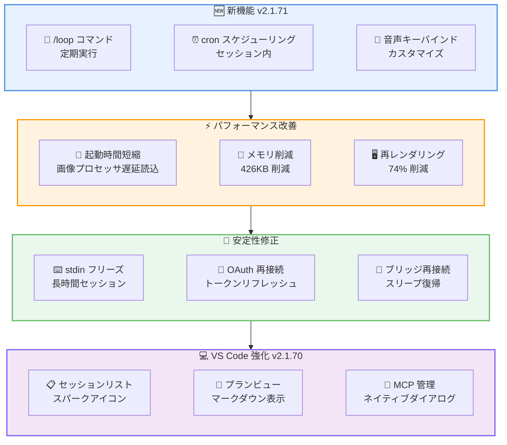

# Claude Code v2.1.70-v2.1.71 リリース: ループコマンドと大規模な安定性改善

## メタデータ

| 項目 | 内容 |
|------|------|
| 発表日 | 2026-03-06 |
| ソース | Claude Code Changelog |
| カテゴリ | ツール更新 |
| 公式リンク | https://github.com/anthropics/claude-code/blob/main/CHANGELOG.md |

## 概要

Claude Code v2.1.70 および v2.1.71 が 2026 年 3 月 6 日にリリースされました。2 バージョン合計で 57 件の変更が含まれ、新しい `/loop` コマンドによる定期実行機能、VS Code の大幅な機能強化、起動時のフリーズ修正やメモリ削減など、パフォーマンスと安定性の両面で大きな改善が実現されています。

特に v2.1.71 では長時間セッションにおける stdin フリーズの修正や、音声モード利用者向けの起動遅延の解消など、日常的な使い勝手を向上させる修正が多数含まれています。

## 詳細

### 背景

Claude Code は Anthropic が提供する CLI ベースの AI 開発支援ツールです。今回のリリースでは、ユーザーから報告されていた起動時のフリーズや接続の不安定さといった問題が集中的に修正されました。また、VS Code 拡張機能の強化やプラグインシステムの改善も進められています。

### 主な変更点 (v2.1.71)

#### 新機能

- **`/loop` コマンド**: プロンプトやスラッシュコマンドを一定間隔で繰り返し実行する機能を追加 (例: `/loop 5m check the deploy`)
- **cron スケジューリングツール**: セッション内で定期実行プロンプトをスケジュール可能に
- **`voice:pushToTalk` キーバインド**: 音声モードのアクティベーションキーを `keybindings.json` でカスタマイズ可能に (デフォルト: スペースキー)
- **Bash 自動承認リスト拡張**: `fmt`、`comm`、`cmp`、`numfmt`、`expr`、`test`、`printf`、`getconf`、`seq`、`tsort`、`pr` を追加

#### 主要な修正 (17 件)

- **stdin フリーズの修正**: 長時間セッションでキーストロークが処理されなくなる問題を解消
- **起動時の 5-8 秒フリーズ修正**: 音声モード有効時の CoreAudio 初期化がメインスレッドをブロックする問題を解消
- **UI フリーズの修正**: 多数の claude.ai プロキシコネクタが同時に OAuth トークンをリフレッシュする際の起動フリーズを解消
- **フォーク会話のプランファイル共有問題**: `/fork` で分岐した会話が同じプランファイルを共有し、編集が上書きされる問題を修正
- **Read ツールの画像処理**: 画像処理失敗時にオーバーサイズの画像がコンテキストに挿入される問題を修正
- **heredoc コミットメッセージの誤検知**: 複合 Bash コマンド内の heredoc コミットメッセージに対する不要な権限プロンプトを修正
- **プラグインインストールの消失**: 複数の Claude Code インスタンスを同時実行した際にプラグインが失われる問題を修正
- **OAuth 再接続の失敗**: claude.ai コネクタが OAuth トークンリフレッシュ後に再接続できない問題を修正
- **`--print` のハング**: チームエージェント構成時に終了ループが `in_process_teammate` タスクを待ち続ける問題を修正

#### 改善

- **起動時間の短縮**: ネイティブ画像プロセッサの読み込みを初回使用時まで遅延
- **ブリッジセッション再接続の高速化**: スリープ復帰後の再接続が最大 10 分から数秒に短縮
- **`/plugin uninstall` の改善**: プロジェクトスコープのプラグインを `.claude/settings.local.json` で無効化し、チームメイトに影響しないよう変更
- **MCP サーバーの重複排除**: 手動設定と重複するプラグイン提供の MCP サーバーをスキップ

### 主な変更点 (v2.1.70)

#### 新機能

- **VS Code セッションリスト**: アクティビティバーにスパークアイコンを追加し、全 Claude Code セッションを一覧表示
- **VS Code プランビュー**: プランのフルマークダウン表示とコメント追加機能
- **VS Code MCP 管理ダイアログ**: `/mcp` コマンドでサーバーの有効化・無効化、再接続、OAuth 認証管理が可能

#### 主要な修正 (19 件)

- **API 400 エラーの修正**: `ANTHROPIC_BASE_URL` でサードパーティゲートウェイ使用時のツール検索エラーを解消
- **effort パラメータエラー**: カスタム Bedrock 推論プロファイル使用時のエラーを修正
- **ToolSearch 後の空レスポンス**: サーバーがシステムプロンプト形式のタグでツールスキーマを描画し、モデルが早期停止する問題を修正
- **プロンプトキャッシュの無効化**: MCP サーバーの `instructions` 接続時にキャッシュが破棄される問題を修正
- **SSH 環境での Enter キー**: 低速 SSH 接続で Enter が改行として挿入される問題を修正
- **Windows/WSL のクリップボード**: CJK 文字や絵文字が文字化けする問題を PowerShell `Set-Clipboard` で修正

#### パフォーマンス改善

- **プロンプト入力の再レンダリング**: ターン中の再レンダリングを約 74% 削減
- **起動メモリの削減**: カスタム CA 証明書未使用ユーザーのメモリを約 426KB 削減
- **Remote Control ポーリング**: `/poll` レートを接続中は 10 分に 1 回に削減し、サーバー負荷を約 300 倍低減
- **コンパクション改善**: 画像を保持してプロンプトキャッシュの再利用を可能に

### 技術的な詳細

今回のリリースでは、パフォーマンスと安定性に関する広範な技術的改善が行われています。

- **CoreAudio 初期化の非同期化**: macOS でのシステムウェイク後の音声モード初期化をメインスレッドから分離
- **OAuth トークンリフレッシュの直列化**: 多数のコネクタが同時にリフレッシュする際の競合を防止
- **画像処理のフォールバック改善**: 画像処理失敗時にオーバーサイズのデータがコンテキストに流入しないようガード
- **ポーリング戦略の最適化**: 接続中のポーリング頻度を大幅に削減しつつ、接続断時には即座に高速ポーリングに切り替え

## 開発者への影響

### 対象

- Claude Code CLI を日常的に利用している開発者
- VS Code で Claude Code 拡張機能を使用しているユーザー
- カスタム Bedrock エンドポイントやサードパーティゲートウェイを利用しているチーム
- プラグインや MCP サーバーを活用しているユーザー

### 必要なアクション

以下のコマンドで最新バージョンに更新できます。

```bash
# npm でのアップデート
npm update -g @anthropic-ai/claude-code

# 現在のバージョン確認
claude --version
```

### 新機能の活用例

```bash
# /loop コマンドによるデプロイ監視
/loop 5m check the deploy status

# /loop コマンドによる定期的なテスト実行
/loop 10m run the test suite and report failures
```

## アーキテクチャ図



## 関連リンク

- [Claude Code Changelog](https://github.com/anthropics/claude-code/blob/main/CHANGELOG.md)
- [Claude Code GitHub リポジトリ](https://github.com/anthropics/claude-code)
- [Claude Code ドキュメント](https://docs.anthropic.com/en/docs/claude-code)

## まとめ

Claude Code v2.1.70-v2.1.71 は、合計 57 件の変更を含む大規模なリリースです。v2.1.71 で追加された `/loop` コマンドにより、デプロイ監視やテスト実行などの定期タスクをセッション内で自動化できるようになりました。

安定性の面では、長時間セッションでの stdin フリーズ、音声モードの起動遅延、OAuth 再接続の失敗など、日常的な使用体験に直結する問題が多数修正されています。パフォーマンス面でも、プロンプト入力の再レンダリングを 74% 削減、起動メモリを 426KB 削減、Remote Control のポーリング負荷を 300 倍低減するなど、数値で示される具体的な改善が実現されました。

VS Code 拡張機能もセッション管理、プランビュー、MCP サーバー管理の 3 つの新機能で大幅に強化されており、IDE 統合の利便性が向上しています。全ての Claude Code ユーザーに早期のアップデートを推奨します。
