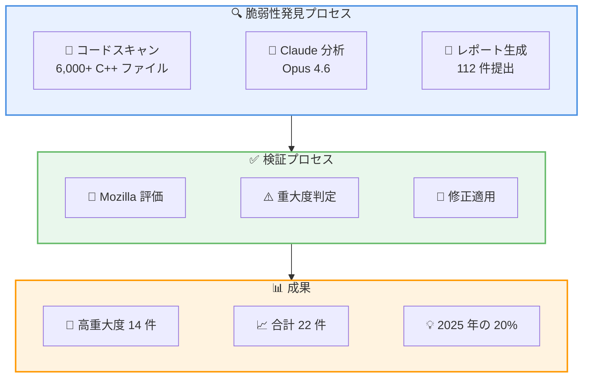

# Anthropic と Mozilla の提携: Firefox セキュリティ強化に向けた AI 活用

## メタデータ

| 項目 | 内容 |
|------|------|
| 発表日 | 2026-03-06 |
| ソース | Anthropic News |
| カテゴリ | セキュリティ・パートナーシップ |
| 公式リンク | https://www.anthropic.com/news/mozilla-firefox-security |

## 概要

Anthropic は 2026 年 3 月 6 日、Mozilla との提携により Firefox ブラウザのセキュリティ向上に取り組んだ成果を発表しました。Claude Opus 4.6 を活用し、わずか 2 週間で 22 件の脆弱性を発見。そのうち 14 件は Mozilla により高重大度 (high-severity) と評価され、これは 2025 年に修正された Firefox の高重大度脆弱性の約 20% に相当します。

この取り組みは、AI がサイバーセキュリティ分野で実用的な貢献を果たせることを実証した重要なマイルストーンとなっています。

## 主な成果

### 脆弱性発見の実績

Claude Opus 4.6 による脆弱性発見の実績は以下の通りです。

- **発見脆弱性数**: 22 件
- **高重大度脆弱性**: 14 件 (Mozilla 評価)
- **調査期間**: 約 2 週間
- **提出レポート数**: 112 件
- **スキャン対象**: 約 6,000 件の C++ ファイル

### 技術的アプローチ

Anthropic のセキュリティ調査は以下のアプローチで実施されました。

- **初期フォーカス**: Firefox の JavaScript エンジン
- **Use After Free 脆弱性**: 調査開始から 20 分以内に発見
- **過去の CVE 再現**: Claude は過去に報告された脆弱性を再現可能
- **エクスプロイト開発**: 2 件のケースで基本的なエクスプロイト開発に成功

## 技術的な詳細

### 脆弱性発見のワークフロー

### 発見された脆弱性の種類

主に以下の種類の脆弱性が発見されました。

- **Use After Free**: メモリ解放後のポインタ使用による脆弱性
- **メモリ安全性の問題**: C++ コードベースに内在する問題
- **JavaScript エンジンの脆弱性**: SpiderMonkey 関連の問題

## 今後の展望

Anthropic は今回の成果を踏まえ、以下の分野でサイバーセキュリティへの取り組みを拡大する予定です。

- **脆弱性検索の自動化**: より広範なソフトウェアへの適用
- **パッチ開発支援**: 脆弱性の発見から修正までの一貫したサポート
- **エクスプロイト分析**: 攻撃手法の理解と防御策の提案

## 開発者への影響

### セキュリティ対策の重要性

今回の発表は、開発者コミュニティに対して以下のメッセージを発信しています。

- AI による脆弱性発見能力が急速に向上している
- ソフトウェアセキュリティの強化が今まで以上に重要
- プロアクティブなセキュリティ対策の必要性

### 引用

> "Frontier language models are now world-class vulnerability researchers."
>
> (フロンティア言語モデルは今や世界クラスの脆弱性研究者です)

## 関連リンク

- [Anthropic News](https://www.anthropic.com/news)
- [Mozilla Security](https://www.mozilla.org/en-US/security/)
- [Claude Models](https://www.anthropic.com/claude)

## まとめ

Anthropic と Mozilla の提携は、AI がサイバーセキュリティ分野で実質的な価値を提供できることを示す重要な事例です。Claude Opus 4.6 が 2 週間で 22 件の脆弱性を発見し、そのうち 14 件が高重大度と評価されたことは、AI による自動化されたセキュリティ監査の可能性を示しています。

この取り組みは、AI とセキュリティ専門家の協力による、より安全なソフトウェアエコシステムの構築に向けた重要な一歩となっています。
