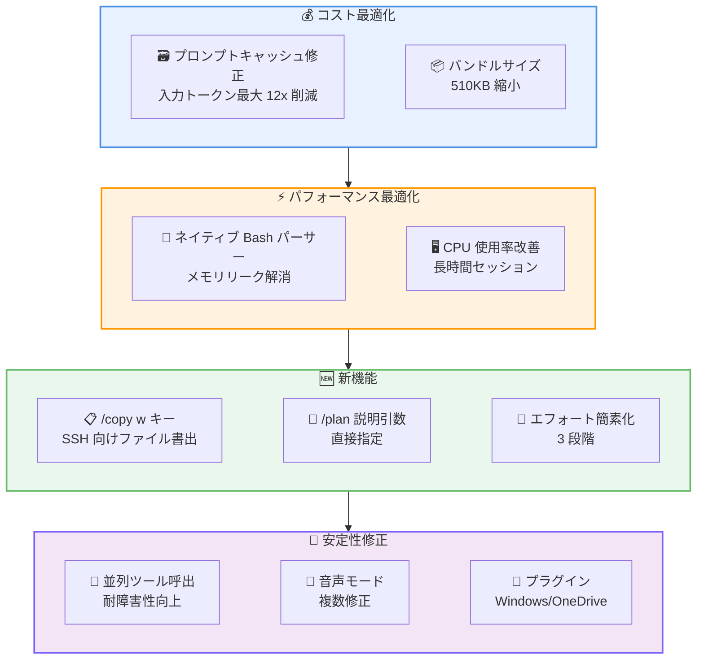

# Claude Code v2.1.72 リリース: トークンコスト最大 12 倍削減とバンドルサイズ 510KB 縮小

## メタデータ

| 項目 | 内容 |
|------|------|
| 発表日 | 2026-03-09 |
| ソース | Claude Code Changelog |
| カテゴリ | Claude Code アップデート |
| 公式リンク | https://github.com/anthropics/claude-code/blob/main/CHANGELOG.md |

## 概要

Claude Code v2.1.72 が 2026 年 3 月 9 日にリリースされました。本リリースでは、SDK の `query()` 呼び出しにおけるプロンプトキャッシュ無効化の修正により入力トークンコストが最大 12 倍削減されるほか、Bash コマンドパーサーのネイティブモジュール化によりメモリリークの解消と初期化の高速化が実現されています。バンドルサイズも約 510KB 縮小され、全体的なパフォーマンスが大幅に向上しています。

新機能としては、`/copy` コマンドへの `w` キーによるファイル直接書き出し、`/plan` コマンドへの説明引数サポート、`ExitWorktree` ツールの追加、エフォートレベルの簡素化 (低/中/高の 3 段階) などが含まれています。

## 詳細

### 背景

Claude Code は Anthropic が提供する CLI ベースの AI 開発支援ツールです。v2.1.72 では、コスト効率の改善、開発ワークフローの利便性向上、そして多数のバグ修正に重点が置かれています。特に SSH 環境での利用改善や、長時間セッションの CPU 使用率最適化など、実運用環境での安定性向上が図られています。

### 主な変更点

#### 新機能

- **`/copy` の `w` キー対応**: フォーカス中の選択範囲をクリップボードを介さずファイルに直接書き出し可能に (SSH 環境で特に有用)
- **`/plan` への説明引数**: `/plan fix the auth bug` のように、プラン作成時に説明を直接指定可能に
- **`ExitWorktree` ツール**: `EnterWorktree` セッションから離脱するためのツールを追加
- **`CLAUDE_CODE_DISABLE_CRON` 環境変数**: セッション中にスケジュール済み cron ジョブを停止可能に
- **Bash 自動承認リスト拡張**: `lsof`、`pgrep`、`tput`、`ss`、`fd`、`fdfind` を追加
- **Agent ツールの `model` パラメータ復活**: 呼び出しごとのモデルオーバーライドが再度可能に
- **エフォートレベルの簡素化**: `max` を廃止し、低 (○) / 中 (◐) / 高 (●) の 3 段階に整理
- **マーケットプレイス Git URL 対応**: `.git` サフィックスなしの URL をサポート (Azure DevOps、AWS CodeCommit)

#### パフォーマンス改善

- **プロンプトキャッシュ修正**: SDK `query()` 呼び出しにおけるキャッシュ無効化を修正し、入力トークンコストを最大 12 倍削減
- **Bash パーサーのネイティブ化**: コマンドパーサーをネイティブモジュールに切り替え、初期化の高速化とメモリリークを解消
- **バンドルサイズ削減**: 約 510KB の縮小
- **CPU 使用率改善**: 長時間セッションにおける CPU 消費を最適化
- **CLAUDE.md の HTML コメント非表示**: 自動挿入時に HTML コメントを Claude に送信しないよう変更

#### UI/UX 改善

- **`/config` の操作性向上**: Escape でキャンセル、Enter で保存して閉じる、Space で設定トグル
- **上矢印キー履歴の改善**: 同時実行セッションで現在のセッションのメッセージを優先表示
- **音声入力の精度向上**: リポジトリ名や開発用語 (regex、OAuth、JSON) の文字起こし精度を改善

#### バグ修正 (24 件以上)

- **終了の遅延修正**: バックグラウンドタスクやフック実行時の遅い終了を修正
- **Agent タスク進捗の停止**: "Initializing..." で停止する問題を解消
- **スキルフックの二重発火**: イベントごとにフックが 2 回発火する問題を修正
- **音声モードの複数問題修正**: 入力遅延、"No speech detected" の誤検知、古いトランスクリプトの残存
- **`--continue` の動作修正**: `--compact` 後に `--continue` でセッション再開できない問題を修正
- **Bash セキュリティパーサー**: エッジケースでのパース問題を修正
- **プラグインの問題修正**: Windows/OneDrive での EEXIST エラー、マーケットプレイスのユーザースコープインストールブロック、リテラル `~` ディレクトリの問題
- **フィードバック調査の頻度**: アンケート表示が頻繁すぎる問題を修正
- **`--effort` CLI フラグのリセット**: 設定書き込みによりフラグがリセットされる問題を修正
- **Ctrl+B バックグラウンドクエリ**: トランスクリプトが失われる問題を修正
- **`/clear` のスコープ修正**: バックグラウンドタスクを終了せず、フォアグラウンドのみクリアするよう変更
- **Worktree の分離問題**: ワークツリー間の分離が不完全な問題を修正
- **サンドボックス権限問題**: 権限関連の問題を修正
- **U+2028/U+2029 文字によるクラッシュ**: Unicode 行区切り文字によるセッションクラッシュを修正
- **権限ルールマッチング**: ワイルドカード、heredoc、環境変数プレフィックスの問題を修正
- **並列ツール呼び出しの修正**: Read/WebFetch/Glob の失敗が兄弟タスクをキャンセルする問題を修正

#### VS Code 修正・機能追加

- 統合ターミナルでのスクロール速度を修正
- Shift+Enter が改行挿入ではなく送信になる問題を修正
- エフォートレベルインジケーターを入力ボーダーに追加
- `vscode://anthropic.claude-code/open` URI ハンドラーを追加

### 技術的な詳細

本リリースの技術的な注目点は以下の通りです。

- **プロンプトキャッシュの最適化**: SDK 内部の `query()` 呼び出しでキャッシュが不必要に無効化されていた問題を修正。これにより、キャッシュヒット率が大幅に向上し、入力トークンコストが最大 12 倍削減されます。コストに敏感なプロダクション環境では特に大きな恩恵があります。
- **ネイティブ Bash パーサー**: JavaScript ベースの Bash コマンドパーサーをネイティブモジュールに置き換え。メモリリークが解消され、初期化速度も向上しています。
- **並列ツール呼び出しの耐障害性**: 複数のツールを並列実行する際、1 つのツールが失敗しても他のツールがキャンセルされないよう修正。これにより、大規模なファイル操作や Web フェッチの信頼性が向上しています。

## 開発者への影響

### 対象

- Claude Code CLI を日常的に利用している開発者
- SSH 環境やリモート開発環境で Claude Code を使用しているユーザー
- VS Code で Claude Code 拡張機能を使用しているユーザー
- SDK を利用してカスタムワークフローを構築しているチーム
- コスト効率を重視しているプロダクション環境のユーザー

### 必要なアクション

以下のコマンドで最新バージョンに更新できます。

```bash
# npm でのアップデート
npm update -g @anthropic-ai/claude-code

# 現在のバージョン確認
claude --version
```

### 新機能の活用例

```bash
# /copy の w キーでファイルに直接書き出し (SSH 環境向け)
# /copy メニュー内で w を押してファイルパスを指定

# /plan に説明を直接渡してプラン作成
/plan fix the auth bug

# cron ジョブの停止
export CLAUDE_CODE_DISABLE_CRON=1

# エフォートレベルの指定
claude --effort high
```

## アーキテクチャ図



## 関連リンク

- [Claude Code Changelog](https://github.com/anthropics/claude-code/blob/main/CHANGELOG.md)
- [Claude Code GitHub リポジトリ](https://github.com/anthropics/claude-code)
- [Claude Code ドキュメント](https://docs.anthropic.com/en/docs/claude-code)

## まとめ

Claude Code v2.1.72 は、コスト効率とパフォーマンスの両面で大きな改善を実現したリリースです。最も注目すべきは、プロンプトキャッシュ無効化の修正による入力トークンコスト最大 12 倍の削減で、特に大規模なプロジェクトや頻繁に API を呼び出すワークフローにおいて、運用コストの大幅な低減が期待できます。

Bash パーサーのネイティブモジュール化により、メモリリークの解消と初期化速度の向上が実現されたほか、バンドルサイズも 510KB 縮小されています。新機能面では、SSH 環境でのファイル書き出し (`/copy` の `w` キー) や `/plan` の説明引数対応など、開発ワークフローの利便性が向上しています。

24 件以上のバグ修正により、音声モード、プラグイン、並列ツール呼び出し、権限ルールマッチングなど幅広い領域の安定性が改善されています。全ての Claude Code ユーザーに早期のアップデートを推奨します。
