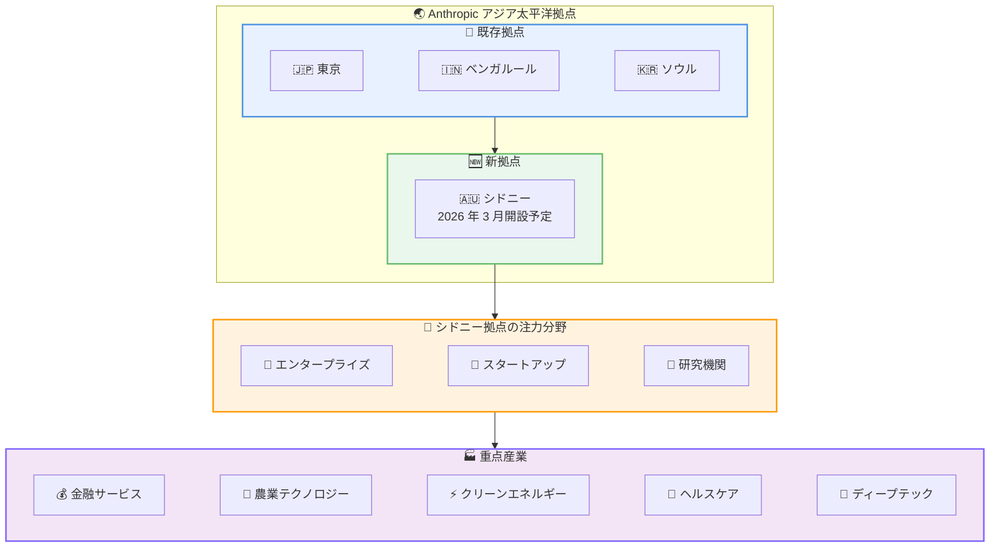

# Anthropic がシドニーにオフィスを開設: アジア太平洋地域 4 番目の拠点

## メタデータ

| 項目 | 内容 |
|------|------|
| 発表日 | 2026-03-10 |
| ソース | Anthropic News |
| カテゴリ | 事業拡大・アナウンスメント |
| 公式リンク | https://www.anthropic.com/news/sydney-fourth-office-asia-pacific |

## 概要

Anthropic は 2026 年 3 月 10 日、オーストラリアとニュージーランドへの事業拡大を発表しました。数週間以内にシドニーにオフィスを開設し、アジア太平洋地域では東京、ベンガルール、ソウルに続く 4 番目の拠点となります。

オーストラリアとニュージーランドでは人口比で Claude.ai の利用率がそれぞれ世界 4 位と 8 位を記録しており、両国の企業や政府機関からの強い需要に応える形での拡大となります。

## 主なポイント

### 拠点開設の概要

- **開設時期**: 数週間以内にシドニーにオフィスを開設
- **位置づけ**: アジア太平洋地域で 4 番目の拠点
- **初期フォーカス**: エンタープライズ、スタートアップ、研究顧客のサポート
- **採用**: シドニーチームの採用を開始

### エグゼクティブ訪問

- エグゼクティブチームが 2026 年 3 月末にオーストラリアを訪問予定
- パートナーシップの締結を進める方針

### 既存パートナー

オーストラリアでは既に以下の主要企業との協力関係を構築しています。

- **Canva**: デザインプラットフォーム
- **Quantium**: データアナリティクス企業
- **Commonwealth Bank of Australia**: オーストラリア最大の銀行

### Claude.ai の利用状況

- オーストラリア: 人口比で世界 4 位の利用率
- ニュージーランド: 人口比で世界 8 位の利用率
- 主な利用分野: コンピューターとコーディングタスク、教育指導と研究

## 詳細

### アジア太平洋地域の拠点展開

### インフラストラクチャ計画

Anthropic はオーストラリアでのサービス提供基盤の強化を以下の方向で進めています。

- **コンピュートキャパシティの拡大**: オーストラリア国内でのコンピュートリソースの増強を検討中
- **ローカルインフラの整備**: サードパーティパートナーを通じたインフラの追加を模索
- **データレジデンシー対応**: データレジデンシー要件を持つ企業や政府機関からの要望に対応

### 重点分野

Chris Ciauri (Managing Director of International) は、以下の国家的に重要な分野での AI 活用に注力する方針を示しています。

- 金融サービス
- 農業テクノロジー
- クリーンエネルギーイノベーション
- ヘルスケア
- ディープテック
- 科学研究

## 開発者への影響

### 対象

- オーストラリアおよびニュージーランドで Claude API を利用している開発者
- データレジデンシー要件を持つプロジェクトの開発者
- エンタープライズ向けソリューションを構築している開発者

### 期待される変化

- **ローカルサポートの強化**: シドニー拠点からのより迅速なサポート対応が可能に
- **インフラの近接性**: 将来的なローカルコンピュートキャパシティの拡大により、レイテンシーの改善が期待される
- **パートナーシップの機会**: 現地チームとの直接的な連携が可能に

### 必要なアクション

現時点で開発者に必要な即座のアクションはありません。今後、ローカルインフラの展開やデータレジデンシー対応に関する追加情報が提供される見込みです。

## 関連リンク

- [Anthropic News](https://www.anthropic.com/news)
- [公式発表](https://www.anthropic.com/news/sydney-fourth-office-asia-pacific)
- [Claude API](https://www.anthropic.com/api)

## まとめ

Anthropic のシドニーオフィス開設は、アジア太平洋地域での事業拡大における重要なマイルストーンです。東京、ベンガルール、ソウルに続く 4 番目の拠点として、オーストラリアとニュージーランドの企業・政府機関に対するサポート体制が強化されます。

人口比で世界トップクラスの Claude.ai 利用率を持つ両国において、金融サービス、農業テクノロジー、クリーンエネルギーなどの重点分野での AI 活用が加速することが期待されます。ローカルインフラの拡充やデータレジデンシー対応も進められており、今後のさらなる展開が注目されます。
