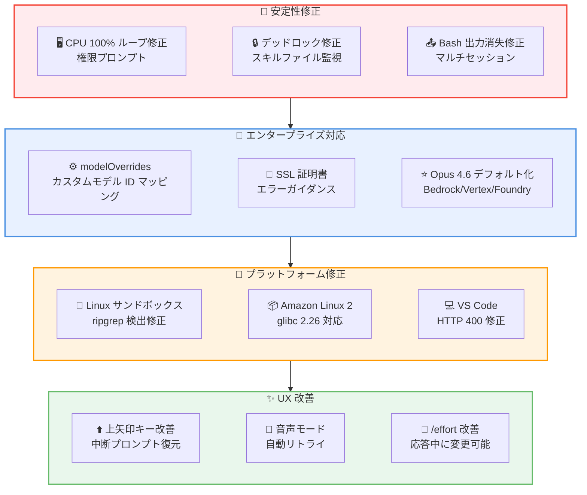

# Claude Code v2.1.73 リリース: CPU フリーズ修正、Opus 4.6 デフォルト化、modelOverrides 設定の追加

## メタデータ

| 項目 | 内容 |
|------|------|
| 発表日 | 2026-03-11 |
| ソース | Claude Code Changelog |
| カテゴリ | Claude Code アップデート |
| 公式リンク | https://github.com/anthropics/claude-code/blob/main/CHANGELOG.md |

## 概要

Claude Code v2.1.73 が 2026 年 3 月 11 日にリリースされました。本リリースでは、権限プロンプト表示時に発生していた 100% CPU ループおよびフリーズの修正、多数のスキルファイル変更時のデッドロック解消など、安定性に関する重要な修正が多数含まれています。

新機能として、`modelOverrides` 設定によるモデルピッカーエントリのカスタムプロバイダーモデル ID へのマッピングが追加されました。また、Bedrock、Vertex、Microsoft Foundry でのデフォルト Opus モデルが Opus 4.6 に更新されています。

## 詳細

### 背景

Claude Code は Anthropic が提供する CLI ベースの AI 開発支援ツールです。v2.1.73 では、安定性の大幅な改善に重点が置かれており、CPU フリーズ、デッドロック、セッション破損など、ユーザー体験を損なう深刻なバグが複数修正されています。加えて、エンタープライズ環境でのカスタムモデル構成を容易にする `modelOverrides` 設定が追加されました。

### 主な変更点

#### 新機能

- **`modelOverrides` 設定の追加**: モデルピッカーのエントリをカスタムプロバイダーモデル ID (Bedrock 推論プロファイル ARN など) にマッピング可能に。エンタープライズ環境でのカスタムモデル構成が容易になります。
- **SSL 証明書エラー時のガイダンス強化**: OAuth ログインや接続チェックが SSL 証明書エラーで失敗した際に、具体的な対処方法 (企業プロキシ、`NODE_EXTRA_CA_CERTS` の設定) を提示するよう改善。

#### バグ修正 (16 件)

- **CPU 100% ループの修正**: 複雑な Bash コマンドに対する権限プロンプト表示時にフリーズおよび 100% CPU ループが発生する問題を修正
- **デッドロックの修正**: 多数のスキルファイルが同時に変更された場合 (`git pull` 時に大規模な `.claude/skills/` ディレクトリがある場合など) に Claude Code がフリーズするデッドロックを修正
- **Bash ツール出力の消失修正**: 同一プロジェクトディレクトリで複数の Claude Code セッションを実行した際に、Bash ツールの出力が失われる問題を修正
- **サブエージェントのモデルダウングレード修正**: `model: opus`/`sonnet`/`haiku` を指定したサブエージェントが、Bedrock、Vertex、Microsoft Foundry で古いモデルバージョンにサイレントダウングレードされる問題を修正
- **バックグラウンド Bash プロセスのクリーンアップ**: サブエージェントが生成したバックグラウンド Bash プロセスが、エージェント終了時にクリーンアップされない問題を修正
- **`/resume` の修正**: セッションピッカーに現在のセッションが表示される問題を修正
- **`/ide` のクラッシュ修正**: 拡張機能の自動インストール時に `onInstall is not defined` エラーでクラッシュする問題を修正
- **`/loop` の利用制限解除**: Bedrock/Vertex/Foundry 環境およびテレメトリ無効時に `/loop` が利用できなかった問題を修正
- **SessionStart フックの二重発火修正**: `--resume` または `--continue` でセッション再開時に SessionStart フックが 2 回発火する問題を修正
- **JSON 出力フックの修正**: JSON 出力フックが毎ターン no-op の system-reminder メッセージをモデルのコンテキストに注入する問題を修正
- **音声モードのセッション破損修正**: 低速接続で新しい録音と重なった場合にセッションが破損する問題を修正
- **Linux サンドボックスの起動失敗修正**: ネイティブビルドで "ripgrep (rg) not found" エラーが発生する問題を修正
- **Linux ネイティブモジュールの互換性修正**: Amazon Linux 2 およびその他の glibc 2.26 システムでネイティブモジュールが読み込めない問題を修正
- **Remote Control の画像受信エラー修正**: `media_type: Field required` API エラーを修正
- **`/heapdump` の Windows 修正**: Desktop フォルダが既に存在する場合の `EEXIST` エラーを修正
- **VS Code: HTTP 400 エラー修正**: プロキシ環境下または Bedrock/Vertex で Claude 4.5 モデル使用時の HTTP 400 エラーを修正

#### 改善・変更

- **中断後の上矢印キー改善**: Claude の応答を中断した後、上矢印キーで中断されたプロンプトの復元と会話の巻き戻しを 1 ステップで実行可能に
- **IDE 検出速度の向上**: 起動時の IDE 検出速度を改善
- **クリップボード画像貼り付けの高速化**: macOS でのクリップボード画像貼り付けパフォーマンスを改善
- **`/effort` のリアルタイム変更対応**: Claude の応答中でも `/effort` が動作するよう改善 (`/model` と同様の挙動に統一)
- **音声モードの自動リトライ**: 高速な push-to-talk 再押下時の一時的な接続障害を自動リトライするよう改善
- **Remote Control スポーンモード選択の改善**: より適切なコンテキストを提示するよう改善
- **デフォルト Opus モデルの更新**: Bedrock、Vertex、Microsoft Foundry でのデフォルト Opus モデルを Opus 4.6 に変更 (以前は Opus 4.1)
- **`/output-style` コマンドの非推奨化**: `/config` の使用を推奨。出力スタイルはセッション開始時に固定され、プロンプトキャッシュの効率が向上

### 技術的な詳細

本リリースの技術的な注目点は以下の通りです。

- **CPU フリーズの根本修正**: 複雑な Bash コマンド (パイプチェーン、ヒアドキュメントなど) の権限確認時にパーサーが無限ループに陥る問題が修正されました。これにより、複雑なコマンドを日常的に使用する開発者のワークフローが大幅に安定化します。
- **デッドロック解消**: ファイル監視システムが多数のスキルファイル変更を検知した際に発生するロック競合が修正されました。大規模なスキルディレクトリを持つリポジトリで `git pull` や `git checkout` を行う際の安定性が向上しています。
- **`modelOverrides` の仕組み**: モデルピッカーの論理名 (例: `opus`、`sonnet`) をカスタムプロバイダー固有の ID にマッピングする設定です。Bedrock の推論プロファイル ARN や、Vertex のカスタムエンドポイントを使用する場合に特に有用です。
- **サブエージェントのモデル解決修正**: サブエージェントに `model: opus` 等を指定した際、Bedrock/Vertex/Foundry 環境ではモデル解決ロジックが正しく最新バージョンを参照するよう修正されました。これにより、サブエージェントでも確実に Opus 4.6 等の最新モデルが使用されます。

## 開発者への影響

### 対象

- Claude Code CLI を日常的に利用している全ての開発者
- 企業プロキシ環境で Claude Code を使用しているユーザー
- Bedrock、Vertex、Microsoft Foundry 経由で Claude Code を利用しているエンタープライズユーザー
- Linux 環境 (特に Amazon Linux 2) で Claude Code を使用しているユーザー
- 音声モードを使用しているユーザー
- VS Code で Claude Code 拡張機能を使用しているユーザー

### 必要なアクション

以下のコマンドで最新バージョンに更新できます。

```bash
# npm でのアップデート
npm update -g @anthropic-ai/claude-code

# 現在のバージョン確認
claude --version
```

### 新機能の活用例

```bash
# modelOverrides の設定例 (claude_config.json)
# モデルピッカーの "opus" を Bedrock 推論プロファイル ARN にマッピング
{
  "modelOverrides": {
    "opus": "arn:aws:bedrock:us-east-1:123456789:inference-profile/my-opus-profile"
  }
}

# SSL 証明書エラーが発生する場合の対処
export NODE_EXTRA_CA_CERTS=/path/to/corporate-ca-cert.pem
```

## アーキテクチャ図



## 関連リンク

- [Claude Code Changelog](https://github.com/anthropics/claude-code/blob/main/CHANGELOG.md)
- [Claude Code GitHub リポジトリ](https://github.com/anthropics/claude-code)
- [Claude Code ドキュメント](https://docs.anthropic.com/en/docs/claude-code)

## まとめ

Claude Code v2.1.73 は、安定性とエンタープライズ対応の両面で重要な改善を実現したリリースです。最も注目すべきは、複雑な Bash コマンドの権限確認時に発生していた 100% CPU ループの修正と、大規模スキルディレクトリでのデッドロック解消です。これらは日常的な開発ワークフローに直接影響する問題であり、多くのユーザーにとって体感品質が向上するでしょう。

エンタープライズ向けには、`modelOverrides` 設定によるカスタムモデル ID マッピングが追加され、Bedrock 推論プロファイルや Vertex カスタムエンドポイントの利用が容易になりました。また、Bedrock、Vertex、Microsoft Foundry でのデフォルト Opus モデルが Opus 4.6 に更新され、サブエージェントのモデルダウングレード問題も修正されています。

16 件のバグ修正に加え、上矢印キーによるプロンプト復元の改善、音声モードの自動リトライ、`/effort` のリアルタイム変更対応など、UX の改善も含まれています。特に Linux 環境 (Amazon Linux 2 を含む) での互換性修正は、クラウド環境で Claude Code を運用しているユーザーにとって重要です。全ての Claude Code ユーザーに早期のアップデートを推奨します。
