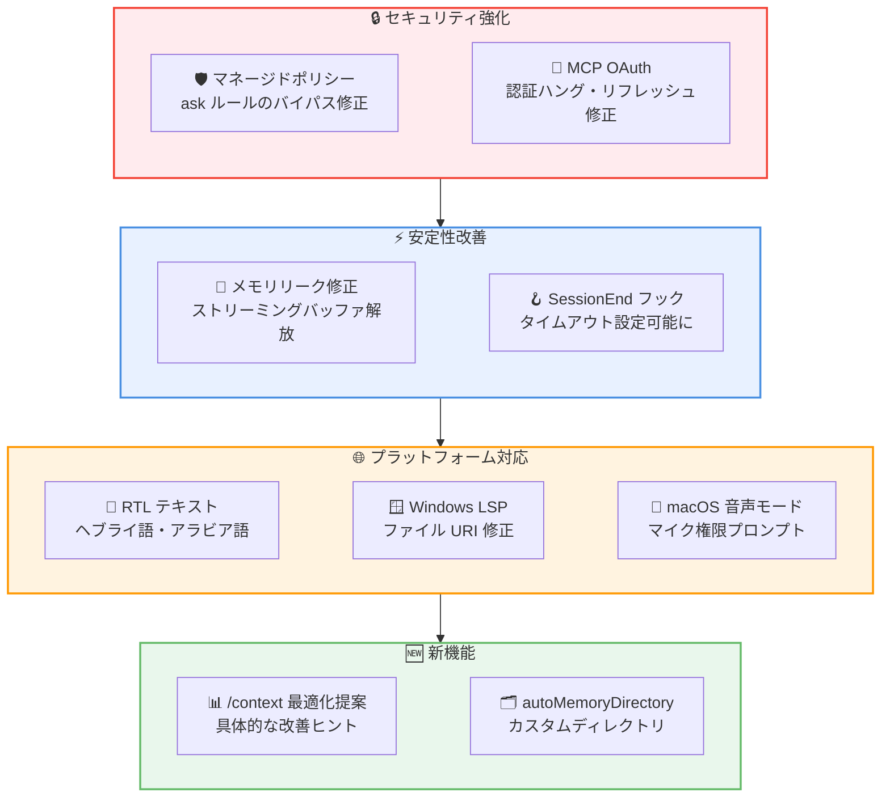

# Claude Code v2.1.74 リリース: メモリリーク修正、セキュリティ強化、RTL 言語対応

## メタデータ

| 項目 | 内容 |
|------|------|
| 発表日 | 2026-03-11 |
| ソース | Claude Code Changelog |
| カテゴリ | Claude Code アップデート |
| 公式リンク | https://github.com/anthropics/claude-code/blob/main/CHANGELOG.md |

## 概要

Claude Code v2.1.74 が 2026 年 3 月 11 日にリリースされました。本リリースでは、ストリーミング API レスポンスバッファのメモリリーク修正による RSS メモリの無制限増加の解消、マネージドポリシーの `ask` ルールがバイパスされるセキュリティ問題の修正、そしてヘブライ語やアラビア語などの RTL テキストレンダリング対応が主な変更点です。

新機能として `/context` コマンドへの最適化提案機能と `autoMemoryDirectory` 設定が追加され、MCP OAuth 認証や音声モード、プラグイン管理に関する多数のバグ修正も含まれています。

## 詳細

### 背景

Claude Code は Anthropic が提供する CLI ベースの AI 開発支援ツールです。v2.1.74 では、メモリ管理の安定性向上、セキュリティポリシーの適切な適用、そして国際化対応の強化に重点が置かれています。特に長時間稼働するセッションでのメモリリーク修正と、管理者が設定したセキュリティポリシーの確実な適用は、エンタープライズ環境での運用信頼性を大きく向上させます。

### 主な変更点

#### 新機能

- **`/context` コマンドの最適化提案**: コンテキスト負荷の高いツール、メモリの肥大化、キャパシティ警告を特定し、具体的な最適化のヒントを提示
- **`autoMemoryDirectory` 設定**: 自動メモリのストレージディレクトリをカスタム指定可能に

#### セキュリティ修正

- **マネージドポリシーのバイパス修正**: マネージドポリシーの `ask` ルールがユーザーの `allow` ルールやスキルの `allowed-tools` によってバイパスされる問題を修正。管理者が設定したセキュリティポリシーが確実に適用されるようになりました。

#### パフォーマンス修正

- **ストリーミング API メモリリーク修正**: ジェネレータが早期終了した際にストリーミング API レスポンスバッファが解放されず、Node.js/npm コードパスで RSS メモリが無制限に増加する問題を修正

#### MCP 関連修正

- **OAuth 認証ハング修正**: コールバックポートが既に使用中の場合に MCP OAuth 認証がハングする問題を修正
- **OAuth リフレッシュトークン修正**: HTTP 200 でエラーを返す OAuth サーバー (Slack など) でリフレッシュトークン期限切れ後に再認証プロンプトが表示されない問題を修正

#### プラットフォーム対応

- **RTL テキストレンダリング修正**: ヘブライ語、アラビア語などの RTL テキストが Windows Terminal、conhost、VS Code 統合ターミナルで正しくレンダリングされない問題を修正
- **Windows LSP 修正**: 不正なファイル URI により Windows 上で LSP サーバーが動作しない問題を修正
- **macOS 音声モード修正**: ネイティブバイナリにおいて、マイク権限が付与されていないターミナルで音声モードがサイレントに失敗する問題を修正。`audio-input` エンタイトルメントの追加により macOS が正しく権限プロンプトを表示

#### エージェント・モデル設定修正

- **フルモデル ID 対応**: エージェントフロントマターの `model:` フィールドおよび `--agents` JSON 設定でフルモデル ID (例: `claude-opus-4-5`) がサイレントに無視される問題を修正。`--model` と同じモデル値を受け付けるようになりました。

#### フック・プラグイン修正

- **`SessionEnd` フックのタイムアウト修正**: 終了時に `hook.timeout` の設定に関わらず 1.5 秒で強制終了される問題を修正。`CLAUDE_CODE_SESSIONEND_HOOKS_TIMEOUT_MS` 環境変数で設定可能に
- **プラグインインストール修正**: REPL 内でマーケットプレイスプラグインのローカルソースインストールが失敗する問題を修正
- **マーケットプレイス更新の Git サブモジュール同期**: プラグイン更新時にサブモジュールが同期されず、サブモジュール内のプラグインソースが壊れる問題を修正
- **不明なスラッシュコマンドの入力保持**: 引数付きの不明なスラッシュコマンドで入力がサイレントに破棄される問題を修正。警告として入力内容を表示するように変更

#### その他の変更

- **`--plugin-dir` の優先順位変更**: ローカル開発コピーが同名のインストール済みマーケットプレイスプラグインを上書きするよう変更 (マネージド設定で強制有効化されたプラグインを除く)
- **[VS Code] セッション削除ボタン修正**: 無題セッションの削除ボタンが機能しない問題を修正
- **[VS Code] スクロール操作改善**: 統合ターミナルでのスクロールホイールの応答性を、ターミナル対応のアクセラレーションにより改善

### 技術的な詳細

本リリースの技術的な注目点は以下の通りです。

- **ストリーミングバッファのメモリリーク**: Node.js/npm コードパスにおいて、ストリーミング API レスポンスのジェネレータが早期終了 (例: ユーザーによるキャンセル) した際、レスポンスバッファが解放されずにメモリが蓄積し続ける問題がありました。長時間のセッションや頻繁な API 呼び出しのキャンセルが発生する環境で RSS メモリが無制限に増加する原因となっていました。
- **マネージドポリシーのセキュリティ強化**: 管理者が `ask` ルールとして設定したポリシーが、ユーザーレベルの `allow` ルールやスキルの `allowed-tools` 設定によって迂回される脆弱性が修正されました。エンタープライズ環境でのポリシー管理において重要な修正です。
- **MCP OAuth のエッジケース対応**: OAuth フローにおける 2 つの異なる問題が修正されました。1 つ目はコールバックポート競合によるハング、2 つ目は HTTP 200 ステータスでエラーを返す OAuth サーバー (Slack が該当) でのリフレッシュトークン期限切れ処理です。

## 開発者への影響

### 対象

- Claude Code CLI を日常的に利用している開発者
- エンタープライズ環境でマネージドポリシーを運用しているチーム
- MCP 連携で OAuth 認証を利用しているユーザー
- Windows 環境で Claude Code を使用している開発者
- ヘブライ語やアラビア語などの RTL 言語圏のユーザー
- macOS ネイティブバイナリで音声モードを使用しているユーザー

### 必要なアクション

以下のコマンドで最新バージョンに更新できます。

```bash
# npm でのアップデート
npm update -g @anthropic-ai/claude-code

# 現在のバージョン確認
claude --version
```

特に以下のケースに該当するユーザーは早急なアップデートを推奨します。

- 長時間セッションでメモリ使用量の増加が観察されている場合
- マネージドポリシーでセキュリティルールを設定している環境
- MCP OAuth 連携 (特に Slack) で認証の問題が発生している場合

### 新機能の活用例

```bash
# /context コマンドで最適化提案を確認
/context

# 自動メモリのストレージディレクトリをカスタム設定
# settings.json で以下を設定
# "autoMemoryDirectory": "/path/to/custom/memory"

# SessionEnd フックのタイムアウトをカスタマイズ
export CLAUDE_CODE_SESSIONEND_HOOKS_TIMEOUT_MS=10000

# ローカル開発中のプラグインを優先して読み込む
claude --plugin-dir ./my-plugin
```

## アーキテクチャ図



## 関連リンク

- [Claude Code Changelog](https://github.com/anthropics/claude-code/blob/main/CHANGELOG.md)
- [Claude Code GitHub リポジトリ](https://github.com/anthropics/claude-code)
- [Claude Code ドキュメント](https://docs.anthropic.com/en/docs/claude-code)

## まとめ

Claude Code v2.1.74 は、セキュリティ、安定性、プラットフォーム対応の 3 つの柱で重要な改善を実現したリリースです。最も注目すべきは、マネージドポリシーの `ask` ルールがバイパスされるセキュリティ問題の修正で、エンタープライズ環境でのポリシー管理の信頼性が向上しています。

ストリーミング API レスポンスバッファのメモリリーク修正により、長時間セッションでの RSS メモリ無制限増加が解消され、Node.js/npm コードパスの安定性が大幅に改善されました。MCP OAuth 認証に関する 2 つの修正も、Slack などの外部サービスとの連携信頼性を向上させています。

プラットフォーム対応としては、RTL テキストレンダリング、Windows LSP サーバー、macOS 音声モードの権限プロンプトなど、多様な環境での利用体験が改善されています。全ての Claude Code ユーザーに早期のアップデートを推奨します。
