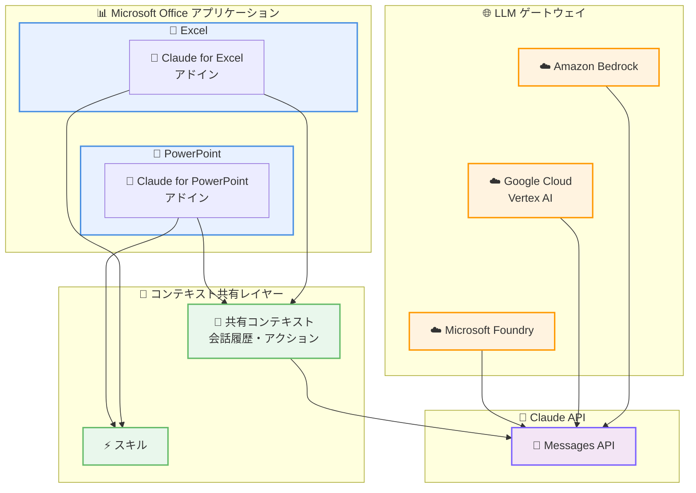

# Claude for Excel と Claude for PowerPoint の連携強化: アプリケーション間でのコンテキスト共有

## メタデータ

| 項目 | 内容 |
|------|------|
| 発表日 | 2026-03-11 |
| ソース | Claude Apps Release Notes |
| カテゴリ | 新機能・製品アップデート |
| 公式リンク | https://support.claude.com/en/articles/12138966-release-notes |

## 概要

Anthropic は 2026 年 3 月 11 日、Claude for Excel と Claude for PowerPoint のアドインにおける連携機能の強化を発表しました。両アドイン間で会話の完全なコンテキストを共有できるようになり、一方のアプリケーションでの操作がもう一方のアプリケーションにも反映されるようになります。

また、アドインでのスキルサポートの追加、および Amazon Bedrock、Google Cloud の Vertex AI、Microsoft Foundry を通じた LLM ゲートウェイ接続のサポートも導入されました。

## 主なポイント

### クロスアプリケーションコンテキスト共有

- Claude for Excel と Claude for PowerPoint のアドイン間で会話の完全なコンテキストを共有可能に
- 一方のアプリケーションで Claude が実行したアクションが、もう一方のアプリケーションでの操作にも反映される
- Excel でのデータ分析結果を PowerPoint でのプレゼンテーション作成に直接活用可能

### スキルサポートの追加

- アドインでスキル機能が利用可能に
- 特定のタスクに特化した操作をアドイン内で実行できるようになる

※ 詳細ページ未公開のため、公開後に更新が必要です

### LLM ゲートウェイ接続のサポート

- **Amazon Bedrock**: AWS 環境からアドインへの接続が可能に
- **Google Cloud Vertex AI**: Google Cloud 環境からの接続をサポート
- **Microsoft Foundry**: Microsoft 環境からの接続をサポート
- エンタープライズ環境での既存クラウドインフラを活用したアドイン利用が可能に

## 詳細

### アーキテクチャ

### ユースケース

この連携強化により、以下のようなワークフローが実現可能になります。

1. **データ分析からプレゼンテーション作成**: Excel でデータ分析を行い、その結果とコンテキストを保持したまま PowerPoint でプレゼンテーションを自動生成
2. **レポート作成の効率化**: Excel のスプレッドシートデータに基づいて、PowerPoint でグラフやサマリースライドを作成
3. **エンタープライズ統合**: 既存のクラウドインフラ (Bedrock、Vertex AI、Foundry) を通じて、セキュリティポリシーを維持しながらアドインを利用

## 開発者への影響

### 対象

- Microsoft Office アドインを利用しているエンドユーザー
- Amazon Bedrock、Google Cloud Vertex AI、Microsoft Foundry を利用しているエンタープライズユーザー
- Claude を業務ワークフローに統合している組織

### 必要なアクション

- Claude for Excel および Claude for PowerPoint のアドインを最新バージョンに更新
- LLM ゲートウェイ接続を利用する場合は、各クラウドプロバイダーでの設定が必要

※ 詳細ページ未公開のため、公開後に更新が必要です

## 関連リンク

- [Claude Apps Release Notes](https://support.claude.com/en/articles/12138966-release-notes)
- [Anthropic News](https://www.anthropic.com/news)
- [Claude API](https://www.anthropic.com/api)

## まとめ

Claude for Excel と Claude for PowerPoint のアドイン連携強化は、Microsoft Office 環境での AI 活用をより実用的なものにする重要なアップデートです。クロスアプリケーションのコンテキスト共有により、Excel でのデータ分析から PowerPoint でのプレゼンテーション作成まで、一貫した AI アシスタンスを受けられるようになります。

また、Amazon Bedrock、Google Cloud Vertex AI、Microsoft Foundry を通じた LLM ゲートウェイ接続のサポートにより、エンタープライズ環境での導入障壁が大幅に下がることが期待されます。スキルサポートの追加とあわせて、業務効率化の可能性がさらに広がるアップデートと言えます。
