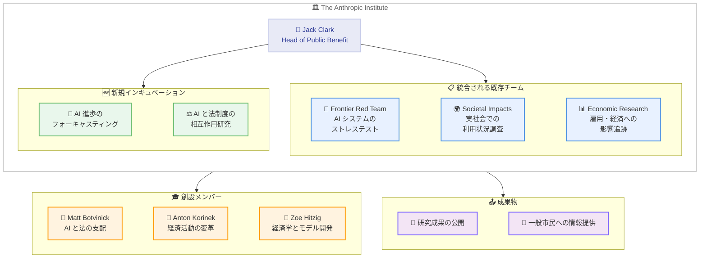

# The Anthropic Institute: 強力な AI がもたらす社会的課題に取り組む新組織を設立

## メタデータ

| 項目 | 内容 |
|------|------|
| 発表日 | 2026-03-11 |
| ソース | Anthropic News |
| カテゴリ | アナウンスメント |
| 公式リンク | https://www.anthropic.com/news/the-anthropic-institute |

## 概要

Anthropic は 2026 年 3 月 11 日、強力な AI が社会にもたらす最も重大な課題に取り組むための新組織「The Anthropic Institute」の設立を発表しました。共同創業者の Jack Clark が Head of Public Benefit という新しい役職に就任し、組織を率います。

The Anthropic Institute は、機械学習エンジニア、経済学者、社会科学者からなる学際的なチームで構成され、フロンティア AI システムの開発者だけが持つ情報へのアクセスを活かし、研究者や一般市民が活用できる知見を提供していきます。

## 主なポイント

### 組織の構成

The Anthropic Institute は、Anthropic 内の既存の 3 つの研究チームを統合・拡大する形で設立されます。

- **Frontier Red Team**: AI システムのストレステストを実施し、脆弱性やリスクを特定
- **Societal Impacts**: AI の実社会での利用状況を調査・分析
- **Economic Research**: AI が雇用や経済に与える影響を追跡・評価

さらに、新しいチームのインキュベーションも進められており、現在以下の分野に取り組んでいます。

- AI の進歩を予測するフォーキャスティング
- 強力な AI が法制度とどのように相互作用するかの研究

### リーダーシップ

- **Jack Clark** (Anthropic 共同創業者): Head of Public Benefit として The Anthropic Institute を統括

### 創設メンバー

著名な研究者が創設メンバーとして参画しています。

- **Matt Botvinick**: Google DeepMind の元 Senior Director of Research、Princeton 大学教授。AI と法の支配 (Rule of Law) に関する研究を主導
- **Anton Korinek**: University of Virginia 経済学教授。変革的な AI が経済活動をどのように再構築するかの研究を主導
- **Zoe Hitzig**: 元 OpenAI 所属。経済学研究をモデルの学習・開発に結びつける取り組みを担当

## 詳細

### 組織構造

### 公共政策組織の拡大

The Anthropic Institute の設立と並行して、Anthropic は公共政策部門も強化しています。

- **Sarah Heck** が Head of Public Policy に就任 (前職: Stripe の Head of Entrepreneurship、ホワイトハウス国家安全保障会議)
- 2026 年春にワシントン DC に初のオフィスを開設予定
- グローバルな政策活動の拡大

### 独自の優位性

The Anthropic Institute は、フロンティア AI システムの開発者だけが持つ情報にアクセスできる独自の立場にあります。この「内部からの視点」を活かし、外部の研究者や政策立案者が利用できる形で知見を提供することが、この組織の大きな特徴です。

## 社会への影響

### 対象

- AI 政策に関わる研究者・政策立案者
- AI の社会的影響に関心を持つ一般市民
- AI と法制度の関係を研究する法学者
- AI が労働市場に与える影響を分析する経済学者
- フロンティア AI の安全性に取り組むセキュリティ研究者

### 期待される効果

- **透明性の向上**: フロンティア AI の開発に関する内部知見が公開されることで、社会全体の理解が深まる
- **政策形成への貢献**: エビデンスに基づいた AI 政策の立案に必要な情報が提供される
- **リスク評価の強化**: AI システムの脆弱性やリスクに関する体系的な評価が進む
- **経済的影響の把握**: AI が雇用や経済活動に与える影響のデータが蓄積される

## 関連リンク

- [公式発表](https://www.anthropic.com/news/the-anthropic-institute)
- [Anthropic News](https://www.anthropic.com/news)

## まとめ

The Anthropic Institute の設立は、Anthropic が AI 開発だけでなく、AI がもたらす社会的課題への対応にも本格的に取り組む姿勢を示すものです。共同創業者の Jack Clark をリーダーに、Google DeepMind、Princeton 大学、University of Virginia、OpenAI など多様なバックグラウンドを持つ研究者が集結し、AI の安全性評価、社会的影響の調査、経済への影響分析、法制度との関係性の研究を推進します。

フロンティア AI システムの開発者としての独自の立場を活かし、外部の研究者や一般市民が活用できる情報を提供するという方針は、AI 開発の透明性と責任ある発展に向けた重要な一歩です。DC オフィスの開設や公共政策チームの強化と合わせ、Anthropic の公共的な取り組みが大きく拡大していくことが期待されます。
