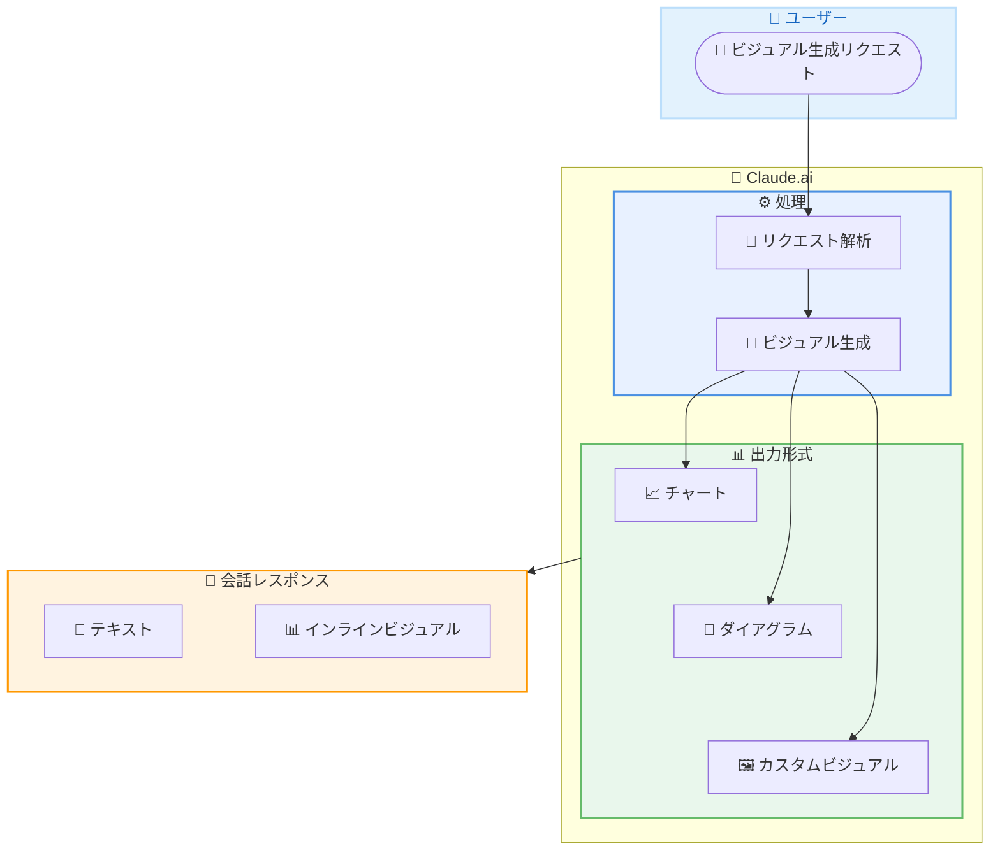

# Claude がインタラクティブなチャート、ダイアグラム、ビジュアライゼーションを作成可能に

## メタデータ

| 項目 | 内容 |
|------|------|
| 発表日 | 2026-03-12 |
| ソース | Claude Apps Release Notes |
| カテゴリ | 新機能 |
| 公式リンク | https://support.claude.com/en/articles/12138966-release-notes |

## 概要

Anthropic は 2026 年 3 月 12 日、Claude.ai においてインタラクティブなチャート、ダイアグラム、およびビジュアライゼーションをインライン (会話内) で作成できる新機能を発表しました。

従来、Claude はテキストベースの応答のみを出力していましたが、本機能により会話の中で直接カスタムビジュアルコンテンツを生成できるようになりました。Artifacts とは異なり、応答テキストの中にインラインで視覚的なコンテンツが埋め込まれる形式です。

## 主なポイント

### 新機能の概要

- **インラインビジュアル生成**: Claude の応答内に直接チャート、ダイアグラム、ビジュアライゼーションを埋め込み可能に
- **カスタムビジュアル**: ユーザーのリクエストに応じたカスタムチャートやダイアグラムを生成
- **インタラクティブ対応**: 静的な画像ではなく、インタラクティブに操作可能なビジュアルを提供
- **会話内統合**: Artifacts とは別に、会話のフロー内でシームレスにビジュアルを表示

### 対応するビジュアルの種類

※ 詳細ページ未公開のため、公開後に更新が必要です

リリースノートの記載に基づき、以下の種類のビジュアルが作成可能と考えられます。

- **チャート**: データの可視化 (棒グラフ、折れ線グラフ、円グラフなど)
- **ダイアグラム**: システム構成図、フローチャート、関係図など
- **その他のビジュアライゼーション**: カスタムレイアウトや図解

## 詳細

### 背景

これまで Claude.ai では、テキストベースの応答に加え、Artifacts 機能によりコードやドキュメントなどの成果物を別パネルに表示することが可能でした。しかし、会話の流れの中でデータの可視化やダイアグラムをインラインで直接表示する機能は提供されていませんでした。

本機能 (Custom visuals in chat) の導入により、ユーザーはデータ分析や説明の場面で、より直感的な視覚的フィードバックを会話内で受け取ることが可能になります。

### 技術的な詳細

※ 詳細ページ未公開のため、公開後に更新が必要です

### ビジュアライゼーション機能のアーキテクチャ

### 従来の応答との比較

| 機能 | 従来 | 本アップデート後 |
|------|------|-----------------|
| テキスト応答 | 対応 | 対応 |
| コードブロック | 対応 | 対応 |
| Artifacts | 対応 (別パネル) | 対応 (別パネル) |
| インラインチャート | 非対応 | 対応 |
| インラインダイアグラム | 非対応 | 対応 |
| インタラクティブビジュアル | 非対応 | 対応 |

## 開発者への影響

### 対象

- Claude.ai を利用しているすべてのユーザー
- データ分析やビジュアライゼーションを頻繁に行うユーザー
- 技術的な説明やドキュメント作成に Claude を活用しているユーザー

### 必要なアクション

現時点で特別なアクションは不要です。Claude.ai 上で会話する際に、チャートやダイアグラムの作成をリクエストすることで本機能を利用できます。

※ 詳細ページ未公開のため、公開後に更新が必要です

### 想定されるユースケース

- **データ分析**: CSV データやテーブルデータからインタラクティブなグラフを生成
- **システム設計**: アーキテクチャ図やフローチャートを会話内で作成
- **プレゼンテーション準備**: 説明用のダイアグラムや図解を迅速に作成
- **教育**: 概念の視覚的な説明やプロセスフローの図示

## 関連リンク

- [Claude Apps Release Notes](https://support.claude.com/en/articles/12138966-release-notes)
- [Claude.ai](https://claude.ai)

## まとめ

Claude.ai にインタラクティブなチャート、ダイアグラム、ビジュアライゼーションのインライン生成機能が追加されました。従来のテキストベースの応答に加え、会話の流れの中で直接視覚的なコンテンツを表示できるようになったことで、データ分析やシステム設計の説明など、幅広いユースケースでの活用が期待されます。

本機能の詳細な仕様やサポートされるビジュアルの種類については、詳細ページの公開を待って追加情報を確認することを推奨します。
