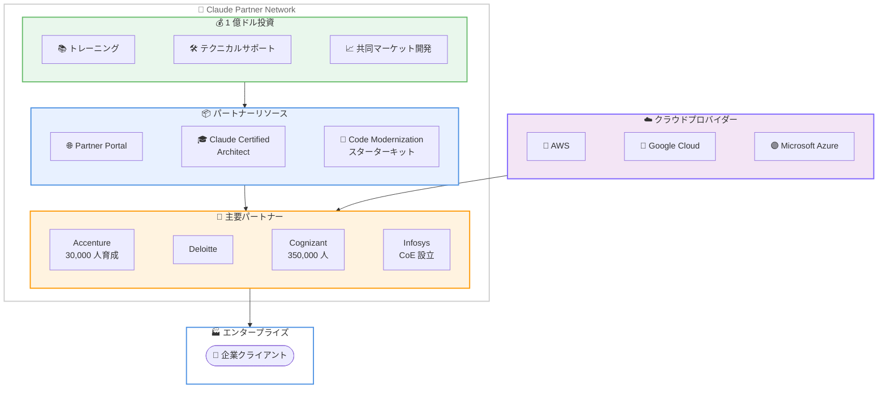

# Anthropic が Claude Partner Network を発表: パートナーエコシステムに 1 億ドルを投資

## メタデータ

| 項目 | 内容 |
|------|------|
| 発表日 | 2026-03-12 |
| ソース | Anthropic News |
| カテゴリ | パートナーシップ・事業拡大 |
| 公式リンク | https://www.anthropic.com/news/claude-partner-network |

## 概要

Anthropic は 2026 年 3 月 12 日、エンタープライズ向け Claude 導入を支援するパートナー組織のためのプログラム「Claude Partner Network」を発表しました。同社はパートナーエコシステムへの初期投資として 1 億ドル (約 150 億円) を投じ、トレーニングコース、専任テクニカルサポート、共同マーケット開発を通じてパートナーを支援します。

Claude は AWS、Google Cloud、Microsoft の主要 3 クラウドプロバイダーすべてで利用可能な唯一のフロンティア AI モデルであり、この幅広いアクセス性を活かしたパートナーエコシステムの構築が進められます。

## 主なポイント

### 投資とプログラム概要

- **投資額**: 2026 年の初期投資として 1 億ドルを投入。今後さらに拡大予定
- **対象**: マネジメントコンサルティング、プロフェッショナルサービス、専門 AI 企業
- **参加条件**: Claude を市場に展開するすべての組織が対象。メンバーシップは無料
- **チーム拡大**: パートナー対応チームを 5 倍に拡大

### パートナー向け支援内容

- **Partner Portal**: Anthropic Academy のトレーニング教材、セールスプレイブックへのアクセス
- **Claude Certified Architect, Foundations**: Claude 初の技術認定資格を提供
- **Code Modernization スターターキット**: レガシーコードベースの移行を支援するツール
- **専任テクニカルサポート**: パートナー専用のサポート体制

### 主要パートナーの取り組み

- **Accenture**: 30,000 人のプロフェッショナルに Claude のトレーニングを実施
- **Deloitte**: エンタープライズ AI には強力な形式化が必要と表明
- **Cognizant**: グローバルワークフォース (約 350,000 人) 全体に Claude アクセスを開放
- **Infosys**: Anthropic Center of Excellence を設立し、クライアントの AI スケーリングを支援

## 詳細

### パートナーネットワークの構造

### クラウドプロバイダーとの連携

Claude は以下の 3 つの主要クラウドプロバイダーすべてで利用可能な唯一のフロンティア AI モデルです。

- **AWS**: Amazon Bedrock を通じて提供
- **Google Cloud**: Vertex AI を通じて提供
- **Microsoft Azure**: Azure AI を通じて提供

この 3 大クラウドプラットフォームでの利用可能性により、パートナーはクライアントの既存インフラに関係なく Claude を導入できるという優位性を持ちます。

### 技術認定プログラム

「Claude Certified Architect, Foundations」は Claude 初の公式技術認定資格です。パートナー組織のエンジニアやアーキテクトが Claude の設計・実装に関する専門知識を証明できる仕組みとなります。

### エグゼクティブコメント

Steve Corfield (Head of Global Business Development and Partnerships, Anthropic) は次のように述べています。

> "Anthropic is the most committed AI company in the world to the partner ecosystem -- and we're putting $100 million behind that this year to prove it."

## 開発者への影響

### 対象

- エンタープライズ向けに Claude を活用したソリューションを構築するパートナー企業の開発者
- Claude API を利用してクライアント向けアプリケーションを開発する SI 企業の技術者
- レガシーシステムのモダナイゼーションに取り組むエンジニア

### 期待される変化

- **技術認定**: Claude Certified Architect 資格により、専門知識の可視化と人材育成が加速
- **移行ツール**: Code Modernization スターターキットにより、レガシーコードベースの移行が効率化
- **トレーニング**: Anthropic Academy の教材を通じて、体系的な学習パスが提供される
- **サポート体制**: 専任テクニカルサポートにより、技術的な課題の迅速な解決が可能に

### 必要なアクション

- Claude を活用したソリューションを提供している組織は、Claude Partner Network への参加を検討
- 技術者は Claude Certified Architect 認定資格の取得を検討
- レガシーシステムの移行を計画している場合は、Code Modernization スターターキットの活用を検討

## 関連リンク

- [公式発表](https://www.anthropic.com/news/claude-partner-network)
- [Anthropic News](https://www.anthropic.com/news)
- [Claude API](https://www.anthropic.com/api)

## まとめ

Anthropic の Claude Partner Network は、エンタープライズ AI 導入におけるパートナーエコシステムの構築に向けた大規模な投資です。1 億ドルの初期投資、技術認定プログラム、専用ツールの提供により、Accenture、Deloitte、Cognizant、Infosys といった大手パートナー企業を通じた Claude の企業導入が加速することが期待されます。

AWS、Google Cloud、Microsoft の 3 大クラウドプロバイダーすべてで利用可能という独自のポジションを活かし、パートナー企業がクライアントの既存インフラに依存せず Claude を導入できる体制が整えられています。パートナー対応チームの 5 倍拡大と無料メンバーシップにより、幅広い組織がエコシステムに参加しやすい仕組みが構築されています。
