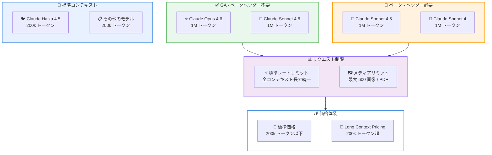

# Claude Opus 4.6 / Sonnet 4.6 の 1M トークンコンテキストウィンドウが GA に

## メタデータ

| 項目 | 内容 |
|------|------|
| 発表日 | 2026-03-13 |
| ソース | Claude Developer Platform Release Notes |
| カテゴリ | API アップデート |
| 公式リンク | https://platform.claude.com/docs/en/release-notes/overview |

## 概要

Anthropic は 2026 年 3 月 13 日、Claude Opus 4.6 および Sonnet 4.6 の 1M トークンコンテキストウィンドウを正式リリース (GA) しました。200k トークンを超えるリクエストはベータヘッダー不要で自動的に処理されるようになります。あわせて、1M 専用レートリミットの廃止とメディアリミットの大幅引き上げ (100 から 600 へ) が実施されました。

## 詳細

### 背景

1M トークンコンテキストウィンドウは、2025 年 8 月 12 日に Claude Sonnet 4 向けのベータ機能として Claude API および Amazon Bedrock で初めて提供されました。その後、2026 年 2 月 5 日に Claude Opus 4.6 でもベータ対応が追加されました。

今回の GA リリースにより、Claude Opus 4.6 と Sonnet 4.6 ではベータヘッダーなしで 1M トークンまでのコンテキストを利用できるようになりました。一方、Claude Sonnet 4.5 と Sonnet 4 については引き続きベータヘッダー (`context-1m-2025-08-07`) が必要です。

### 主な変更点

1. **1M コンテキストウィンドウの GA**: Claude Opus 4.6 と Sonnet 4.6 で、200k トークンを超えるリクエストがベータヘッダー不要で自動的に処理されるようになりました。標準価格で利用可能です
2. **1M 専用レートリミットの廃止**: すべての対応モデルで 1M 専用のレートリミットが撤廃され、アカウントの標準レートリミットがコンテキスト長に関係なく適用されるようになりました
3. **メディアリミットの引き上げ**: 1M トークンコンテキストウィンドウ使用時の画像および PDF ページ数の上限が、1 リクエストあたり 100 から 600 に引き上げられました

### 技術的な詳細

#### モデル別の対応状況

| モデル | コンテキストウィンドウ | ベータヘッダー | ステータス |
|--------|----------------------|---------------|-----------|
| Claude Opus 4.6 | 1M トークン | 不要 | GA |
| Claude Sonnet 4.6 | 1M トークン | 不要 | GA |
| Claude Sonnet 4.5 | 1M トークン | 必要 | ベータ |
| Claude Sonnet 4 | 1M トークン | 必要 | ベータ |
| その他のモデル | 200k トークン | - | - |

#### メディアリミット

| コンテキストウィンドウ | 画像 / PDF ページ上限 |
|----------------------|---------------------|
| 1M トークン | 600 |
| 200k トークン | 100 |

#### 価格体系

200k トークンを超える入力トークンには Long Context Pricing が適用されます。200k トークン以下のリクエストは標準価格で処理されます。

## アーキテクチャ図



## コード例

### Python SDK - 1M コンテキストウィンドウの利用 (ベータヘッダー不要)

Claude Opus 4.6 および Sonnet 4.6 では、ベータヘッダーを指定する必要がなくなりました。200k トークンを超えるリクエストも通常の API コールと同じ方法で送信できます。

```python
import anthropic

client = anthropic.Anthropic()

# Claude Opus 4.6 / Sonnet 4.6 ではベータヘッダー不要
# 200k トークンを超えるリクエストも自動的に処理される
message = client.messages.create(
    model="claude-opus-4-6-20260205",
    max_tokens=16384,
    messages=[
        {
            "role": "user",
            "content": [
                {
                    "type": "text",
                    "text": large_document_text  # 200k トークン超のドキュメント
                },
                {
                    "type": "text",
                    "text": "この文書の要点をまとめてください。"
                }
            ]
        }
    ]
)

print(message.content[0].text)
```

### Sonnet 4.5 / Sonnet 4 での利用 (ベータヘッダーが引き続き必要)

```python
import anthropic

client = anthropic.Anthropic()

# Sonnet 4.5 / Sonnet 4 ではベータヘッダーが必要
message = client.beta.messages.create(
    model="claude-sonnet-4-5-20250929",
    betas=["context-1m-2025-08-07"],
    max_tokens=16384,
    messages=[
        {
            "role": "user",
            "content": [
                {
                    "type": "text",
                    "text": large_document_text  # 200k トークン超のドキュメント
                },
                {
                    "type": "text",
                    "text": "この文書の要点をまとめてください。"
                }
            ]
        }
    ]
)

print(message.content[0].text)
```

### 大量の画像 / PDF を含むリクエスト (最大 600 件)

```python
import anthropic
import base64

client = anthropic.Anthropic()

# 1M コンテキストウィンドウでは最大 600 画像 / PDF ページを送信可能
content = []
for pdf_url in pdf_urls[:600]:  # 最大 600 ページ
    content.append({
        "type": "document",
        "source": {
            "type": "url",
            "url": pdf_url
        }
    })

content.append({
    "type": "text",
    "text": "これらのドキュメントを分析し、主要な傾向をまとめてください。"
})

message = client.messages.create(
    model="claude-opus-4-6-20260205",
    max_tokens=16384,
    messages=[
        {
            "role": "user",
            "content": content
        }
    ]
)

print(message.content[0].text)
```

## 開発者への影響

### 対象

- Claude API を利用して大量のドキュメント処理や長文分析を行う開発者
- Claude Opus 4.6 / Sonnet 4.6 で 1M コンテキストウィンドウをベータ利用していた開発者
- 画像や PDF を大量に処理するアプリケーションを構築している開発者

### 必要なアクション

- **Opus 4.6 / Sonnet 4.6 ユーザー**: ベータヘッダー (`context-1m-2025-08-07`) の指定を削除可能。削除しなくても動作に影響はありません
- **Sonnet 4.5 / Sonnet 4 ユーザー**: 引き続きベータヘッダーの指定が必要
- **レートリミットの確認**: 1M 専用のレートリミットが廃止されたため、アカウントの標準レートリミットが適用されます。必要に応じて使用量を確認してください

### 移行ガイド

1M コンテキストウィンドウを Opus 4.6 または Sonnet 4.6 で利用している場合、コードの変更は不要です。ベータヘッダーを使用している場合は削除することで、コードがよりシンプルになります。

**変更前 (ベータ期間中)**:

```python
message = client.beta.messages.create(
    model="claude-opus-4-6-20260205",
    betas=["context-1m-2025-08-07"],
    max_tokens=16384,
    messages=[...]
)
```

**変更後 (GA)**:

```python
message = client.messages.create(
    model="claude-opus-4-6-20260205",
    max_tokens=16384,
    messages=[...]
)
```

## 関連リンク

- [Claude Developer Platform Release Notes](https://platform.claude.com/docs/en/release-notes/overview)
- [Context Windows ドキュメント](https://platform.claude.com/docs/en/build-with-claude/context-windows)
- [Long Context Pricing](https://platform.claude.com/docs/en/about-claude/pricing#long-context-pricing)
- [Beta Headers](https://platform.claude.com/docs/en/api/beta-headers)

## まとめ

Claude Opus 4.6 と Sonnet 4.6 で 1M トークンコンテキストウィンドウが GA となり、ベータヘッダーなしで利用可能になりました。2025 年 8 月のベータ開始から約 7 か月を経ての正式リリースとなります。1M 専用レートリミットの廃止により、コンテキスト長に関係なく統一されたレートリミットが適用されるようになり、運用がシンプルになりました。また、メディアリミットの 6 倍引き上げ (100 から 600) により、大量の画像や PDF を含むリクエストの処理能力が大幅に向上しています。

Sonnet 4.5 と Sonnet 4 では引き続きベータヘッダーが必要ですが、今後の GA 拡大が期待されます。
