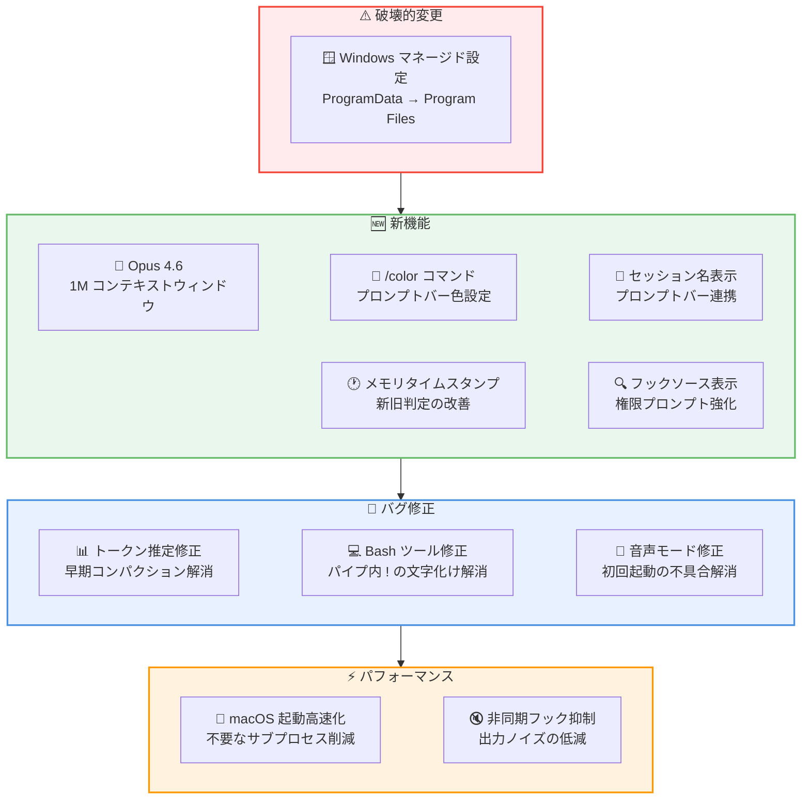

# Claude Code v2.1.75 リリース: Opus 4.6 の 1M コンテキストウィンドウ対応とトークン推定修正

## メタデータ

| 項目 | 内容 |
|------|------|
| 発表日 | 2026-03-13 |
| ソース | Claude Code Changelog |
| カテゴリ | Claude Code アップデート |
| 公式リンク | https://github.com/anthropics/claude-code/blob/main/CHANGELOG.md |

## 概要

Claude Code v2.1.75 が 2026 年 3 月 13 日にリリースされました。本リリースの最大の注目点は、Max、Team、Enterprise プランにおいて Opus 4.6 の 1M コンテキストウィンドウがデフォルトで利用可能になったことです。これにより、大規模なコードベースの解析やリファクタリングがより効率的に行えるようになります。

また、トークン推定において thinking ブロックや `tool_use` ブロックが過剰カウントされ、早期にコンテキストコンパクションが発生する問題が修正されました。Bash ツールでのパイプコマンド内 `!` の文字化け修正、音声モードの初回起動不具合の修正など、多数のバグフィックスが含まれています。

**重要**: Windows のマネージド設定ファイルパスに破壊的変更があります。詳細は「移行ガイド」セクションを参照してください。

## 詳細

### 背景

Claude Code は Anthropic が提供する CLI ベースの AI 開発支援ツールです。v2.1.75 では、Opus 4.6 のフルコンテキストウィンドウの開放による大規模コードベース対応の強化、トークン推定精度の改善によるコンテキスト管理の最適化、そして UX の細やかな改善に重点が置かれています。

### 主な変更点

#### 新機能

- **Opus 4.6 の 1M コンテキストウィンドウ**: Max、Team、Enterprise プランで Opus 4.6 の 1M コンテキストウィンドウがデフォルトで有効化。従来は追加使用量として別途必要でしたが、プラン内で利用可能になりました。
- **`/color` コマンド**: 全ユーザーがセッションのプロンプトバーの色をカスタマイズ可能に。複数セッションを同時に使用する際の視覚的な区別に活用できます。
- **セッション名のプロンプトバー表示**: `/rename` でセッション名を設定した際、プロンプトバーにセッション名が表示されるようになりました。
- **メモリファイルの最終更新タイムスタンプ**: メモリファイルに最終更新日時が追加され、Claude がどのメモリが新しいか古いかを判断できるようになりました。
- **フックソースの表示**: 権限確認プロンプトにおいて、フックの出所 (settings/plugin/skill) が表示されるようになりました。

#### バグ修正

- **音声モードの初回起動修正**: 新規インストール環境で `/voice` を 2 回トグルしないと音声モードが起動しない問題を修正
- **モデル名表示の更新修正**: `/model` や Option+P でモデル切り替え後、ヘッダーに表示されるモデル名が更新されない問題を修正
- **セッションクラッシュ修正**: 添付メッセージの計算が undefined を返した際にセッションがクラッシュする問題を修正
- **Bash ツールの `!` 文字化け修正**: パイプコマンド内の `!` が正しく処理されない問題を修正。`jq 'select(.x != .y)'` などが正常に動作するようになりました。
- **マネージド無効プラグインの非表示化**: 組織によって強制無効化されたプラグインが `/plugin` のインストール済みタブに表示される問題を修正
- **トークン推定の過剰カウント修正**: thinking ブロックおよび `tool_use` ブロックのトークン推定が過剰にカウントされ、早期にコンテキストコンパクションが発生する問題を修正
- **マーケットプレイス設定パスの修正**: 破損したマーケットプレイス設定パスのハンドリングを修正
- **`/resume` セッション名の喪失修正**: フォークまたは継続されたセッションを `/resume` した際にセッション名が失われる問題を修正
- **`/status` ダイアログの Esc キー修正**: Config タブを表示した後に Esc キーでダイアログが閉じない問題を修正
- **プラン承認・拒否時の入力処理修正**: プランの承認または拒否時の入力ハンドリングを修正
- **エージェントチームのフッターヒント修正**: "↓ to expand" と表示されていた箇所を正しい "shift + ↓ to expand" に修正

#### パフォーマンス改善

- **macOS 起動パフォーマンス改善**: 非 MDM マシンで不要なサブプロセスの起動をスキップし、起動時間を短縮
- **非同期フック完了メッセージの抑制**: 非同期フックの完了メッセージがデフォルトで非表示に変更。`--verbose` またはトランスクリプトモードで確認可能

#### 破壊的変更

- **Windows マネージド設定パスの変更**: 非推奨だった `C:\ProgramData\ClaudeCode\managed-settings.json` のフォールバックが削除されました。`C:\Program Files\ClaudeCode\managed-settings.json` を使用する必要があります。

### 技術的な詳細

本リリースの技術的な注目点は以下の通りです。

- **1M コンテキストウィンドウの開放**: Opus 4.6 は最大 1M トークンのコンテキストウィンドウを持っていますが、これまで Max、Team、Enterprise プランでも追加使用量として別途課金が必要でした。v2.1.75 ではこの制限が撤廃され、プラン内でデフォルト利用可能になりました。大規模なモノリポやフレームワーク全体の解析など、広範なコンテキストを必要とするタスクに大きな恩恵があります。
- **トークン推定精度の改善**: thinking ブロックや `tool_use` ブロックのトークン数が実際より多く推定されていたため、コンテキストウィンドウに余裕があるにもかかわらずコンパクションが早期に実行される問題がありました。この修正により、コンテキストウィンドウをより効率的に活用できるようになります。
- **Bash ツールの `!` 処理**: シェルにおける履歴展開文字 `!` がパイプコマンド内で意図せず展開・文字化けしていた問題が修正されました。`jq` や `grep -v` などのフィルタリングコマンドで否定条件を使用する際に影響していた問題です。

## 開発者への影響

### 対象

- Max、Team、Enterprise プランで Claude Code を利用している開発者
- 大規模コードベースを扱うチーム
- Windows 環境でマネージド設定を運用しているエンタープライズユーザー
- 音声モードを利用しているユーザー
- 複数セッションを並行して使用する開発者

### 必要なアクション

以下のコマンドで最新バージョンに更新できます。

```bash
# npm でのアップデート
npm update -g @anthropic-ai/claude-code

# 現在のバージョン確認
claude --version
```

特に以下のケースに該当するユーザーは早急なアップデートを推奨します。

- コンテキストコンパクションが頻繁に発生し、会話の途中で情報が失われている場合
- Bash ツールでパイプコマンドの `!` を含む操作が失敗している場合
- 新規インストール環境で音声モードが正常に動作しない場合

### 移行ガイド

#### Windows マネージド設定パスの移行

**対象**: Windows 環境でマネージド設定ファイルを `C:\ProgramData\ClaudeCode\` に配置しているエンタープライズユーザー

v2.1.75 で非推奨の旧パスへのフォールバックが完全に削除されました。以下の手順で移行してください。

```powershell
# 1. 旧パスにファイルが存在するか確認
Test-Path "C:\ProgramData\ClaudeCode\managed-settings.json"

# 2. 新しいパスにディレクトリを作成
New-Item -ItemType Directory -Force -Path "C:\Program Files\ClaudeCode"

# 3. 設定ファイルを移動
Move-Item "C:\ProgramData\ClaudeCode\managed-settings.json" "C:\Program Files\ClaudeCode\managed-settings.json"

# 4. 旧ディレクトリが空であれば削除
Remove-Item "C:\ProgramData\ClaudeCode" -ErrorAction SilentlyContinue
```

## コード例

```bash
# /color コマンドでセッションのプロンプトバー色を設定
/color blue

# /rename でセッション名を設定 (プロンプトバーに表示される)
/rename "feature-auth-refactor"

# Opus 4.6 の 1M コンテキストウィンドウを活用
# Max/Team/Enterprise プランでは追加設定不要

# 修正された Bash ツールでの jq コマンド例
jq 'select(.status != "completed")' results.json

# 非同期フックの完了メッセージを確認する場合
claude --verbose
```

## アーキテクチャ図



## 関連リンク

- [Claude Code Changelog](https://github.com/anthropics/claude-code/blob/main/CHANGELOG.md)
- [Claude Code GitHub リポジトリ](https://github.com/anthropics/claude-code)
- [Claude Code ドキュメント](https://docs.anthropic.com/en/docs/claude-code)

## まとめ

Claude Code v2.1.75 は、Opus 4.6 の 1M コンテキストウィンドウのデフォルト開放を筆頭に、トークン推定精度の改善やユーザー体験の向上を実現した重要なリリースです。Max、Team、Enterprise プランのユーザーは、追加の設定なしで大規模コードベースの解析やリファクタリングをより効率的に行えるようになります。

トークン推定における thinking ブロックと `tool_use` ブロックの過剰カウント修正により、コンテキストウィンドウの実効的な利用可能量が増加し、不要なコンパクションが削減されます。Bash ツールの `!` 文字化け修正や音声モードの初回起動問題の解消など、日常的な開発体験を改善する多数のバグフィックスも含まれています。

Windows 環境でマネージド設定を `C:\ProgramData\ClaudeCode\` に配置しているエンタープライズユーザーは、`C:\Program Files\ClaudeCode\` への移行が必須です。破壊的変更のため、アップデート前に設定ファイルの移行を完了させてください。
