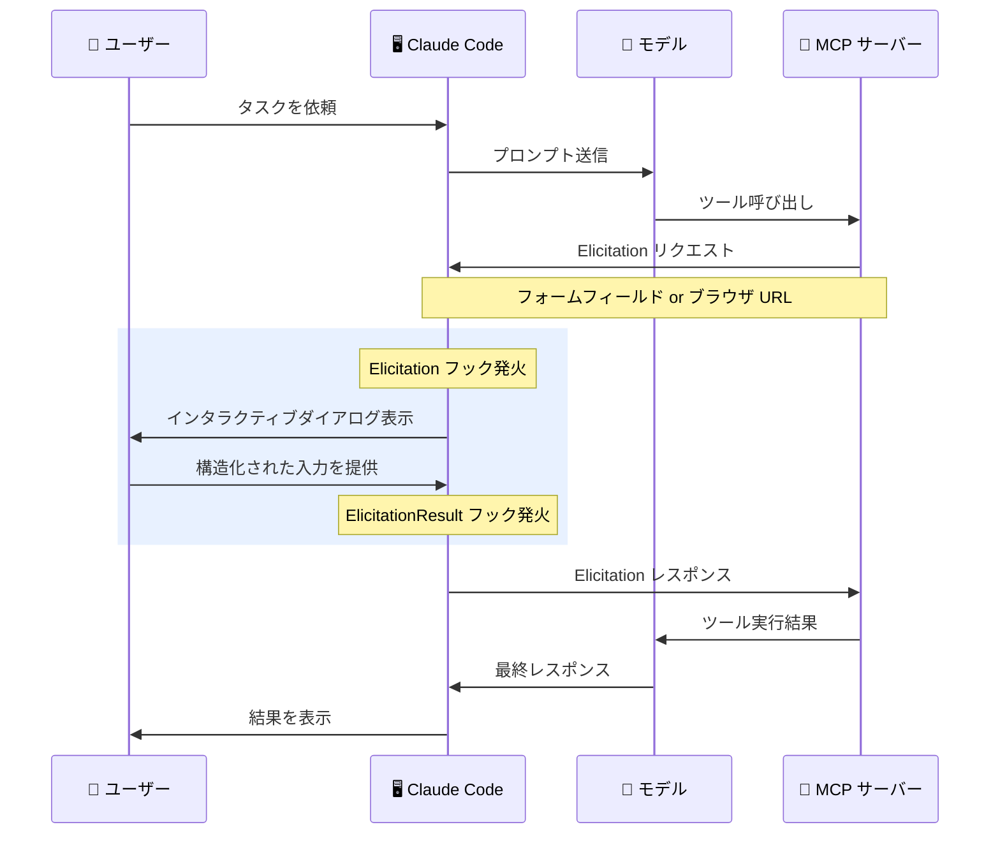
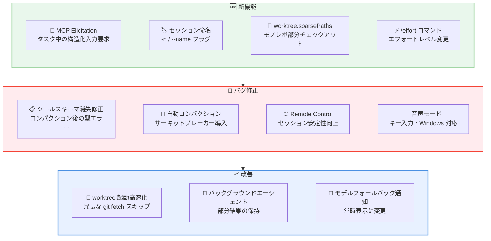

# Claude Code v2.1.76 リリース: MCP Elicitation サポート、セッション命名、ワークツリー高速化

## メタデータ

| 項目 | 内容 |
|------|------|
| 発表日 | 2026-03-14 |
| ソース | Claude Code Changelog |
| カテゴリ | Claude Code アップデート |
| 公式リンク | https://github.com/anthropics/claude-code/blob/main/CHANGELOG.md |

## 概要

Claude Code v2.1.76 が 2026 年 3 月 14 日にリリースされました。本リリースの最大の注目機能は MCP Elicitation サポートです。MCP サーバーがタスク実行中にインタラクティブなダイアログを通じて構造化された入力をユーザーに要求できるようになり、AI エージェントと外部ツール間の対話がより柔軟になりました。

そのほか、セッションに表示名を設定する `-n` / `--name` フラグ、大規模モノレポ向けの `worktree.sparsePaths` 設定、`/effort` スラッシュコマンド、セッション品質アンケート機能が追加されています。バグ修正では、コンパクション後のツール入力スキーマ消失、音声モードのキー入力問題、自動コンパクションの無限リトライなど、多数の問題が解消されています。

## 詳細

### 背景

Claude Code は Anthropic が提供する CLI ベースの AI 開発支援ツールです。MCP (Model Context Protocol) はモデルと外部ツールの統合を標準化するプロトコルであり、v2.1.76 では MCP サーバーがタスク途中でユーザーに追加情報を求める「Elicitation」機能がサポートされました。これにより、たとえばデプロイ先環境の選択や認証情報の入力など、動的な意思決定をワークフロー内で完結できるようになります。

### 主な変更点

#### 新機能

- **MCP Elicitation サポート**: MCP サーバーがタスク実行中にインタラクティブなダイアログ (フォームフィールドまたはブラウザ URL) を通じて構造化された入力を要求可能に。新しい `Elicitation` および `ElicitationResult` フックにより、レスポンスのインターセプトやオーバーライドも可能
- **`-n` / `--name` フラグ**: CLI 起動時にセッションの表示名を設定可能に
- **`worktree.sparsePaths` 設定**: `claude --worktree` で大規模モノレポを扱う際、git sparse-checkout により必要なディレクトリのみをチェックアウト可能に
- **`PostCompact` フック**: コンパクション完了後に発火するフックを追加
- **`/effort` スラッシュコマンド**: モデルのエフォートレベルをセッション内で変更可能に
- **セッション品質アンケート**: エンタープライズ管理者が `feedbackSurveyRate` 設定でサンプルレートを構成可能

#### バグ修正

- **遅延ツールの入力スキーマ消失修正**: `ToolSearch` 経由でロードされたツールがコンパクション後にスキーマを失い、配列や数値パラメータが型エラーで拒否される問題を修正
- **スラッシュコマンドの "Unknown skill" 修正**: スラッシュコマンド実行時に "Unknown skill" と表示される問題を修正
- **プランモード再承認修正**: プラン承認後に再承認を求められる問題を修正
- **音声モードのキー入力修正**: 権限ダイアログまたはプランエディタが開いている間にキー入力が飲み込まれる問題を修正
- **Windows `/voice` 修正**: npm インストール時に `/voice` が動作しない問題を修正
- **コンテキスト制限の誤表示修正**: 1M コンテキストセッションで `model:` フロントマター付きスキル呼び出し時に "Context limit reached" と誤表示される問題を修正
- **非標準モデル文字列のエラー修正**: 非標準モデル文字列使用時の "adaptive thinking is not supported on this model" エラーを修正
- **Bash 権限ルールのマッチング修正**: 引用符付き引数に `#` が含まれる場合に `Bash(cmd:*)` 権限ルールがマッチしない問題を修正
- **Bash 権限ダイアログの表示修正**: "don't ask again" でパイプや複合コマンドの生のコマンド全体が表示される問題を修正
- **自動コンパクションのサーキットブレーカー追加**: 連続失敗時に無限リトライしていた自動コンパクションを 3 回で停止するよう修正
- **MCP 再接続スピナー修正**: 再接続成功後もスピナーが残り続ける問題を修正
- **LSP プラグイン登録修正**: マーケットプレイスの reconcile 前に LSP Manager が初期化された場合にサーバーが登録されない問題を修正
- **tmux over SSH クリップボード修正**: ダイレクトターミナル書き込みと tmux クリップボード統合の両方を試行するよう改善
- **`/export` ファイルパス表示修正**: 成功メッセージでファイル名のみが表示されていた問題を修正し、フルパスを表示
- **テキスト選択後の自動スクロール修正**: テキスト選択後にトランスクリプトが新しいメッセージに自動スクロールしない問題を修正
- **Escape キー修正**: ログイン方法選択画面で Escape キーが機能しない問題を修正
- **Remote Control の複数修正**: アイドル環境のリープ時にセッションがサイレントに停止する問題、高速メッセージが 1 件ずつキューイングされる問題、JWT リフレッシュ後のステイルワークアイテム再配信を修正
- **Bridge セッション回復修正**: 長時間の WebSocket 切断後にブリッジセッションが回復に失敗する問題を修正
- **ソフト非表示コマンドの検索修正**: ソフト非表示コマンドの正確な名前を入力してもスラッシュコマンドが見つからない問題を修正

#### 改善

- **`--worktree` 起動パフォーマンス改善**: git refs を直接読み取り、リモートブランチがローカルで利用可能な場合は冗長な `git fetch` をスキップ
- **バックグラウンドエージェントの改善**: バックグラウンドエージェントを終了した際、部分的な結果が会話コンテキストに保持されるように変更
- **モデルフォールバック通知の改善**: verbose モードに隠されていた通知を常時表示に変更し、人間が読みやすいモデル名を使用
- **ブロック引用の表示改善**: ダークテーマでの可読性向上のため、薄暗い表示から左バー付きイタリック表示に変更
- **ステイルワークツリーの自動クリーンアップ**: 中断された並列実行後に残されたワークツリーを自動的にクリーンアップ
- **Remote Control セッションタイトル改善**: "Interactive session" の代わりに最初のプロンプトからタイトルを生成
- **`/voice` の言語表示改善**: 有効化時にディクテーション言語を表示し、`language` 設定が音声入力に対応していない場合に警告を表示
- **`--plugin-dir` の変更**: サブコマンドをサポートするため 1 つのパスのみを受け付けるように変更。複数ディレクトリには `--plugin-dir` を繰り返し使用
- **[VS Code] gitignore パターンの修正**: カンマを含む gitignore パターンが @-mention ファイルピッカーでファイルタイプ全体を除外する問題を修正

### 技術的な詳細

本リリースの技術的な注目点は以下の通りです。

- **MCP Elicitation プロトコル**: MCP サーバーからの Elicitation リクエストはフォームフィールド (テキスト入力、選択肢など) またはブラウザ URL の 2 種類の形式をサポートしています。`Elicitation` フックでリクエストをインターセプトし、`ElicitationResult` フックでレスポンスを加工できるため、自動化パイプラインにおいてプログラマティックな応答も可能です。
- **遅延ツールのスキーマ消失**: `ToolSearch` を通じて遅延ロードされたツールは、会話のコンパクション時に入力スキーマ情報が失われていました。これにより、配列型や数値型のパラメータが正しく検証されず型エラーとなる問題が発生していました。コンパクション処理でスキーマ情報を保持するよう修正されています。
- **自動コンパクションのサーキットブレーカー**: コンパクションが連続して失敗した場合にリトライが無限に繰り返される問題に対し、3 回の失敗で自動停止するサーキットブレーカーパターンが導入されました。これにより、コンパクション障害時の無限ループによるリソース消費が防止されます。
- **git sparse-checkout によるワークツリー最適化**: `worktree.sparsePaths` で指定されたパスのみをチェックアウトすることで、数千ディレクトリを持つモノレポでのワークツリー作成時間とディスク使用量を大幅に削減します。

## 開発者への影響

### 対象

- Claude Code CLI を日常的に利用している開発者
- MCP サーバーを開発・運用しているチーム
- 大規模モノレポで Claude Code を使用しているチーム
- エンタープライズ環境でフィードバック収集を検討している管理者
- Remote Control や Bridge セッションを利用しているユーザー
- 音声モードを利用しているユーザー

### 必要なアクション

以下のコマンドで最新バージョンに更新できます。

```bash
# npm でのアップデート
npm update -g @anthropic-ai/claude-code

# 現在のバージョン確認
claude --version
```

特に以下のケースに該当するユーザーは早急なアップデートを推奨します。

- MCP サーバーで Elicitation 機能を活用したい場合
- 大規模モノレポでワークツリー機能を使用している場合
- 自動コンパクションの無限リトライが発生していた場合
- Remote Control セッションの安定性に問題があった場合

### 新機能の活用例

```bash
# セッションに表示名を設定して起動
claude -n "feature-auth-refactor"

# /effort でモデルのエフォートレベルを変更
/effort

# worktree.sparsePaths を設定 (settings.json)
# "worktree.sparsePaths": ["packages/core", "packages/api", "libs/shared"]

# Elicitation フックの設定例 (settings.json)
# "hooks": {
#   "Elicitation": [{
#     "matcher": "",
#     "hooks": [{ "type": "command", "command": "echo 'Elicitation requested'" }]
#   }]
# }
```

## アーキテクチャ図

### MCP Elicitation フロー



### リリース全体像



## 関連リンク

- [Claude Code Changelog](https://github.com/anthropics/claude-code/blob/main/CHANGELOG.md)
- [Claude Code GitHub リポジトリ](https://github.com/anthropics/claude-code)
- [Claude Code ドキュメント](https://docs.anthropic.com/en/docs/claude-code)
- [MCP 仕様](https://modelcontextprotocol.io/)

## まとめ

Claude Code v2.1.76 は、MCP Elicitation サポートを中心とした重要な機能追加リリースです。MCP サーバーがタスク実行中にユーザーへ構造化された入力を要求できるようになったことで、デプロイ先環境の選択、認証情報の入力、設定値の確認など、動的な意思決定を含むワークフローの自動化が大幅に進みます。`Elicitation` および `ElicitationResult` フックにより、プログラマティックな応答やレスポンスの加工も可能です。

開発体験の面では、`-n` / `--name` フラグによるセッション命名、`worktree.sparsePaths` による大規模モノレポの効率的な操作、`/effort` コマンドによるモデルエフォートレベルの動的変更など、日常的なワークフローを改善する機能が多数追加されています。

バグ修正では、コンパクション後のツールスキーマ消失、自動コンパクションの無限リトライ、Remote Control セッションの安定性など、信頼性に関わる重要な問題が解消されています。特にサーキットブレーカーの導入は、障害時のリソース消費を防止する堅牢な設計改善です。全ての Claude Code ユーザーに早期のアップデートを推奨します。
