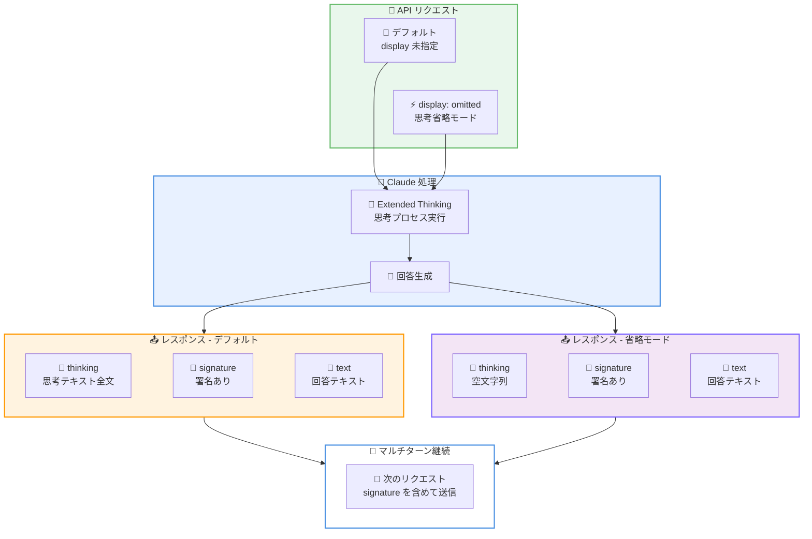

# Extended Thinking の新しい `display` フィールドで思考内容の表示制御が可能に

## メタデータ

| 項目 | 内容 |
|------|------|
| 発表日 | 2026-03-16 |
| ソース | Claude Developer Platform Release Notes |
| カテゴリ | API アップデート |
| 公式リンク | https://platform.claude.com/docs/en/build-with-claude/extended-thinking#controlling-thinking-display |

## 概要

Anthropic は 2026 年 3 月 16 日、Claude API の Extended Thinking 機能に新しい `display` フィールドを追加しました。`thinking.display` パラメータを `"omitted"` に設定することで、レスポンスから思考内容 (thinking content) を省略し、ストリーミングの高速化と帯域幅の削減を実現できます。思考ブロック自体は返却されますが `thinking` フィールドが空になり、マルチターン継続に必要な `signature` は保持されます。料金体系に変更はありません。

## 詳細

### 背景

Extended Thinking は、Claude が複雑なタスクに対してステップバイステップで思考を行い、より正確な回答を生成する機能です。従来、Extended Thinking を有効にすると、レスポンスに思考プロセスの全文が含まれていました。

しかし、多くのユースケースでは思考内容自体を表示する必要がなく、最終的な回答のみが重要です。思考内容はトークン数が多くなることがあり、ストリーミング時のレイテンシや帯域幅に影響を与えていました。

### 主な変更点

1. **`display` フィールドの追加**: `thinking` パラメータ内に新しい `display` フィールドが追加されました。`"omitted"` に設定すると、レスポンスの思考ブロックから思考テキストが省略されます
2. **`signature` の保持**: 思考内容が省略されても、マルチターン会話の継続に必要な `signature` フィールドは保持されます。これにより、後続のターンで思考の文脈を維持できます
3. **料金の変更なし**: `display` フィールドの設定に関わらず、課金は従来と同じです。思考トークンは引き続き生成・課金されますが、レスポンスでの転送量が削減されます

### 技術的な詳細

#### `display` フィールドの設定値

| 設定値 | 動作 | thinking フィールド | signature |
|--------|------|-------------------|-----------|
| 未指定 (デフォルト) | 思考内容を含む | 思考テキスト全文 | あり |
| `"omitted"` | 思考内容を省略 | 空文字列 | あり |

#### レスポンス構造の比較

**デフォルト (思考内容あり)**:

```json
{
  "content": [
    {
      "type": "thinking",
      "thinking": "ユーザーの質問を分析すると...(長い思考プロセス)...",
      "signature": "EuYBCkQ..."
    },
    {
      "type": "text",
      "text": "回答内容です。"
    }
  ]
}
```

**`display: "omitted"` 設定時**:

```json
{
  "content": [
    {
      "type": "thinking",
      "thinking": "",
      "signature": "EuYBCkQ..."
    },
    {
      "type": "text",
      "text": "回答内容です。"
    }
  ]
}
```

#### マルチターンでの継続性

`display: "omitted"` を使用しても、`signature` が保持されるため、マルチターン会話で思考の文脈を維持できます。レスポンスの thinking ブロックをそのまま次のリクエストに含めることで、会話の継続が可能です。

## アーキテクチャ図



## コード例

### Python SDK - 思考内容を省略してリクエスト

`thinking.display` を `"omitted"` に設定することで、レスポンスから思考テキストを省略できます。

```python
import anthropic

client = anthropic.Anthropic()

message = client.messages.create(
    model="claude-opus-4-6-20260205",
    max_tokens=16384,
    thinking={
        "type": "enabled",
        "budget_tokens": 10000,
        "display": "omitted"  # 思考内容を省略
    },
    messages=[
        {
            "role": "user",
            "content": "量子コンピューティングの現状と課題を説明してください。"
        }
    ]
)

# thinking ブロックは存在するが、thinking フィールドは空
for block in message.content:
    if block.type == "thinking":
        print(f"Thinking: '{block.thinking}'")  # 空文字列
        print(f"Signature: {block.signature}")   # 署名は保持
    elif block.type == "text":
        print(f"Response: {block.text}")
```

### Python SDK - マルチターン会話での利用

思考内容を省略しても、`signature` を使ってマルチターン会話を継続できます。

```python
import anthropic

client = anthropic.Anthropic()

# 1 ターン目
first_response = client.messages.create(
    model="claude-opus-4-6-20260205",
    max_tokens=16384,
    thinking={
        "type": "enabled",
        "budget_tokens": 10000,
        "display": "omitted"
    },
    messages=[
        {
            "role": "user",
            "content": "Python でウェブスクレイパーを設計してください。"
        }
    ]
)

# レスポンスのコンテンツブロックをそのまま次のターンに含める
# signature が保持されているため、思考の文脈が継続される
response_content = [
    block.model_dump() for block in first_response.content
]

# 2 ターン目
second_response = client.messages.create(
    model="claude-opus-4-6-20260205",
    max_tokens=16384,
    thinking={
        "type": "enabled",
        "budget_tokens": 10000,
        "display": "omitted"
    },
    messages=[
        {
            "role": "user",
            "content": "Python でウェブスクレイパーを設計してください。"
        },
        {
            "role": "assistant",
            "content": response_content  # 1 ターン目の応答を含める
        },
        {
            "role": "user",
            "content": "エラーハンドリングを追加してください。"
        }
    ]
)

print(second_response.content[-1].text)
```

### ストリーミングでの利用

ストリーミング時に思考内容を省略することで、転送データ量を大幅に削減できます。

```python
import anthropic

client = anthropic.Anthropic()

with client.messages.stream(
    model="claude-opus-4-6-20260205",
    max_tokens=16384,
    thinking={
        "type": "enabled",
        "budget_tokens": 10000,
        "display": "omitted"  # ストリーミング時の帯域幅を削減
    },
    messages=[
        {
            "role": "user",
            "content": "機械学習モデルの評価手法を比較してください。"
        }
    ]
) as stream:
    for event in stream:
        # 思考ブロックのストリーミングデータが省略されるため
        # 回答テキストの配信がより高速になる
        if hasattr(event, "type") and event.type == "content_block_delta":
            if hasattr(event.delta, "text"):
                print(event.delta.text, end="", flush=True)
```

## 開発者への影響

### 対象

- Extended Thinking を使用しているすべての Claude API 開発者
- ストリーミングレスポンスのパフォーマンスを最適化したい開発者
- 思考プロセスの表示が不要なプロダクション環境のアプリケーション開発者

### 必要なアクション

- **思考内容が不要な場合**: `thinking` パラメータに `display: "omitted"` を追加することで、レスポンスの転送量を削減できます
- **マルチターン会話を利用している場合**: `display: "omitted"` を使用しても、`signature` は保持されるため、既存のマルチターン実装に影響はありません
- **料金の確認**: 思考トークンの課金は従来と変わりません。`display` 設定は転送量のみに影響し、トークン使用量や料金には影響しません

### 移行ガイド

既存の Extended Thinking 実装に `display` フィールドを追加するだけで利用可能です。既存のコードとの後方互換性があり、`display` を指定しない場合は従来と同じ動作をします。

**変更前 (従来の実装)**:

```python
message = client.messages.create(
    model="claude-opus-4-6-20260205",
    max_tokens=16384,
    thinking={
        "type": "enabled",
        "budget_tokens": 10000
    },
    messages=[...]
)
```

**変更後 (思考内容を省略)**:

```python
message = client.messages.create(
    model="claude-opus-4-6-20260205",
    max_tokens=16384,
    thinking={
        "type": "enabled",
        "budget_tokens": 10000,
        "display": "omitted"  # この 1 行を追加
    },
    messages=[...]
)
```

## 関連リンク

- [Extended Thinking ドキュメント - Controlling Thinking Display](https://platform.claude.com/docs/en/build-with-claude/extended-thinking#controlling-thinking-display)
- [Extended Thinking 概要](https://platform.claude.com/docs/en/build-with-claude/extended-thinking)
- [Claude Developer Platform Release Notes](https://platform.claude.com/docs/en/release-notes/overview)
- [Messages API リファレンス](https://platform.claude.com/docs/en/api/messages)

## まとめ

Extended Thinking の新しい `display` フィールドは、思考内容の転送を制御するシンプルかつ効果的な機能です。`thinking.display: "omitted"` を設定するだけで、レスポンスから思考テキストを省略でき、ストリーミングの高速化と帯域幅の削減を実現できます。

特にプロダクション環境では、エンドユーザーに思考プロセスを表示する必要がないケースが多く、この機能により不要なデータ転送を削減できます。マルチターン会話の継続に必要な `signature` は保持されるため、既存の実装への影響は最小限です。料金体系にも変更はなく、思考トークンは引き続き同じ料金で課金されます。

`display` フィールドを指定しない場合は従来と同じ動作のため、後方互換性も完全に確保されています。
