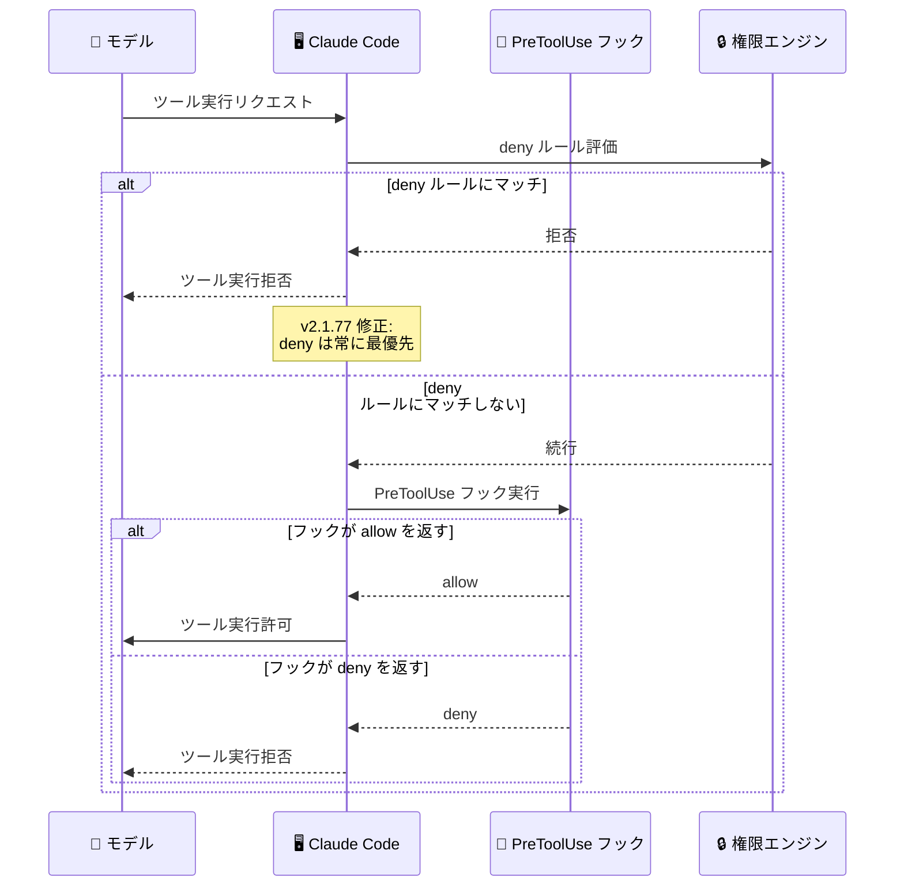
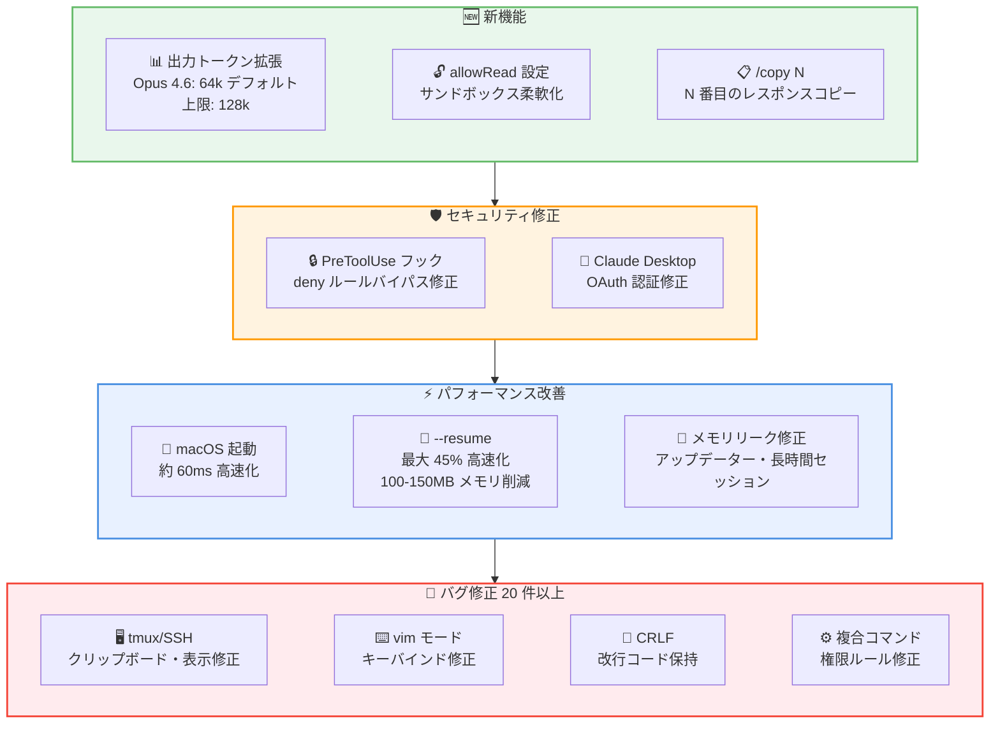

# Claude Code v2.1.77 リリース: Opus 4.6 出力トークン 64k 拡張、セキュリティ修正、大規模パフォーマンス改善

## メタデータ

| 項目 | 内容 |
|------|------|
| 発表日 | 2026-03-17 |
| ソース | Claude Code Changelog |
| カテゴリ | Claude Code アップデート |
| 公式リンク | https://github.com/anthropics/claude-code/blob/main/CHANGELOG.md |

## 概要

Claude Code v2.1.77 が 2026 年 3 月 17 日にリリースされました。本リリースでは、Claude Opus 4.6 のデフォルト最大出力トークンが 64k トークンに拡張され、Opus 4.6 および Sonnet 4.6 モデルの上限が 128k トークンに引き上げられました。これにより、大規模なコード生成やリファクタリングなど、長い出力を必要とするタスクの対応力が大幅に向上しています。

セキュリティ面では、PreToolUse フックが `"allow"` を返した場合に `deny` 権限ルール (エンタープライズ管理設定を含む) をバイパスできてしまう重大な問題が修正されました。パフォーマンス面では、macOS での起動が約 60ms 高速化され、`--resume` の読み込みが最大 45% 高速化、ピークメモリが約 100-150MB 削減されるなど、体感できる改善が多数含まれています。バグ修正は 20 件以上に及び、メモリリーク、自動アップデーターの不具合、tmux/SSH 環境での問題など幅広い修正が行われています。

## 詳細

### 背景

Claude Code は Anthropic が提供する CLI ベースの AI 開発支援ツールです。v2.1.77 は前バージョンから 3 日後のリリースであり、出力トークン制限の大幅拡張、セキュリティ修正、パフォーマンス最適化を中心とした重要なアップデートです。特にトークン上限の引き上げは、Claude Code の実用性を大きく向上させる変更です。

### 主な変更点

#### 新機能

- **Opus 4.6 デフォルト出力トークン 64k 拡張**: Claude Opus 4.6 のデフォルト最大出力トークンが 64k トークンに引き上げられました。Opus 4.6 および Sonnet 4.6 モデルの上限は 128k トークンに設定されています
- **`allowRead` サンドボックス設定**: `denyRead` で制限されたリージョン内で、特定のパスへの読み取りアクセスを再許可する `allowRead` ファイルシステム設定が追加されました
- **`/copy N` コマンド拡張**: `/copy` コマンドにオプションのインデックス指定が追加されました。`/copy N` で N 番目に新しいアシスタントレスポンスをコピーできます

#### バグ修正

**セキュリティ関連:**

- **PreToolUse フックのセキュリティ修正**: PreToolUse フックが `"allow"` を返した場合に `deny` 権限ルールをバイパスしてしまう問題を修正。エンタープライズ管理設定を含む全ての拒否ルールが正しく適用されるようになりました

**メモリ・パフォーマンス関連:**

- **自動アップデーターのメモリリーク修正**: スラッシュコマンドオーバーレイの繰り返し開閉時にバイナリダウンロードが重複して開始され、数十 GB のメモリを消費する問題を修正
- **長時間セッションのメモリリーク修正**: プログレスメッセージがコンパクションを生き残ることによるメモリ増加を修正
- **非ストリーミングモードのコスト追跡修正**: API がストリーミングモードにフォールバックした際にコストとトークン使用量が追跡されない問題を修正

**セッション・データ整合性関連:**

- **`--resume` の会話履歴切り詰め修正**: メモリ抽出の書き込みとメインのトランスクリプト間のレースコンディションにより、最近の会話履歴がサイレントに切り詰められる問題を修正
- **CRLF ファイルの改行変換修正**: Write ツールが CRLF ファイルの上書き時や CRLF ディレクトリでのファイル作成時に改行コードをサイレントに変換する問題を修正
- **0 バイト画像ファイルのエラー修正**: 0 バイトの画像ファイルをプロンプトにドラッグした際の API エラーを修正

**権限・コマンド関連:**

- **複合 Bash コマンドの "Always Allow" 修正**: `cd src && npm test` のような複合コマンドに対して個別のサブコマンドではなく全体を 1 つのルールとして保存していた問題を修正。無効なルールと繰り返しの権限プロンプトが解消されました
- **`CLAUDE_CODE_DISABLE_EXPERIMENTAL_BETAS` 修正**: ベータツールスキーマフィールドが除去されず、プロキシゲートウェイがリクエストを拒否する問題を修正

**ターミナル・UI 関連:**

- **vim NORMAL モードの Backspace/Delete 修正**: vim NORMAL モードで Backspace キーと Delete キーが動作しない問題を修正
- **vim モード切替時のステータスライン修正**: vim モードのオン/オフ切替時にステータスラインが更新されない問題を修正
- **tmux 環境のクリップボード修正**: tmux セッションでクリップボードコピーがサイレントに失敗する問題を修正。コピートーストで Command+V または tmux prefix+] のどちらで貼り付けるか表示されるようになりました
- **tmux over SSH での iTerm2 クラッシュ修正**: SSH 経由の tmux 内でテキスト選択時に iTerm2 がクラッシュする問題を修正
- **tmux でのバックグラウンドカラー修正**: デフォルト設定の tmux 内でバックグラウンドカラーがターミナルデフォルトとして表示される問題を修正
- **VS Code でのハイパーリンク二重オープン修正**: VS Code、Cursor などの xterm.js ベースターミナルで Cmd+click 時にハイパーリンクが 2 回開く問題を修正
- **ペースト消失修正**: ペースト直後に入力すると貼り付けた内容が消失する問題を修正
- **`/feedback` の Ctrl+D 修正**: `/feedback` テキスト入力で Ctrl+D が 2 回目の押下でセッション終了する代わりに前方削除を行っていた問題を修正
- **順序付きリストの表示修正**: ターミナル UI で順序付きリストの番号が表示されない問題を修正
- **CJK 文字の表示修正**: CJK 文字が右端でクリップされた際に隣接する UI 要素にはみ出す問題を修正
- **設定ダイアログのキー操作修正**: 設定、権限、サンドボックスダイアログでリスト操作中に左右矢印キーでタブが切り替わる問題を修正
- **一時ディレクトリのスペース対応修正**: システム一時ディレクトリパスにスペースが含まれる場合に Bash ツールが成功したコマンドでエラーを報告する問題を修正

**セッション・接続関連:**

- **Claude Desktop の API キー修正**: Claude Desktop セッションがターミナル CLI の API キーを誤って使用する問題を修正。OAuth が正しく使用されるようになりました
- **`git-subdir` プラグインキャッシュ修正**: 同一モノレポの異なるサブディレクトリにある `git-subdir` プラグインのキャッシュが衝突する問題を修正
- **ステイルワークツリーのレースコンディション修正**: 前回クラッシュから再開されたエージェントのワークツリーがクリーンアップ処理で削除されるレースコンディションを修正
- **`/mcp` ダイアログの入力デッドロック修正**: エージェント実行中に `/mcp` や類似のダイアログを開くと入力がデッドロックする問題を修正
- **tmux/screen 内の IDE 連携修正**: tmux または screen 内で Claude Code を起動した際に IDE 統合が自動接続されない問題を修正
- **チームメイトペインの終了修正**: リーダーが終了してもチームメイトペインが閉じない問題を修正
- **iTerm2 自動モードの検出修正**: ネイティブスプリットペインチームメイト使用時に iTerm2 の自動モードが iTerm2 を検出しない問題を修正

#### 改善・変更

**パフォーマンス改善:**

- **macOS 起動高速化 (約 60ms 短縮)**: キーチェイン認証情報の読み取りをモジュールロードと並列化することで起動を高速化
- **`--resume` 高速化**: フォークが多いセッションや大規模セッションで読み込みが最大 45% 高速化、ピークメモリが約 100-150MB 削減

**操作性改善:**

- **Esc キーの改善**: 実行中の非ストリーミング API リクエストを Esc キーで中断可能に
- **`claude plugin validate` の強化**: スキル、エージェント、コマンドフロントマターおよび `hooks/hooks.json` の検証機能が追加。YAML パースエラーやスキーマ違反を検出
- **バックグラウンド Bash タスクの制限**: 出力が 5GB を超えた場合にバックグラウンド Bash タスクを強制終了。ディスク容量を消費する暴走プロセスを防止
- **セッション自動命名**: プラン承認時にプランの内容からセッション名を自動生成
- **`apiKeyHelper` のタイムアウト通知**: `apiKeyHelper` が 10 秒以上かかる場合に通知を表示し、メインループのブロッキングを防止
- **`/fork` から `/branch` に名称変更**: `/fork` はエイリアスとして引き続き利用可能

**API・プラグイン関連:**

- **ヘッドレスモードプラグインの改善**: ヘッドレスモードでのプラグインインストールが `CLAUDE_CODE_PLUGIN_SEED_DIR` と正しく連携するよう改善
- **Agent ツールの `resume` パラメータ廃止**: `SendMessage({to: agentId})` を使用して以前起動したエージェントを継続する方式に変更
- **`SendMessage` の自動再開**: 停止したエージェントをエラーではなくバックグラウンドで自動再開するよう変更

**VS Code 関連:**

- **プランプレビュータブの改善**: "Claude's Plan" の代わりにプランの見出しをタブタイトルとして使用
- **macOS option+click の案内改善**: option+click でネイティブ選択がトリガーされない場合、`macOptionClickForcesSelection` 設定へのポインターをフッターに表示

### 技術的な詳細

本リリースの技術的な注目点は以下の通りです。

- **出力トークン上限の拡張**: Opus 4.6 のデフォルト最大出力トークンが 64k に引き上げられたことで、大規模なコード生成、複数ファイルにまたがるリファクタリング、詳細な説明を伴う出力などが 1 回のレスポンスで完結しやすくなりました。上限の 128k トークンは設定で明示的に指定することで利用可能です。

- **PreToolUse フックのセキュリティ修正**: 以前の実装ではフックが `"allow"` を返すと、`deny` ルール (エンタープライズ管理者による強制拒否設定を含む) が無視されていました。修正後は `deny` ルールが常に最優先で評価されるようになり、フックによるバイパスが不可能になっています。エンタープライズ環境では特に重要なセキュリティ修正です。

- **自動アップデーターのメモリリーク**: スラッシュコマンドオーバーレイが開閉されるたびに新しいバイナリダウンロードが開始され、以前のダウンロードがキャンセルされないまま蓄積されていました。これにより数十 GB のメモリが消費される可能性がありました。修正後は重複ダウンロードが抑制されます。

- **`--resume` のレースコンディション**: メモリ抽出プロセスの書き込みとメインのトランスクリプト読み取りが競合し、再開時に最新の会話ターンが欠落する場合がありました。書き込みと読み取りの適切な同期処理が追加されています。

- **`allowRead` サンドボックス設定**: 従来の `denyRead` は指定されたパス以下の全ての読み取りを一律に拒否していました。新しい `allowRead` 設定により、`denyRead` で制限された範囲内の特定サブパスに対して読み取りを再許可でき、より柔軟なファイルシステムアクセス制御が可能になりました。

## 開発者への影響

### 対象

- Claude Code CLI を日常的に利用している全ての開発者
- エンタープライズ環境で Claude Code を運用している管理者 (セキュリティ修正)
- 大規模な出力を必要とするコード生成タスクを行うユーザー
- tmux、SSH、screen 環境で Claude Code を使用しているユーザー
- vim モードを利用しているユーザー
- VS Code / Cursor で Claude Code を使用しているユーザー

### 必要なアクション

以下のコマンドで最新バージョンに更新できます。

```bash
# npm でのアップデート
npm update -g @anthropic-ai/claude-code

# 現在のバージョン確認
claude --version
```

特に以下のケースに該当するユーザーは早急なアップデートを推奨します。

- **エンタープライズ環境**: PreToolUse フックによる `deny` ルールバイパスのセキュリティ修正が含まれています
- **長時間セッション**: メモリリーク修正により安定性が大幅に向上しています
- **`--resume` を頻繁に使用**: 会話履歴の切り詰め問題が修正され、パフォーマンスも向上しています
- **tmux / SSH 環境**: 複数のクリップボード、表示、クラッシュ問題が修正されています

### 移行ガイド

#### Agent ツールの `resume` パラメータ廃止

```javascript
// 変更前
Agent({ resume: agentId })

// 変更後
SendMessage({ to: agentId })
```

`SendMessage` は停止したエージェントを自動的にバックグラウンドで再開するため、明示的な再開処理は不要です。

#### `/fork` から `/branch` への名称変更

`/fork` はエイリアスとして引き続き動作しますが、新しい `/branch` コマンドの使用を推奨します。

## コード例

```bash
# allowRead でサンドボックス設定を細かく制御
# settings.json の例
# {
#   "sandbox": {
#     "filesystem": {
#       "denyRead": ["/secrets"],
#       "allowRead": ["/secrets/public-keys"]
#     }
#   }
# }

# /copy N で特定のアシスタントレスポンスをコピー
/copy 3  # 3 番目に新しいレスポンスをコピー
```

## アーキテクチャ図

### セキュリティ修正: PreToolUse フックの権限評価フロー



### リリース全体像



## 関連リンク

- [Claude Code Changelog](https://github.com/anthropics/claude-code/blob/main/CHANGELOG.md)
- [Claude Code GitHub リポジトリ](https://github.com/anthropics/claude-code)
- [Claude Code ドキュメント](https://docs.anthropic.com/en/docs/claude-code)

## まとめ

Claude Code v2.1.77 は、出力能力の拡張、セキュリティ強化、パフォーマンス改善の 3 つの柱からなる重要なリリースです。

最も影響の大きい変更は、Claude Opus 4.6 のデフォルト出力トークンが 64k に拡張され、上限が 128k トークンに引き上げられたことです。大規模なコード生成、複数ファイルのリファクタリング、詳細なドキュメント生成など、長い出力を要するタスクが 1 回のレスポンスで完結しやすくなりました。

セキュリティ面では、PreToolUse フックが `deny` 権限ルール (エンタープライズ管理設定を含む) をバイパスできてしまう問題が修正されており、エンタープライズ環境では特に早急なアップデートが推奨されます。

パフォーマンス面では、macOS の起動高速化 (約 60ms)、`--resume` の最大 45% 高速化とメモリ削減 (100-150MB)、自動アップデーターや長時間セッションのメモリリーク修正など、日常的な使用感を大きく改善する修正が含まれています。

20 件以上のバグ修正は、tmux/SSH 環境、vim モード、CRLF ファイル処理、複合 Bash コマンドの権限管理など多岐にわたり、幅広い利用環境での安定性が向上しています。全ての Claude Code ユーザーにアップデートを推奨します。
