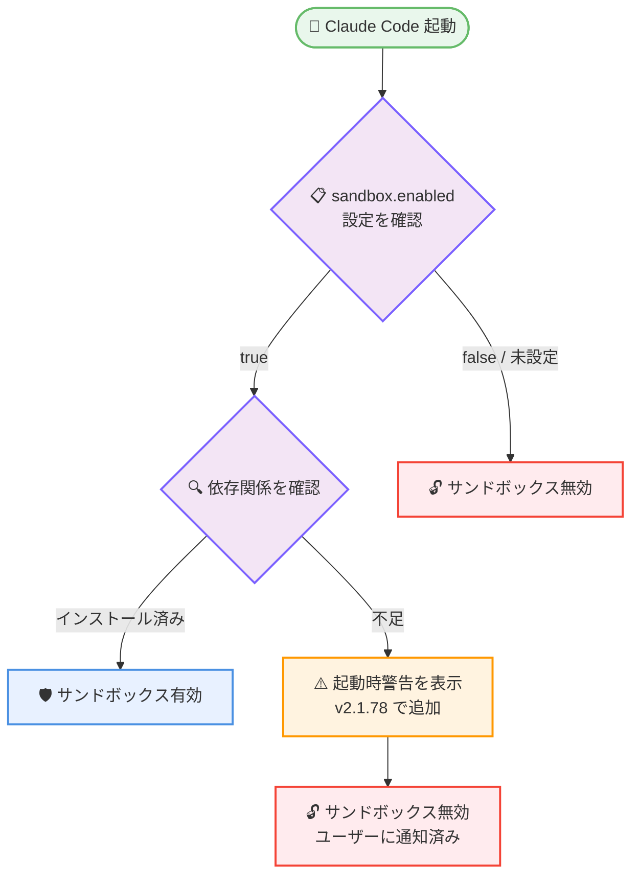
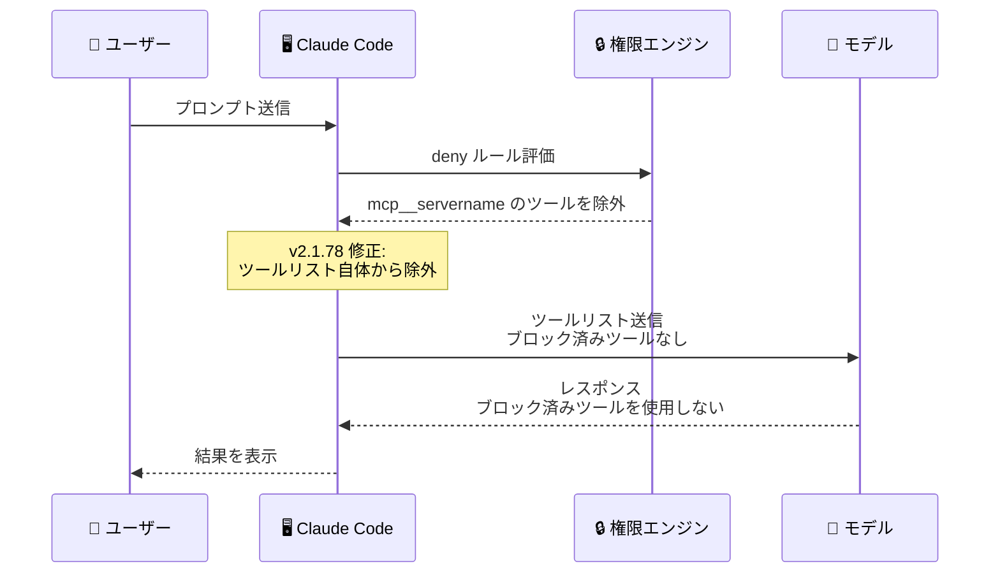
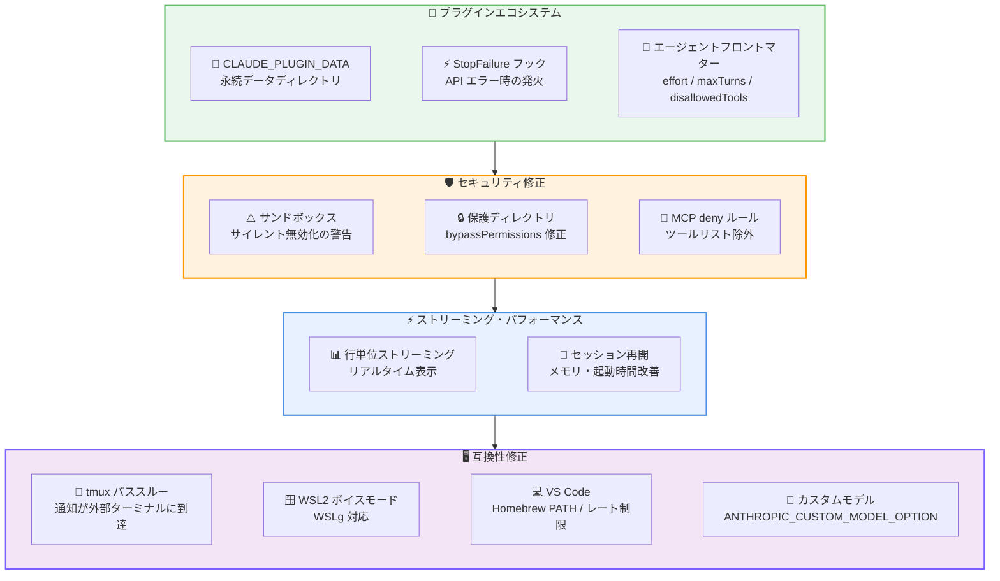

# Claude Code v2.1.78 リリース: プラグインエコシステム強化、セキュリティ修正、ストリーミング改善

## メタデータ

| 項目 | 内容 |
|------|------|
| 発表日 | 2026-03-17 |
| ソース | Claude Code Changelog |
| カテゴリ | Claude Code アップデート |
| 公式リンク | https://github.com/anthropics/claude-code/blob/main/CHANGELOG.md |

## 概要

Claude Code v2.1.78 が 2026 年 3 月 17 日にリリースされました。本リリースでは、プラグインエコシステムの大幅な機能拡張、セキュリティ修正、ストリーミングとパフォーマンスの改善、そして多数の互換性修正が含まれています。

プラグイン関連では、プラグインの永続データディレクトリ (`CLAUDE_PLUGIN_DATA`)、`StopFailure` フックイベント、プラグインが提供するエージェントのフロントマターサポートが追加されました。セキュリティ面では、サンドボックス依存関係が不足している場合にサンドボックスがサイレントに無効化される問題の修正や、`bypassPermissions` モードでの保護ディレクトリの書き込み制御が強化されています。

レスポンステキストが行単位でストリーミングされるようになり、大規模セッションの再開時のメモリ使用量と起動時間が改善されました。バグ修正は 20 件以上に及び、MCP サーバーの `deny` ルール、VS Code 連携、tmux パススルー、WSL2 対応など幅広い環境での安定性が向上しています。

## 詳細

### 背景

Claude Code は Anthropic が提供する CLI ベースの AI 開発支援ツールです。v2.1.78 は v2.1.77 と同日のリリースであり、プラグインエコシステムの成熟、権限・サンドボックスシステムの堅牢化、幅広いターミナル環境との互換性向上を中心とした重要なアップデートです。特にプラグイン開発者とエンタープライズ環境のユーザーにとって影響の大きいリリースです。

### 主な変更点

#### 新機能

- **`StopFailure` フックイベント**: API エラー (レート制限、認証失敗など) によりターンが終了した際に発火する新しいフックイベントが追加されました。エラー発生時のカスタムリカバリ処理やログ記録が可能になります
- **`CLAUDE_PLUGIN_DATA` 変数**: プラグインの永続状態を保存するためのデータディレクトリパスを提供する変数が追加されました。プラグインの更新後もデータが保持され、`/plugin uninstall` 実行時には削除前に確認プロンプトが表示されます
- **プラグインエージェントのフロントマターサポート**: プラグインが提供するエージェントに対して `effort`、`maxTurns`、`disallowedTools` のフロントマター設定が可能になりました
- **`ANTHROPIC_CUSTOM_MODEL_OPTION` 環境変数**: `/model` ピッカーにカスタムエントリを追加するための環境変数が追加されました。`_NAME` および `_DESCRIPTION` サフィックス付き変数で表示名と説明文をカスタマイズできます

#### 改善・変更

**ストリーミング・パフォーマンス改善:**

- **行単位ストリーミング**: レスポンステキストが生成されるたびに行単位でストリーミング表示されるようになりました。長い出力でもリアルタイムに内容を確認できます
- **大規模セッション再開の最適化**: 大規模セッションの再開時のメモリ使用量と起動時間が改善されました

**ターミナル互換性改善:**

- **tmux パススルー対応**: iTerm2、Kitty、Ghostty のポップアップ通知やプログレスバーなどのターミナル通知が、tmux 内で `set -g allow-passthrough on` を設定することで外側のターミナルに到達するようになりました

#### バグ修正

**セキュリティ関連:**

- **サンドボックスのサイレント無効化修正**: `sandbox.enabled: true` が設定されているにもかかわらず依存関係が不足している場合に、サンドボックスがサイレントに無効化されていた問題を修正。起動時に警告が表示されるようになりました
- **保護ディレクトリの書き込み制御修正**: `bypassPermissions` モードで `.git`、`.claude` などの保護ディレクトリがプロンプトなしで書き込み可能になっていた問題を修正

**MCP・権限システム関連:**

- **MCP サーバーの `deny` ルール修正**: `deny: ["mcp__servername"]` の権限ルールがモデルに送信される前に MCP サーバーツールを除去していなかった問題を修正。修正前はモデルがブロックされたツールを認識し、使用を試みることが可能でした
- **`sandbox.filesystem.allowWrite` の絶対パス修正**: `allowWrite` 設定で絶対パスが正しく動作しない問題を修正。以前は `//` プレフィックスが必要でした

**Git・セッション関連:**

- **`git log HEAD` のサンドボックスエラー修正**: Linux 上のサンドボックス内 Bash で `git log HEAD` が "ambiguous argument" エラーで失敗する問題と、スタブファイルが `git status` に表示される問題を修正
- **`cc log` と `--resume` の会話履歴切り詰め修正**: サブエージェントを使用した大規模セッション (5 MB 超) で `cc log` と `--resume` が会話履歴をサイレントに切り詰めていた問題を修正
- **API エラー時の無限ループ修正**: API エラーが stop フックをトリガーし、そのフックがブロッキングエラーをモデルに再送することで無限ループが発生する問題を修正

**ターミナル・UI 関連:**

- **`/sandbox` タブの表示修正**: Dependencies タブが macOS 上で Linux の前提条件を表示していた問題を修正し、macOS 固有の情報が正しく表示されるようになりました
- **ctrl+u キーバインド修正**: ノーマルモードで ctrl+u がスクロールしていた問題を修正。readline の kill-line 動作に変更され、ctrl+u / ctrl+d の半ページスクロールはトランスクリプトモード専用になりました
- **ボイスモードの修飾キーコンボ修正**: ctrl+k などの修飾キーコンボによる push-to-talk キーバインドが、即座にアクティブ化されず長押しが必要だった問題を修正
- **ボイスモードの WSL2 対応**: WSLg を使用した WSL2 環境でボイスモードが動作しない問題を修正。WSL1 / Win10 ユーザーには明確なエラーメッセージが表示されるようになりました
- **Homebrew パス修正**: Dock やSpotlight から VS Code を起動した場合に Bash ツールが Homebrew やその他の PATH 依存バイナリを見つけられない問題を修正
- **Claude オレンジカラー修正**: truecolor サポートをアドバタイズしない VS Code、Cursor、code-server のターミナルで Claude のオレンジカラーが色あせて表示される問題を修正
- **改行セパレータ修正**: キューに入れられたプロンプトが改行セパレータなしで連結される問題を修正

**設定・フラグ関連:**

- **`--worktree` フラグ修正**: `--worktree` フラグがワークツリーディレクトリからスキルとフックを読み込まない問題を修正
- **Git 指示の抑制修正**: `CLAUDE_CODE_DISABLE_GIT_INSTRUCTIONS` 環境変数と `includeGitInstructions` 設定がシステムプロンプトの git status セクションを抑制しない問題を修正
- **`ANTHROPIC_BETAS` 環境変数修正**: Haiku モデル使用時に `ANTHROPIC_BETAS` 環境変数がサイレントに無視される問題を修正

**VS Code 関連:**

- **ログイン画面のフラッシュ修正**: 既に認証済みの状態でサイドバーを開いた際にログイン画面が一瞬表示される問題を修正
- **Opus モデル選択時のレート制限修正**: Opus 選択時に "API Error: Rate limit reached" エラーが発生する問題を修正。プランティアが不明なサブスクライバーに対してモデルドロップダウンが 1M コンテキストバリアントを提供しないようになりました

### 技術的な詳細

本リリースの技術的な注目点は以下の通りです。

- **サンドボックスのサイレント無効化問題**: `sandbox.enabled: true` が設定ファイルで明示的に有効化されている場合でも、必要な依存関係 (Linux では bubblewrap、macOS では sandbox-exec 関連) がインストールされていないと、サンドボックスが警告なしに無効化されていました。これはセキュリティ設定を信頼しているユーザーにとって重大なリスクでした。修正後は起動時に目に見える警告が表示され、サンドボックスが実際に有効かどうかを確認できます。

- **MCP サーバーの `deny` ルールの実装不備**: `deny: ["mcp__servername"]` と設定しても、ツールリストからの除外が行われていなかったため、モデルはブロックされたツールの存在を認識し、呼び出しを試みることができました。モデルがツールを呼び出そうとしても実行時に拒否されるため実害は限定的ですが、不要な API ターンの消費やユーザーの混乱を招く問題でした。修正後はツールリスト自体から除外され、モデルがブロックされたツールを認識しなくなります。

- **`CLAUDE_PLUGIN_DATA` のライフサイクル管理**: プラグインの永続データは `CLAUDE_PLUGIN_DATA` が指すディレクトリに保存され、プラグインの更新時にも保持されます。`/plugin uninstall` 実行時にはデータディレクトリの存在を確認し、削除前にユーザーに確認を求めます。これにより、プラグインが蓄積した学習データや設定が意図せず失われることを防ぎます。

- **行単位ストリーミング**: 従来はレスポンス全体がバッファリングされてから表示される場合がありましたが、v2.1.78 では行単位でストリーミング表示されるようになりました。これにより、長いコード生成やドキュメント出力の際にリアルタイムで進捗を確認でき、ユーザー体験が向上しています。

- **tmux パススルーの仕組み**: tmux はデフォルトでエスケープシーケンスをフィルタリングするため、iTerm2 や Kitty 固有の通知シーケンスが外部ターミナルに到達しません。`set -g allow-passthrough on` を設定することで、これらのシーケンスが tmux を通過し、外側のターミナルエミュレータが正しく通知を処理できるようになります。

## 開発者への影響

### 対象

- Claude Code CLI を日常的に利用している全ての開発者
- プラグインを開発・利用しているユーザー (プラグインエコシステムの強化)
- エンタープライズ環境で Claude Code を運用している管理者 (セキュリティ修正)
- MCP サーバーを利用し、権限ルールで制御しているユーザー
- tmux、WSL2、VS Code 環境で Claude Code を使用しているユーザー
- カスタムモデルやプロキシを利用しているユーザー

### 必要なアクション

以下のコマンドで最新バージョンに更新できます。

```bash
# npm でのアップデート
npm update -g @anthropic-ai/claude-code

# 現在のバージョン確認
claude --version
```

特に以下のケースに該当するユーザーは早急なアップデートを推奨します。

- **サンドボックスを有効化している環境**: サンドボックスがサイレントに無効化される問題が修正されています。アップデート後、起動時に警告が表示されないことを確認してください
- **`bypassPermissions` モードを使用**: `.git` や `.claude` などの保護ディレクトリへの意図しない書き込みが防止されます
- **MCP サーバーの `deny` ルールを設定**: ブロックしたツールがモデルから完全に隠蔽されるようになりました
- **`--resume` を頻繁に使用**: 大規模セッションでの会話履歴切り詰めとパフォーマンスが改善されています
- **tmux 環境**: `set -g allow-passthrough on` の設定で通知機能が利用可能になりました

### 移行ガイド

#### `ANTHROPIC_CUSTOM_MODEL_OPTION` の設定

```bash
# カスタムモデルエントリの追加
export ANTHROPIC_CUSTOM_MODEL_OPTION="my-custom-model-id"
export ANTHROPIC_CUSTOM_MODEL_OPTION_NAME="My Custom Model"
export ANTHROPIC_CUSTOM_MODEL_OPTION_DESCRIPTION="プロキシ経由のカスタムモデル"

# /model ピッカーに "My Custom Model" が表示される
```

#### `CLAUDE_PLUGIN_DATA` の利用

プラグイン開発者は `CLAUDE_PLUGIN_DATA` 環境変数を使用して、プラグインの更新に耐える永続データを保存できます。

```bash
# プラグインスクリプト内での使用例
DATA_DIR="${CLAUDE_PLUGIN_DATA}"
mkdir -p "${DATA_DIR}"

# 設定やキャッシュの保存
echo '{"setting": "value"}' > "${DATA_DIR}/config.json"
```

#### tmux パススルーの有効化

```bash
# tmux.conf に追加
set -g allow-passthrough on

# 既存セッションに即時反映
tmux set -g allow-passthrough on
```

## コード例

```bash
# StopFailure フックの設定例
# .claude/hooks/hooks.json
# {
#   "StopFailure": [
#     {
#       "command": "notify-send 'Claude Code' 'API エラーでターンが終了しました'"
#     }
#   ]
# }

# プラグインエージェントのフロントマター例
# ---
# effort: high
# maxTurns: 10
# disallowedTools:
#   - Bash
#   - Write
# ---

# sandbox.filesystem.allowWrite で絶対パスを使用
# 修正前: allowWrite: ["//tmp/output"]
# 修正後: allowWrite: ["/tmp/output"]
```

## アーキテクチャ図

### セキュリティ修正: サンドボックス有効化フロー



### MCP サーバー deny ルールの修正



### リリース全体像



## 関連リンク

- [Claude Code Changelog](https://github.com/anthropics/claude-code/blob/main/CHANGELOG.md)
- [Claude Code GitHub リポジトリ](https://github.com/anthropics/claude-code)
- [Claude Code ドキュメント](https://docs.anthropic.com/en/docs/claude-code)

## まとめ

Claude Code v2.1.78 は、プラグインエコシステムの強化、セキュリティの堅牢化、ストリーミング改善、幅広い互換性修正の 4 つの柱からなるリリースです。

プラグイン開発者にとって最も影響の大きい変更は、`CLAUDE_PLUGIN_DATA` による永続データ管理、`StopFailure` フックイベント、エージェントフロントマターのサポートです。これらにより、プラグインの状態管理、エラーハンドリング、エージェント制御がより柔軟に行えるようになりました。

セキュリティ面では、サンドボックスのサイレント無効化、`bypassPermissions` モードでの保護ディレクトリへの書き込み、MCP サーバーの `deny` ルールの不完全な適用という 3 つの重要な問題が修正されています。特にサンドボックスの有効化を前提としたセキュリティ運用を行っている環境では早急なアップデートが推奨されます。

ストリーミングが行単位に改善されたことで、長い出力のリアルタイム確認が可能になり、大規模セッションの再開パフォーマンスも向上しています。互換性面では tmux パススルー、WSL2 ボイスモード、VS Code の Homebrew PATH 解決、truecolor 非対応ターミナルでのカラー表示など、多様な環境での利用体験が改善されました。20 件以上のバグ修正を含む本リリースは、全ての Claude Code ユーザーにアップデートを推奨します。
