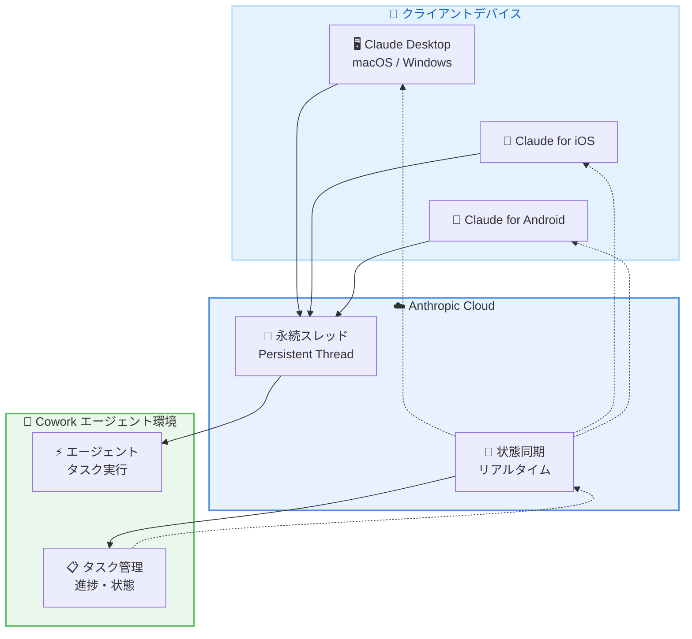
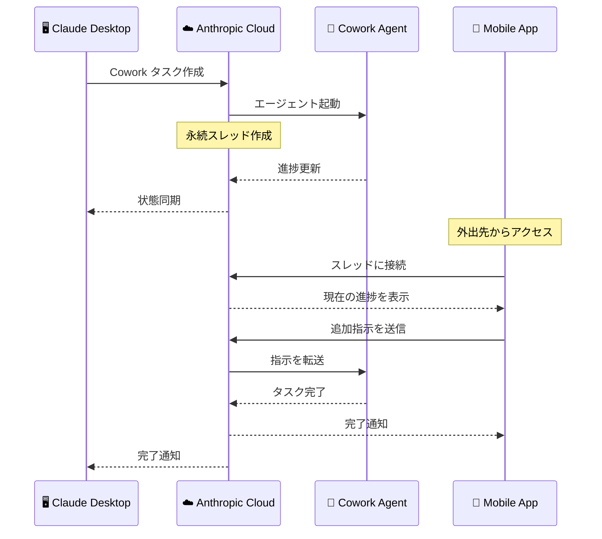
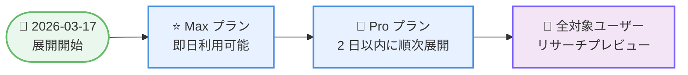

# Claude Apps Cowork モバイルコントロール: スマートフォンから永続スレッドでタスク管理が可能に

## メタデータ

| 項目 | 内容 |
|------|------|
| 発表日 | 2026-03-17 |
| ソース | Claude Apps Release Notes |
| カテゴリ | Claude Apps アップデート |
| 公式リンク | https://support.claude.com/en/articles/12138966-release-notes |

## 概要

Anthropic は 2026 年 3 月 17 日、Claude Apps の Cowork 機能にモバイルコントロールを追加しました。Pro および Max プランのユーザーは、Claude Desktop または Claude for iOS/Android から永続的なエージェントスレッドにアクセスし、Cowork 内のタスクを管理できるようになります。

本機能はリサーチプレビューとして提供され、Max プランのユーザーから先行して展開が開始され、Pro プランのユーザーには 2 日以内に順次展開されます。これにより、デスクでの作業中に開始したタスクを外出先からモバイルデバイスで監視・制御することが可能になります。

## 詳細

### 背景

Cowork は Claude が自律的にタスクを実行するためのエージェント環境です。従来、Cowork でのタスク管理はデスクトップ環境に限定されていましたが、ユーザーからはモバイルデバイスからもタスクの進捗確認や指示の送信を行いたいという要望がありました。

今回のアップデートでは、永続スレッド (persistent thread) の仕組みを導入することで、デバイスをまたいだシームレスなタスク管理を実現しています。これはリサーチプレビューとしての提供であり、今後のフィードバックに基づいて機能が改善される予定です。

### 主な変更点

#### 永続スレッドによるタスク管理

- **永続的なエージェントスレッド**: Cowork のタスクに対して永続的なスレッドが作成され、デバイス間で同期されます。Claude Desktop で開始したタスクの状態を、iOS や Android アプリからリアルタイムで確認できます
- **マルチデバイスアクセス**: Claude Desktop、Claude for iOS、Claude for Android のいずれからでも同一のスレッドにアクセス可能です。デバイスを切り替えてもタスクの文脈が維持されます

#### 対応プランと展開スケジュール

- **Max プラン**: 2026 年 3 月 17 日より展開開始
- **Pro プラン**: 2026 年 3 月 17 日から 2 日以内に順次展開

#### リサーチプレビュー

本機能はリサーチプレビューとして提供されています。以下の点に留意が必要です。

- 機能の仕様は今後変更される可能性があります
- ユーザーからのフィードバックが機能改善に活用されます
- Free プランのユーザーは現時点では利用できません

### 技術的な詳細

本機能の技術的な特徴は以下の通りです。

- **永続スレッドアーキテクチャ**: Cowork のエージェントスレッドがクラウド上で永続化され、複数のクライアントから同一のスレッドにアクセスできる仕組みが導入されました。これにより、デバイス間でのタスク状態の同期が実現されています

- **対応プラットフォーム**: Claude Desktop (macOS/Windows)、Claude for iOS、Claude for Android の 3 つのプラットフォームがサポートされています。各プラットフォームのネイティブアプリケーションから Cowork のスレッドにアクセスできます

- **エージェントタスクの遠隔管理**: スマートフォンからタスクの進捗確認、追加指示の送信、タスクの管理操作が可能です。Cowork 上で実行中のエージェントに対して、モバイルデバイスからリアルタイムで介入できます

## ユーザーへの影響

### 対象

- Claude Pro プランのユーザー
- Claude Max プランのユーザー
- Cowork を日常的に利用しているユーザー
- 外出先からもタスク管理を行いたいユーザー

### 必要なアクション

以下の手順で本機能を利用できます。

1. **アプリの更新**: Claude Desktop および Claude for iOS/Android を最新バージョンに更新してください
2. **プランの確認**: Pro または Max プランに加入していることを確認してください
3. **Cowork でタスクを作成**: Claude Desktop または モバイルアプリから Cowork でタスクを作成し、永続スレッドを通じてデバイス間でタスクを管理できます

### 利用シナリオ

- **外出先での進捗確認**: デスクで開始した長時間タスクの進捗を、移動中にスマートフォンから確認
- **リモートからの指示追加**: タスク実行中の Claude エージェントに対して、モバイルから追加の指示やフィードバックを送信
- **マルチデバイスワークフロー**: デスクトップとモバイルを行き来しながら、途切れることなくタスクを管理

## アーキテクチャ図

### Cowork モバイルコントロールの全体像

### モバイルからのタスク管理フロー

### 展開スケジュール

## 関連リンク

- [Claude Apps Release Notes](https://support.claude.com/en/articles/12138966-release-notes)
- [Cowork の詳細](https://support.claude.com/en/articles/33755498-assign-tasks-to-claude-from-anywhere-in-cowork)
- [Claude for iOS](https://apps.apple.com/app/claude-by-anthropic/id6473753684)
- [Claude for Android](https://play.google.com/store/apps/details?id=com.anthropic.claude)

## まとめ

Claude Apps の Cowork にモバイルコントロール機能が追加されたことで、ユーザーはデスクトップだけでなくスマートフォンからもエージェントタスクを管理できるようになりました。永続スレッドの導入により、Claude Desktop で開始したタスクの進捗を外出先から iOS/Android アプリで確認し、追加の指示を送信することが可能です。

本機能はリサーチプレビューとして Pro および Max プランのユーザーに提供されます。Max プランは 2026 年 3 月 17 日から、Pro プランは 2 日以内に順次展開される予定です。モバイルとデスクトップをシームレスに行き来できるワークフローにより、Cowork の活用範囲が大幅に拡大します。

今後のフィードバックに基づいて機能が改善されていくことが期待されるため、対象プランのユーザーは積極的に試用し、フィードバックを提供することが推奨されます。
