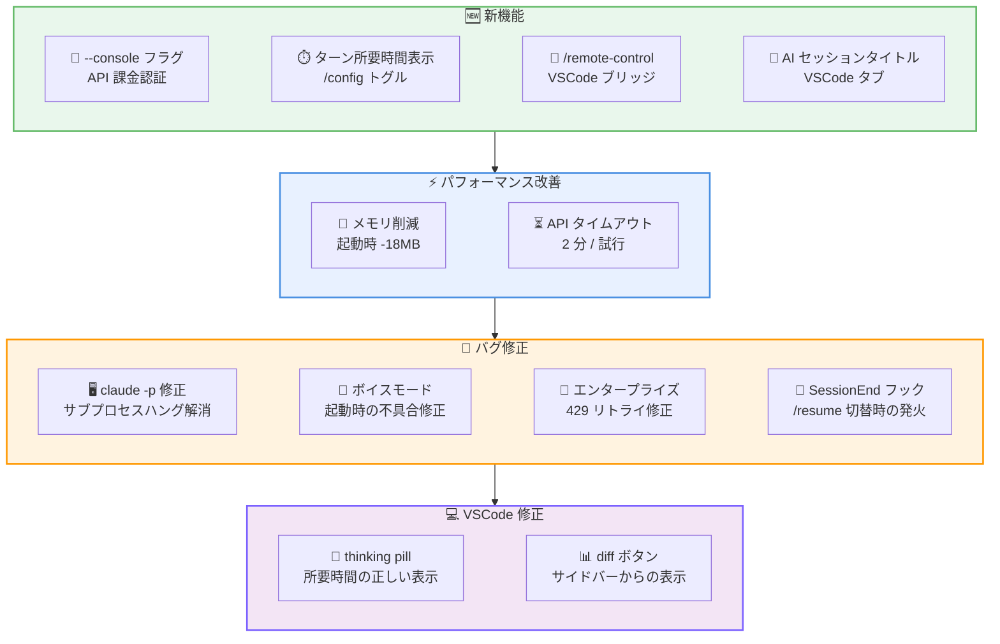
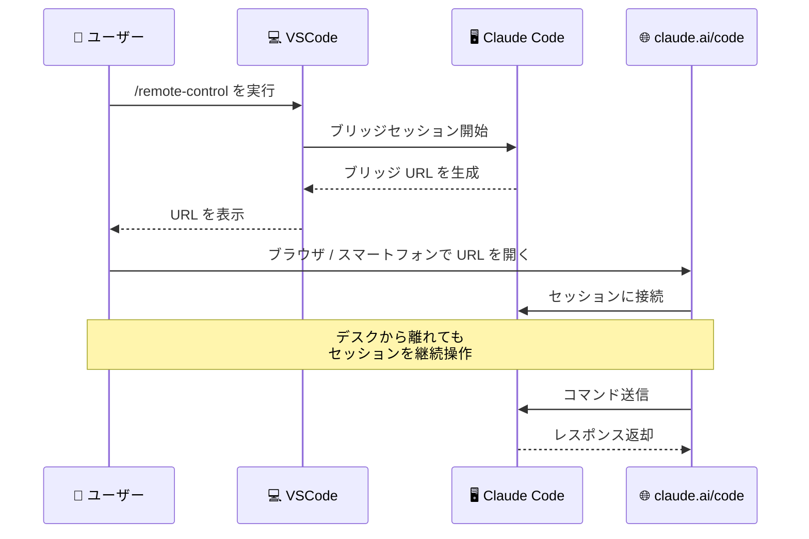

# Claude Code v2.1.79 リリース: メモリ使用量 18MB 削減、VSCode リモートコントロール、認証・安定性の改善

## メタデータ

| 項目 | 内容 |
|------|------|
| 発表日 | 2026-03-18 |
| ソース | Claude Code Changelog |
| カテゴリ | Claude Code アップデート |
| 公式リンク | https://github.com/anthropics/claude-code/blob/main/CHANGELOG.md |

## 概要

Claude Code v2.1.79 が 2026 年 3 月 18 日にリリースされました。本リリースでは、起動時のメモリ使用量が約 18MB 削減されたパフォーマンス改善、Anthropic Console 向けの新しい認証フラグ、VSCode でのリモートコントロール機能、そして多数の安定性修正が含まれています。

新機能として、`claude auth login` に `--console` フラグが追加され、API 課金による認証が簡単に行えるようになりました。VSCode 拡張では `/remote-control` コマンドにより、ブラウザやスマートフォンの claude.ai/code からセッションを継続できるブリッジ機能が追加されています。

バグ修正は 10 件に及び、`claude -p` のサブプロセス起動時のハング問題、ボイスモードの起動不具合、エンタープライズユーザーのレート制限リトライなど、幅広い環境での安定性が向上しています。

## 詳細

### 背景

Claude Code は Anthropic が提供する CLI ベースの AI 開発支援ツールです。v2.1.79 は v2.1.78 の翌日リリースであり、パフォーマンス最適化、認証ワークフローの改善、VSCode 拡張の機能拡充、そして多数の安定性修正を中心としたアップデートです。特にサブプロセスとして Claude Code を利用する自動化環境や、VSCode から Claude Code を活用するユーザーにとって影響の大きいリリースです。

### 主な変更点

#### 新機能

- **`--console` フラグ**: `claude auth login --console` で Anthropic Console (API 課金) による認証が可能になりました。従来の OAuth 認証に加え、API キーベースの認証フローを簡単に選択できます
- **ターン所要時間の表示トグル**: `/config` メニューに "Show turn duration" トグルが追加されました。各ターンの処理時間を確認でき、パフォーマンスのモニタリングに活用できます
- **[VSCode] `/remote-control` コマンド**: セッションを claude.ai/code にブリッジし、ブラウザやスマートフォンから継続操作が可能になりました。デスクから離れた際にもモバイルデバイスからセッションを監視・操作できます
- **[VSCode] AI 生成セッションタイトル**: セッションタブに最初のメッセージに基づいた AI 生成タイトルが表示されるようになりました

#### 改善・変更

**パフォーマンス改善:**

- **起動時メモリ使用量の削減**: 全てのシナリオで起動時のメモリ使用量が約 18MB 削減されました。リソースが限られた環境や多数のセッションを同時に実行する場合に特に効果的です
- **非ストリーミング API フォールバックの改善**: 1 回の試行あたり 2 分のタイムアウトが設定され、セッションが無期限にハングする問題が防止されます

**プラグイン改善:**

- **`CLAUDE_CODE_PLUGIN_SEED_DIR` の複数ディレクトリ対応**: プラットフォームのパス区切り文字 (Unix では `:`、Windows では `;`) で区切ることで、複数のシードディレクトリを指定できるようになりました

#### バグ修正

**CLI 関連:**

- **`claude -p` のサブプロセスハング修正**: 明示的な stdin なしでサブプロセスとして起動された場合 (例: Python の `subprocess.run`) に `claude -p` がハングする問題を修正しました。CI/CD パイプラインや自動化スクリプトでの利用が安定します
- **`claude -p` の Ctrl+C 修正**: print モードで Ctrl+C が動作しない問題を修正しました
- **`/btw` コマンドの修正**: ストリーミング中に `/btw` を実行した際、サイド質問への回答ではなくメインエージェントの出力が返される問題を修正しました

**UI・操作関連:**

- **ボイスモード起動の修正**: `voiceEnabled: true` が設定されている場合に、起動時にボイスモードが正しくアクティブ化されない問題を修正しました
- **`/permissions` のタブナビゲーション修正**: 左右矢印キーによるタブナビゲーションが正しく動作するようになりました
- **ターミナルタイトル制御の修正**: `CLAUDE_CODE_DISABLE_TERMINAL_TITLE` が起動時のターミナルタイトル設定を防止しない問題を修正しました
- **カスタムステータスライン修正**: ワークスペーストラストがブロックしている場合にカスタムステータスラインが何も表示しない問題を修正しました

**エンタープライズ・セッション関連:**

- **エンタープライズユーザーのレート制限リトライ修正**: エンタープライズユーザーがレート制限 (429) エラー時にリトライできない問題を修正しました
- **`SessionEnd` フック修正**: インタラクティブな `/resume` でセッションを切り替えた際に `SessionEnd` フックが発火しない問題を修正しました

**VSCode 関連:**

- **[VSCode] thinking pill の表示修正**: レスポンス完了後に "Thinking" と表示される問題を修正し、"Thought for Ns" と正しい所要時間が表示されるようになりました
- **[VSCode] セッション diff ボタン修正**: 左サイドバーからセッションを開いた際にセッション diff ボタンが表示されない問題を修正しました

### 技術的な詳細

本リリースの技術的な注目点は以下の通りです。

- **起動時メモリ最適化 (約 18MB 削減)**: 全てのシナリオで一律に約 18MB のメモリ使用量が削減されました。これは起動時の初期化プロセスの最適化によるもので、特にコンテナ環境やメモリ制約のあるサーバーで効果を発揮します。多数の Claude Code セッションを並行実行する環境では、累積的なメモリ節約が期待できます。

- **`claude -p` のサブプロセスハング問題**: `claude -p` がサブプロセスとして spawn された際、明示的な stdin が提供されない場合 (例: Python の `subprocess.run(["claude", "-p", "..."])`) にプロセスがハングする問題がありました。これは stdin のストリーム状態の検出ロジックに起因する問題で、CI/CD パイプラインや自動化ワークフローでの利用を妨げていました。

- **非ストリーミング API フォールバック**: ストリーミングが利用できない場合のフォールバック処理に、1 回の試行あたり 2 分のタイムアウトが導入されました。従来はタイムアウトが設定されておらず、ネットワーク障害やサーバー応答の遅延時にセッションが無期限にハングする可能性がありました。

- **`CLAUDE_CODE_PLUGIN_SEED_DIR` の複数ディレクトリ対応**: 環境変数にプラットフォーム固有のパス区切り文字を使用して複数のディレクトリを指定可能になりました。これにより、組織全体の共有プラグインディレクトリとチーム固有のプラグインディレクトリを同時に指定するなど、柔軟なプラグイン管理が実現します。

- **`/remote-control` の仕組み**: VSCode 内の Claude Code セッションを claude.ai/code にブリッジすることで、ブラウザやモバイルデバイスからセッションの状態を確認し、操作を継続できます。長時間実行タスクの監視や、デスクを離れた際のセッション継続に活用できます。

## 開発者への影響

### 対象

- Claude Code CLI を日常的に利用している全ての開発者
- `claude -p` をサブプロセスとして利用する自動化環境のユーザー (ハング問題の修正)
- VSCode から Claude Code を利用しているユーザー (リモートコントロール、セッションタイトル)
- エンタープライズ環境で Claude Code を運用している管理者 (レート制限リトライの修正)
- プラグインを開発・管理しているユーザー (複数シードディレクトリ対応)
- ボイスモードを利用しているユーザー (起動時の不具合修正)

### 必要なアクション

以下のコマンドで最新バージョンに更新できます。

```bash
# npm でのアップデート
npm update -g @anthropic-ai/claude-code

# 現在のバージョン確認
claude --version
```

特に以下のケースに該当するユーザーは早急なアップデートを推奨します。

- **`claude -p` をサブプロセスで使用**: stdin なしでの起動時のハングと Ctrl+C の問題が修正されています
- **エンタープライズ環境**: レート制限 (429) エラー時のリトライが正常に動作するようになりました
- **VSCode 拡張を利用**: リモートコントロール機能と複数の UI 修正が含まれています
- **`voiceEnabled: true` を設定**: 起動時のボイスモードアクティブ化が正しく動作するようになりました
- **フックを活用**: `SessionEnd` フックがセッション切り替え時にも正しく発火します

### 移行ガイド

#### `--console` フラグによる認証

```bash
# Anthropic Console (API 課金) で認証
claude auth login --console

# 従来の OAuth 認証 (変更なし)
claude auth login
```

#### `CLAUDE_CODE_PLUGIN_SEED_DIR` の複数ディレクトリ設定

```bash
# Unix 環境: コロンで区切る
export CLAUDE_CODE_PLUGIN_SEED_DIR="/org/shared/plugins:/team/plugins:/user/plugins"

# Windows 環境: セミコロンで区切る
set CLAUDE_CODE_PLUGIN_SEED_DIR="C:\org\plugins;C:\team\plugins"
```

#### `/remote-control` の使用 (VSCode)

```
# VSCode 内の Claude Code で実行
/remote-control

# 表示されるリンクをブラウザまたはモバイルデバイスで開く
# claude.ai/code からセッションを継続操作
```

## コード例

```bash
# Anthropic Console 認証で claude -p をサブプロセスとして使用
claude auth login --console

# Python からの呼び出し (v2.1.79 でハング問題が修正)
python3 -c "
import subprocess
result = subprocess.run(
    ['claude', '-p', 'Hello, Claude!'],
    capture_output=True,
    text=True
)
print(result.stdout)
"

# ターン所要時間の表示を有効化
# /config メニューから "Show turn duration" を ON に設定

# 複数のプラグインシードディレクトリを設定
export CLAUDE_CODE_PLUGIN_SEED_DIR="/org/shared:/team/plugins"
```

## アーキテクチャ図

### リリース全体像



### VSCode リモートコントロールフロー



## 関連リンク

- [Claude Code Changelog](https://github.com/anthropics/claude-code/blob/main/CHANGELOG.md)
- [Claude Code GitHub リポジトリ](https://github.com/anthropics/claude-code)
- [Claude Code ドキュメント](https://docs.anthropic.com/en/docs/claude-code)

## まとめ

Claude Code v2.1.79 は、パフォーマンス最適化、新しい認証・操作機能、VSCode 拡張の強化、そして広範な安定性修正の 4 つの柱からなるリリースです。

パフォーマンス面では、起動時のメモリ使用量が約 18MB 削減され、非ストリーミング API フォールバックに 2 分のタイムアウトが導入されました。これにより、リソース制約のある環境でのメモリ効率と、ネットワーク障害時のセッション安定性が向上しています。

新機能として、`--console` フラグによる Anthropic Console 認証、`/config` のターン所要時間表示トグル、VSCode の `/remote-control` コマンドと AI 生成セッションタイトルが追加されました。特に `/remote-control` は、デスクから離れた際にブラウザやスマートフォンからセッションを継続できる実用的な機能です。

バグ修正では、`claude -p` のサブプロセスハング問題とエンタープライズユーザーのレート制限リトライの修正が特に重要です。CI/CD パイプラインや自動化環境で `claude -p` を活用しているユーザーは、早急なアップデートを推奨します。プラグイン管理の柔軟性も向上し、`CLAUDE_CODE_PLUGIN_SEED_DIR` で複数ディレクトリの指定が可能になりました。全ての Claude Code ユーザーにアップデートを推奨します。
