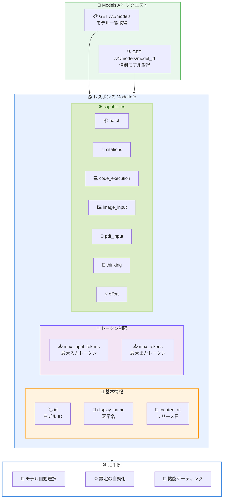

# Models API にモデル機能フィールドが追加

## メタデータ

| 項目 | 内容 |
|------|------|
| 発表日 | 2026-03-18 |
| ソース | Claude Developer Platform Release Notes |
| カテゴリ | API アップデート |
| 公式リンク | https://platform.claude.com/docs/en/release-notes/overview |

## 概要

Anthropic は 2026 年 3 月 18 日、Models API にモデル機能フィールドを追加しました。`GET /v1/models` および `GET /v1/models/{model_id}` のレスポンスに `max_input_tokens`、`max_tokens`、および `capabilities` オブジェクトが含まれるようになりました。これにより、各モデルがサポートする機能をプログラムから動的に確認でき、モデル選択やアプリケーション設定の自動化が可能になります。

## 詳細

### 背景

従来、Claude API で利用可能なモデルの機能や制限値を把握するには、ドキュメントを参照する必要がありました。モデルごとの最大入力トークン数、最大出力トークン数、サポートする機能 (Extended Thinking、画像入力、PDF 入力など) はドキュメントに記載されていましたが、API から直接取得する手段がありませんでした。

新しいモデルがリリースされるたびに、開発者はドキュメントを確認してアプリケーションの設定を手動で更新する必要があり、運用面での負担となっていました。

### 主な変更点

1. **`max_input_tokens` フィールドの追加**: モデルの最大入力コンテキストウィンドウサイズ (トークン数) を返します
2. **`max_tokens` フィールドの追加**: `max_tokens` パラメータに指定可能な最大値を返します
3. **`capabilities` オブジェクトの追加**: モデルがサポートする各機能の対応状況を構造化されたオブジェクトで返します

### 技術的な詳細

#### `capabilities` オブジェクトの構造

`capabilities` オブジェクトには以下のフィールドが含まれます。

| フィールド | 型 | 説明 |
|-----------|------|------|
| `batch` | `CapabilitySupport` | Batch API のサポート状況 |
| `citations` | `CapabilitySupport` | 引用生成のサポート状況 |
| `code_execution` | `CapabilitySupport` | コード実行ツールのサポート状況 |
| `context_management` | `ContextManagementCapability` | コンテキスト管理のサポート状況と利用可能な戦略 |
| `effort` | `EffortCapability` | reasoning_effort のサポート状況とレベル |
| `image_input` | `CapabilitySupport` | 画像入力のサポート状況 |
| `pdf_input` | `CapabilitySupport` | PDF 入力のサポート状況 |
| `structured_outputs` | `CapabilitySupport` | 構造化出力 / JSON モードのサポート状況 |
| `thinking` | `ThinkingCapability` | Extended Thinking のサポート状況と設定タイプ |

各 `CapabilitySupport` オブジェクトは `supported: boolean` フィールドを持ち、そのモデルが該当機能をサポートしているかを示します。

#### レスポンス例

```json
{
  "type": "model",
  "id": "claude-opus-4-6-20260205",
  "display_name": "Claude Opus 4.6",
  "created_at": "2026-02-05T00:00:00Z",
  "max_input_tokens": 200000,
  "max_tokens": 32768,
  "capabilities": {
    "batch": { "supported": true },
    "citations": { "supported": true },
    "code_execution": { "supported": true },
    "image_input": { "supported": true },
    "pdf_input": { "supported": true },
    "structured_outputs": { "supported": true },
    "thinking": {
      "supported": true,
      "types": {
        "enabled": { "supported": true },
        "adaptive": { "supported": true }
      }
    },
    "effort": {
      "supported": true,
      "low": { "supported": true },
      "medium": { "supported": true },
      "high": { "supported": true },
      "max": { "supported": true }
    },
    "context_management": {
      "supported": true,
      "compact_20260112": { "supported": true },
      "clear_thinking_20251015": { "supported": true },
      "clear_tool_uses_20250919": { "supported": true }
    }
  }
}
```

#### `thinking` と `effort` の詳細構造

`thinking` フィールドは Extended Thinking のサポート状況に加え、`types` オブジェクトで `enabled` (明示的有効化) と `adaptive` (自動判定) の対応を示します。

`effort` フィールドは `reasoning_effort` パラメータのサポート状況に加え、`low`、`medium`、`high`、`max` の各レベルの対応を示します。

## アーキテクチャ図



## コード例

### Python SDK - モデル一覧の取得

`GET /v1/models` エンドポイントで利用可能なモデル一覧と機能情報を取得できます。

```python
import anthropic

client = anthropic.Anthropic()

# モデル一覧を取得
models = client.models.list()

for model in models.data:
    print(f"Model: {model.id}")
    print(f"  Display Name: {model.display_name}")
    print(f"  Max Input Tokens: {model.max_input_tokens}")
    print(f"  Max Tokens: {model.max_tokens}")
    print(f"  Thinking: {model.capabilities.thinking.supported}")
    print(f"  Image Input: {model.capabilities.image_input.supported}")
    print()
```

### Python SDK - 個別モデルの機能確認

特定のモデルの詳細情報を取得して、機能の対応状況を確認できます。

```python
import anthropic

client = anthropic.Anthropic()

# 特定のモデル情報を取得
model = client.models.retrieve("claude-opus-4-6-20260205")

print(f"Model: {model.display_name}")
print(f"Max Input Tokens: {model.max_input_tokens}")
print(f"Max Output Tokens: {model.max_tokens}")

# capabilities オブジェクトで機能の対応状況を確認
caps = model.capabilities
print(f"Batch API: {caps.batch.supported}")
print(f"Citations: {caps.citations.supported}")
print(f"Code Execution: {caps.code_execution.supported}")
print(f"Image Input: {caps.image_input.supported}")
print(f"PDF Input: {caps.pdf_input.supported}")
print(f"Structured Outputs: {caps.structured_outputs.supported}")
print(f"Extended Thinking: {caps.thinking.supported}")
print(f"Reasoning Effort: {caps.effort.supported}")
```

### curl - API の直接呼び出し

```bash
# モデル一覧の取得
curl https://api.anthropic.com/v1/models \
    -H 'anthropic-version: 2023-06-01' \
    -H "X-Api-Key: $ANTHROPIC_API_KEY"

# 特定モデルの情報取得
curl https://api.anthropic.com/v1/models/claude-opus-4-6-20260205 \
    -H 'anthropic-version: 2023-06-01' \
    -H "X-Api-Key: $ANTHROPIC_API_KEY"
```

### 動的モデル選択の実装例

capabilities を活用して、要件に基づいたモデルの自動選択を実装できます。

```python
import anthropic

client = anthropic.Anthropic()


def select_model(
    needs_thinking: bool = False,
    needs_image: bool = False,
    needs_pdf: bool = False,
    min_input_tokens: int = 0,
) -> str:
    """要件に基づいて最適なモデルを自動選択する"""
    models = client.models.list()

    for model in models.data:
        caps = model.capabilities

        # 要件を満たすか確認
        if needs_thinking and not caps.thinking.supported:
            continue
        if needs_image and not caps.image_input.supported:
            continue
        if needs_pdf and not caps.pdf_input.supported:
            continue
        if model.max_input_tokens < min_input_tokens:
            continue

        return model.id

    raise ValueError("要件を満たすモデルが見つかりませんでした。")


# Extended Thinking と画像入力をサポートするモデルを選択
model_id = select_model(needs_thinking=True, needs_image=True)
print(f"Selected model: {model_id}")
```

## 開発者への影響

### 対象

- Claude API を利用しているすべての開発者
- 複数のモデルを動的に切り替えるアプリケーションを構築している開発者
- モデルの機能に基づいて UI や機能を制御するプラットフォーム開発者

### 必要なアクション

- **新しいフィールドの活用**: `max_input_tokens`、`max_tokens`、`capabilities` を利用して、ハードコーディングされたモデル設定を動的な取得に置き換えることを検討してください
- **既存実装への影響なし**: レスポンスにフィールドが追加されたのみで、既存の API 呼び出しに破壊的な変更はありません
- **モデル選択の自動化**: `capabilities` オブジェクトを活用することで、新しいモデルがリリースされた際にアプリケーションコードを変更せずに対応できます

### 移行ガイド

既存の Models API 呼び出しはそのまま動作します。新しいフィールドはレスポンスに追加されたもので、破壊的な変更はありません。

**活用例 - ハードコーディングの除去**:

```python
# 変更前: ハードコーディング
MAX_INPUT_TOKENS = 200000
SUPPORTS_THINKING = True

# 変更後: API から動的に取得
model = client.models.retrieve("claude-opus-4-6-20260205")
max_input_tokens = model.max_input_tokens
supports_thinking = model.capabilities.thinking.supported
```

## 関連リンク

- [Models API - List Models](https://platform.claude.com/docs/en/api/models/list)
- [Models API - Get Model](https://platform.claude.com/docs/en/api/models/get)
- [Claude Developer Platform Release Notes](https://platform.claude.com/docs/en/release-notes/overview)

## まとめ

Models API に追加された `max_input_tokens`、`max_tokens`、および `capabilities` フィールドにより、各モデルのトークン制限と機能サポート状況を API から直接取得できるようになりました。

`capabilities` オブジェクトは、Batch API、引用、コード実行、画像入力、PDF 入力、構造化出力、Extended Thinking、reasoning_effort、コンテキスト管理といった幅広い機能の対応状況を網羅しています。これにより、モデルの機能をプログラムから動的に確認し、最適なモデルの自動選択やアプリケーション設定の自動化が実現できます。

既存の API 呼び出しとの後方互換性は完全に維持されており、レスポンスに新しいフィールドが追加されただけのため、既存の実装に影響はありません。
