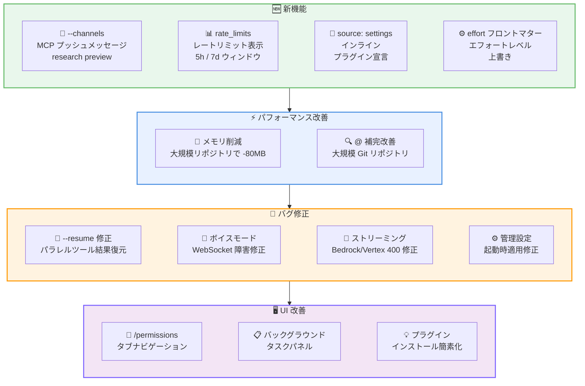
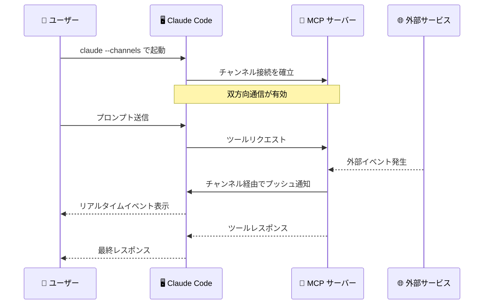

# Claude Code v2.1.80 リリース: MCP チャンネル、レートリミット表示、大規模リポジトリでのメモリ 80MB 削減

## メタデータ

| 項目 | 内容 |
|------|------|
| 発表日 | 2026-03-20 |
| ソース | Claude Code Changelog |
| カテゴリ | Tool Update / CLI |
| 公式リンク | https://github.com/anthropics/claude-code/blob/main/CHANGELOG.md |

## 概要

Claude Code v2.1.80 が 2026 年 3 月 20 日にリリースされました。本リリースでは、MCP サーバーからセッションへメッセージをプッシュできる `--channels` (research preview)、ステータスラインへのレートリミット使用状況表示、スキルのエフォートレベル制御など 5 つの新機能が追加されました。

修正面では、`--resume` でパラレルツール結果が欠落する問題、ボイスモードの WebSocket 障害、API プロキシ経由でのストリーミングエラーなど 7 件のバグが修正されています。

パフォーマンス改善として、大規模リポジトリ (25 万ファイル規模) での起動時メモリ使用量が約 80MB 削減され、`@` ファイル補完の応答性も向上しました。

## 詳細

### 背景

Claude Code は Anthropic が提供する CLI ベースの AI 開発支援ツールです。v2.1.80 は v2.1.79 の 2 日後のリリースであり、MCP エコシステムの拡張、開発者体験の向上、大規模リポジトリでのパフォーマンス最適化を中心としたアップデートです。特に `--channels` は MCP サーバーとの双方向通信を実現する research preview 機能であり、今後の MCP 活用の幅を広げる重要な追加です。

### 主な変更点

#### 新機能

- **`--channels` (research preview)**: MCP サーバーがセッションにメッセージをプッシュできる新機能です。従来はクライアントから MCP サーバーへのリクエストが主体でしたが、サーバー側からのプッシュ通知が可能になり、リアルタイムイベントの受信や非同期ワークフローの構築が期待できます
- **`rate_limits` フィールド**: ステータスラインスクリプト向けに Claude.ai のレートリミット使用状況を表示するフィールドが追加されました。5 時間ウィンドウと 7 日間ウィンドウの `used_percentage` と `resets_at` を確認でき、使用量の可視化が可能です
- **`source: 'settings'` プラグインソース**: settings.json 内にプラグインエントリをインラインで宣言できるプラグインマーケットプレースソースが追加されました。外部ファイルを参照せずにプラグイン設定を一元管理できます
- **CLI ツール使用検出によるプラグインティップス**: ファイルパターンマッチングに加え、CLI ツールの使用状況を検出してプラグインの推奨が表示されるようになりました
- **`effort` フロントマターサポート**: スキルやスラッシュコマンドに `effort` フロントマターを指定することで、呼び出し時にモデルのエフォートレベルを上書きできるようになりました

#### バグ修正

**セッション・データ関連:**

- **`--resume` のパラレルツール結果欠落を修正**: パラレルツールコールを含むセッションを再開した際、全ての `tool_use`/`tool_result` ペアが正しく復元されるようになりました。従来は `[Tool result missing]` プレースホルダが表示される問題がありました
- **管理設定の起動時適用を修正**: `enabledPlugins`、`permissions.defaultMode`、ポリシー設定の環境変数が、`remote-settings.json` が前回セッションからキャッシュされている場合に起動時に適用されない問題を修正しました

**通信・API 関連:**

- **ボイスモード WebSocket 障害を修正**: Cloudflare のボット検出が非ブラウザ TLS フィンガープリントをブロックすることで発生していた WebSocket 接続失敗を修正しました
- **ファイングレインドツールストリーミングの 400 エラーを修正**: API プロキシ、Bedrock、Vertex 経由でファイングレインドツールストリーミングを使用した際の 400 エラーを修正しました

**UI 関連:**

- **`/remote-control` の不要な表示を修正**: ゲートウェイやサードパーティプロバイダーのデプロイメントで機能しない `/remote-control` が表示される問題を修正しました
- **`/sandbox` のタブ切替を修正**: Tab キーや矢印キーでのタブ切替が応答しない問題を修正しました
- **`/effort` の表示を修正**: auto が実際に解決される値を表示するようになり、ステータスバーインジケーターと一致するようになりました

#### 改善・変更

**パフォーマンス改善:**

- **大規模リポジトリでのメモリ使用量削減**: 起動時のメモリ使用量が大幅に削減されました。25 万ファイル規模のリポジトリで約 80MB の節約が確認されています
- **`@` ファイル補完の応答性向上**: 大規模 Git リポジトリでの `@` ファイルオートコンプリートの応答性が改善されました

**UI・操作性改善:**

- **`/permissions` のナビゲーション改善**: Tab キーと矢印キーでリスト内からタブを切替できるようになりました
- **バックグラウンドタスクパネルの改善**: 左矢印キーでリストビューからパネルを閉じられるようになりました
- **プラグインインストールティップスの簡素化**: 2 ステップのフローから単一の `/plugin install` コマンドに簡素化されました

### 技術的な詳細

本リリースの技術的な注目点は以下の通りです。

- **`--channels` の仕組み (research preview)**: MCP サーバーがクライアントセッションにメッセージをプッシュするための新しい通信チャンネルです。従来の MCP ではクライアントがサーバーにリクエストを送信し、レスポンスを受け取る一方向のフローが主体でした。`--channels` により、サーバー側で発生したイベント (ビルド完了、テスト結果、外部サービスからの通知など) をリアルタイムにセッションへ配信できるようになります。research preview のため、今後 API が変更される可能性があります。

- **`rate_limits` フィールド**: ステータスラインスクリプトから参照可能な構造化データとして提供されます。5 時間ウィンドウと 7 日間ウィンドウそれぞれの `used_percentage` (使用率) と `resets_at` (リセット時刻) が含まれ、カスタムステータスラインで使用量をリアルタイムに監視できます。

- **大規模リポジトリでのメモリ最適化 (約 80MB 削減)**: v2.1.79 での 18MB 削減に続き、25 万ファイル規模のリポジトリで約 80MB のメモリ削減が達成されました。これはファイルインデックスの構築や Git メタデータの保持に関する最適化によるもので、モノレポやエンタープライズ規模のリポジトリで顕著な効果を発揮します。

- **`--resume` のパラレルツール結果復元**: パラレルツールコール (複数のツールが同時に実行されるケース) を含むセッションの復元ロジックが修正されました。従来は `tool_use` ブロックと `tool_result` ブロックの対応関係がパラレル実行時に正しく維持されず、復元時に結果が欠落していました。

- **Cloudflare ボット検出への対応**: ボイスモードの WebSocket 接続において、非ブラウザの TLS フィンガープリントが Cloudflare のボット検出に引っかかり、接続が拒否される問題がありました。TLS ハンドシェイクの調整により、正当なクライアントとして認識されるようになりました。

## 開発者への影響

### 対象

- Claude Code CLI を日常的に利用している全ての開発者
- MCP サーバーを開発・運用しているユーザー (`--channels` research preview)
- Claude.ai のレートリミットを意識して作業しているユーザー (`rate_limits` フィールド)
- 大規模リポジトリで Claude Code を使用しているユーザー (メモリ 80MB 削減)
- `--resume` でセッションを再開する機会が多いユーザー (パラレルツール結果の修正)
- API プロキシ、Bedrock、Vertex 経由で利用しているユーザー (ストリーミングエラー修正)
- ボイスモードを利用しているユーザー (WebSocket 障害修正)
- スキルやスラッシュコマンドを作成しているユーザー (`effort` フロントマター)

### 必要なアクション

以下のコマンドで最新バージョンに更新できます。

```bash
# npm でのアップデート
npm update -g @anthropic-ai/claude-code

# 現在のバージョン確認
claude --version
```

特に以下のケースに該当するユーザーは早急なアップデートを推奨します。

- **`--resume` でセッション再開時に `[Tool result missing]` が表示される**: パラレルツール結果の復元が修正されています
- **API プロキシ、Bedrock、Vertex 経由でストリーミングエラーが発生する**: ファイングレインドツールストリーミングの 400 エラーが修正されています
- **大規模リポジトリで起動が遅い**: メモリ使用量の大幅削減により起動パフォーマンスが向上しています
- **ボイスモードの接続が不安定**: Cloudflare ボット検出に起因する WebSocket 障害が修正されています
- **管理設定が起動時に反映されない**: キャッシュされた `remote-settings.json` の問題が修正されています

### 移行ガイド

#### `--channels` の使用 (research preview)

```bash
# MCP サーバーからのプッシュメッセージを有効化
claude --channels

# MCP サーバー側でチャンネルにメッセージをプッシュ可能に
# 注意: research preview のため API が変更される可能性があります
```

#### `effort` フロントマターの設定

```markdown
---
effort: high
---

# スキル名

スキルの説明...
```

スキルやスラッシュコマンドのフロントマターに `effort` を追加することで、呼び出し時のモデルエフォートレベルを制御できます。

#### `rate_limits` フィールドの活用

ステータスラインスクリプトで `rate_limits` フィールドを参照し、レートリミットの使用状況を表示できます。

```json
{
  "rate_limits": {
    "5h": {
      "used_percentage": 45.2,
      "resets_at": "2026-03-20T15:00:00Z"
    },
    "7d": {
      "used_percentage": 12.8,
      "resets_at": "2026-03-27T00:00:00Z"
    }
  }
}
```

#### `source: 'settings'` プラグインソース

```json
{
  "plugins": [
    {
      "source": "settings",
      "name": "my-plugin",
      "command": "node /path/to/plugin.js"
    }
  ]
}
```

## コード例

```bash
# v2.1.80 へのアップデート
npm update -g @anthropic-ai/claude-code

# MCP チャンネルを有効にしてセッション開始 (research preview)
claude --channels

# セッション再開 (パラレルツール結果が正しく復元される)
claude --resume

# プラグインのインストール (簡素化されたフロー)
/plugin install my-plugin
```

## アーキテクチャ図

### リリース全体像



### MCP チャンネルのフロー



## 関連リンク

- [Claude Code Changelog](https://github.com/anthropics/claude-code/blob/main/CHANGELOG.md)
- [Claude Code GitHub リポジトリ](https://github.com/anthropics/claude-code)
- [Claude Code ドキュメント](https://docs.anthropic.com/en/docs/claude-code)
- [MCP 仕様](https://modelcontextprotocol.io/)

## まとめ

Claude Code v2.1.80 は、MCP エコシステムの拡張、レートリミットの可視化、大規模リポジトリでのパフォーマンス最適化、そして広範なバグ修正の 4 つの柱からなるリリースです。

最も注目すべき新機能は `--channels` (research preview) です。MCP サーバーからセッションへのプッシュメッセージが可能になり、ビルド完了通知やテスト結果のリアルタイム配信など、非同期ワークフローの構築が期待できます。research preview のため今後の API 変更の可能性がありますが、MCP の活用範囲を大きく広げる重要な追加です。

開発者体験の改善も充実しています。`rate_limits` フィールドにより Claude.ai のレートリミット使用状況をステータスラインでリアルタイムに監視でき、`effort` フロントマターでスキル単位のモデルエフォートレベル制御が可能になりました。`source: 'settings'` プラグインソースにより、プラグインの設定管理も簡素化されています。

パフォーマンス面では、25 万ファイル規模のリポジトリで起動時メモリ使用量が約 80MB 削減されました。v2.1.79 での 18MB 削減に続く大幅な最適化であり、モノレポやエンタープライズ規模のリポジトリでの利用体験が大きく向上しています。

バグ修正では、`--resume` でのパラレルツール結果欠落、ボイスモードの WebSocket 障害、API プロキシ経由のストリーミングエラー、管理設定の起動時適用の問題が修正されています。特に `--resume` の修正は、パラレルツールコールを多用するセッションの信頼性を向上させる重要な修正です。全ての Claude Code ユーザーにアップデートを推奨します。
