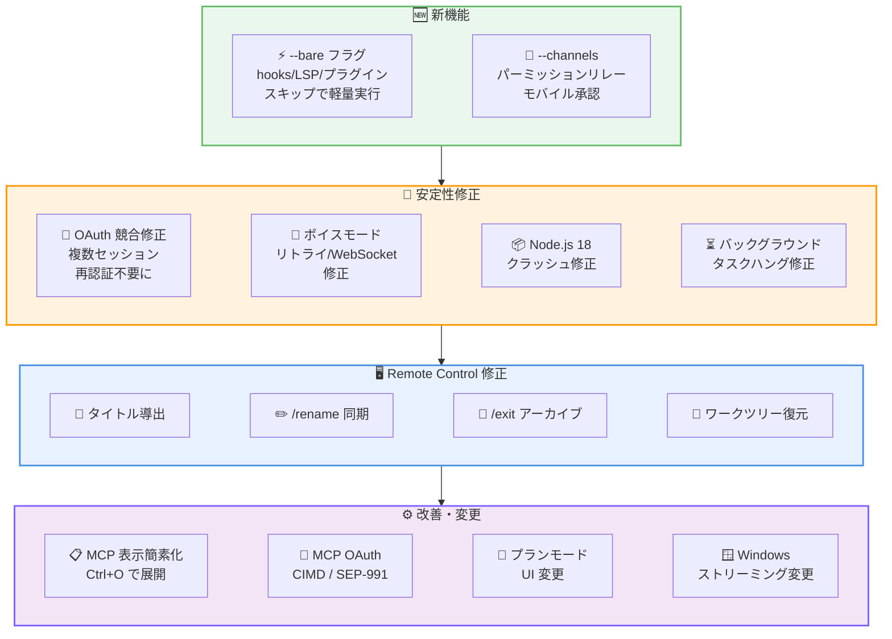
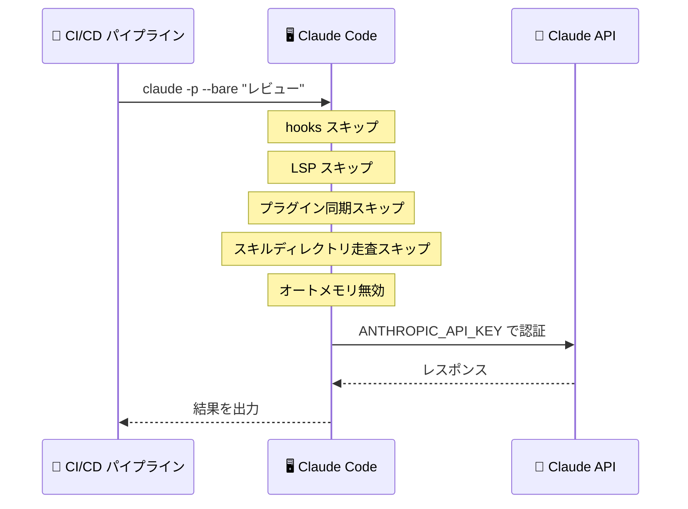
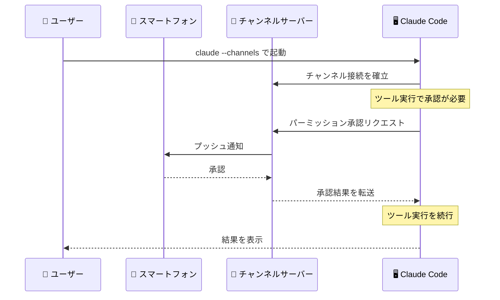

# Claude Code v2.1.81 リリース: --bare フラグによるスクリプト最適化、パーミッション転送チャンネル、27 件の修正と改善

## メタデータ

| 項目 | 内容 |
|------|------|
| 発表日 | 2026-03-21 |
| ソース | Claude Code Changelog |
| カテゴリ | Tool Update / CLI |
| 公式リンク | https://github.com/anthropics/claude-code/blob/main/CHANGELOG.md |

## 概要

Claude Code v2.1.81 が 2026 年 3 月 21 日にリリースされました。本リリースでは、スクリプト用途に最適化された `--bare` フラグと、パーミッション承認をモバイル端末に転送する `--channels` パーミッションリレーの 2 つの新機能が追加されました。

修正面では、OAuth トークンの競合による再認証問題、ボイスモードの複数の不具合、Node.js 18 でのクラッシュ、Remote Control セッションの各種問題など 17 件のバグが修正されています。

改善として、MCP ツールコールの表示簡素化、`!` bash モードの案内強化、プラグインの自動更新、MCP OAuth の CIMD 対応、プランモードの UI 変更など 8 件の改善・変更が含まれています。さらに、VSCode 環境での Windows PATH 継承に関するプラットフォーム固有の修正も含まれます。

## 詳細

### 背景

Claude Code は Anthropic が提供する CLI ベースの AI 開発支援ツールです。v2.1.81 は v2.1.80 の翌日にリリースされた迅速なアップデートであり、CI/CD パイプラインでの利用を強化する `--bare` フラグ、前バージョンで追加された `--channels` のパーミッション転送機能、そして幅広いバグ修正を中心としたリリースです。全 27 項目の変更が含まれ、特にセッション管理、ボイスモード、Remote Control の安定性が大幅に向上しています。

### 主な変更点

#### 新機能

- **`--bare` フラグ**: スクリプトからの `-p` 呼び出し向けに、hooks、LSP、プラグイン同期、スキルディレクトリの走査をスキップする軽量モードです。`ANTHROPIC_API_KEY` または `--settings` 経由の `apiKeyHelper` が必要で、OAuth やキーチェーン認証は無効化されます。オートメモリも完全に無効化されるため、CI/CD パイプラインや自動化スクリプトでの利用に最適です
- **`--channels` パーミッションリレー**: パーミッション機能を宣言したチャンネルサーバーが、ツール承認プロンプトをモバイル端末に転送できるようになりました。リモート環境で Claude Code を実行中にパーミッション承認が必要な場合、スマートフォンから承認操作が可能になります

#### バグ修正

**認証・セッション関連:**

- **OAuth トークンの競合修正**: 複数の Claude Code セッションを同時に実行している際、1 つのセッションが OAuth トークンをリフレッシュすると他のセッションで再認証が必要になる問題を修正しました
- **Node.js 18 でのクラッシュ修正**: Node.js 18 環境で発生していたクラッシュが修正されました
- **`CLAUDE_CODE_DISABLE_EXPERIMENTAL_BETAS` の修正**: structured-outputs ベータヘッダーが抑制されず、Vertex/Bedrock に転送するプロキシゲートウェイで 400 エラーが発生する問題を修正しました
- **`--channels` のバイパス修正**: 他の管理設定が構成されていない Team/Enterprise 組織での `--channels` バイパスを修正しました

**ボイスモード関連:**

- **リトライ失敗の表示修正**: リトライ失敗が無視され、実際のエラーではなく誤解を招く「ネットワークを確認してください」メッセージが表示される問題を修正しました
- **WebSocket 切断からの音声復旧**: サーバーがサイレントに WebSocket 接続を切断した際、音声が復旧しない問題を修正しました

**UI・操作関連:**

- **Bash コマンドの不要なパーミッションプロンプト修正**: 文字列内にダッシュを含む Bash コマンドで不要なパーミッションプロンプトが表示される問題を修正しました
- **プラグイン hooks のブロック修正**: プラグインディレクトリがセッション中に削除された場合、プラグイン hooks がプロンプト送信をブロックする問題を修正しました
- **バックグラウンドタスクのハング修正**: ポーリング間隔の間にタスクが完了した場合、バックグラウンドエージェントタスクの出力が無期限にハングする競合条件を修正しました
- **`/btw` のペーストテキスト修正**: アクティブなレスポンス中に `/btw` を使用した際、ペーストされたテキストが含まれない問題を修正しました
- **tmux での Cmd+Tab ペーストの競合修正**: tmux 環境で高速な Cmd+Tab の後にペーストがクリップボードコピーを追い越す競合を修正しました
- **ターミナルタブタイトルの更新修正**: 自動生成されたセッション説明でターミナルタブタイトルが更新されない問題を修正しました
- **不可視 hook 添付のカウント修正**: トランスクリプトモードで不可視の hook 添付がメッセージカウントを膨張させる問題を修正しました

**Remote Control 関連:**

- **セッションタイトルの修正**: Remote Control セッションが最初のプロンプトからタイトルを導出せず、汎用タイトルが表示される問題を修正しました
- **`/rename` の同期修正**: `/rename` が Remote Control セッションのタイトルを同期しない問題を修正しました
- **`/exit` のアーカイブ修正**: Remote Control の `/exit` がセッションを確実にアーカイブしない問題を修正しました
- **ワークツリーのセッション復元**: ワークツリー内にあったセッションを再開する際、そのワークツリーに自動的に切り替わるようになりました

#### 改善

- **MCP ツールコールの表示簡素化**: MCP の read/search ツールコールが単一の「Queried {server}」行に折りたたまれるようになりました (Ctrl+O で展開可能)
- **`!` bash モードの案内強化**: 対話的コマンドの実行が必要な場面で、Claude が `!` bash モードを提案するようになりました
- **プラグインの自動更新**: ref 追跡プラグインがロードのたびに再クローンされ、上流の変更を自動的に反映するようになりました
- **Remote Control セッションタイトルの更新**: 3 番目のメッセージ送信後にセッションタイトルが更新されるようになりました

#### 変更

- **MCP OAuth の CIMD 対応**: Dynamic Client Registration を持たないサーバー向けに、Client ID Metadata Document (CIMD / SEP-991) をサポートするよう MCP OAuth が更新されました
- **プランモードの UI 変更**: プランモードで「コンテキストをクリア」オプションがデフォルトで非表示になりました (`"showClearContextOnPlanAccept": true` で復元可能)
- **Windows でのストリーミング無効化**: レンダリングの問題により、Windows (Windows Terminal 上の WSL を含む) で行単位のレスポンスストリーミングが無効化されました

#### プラットフォーム固有

- **[VSCode] Windows PATH 継承の修正**: Git Bash 使用時の Bash ツールにおける Windows PATH 継承の問題を修正しました (v2.1.78 でのリグレッション)

### 技術的な詳細

本リリースの技術的な注目点は以下の通りです。

- **`--bare` フラグの設計思想**: CI/CD パイプラインやスクリプトからの呼び出しでは、hooks、LSP、プラグイン同期、スキルディレクトリの走査といった対話型セッション向けの機能は不要です。`--bare` フラグはこれらを全てスキップし、最小限のオーバーヘッドで API 呼び出しに集中します。認証は `ANTHROPIC_API_KEY` 環境変数または `--settings` 経由の `apiKeyHelper` に限定され、OAuth やキーチェーン認証は無効化されます。オートメモリも完全に無効化されるため、ステートレスな実行が保証されます。

- **`--channels` パーミッションリレーの仕組み**: v2.1.80 で追加された `--channels` の拡張機能です。チャンネルサーバーがパーミッション機能 (permission capability) を宣言すると、Claude Code のツール承認プロンプトをそのサーバー経由でモバイル端末に転送できます。SSH やリモートデスクトップ経由で Claude Code を実行している場合でも、スマートフォンからパーミッションを承認でき、ワークフローの中断を最小限に抑えられます。

- **OAuth トークンの競合解消**: 複数セッション間での OAuth トークンリフレッシュの競合は、共有トークンストアへの排他制御が不十分だったことが原因です。1 つのセッションがトークンをリフレッシュすると、他のセッションが保持していた古いトークンが無効化され、再認証が要求されていました。本修正では、リフレッシュされたトークンを全セッションが適切に共有する仕組みが導入されています。

- **MCP OAuth CIMD 対応**: Dynamic Client Registration (DCR) は MCP サーバーが OAuth クライアントを動的に登録する仕組みですが、全てのサーバーが DCR をサポートしているわけではありません。Client ID Metadata Document (CIMD / SEP-991) は、事前に発行されたクライアント ID のメタデータをドキュメントとして公開する代替方式で、DCR 非対応のサーバーでも OAuth 認証が可能になります。

- **バックグラウンドタスクの競合条件**: ポーリングベースの完了チェックにおいて、ポーリング間隔の間にタスクが完了すると、完了イベントが検出されず出力が無期限にハングする問題がありました。タスク完了ステータスのチェックロジックが改善され、ポーリング間隔に関係なく完了を確実に検出するようになりました。

## 開発者への影響

### 対象

- Claude Code CLI を日常的に利用している全ての開発者
- CI/CD パイプラインや自動化スクリプトで Claude Code を使用しているユーザー (`--bare` フラグ)
- リモート環境で Claude Code を実行しているユーザー (`--channels` パーミッションリレー)
- 複数の Claude Code セッションを同時に実行しているユーザー (OAuth 競合修正)
- ボイスモードを利用しているユーザー (リトライ失敗表示、WebSocket 復旧修正)
- Vertex/Bedrock プロキシ経由で利用しているユーザー (structured-outputs ベータヘッダー修正)
- Remote Control 機能を利用しているユーザー (タイトル、リネーム、終了の各種修正)
- Node.js 18 環境を使用しているユーザー (クラッシュ修正)
- Windows / WSL 環境で利用しているユーザー (ストリーミング変更、VSCode PATH 修正)
- MCP サーバーを開発・運用しているユーザー (CIMD 対応、ツールコール表示簡素化)

### 必要なアクション

以下のコマンドで最新バージョンに更新できます。

```bash
# npm でのアップデート
npm update -g @anthropic-ai/claude-code

# 現在のバージョン確認
claude --version
```

特に以下のケースに該当するユーザーは早急なアップデートを推奨します。

- **複数セッション実行時に再認証を繰り返し求められる**: OAuth トークンの競合が修正されています
- **Node.js 18 環境でクラッシュが発生する**: Node.js 18 固有のクラッシュが修正されています
- **Vertex/Bedrock プロキシ経由で 400 エラーが発生する**: `CLAUDE_CODE_DISABLE_EXPERIMENTAL_BETAS` が structured-outputs ベータヘッダーを正しく抑制するようになりました
- **ボイスモードが不安定**: リトライ失敗の正確な表示と WebSocket 切断からの音声復旧が修正されています
- **バックグラウンドタスクの出力がハングする**: ポーリング間隔の競合条件が修正されています
- **CI/CD で Claude Code を使用している**: `--bare` フラグで起動を高速化できます

### 移行ガイド

#### `--bare` フラグの使用

```bash
# CI/CD パイプラインでの使用例
ANTHROPIC_API_KEY=sk-ant-xxx claude -p --bare "コードレビューを実施してください"

# --settings 経由の apiKeyHelper を使用する場合
claude -p --bare --settings '{"apiKeyHelper": "my-key-helper"}' "テストを実行してください"
```

`--bare` フラグを使用すると以下が無効化されます。

- hooks の実行
- LSP (Language Server Protocol) の起動
- プラグイン同期
- スキルディレクトリの走査
- OAuth / キーチェーン認証
- オートメモリ

#### プランモードの「コンテキストをクリア」復元

```json
{
  "showClearContextOnPlanAccept": true
}
```

設定ファイルに上記を追加することで、プランモードの「コンテキストをクリア」オプションを復元できます。

#### Windows / WSL での行単位ストリーミング

Windows (Windows Terminal 上の WSL を含む) では、レンダリングの問題により行単位のレスポンスストリーミングが無効化されました。この変更は自動的に適用され、ユーザー側でのアクションは不要です。レスポンスの表示方法が若干変わる可能性がありますが、機能的な影響はありません。

## コード例

```bash
# v2.1.81 へのアップデート
npm update -g @anthropic-ai/claude-code

# --bare フラグで CI/CD 向けの軽量実行
export ANTHROPIC_API_KEY=sk-ant-xxx
claude -p --bare "このプルリクエストの差分をレビューしてください"

# --bare フラグと --settings の組み合わせ
claude -p --bare --settings '{"apiKeyHelper": "/usr/local/bin/get-api-key"}' \
  "src/ ディレクトリのコードを分析してください"

# --channels パーミッションリレーを有効にして起動
claude --channels

# ! bash モード (Claude が提案する対話的コマンド実行)
# Claude のレスポンス中に !npm run dev のように提案される

# MCP ツールコールの展開 (セッション中)
# Ctrl+O で折りたたまれた "Queried {server}" 行を展開
```

## アーキテクチャ図

### v2.1.81 の主要機能



### --bare フラグの動作フロー



### --channels パーミッションリレーのフロー



## 関連リンク

- [Claude Code Changelog](https://github.com/anthropics/claude-code/blob/main/CHANGELOG.md)
- [Claude Code GitHub リポジトリ](https://github.com/anthropics/claude-code)
- [Claude Code ドキュメント](https://docs.anthropic.com/en/docs/claude-code)
- [MCP 仕様](https://modelcontextprotocol.io/)
- [SEP-991 Client ID Metadata Document](https://modelcontextprotocol.io/)

## まとめ

Claude Code v2.1.81 は、CI/CD 向け軽量実行モード、モバイルパーミッション承認、広範な安定性修正の 3 つの柱からなる全 27 項目のリリースです。

最も注目すべき新機能は `--bare` フラグです。hooks、LSP、プラグイン同期、スキルディレクトリの走査、オートメモリを全てスキップし、`ANTHROPIC_API_KEY` による認証のみで軽量に実行できます。CI/CD パイプラインや自動化スクリプトでの Claude Code 利用において、起動オーバーヘッドを最小化し、ステートレスな実行を保証する重要な追加です。

`--channels` パーミッションリレーは、v2.1.80 で追加されたチャンネル機能の実用的な拡張です。SSH やリモート環境で Claude Code を実行中、ツール承認をスマートフォンに転送できるようになり、リモート開発のワークフローが大幅に改善されます。

安定性の面では、複数セッション間の OAuth トークン競合、ボイスモードの複数の不具合、Node.js 18 でのクラッシュ、バックグラウンドタスクのハングなど、日常利用に影響する 17 件のバグが修正されています。特に OAuth トークンの競合修正は、複数ターミナルで Claude Code を同時に使用する開発者にとって大きな改善です。

Remote Control セッションに関しても、タイトルの導出、`/rename` の同期、`/exit` のアーカイブ、ワークツリーの復元と 4 件の修正が行われ、リモートコントロール機能の信頼性が向上しています。

改善面では、MCP ツールコールの表示が簡素化され (Ctrl+O で展開可能)、MCP OAuth が CIMD / SEP-991 に対応するなど、MCP エコシステムとの連携が強化されています。Windows / WSL 環境でのストリーミング無効化は一時的な制約ですが、レンダリング品質を優先した判断です。全ての Claude Code ユーザーにアップデートを推奨します。
