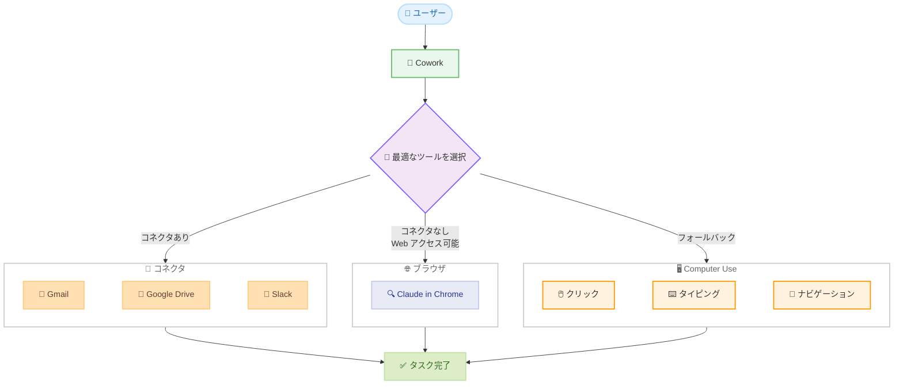
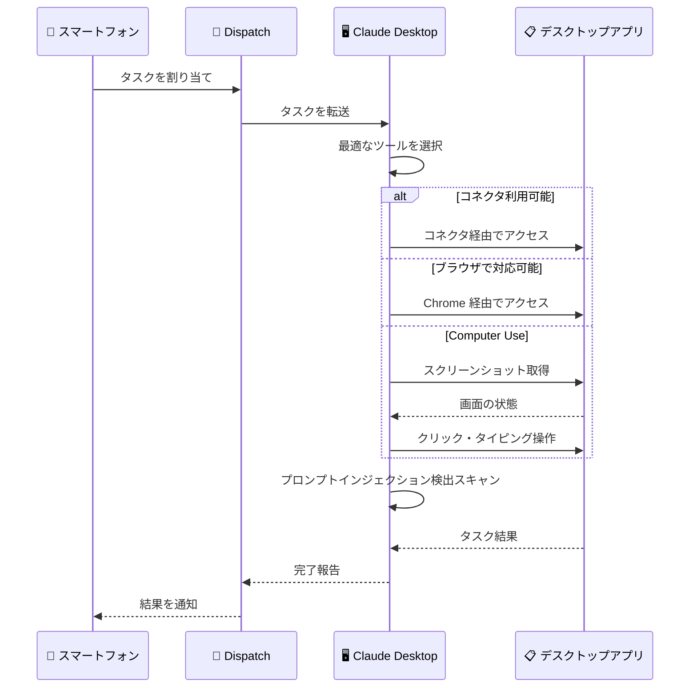

# Computer Use が Cowork と Claude Code で利用可能に + Dispatch の改善

## メタデータ

| 項目 | 内容 |
|------|------|
| 発表日 | 2026-03-23 |
| ソース | Claude Apps Release Notes / Claude Blog |
| カテゴリ | 製品アップデート |
| 公式リンク | [Blog](https://claude.com/blog/dispatch-and-computer-use) / [Support](https://support.claude.com/en/articles/14128542-let-claude-use-your-computer-in-cowork) |

## 概要

Anthropic は、Claude がユーザーのコンピュータ画面を直接操作できる Computer Use 機能を Cowork および Claude Code で利用可能にしたことを発表しました。セットアップ不要で、macOS の Claude Desktop アプリにおいて Pro および Max プランのユーザーが研究プレビューとして利用できます。

あわせて、Dispatch 機能の改善も発表されました。Dispatch はスマートフォンからタスクを割り当てる機能で、ユーザーが離席中でも Claude がコンピュータを操作してタスクを実行できるようになりました。スマートフォンとデスクトップの間で 1 つの継続的な会話を維持できます。

## 詳細

### 背景

Computer Use は、Claude がコンピュータ画面上でポイント、クリック、ナビゲーションを行い、タスクを完了する機能です。従来は API 経由での利用が中心でしたが、今回のアップデートにより Cowork と Claude Code のユーザーインターフェースから直接利用できるようになりました。

Cowork は Claude Desktop アプリにおける協働作業モードであり、Claude が様々なツールを組み合わせてタスクを遂行します。Computer Use はその最新のツールとして追加され、既存のコネクタやブラウザ操作と組み合わせることで、より幅広いタスクに対応できるようになりました。

### 主な変更点

#### Computer Use in Cowork のツール選択ロジック

Cowork における Claude のツール選択は、最も精度の高いツールを優先する階層構造になっています。

1. **コネクタ優先**: Gmail、Google Drive、Slack などの専用コネクタがある場合はそれを使用
2. **ブラウザ操作**: コネクタが利用できない場合、Claude in Chrome 経由でブラウザを操作
3. **画面操作 (Computer Use)**: 上記のいずれも利用できない場合のフォールバックとして、デスクトップアプリ上でのクリック、タイピング、ナビゲーションを実行

#### 利用可能なタスク例

- 複数のソースから情報を集めて競合分析をまとめる
- 電話シミュレータを開いて UX テストを実施する
- 複数のソースからスプレッドシートにデータを入力する
- コネクタが存在しないアプリ (社内ダッシュボードなど) を操作する

#### パーミッションモデル

- Claude は各アプリケーションへのアクセス前にユーザーの許可を求める
- 一部のアプリケーションはデフォルトでアクセス制限される
- 以下の操作は回避するようトレーニングされている。
  - 株式取引
  - 機密データの入力
  - 顔画像の収集

#### Dispatch の改善

- スマートフォンからタスクを割り当て可能
- スマートフォンとデスクトップの間で 1 つの継続的な会話を維持
- ユーザーが離席中でも、Dispatch 経由で Claude がコンピュータを操作してタスクを実行

#### 安全対策

- Claude は画面操作のためにスクリーンショットを撮影してナビゲーションを行う
- アクティベーション時にプロンプトインジェクション検出のための自動スキャンを実施
- ユーザーはいつでも Claude の操作を停止可能

### 技術的な詳細

本機能の技術的な注目点は以下の通りです。

- **ツール選択の階層構造**: Cowork の Computer Use は単独で動作するのではなく、コネクタ、ブラウザ、画面操作の 3 層構造の中で最も適切なツールが自動選択されます。直接統合 (コネクタ) が最も高速かつ正確であり、画面操作はフォールバックとして位置づけられています。これにより、可能な限り効率的なツールが優先されます。

- **スクリーンショットベースのナビゲーション**: Claude は画面の状態を把握するためにスクリーンショットを取得し、視覚的に要素を認識してクリックやタイピングを行います。この方式はアプリケーション固有の API を必要としないため、任意のデスクトップアプリケーションを操作できる汎用性がありますが、直接統合と比較して動作が遅い傾向があります。

- **プロンプトインジェクション検出**: 画面操作中に表示されるコンテンツを通じた悪意あるプロンプトインジェクションを防止するため、アクティベーションの自動スキャンが実装されています。これは画面上のテキストや画像が Claude の動作を意図しない方向に誘導することを防ぐセーフガードです。

- **プラットフォーム制約**: 現時点では macOS のみのサポートとなっています。Windows 対応は近日公開予定です。画面操作は直接統合と比較して低速であり、複雑なタスクではリトライが必要になる場合があります。

## 開発者への影響

### 対象

- Claude Desktop アプリを macOS で利用している Pro / Max プランのユーザー
- Cowork 機能を活用して業務効率化を図っているユーザー
- コネクタが存在しない社内ツールやデスクトップアプリケーションを Claude と連携させたいユーザー
- Dispatch 機能でリモートからタスクを管理しているユーザー
- Claude Code で Computer Use を活用した開発ワークフローを構築したいユーザー

### 必要なアクション

以下の手順で Computer Use 機能を利用できます。

1. macOS の Claude Desktop アプリを最新バージョンに更新
2. Pro または Max プランであることを確認
3. Cowork モードで Claude にタスクを依頼すると、必要に応じて Computer Use が自動的に使用される
4. 各アプリケーションへのアクセス許可を求められた場合は、内容を確認して承認または拒否

Dispatch 機能を利用する場合は以下の通りです。

1. スマートフォンの Claude アプリからタスクを割り当て
2. デスクトップの Claude Desktop アプリが起動している状態であることを確認
3. Claude が自動的にコンピュータを操作してタスクを実行

### 移行ガイド

本機能は新規追加であり、既存の機能やワークフローに対する破壊的変更はありません。研究プレビューとして提供されているため、以下の点に留意してください。

- **複雑なタスクではリトライが必要な場合がある**: 画面操作の精度は発展途上であり、意図通りに動作しない場合は再試行が必要です
- **画面操作は直接統合より低速**: コネクタやブラウザ操作で対応可能なタスクは、それらの方法が優先されます
- **macOS 限定**: Windows 対応は近日公開予定です

## コード例

```text
本機能は Claude Desktop アプリの GUI を通じて利用するため、コード例は該当しません。

Cowork での利用例:
- 「社内ダッシュボードから今月の売上データを取得して、スプレッドシートにまとめてください」
- 「この画面に表示されているフォームに、添付ファイルの情報を入力してください」

Dispatch での利用例:
- スマートフォンから「デスクトップのメールアプリで、未読メールの要約を作成してください」
```

## アーキテクチャ図

### Cowork のツール選択階層



### Dispatch + Computer Use のフロー



## 関連リンク

- [Computer Use in Cowork - Blog](https://claude.com/blog/dispatch-and-computer-use)
- [Let Claude Use Your Computer in Cowork - Support](https://support.claude.com/en/articles/14128542-let-claude-use-your-computer-in-cowork)
- [Anthropic News](https://www.anthropic.com/news)

## まとめ

Anthropic は Computer Use 機能を Cowork と Claude Code で利用可能にし、Claude がユーザーのコンピュータ画面を直接操作してタスクを完了できるようになりました。macOS の Claude Desktop アプリにおいて、Pro および Max プランのユーザーが研究プレビューとして利用できます。

最も注目すべき点は、Cowork におけるツール選択の階層構造です。Claude はコネクタ、ブラウザ、画面操作の 3 つのツールから最も精度の高いものを自動選択します。コネクタが利用可能な場合はそれを優先し、Computer Use はフォールバックとして位置づけられています。これにより、効率性と精度のバランスが最適化されています。

Dispatch の改善も重要なアップデートです。スマートフォンからタスクを割り当て、ユーザーが離席中でも Claude がデスクトップ上で作業を継続できるようになりました。スマートフォンとデスクトップの間で 1 つの継続的な会話を維持できるため、場所を問わない柔軟なワークフローが実現されます。

安全面では、各アプリケーションへのアクセス前にユーザー許可を求める仕組み、プロンプトインジェクション検出の自動スキャン、株式取引や機密データ入力の回避といった複数のセーフガードが実装されています。ユーザーはいつでも Claude の操作を停止できます。

現時点では macOS のみの対応で、Windows 対応は近日公開予定です。画面操作は直接統合と比較して低速であり、複雑なタスクではリトライが必要になる場合がある点は留意が必要です。研究プレビューの段階ではありますが、コネクタが存在しない社内ツールやデスクトップアプリケーションとの連携を大幅に拡大する可能性を持つ機能です。
