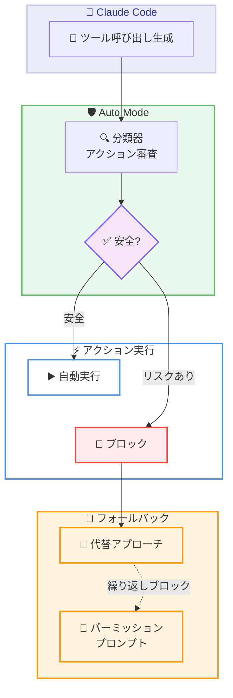

# Claude Code に Auto Mode が登場 (リサーチプレビュー)

## メタデータ

| 項目 | 内容 |
|------|------|
| 発表日 | 2026-03-24 |
| ソース | Claude Blog |
| カテゴリ | 製品アップデート |
| 公式リンク | https://claude.com/blog/auto-mode |

## 概要

Anthropic は 2026 年 3 月 24 日、Claude Code に新しいパーミッションモード「Auto Mode」をリサーチプレビューとして発表しました。Auto Mode は、すべてのアクションに対して承認を求めるデフォルトモードと、一切のチェックを行わない `--dangerously-skip-permissions` の中間に位置するモードです。各ツール呼び出しの実行前に分類器がアクションを審査し、安全と判断されたものは自動的に実行され、リスクのあるアクションはブロックされます。現在、Claude Team プランのユーザー向けに提供されており、Enterprise プランおよび API ユーザーへの展開も近日中に予定されています。

## 詳細

### 背景

Claude Code のパーミッションモデルでは、これまで 2 つの選択肢がありました。

1. **デフォルトモード**: すべてのファイル書き込みと bash コマンドの実行時にユーザーの承認を要求する、最も安全だが作業を頻繁に中断するモード
2. **`--dangerously-skip-permissions`**: すべてのチェックをスキップする、隔離環境専用の危険なモード

開発者は安全性と生産性のトレードオフに直面しており、セキュリティを維持しつつ作業の流れを止めない中間的なアプローチが求められていました。Auto Mode はこの課題を解決するために設計されています。

### 主な変更点

1. **Auto Mode の追加**: デフォルトモードと `--dangerously-skip-permissions` の間に位置する新しいパーミッションモードが追加されました
2. **分類器によるアクション審査**: 各ツール呼び出しの実行前に、分類器が潜在的に危険なアクションかどうかを判定します
3. **安全なアクションの自動実行**: 分類器が安全と判断したアクションは、ユーザーの承認なしに自動的に実行されます
4. **リスクのあるアクションのブロック**: 大量のファイル削除、機密データの流出、悪意のあるコード実行などが検出された場合、アクションはブロックされ、Claude は別のアプローチを取ります
5. **フォールバック機構**: Claude がブロックされたアクションを繰り返し試行する場合は、ユーザーにパーミッションプロンプトが表示されます

### 技術的な詳細

#### 動作フロー

Auto Mode では、Claude の各ツール呼び出しが実行される前に以下のプロセスが行われます。

1. Claude がツール呼び出しを生成する
2. 分類器がアクションの安全性を審査する
3. 安全と判定された場合、アクションが自動的に実行される
4. リスクありと判定された場合、アクションがブロックされ、Claude が代替アプローチを検討する
5. Claude がブロックされたアクションに固執する場合、ユーザーにパーミッションプロンプトが表示される

#### 分類器が検出するリスク

分類器は以下のような潜在的に破壊的なアクションを検出します。

- **大量ファイル削除**: 意図しないファイルの一括削除
- **機密データの流出**: 環境変数や認証情報の外部送信
- **悪意のあるコード実行**: セキュリティリスクのあるコマンドの実行

#### 対応モデル

Auto Mode は以下のモデルで動作します。

- Claude Sonnet 4.6
- Claude Opus 4.6

#### パーミッションモードの比較

| モード | 動作 | 安全性 | 生産性 |
|--------|------|--------|--------|
| デフォルト | すべてのファイル書き込みと bash コマンドで承認を要求 | 最も安全 | 中断が多い |
| Auto Mode | 分類器が審査し、安全なアクションは自動実行 | バランス型 | 流れを維持 |
| `--dangerously-skip-permissions` | すべてのチェックをスキップ | 危険 | 最も高い |

## アーキテクチャ図



## コード例

### CLI での有効化

Auto Mode は CLI フラグで有効化し、Shift+Tab でモードを切り替えます。

```bash
# Auto Mode を有効化して Claude Code を起動
claude --enable-auto-mode

# 起動後、Shift+Tab でパーミッションモードを切り替え
# Default → Auto → Default ...
```

### 管理者向け設定

管理者は managed settings で Auto Mode を無効化できます。

```json
{
  "disableAutoMode": "disable"
}
```

### デスクトップアプリ / VS Code 拡張機能での有効化

1. Settings を開く
2. Claude Code セクションに移動する
3. Auto Mode をトグルで有効化する
4. パーミッションモードのドロップダウンから Auto Mode を選択する

## 開発者への影響

### 対象

- Claude Code を日常的に使用している開発者
- Claude Team プランのユーザー (現時点)
- 今後、Enterprise プランおよび API ユーザーにも展開予定
- 組織の Claude Code 利用を管理する管理者

### 必要なアクション

- **Team プランユーザー**: `claude --enable-auto-mode` で Auto Mode を試用できます。Shift+Tab でモードを切り替えてください
- **デスクトップ / VS Code ユーザー**: Settings -> Claude Code で Auto Mode をトグルで有効化し、ドロップダウンからモードを選択してください
- **管理者**: Auto Mode を組織で無効化する場合は、managed settings に `"disableAutoMode": "disable"` を設定してください。Claude デスクトップアプリではデフォルトで無効化されており、Organization Settings -> Claude Code で有効化できます
- **Enterprise / API ユーザー**: 近日中の提供開始をお待ちください

### 注意事項

Auto Mode の利用にあたり、以下の制限事項に注意してください。

- **トークン消費への影響**: 分類器の実行により、トークン消費量、コスト、レイテンシに若干の影響がある場合があります
- **分類の精度**: 分類器はすべてのリスクを完全に検出できるわけではなく、安全なアクションをブロックする場合や、リスクのあるアクションを許可する場合があります
- **隔離環境の推奨**: 本番環境への意図しない影響を防ぐため、隔離された開発環境での利用が推奨されています

## 関連リンク

- [Claude Code Auto Mode - 公式ブログ](https://claude.com/blog/auto-mode)
- [Claude Code ドキュメント](https://docs.anthropic.com/en/docs/claude-code)

## まとめ

Claude Code の新しい Auto Mode は、セキュリティと生産性のバランスを取る中間的なパーミッションモードです。分類器がツール呼び出しの実行前にアクションを審査し、安全なものは自動実行、リスクのあるものはブロックするという仕組みにより、デフォルトモードの頻繁な承認要求による作業中断を軽減しつつ、`--dangerously-skip-permissions` のセキュリティリスクを回避できます。

現在リサーチプレビューとして Claude Team プランユーザーに提供されており、Claude Sonnet 4.6 および Opus 4.6 で動作します。Enterprise プランおよび API ユーザーへの展開も近日中に予定されています。分類器の精度やトークン消費への影響などの制限事項があるため、隔離環境での利用が推奨されています。
