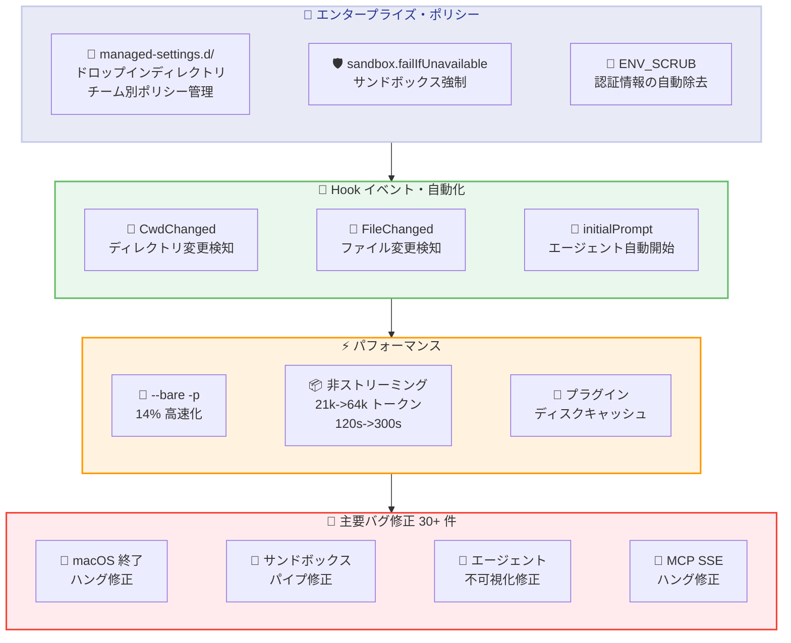
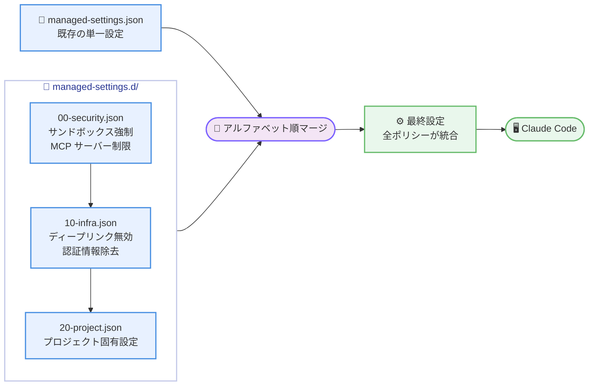
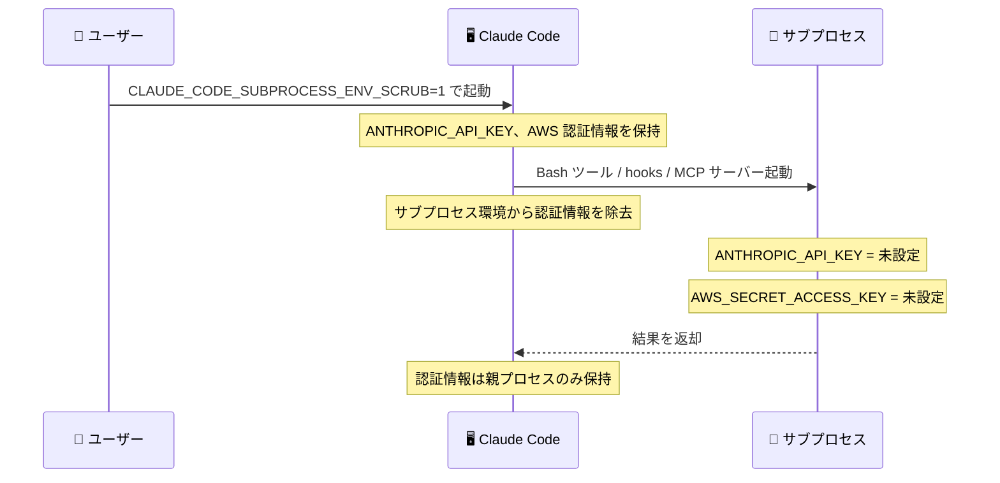

# Claude Code v2.1.83 リリース: マネージド設定のドロップインディレクトリ、30 件超のバグ修正、セキュリティとパフォーマンスの大幅改善

## メタデータ

| 項目 | 内容 |
|------|------|
| 発表日 | 2026-03-24 |
| ソース | Claude Code Changelog |
| カテゴリ | Tool Update / CLI |
| 公式リンク | https://github.com/anthropics/claude-code/blob/main/CHANGELOG.md |

## 概要

Claude Code v2.1.83 が 2026 年 3 月 24 日にリリースされました。本リリースは、新機能 13 件、バグ修正 30 件超、改善・変更 25 件超を含む大規模なアップデートです。

新機能の中核として、`managed-settings.d/` ドロップインディレクトリによるポリシー管理の分散化、`CwdChanged` / `FileChanged` hook イベントによるリアクティブな環境管理、`sandbox.failIfUnavailable` 設定によるサンドボックス強制、`CLAUDE_CODE_SUBPROCESS_ENV_SCRUB=1` による認証情報の自動除去が追加されました。

バグ修正では、macOS での終了時ハング、大規模ファイルの diff タイムアウト、起動時の UI フリーズ、サンドボックスモードでのパイプコマンドハング、バックグラウンドエージェントの不可視化、MCP SSE 接続断時のハングなど、日常利用に直結する 30 件超の問題が解消されています。

改善面では、`--bare -p` の 14% 高速化、非ストリーミングフォールバックの大幅拡張 (21k -> 64k トークン)、WebFetch の User-Agent 更新、`TaskOutput` ツールの非推奨化など、パフォーマンスとエコシステム連携が強化されています。

## 詳細

### 背景

Claude Code は Anthropic が提供する CLI ベースの AI 開発支援ツールです。v2.1.83 は v2.1.81 から 3 日後のリリースであり、エンタープライズ環境でのポリシー管理、セキュリティ強化、大規模な安定性改善を中心としたリリースです。特に 30 件を超えるバグ修正は、ボイスモード、Remote Control、サンドボックスモード、バックグラウンドエージェントなど幅広い領域にわたり、Claude Code の全体的な信頼性を大幅に向上させています。

### 主な変更点

#### 新機能

**エンタープライズ・ポリシー管理:**

- **`managed-settings.d/` ドロップインディレクトリ**: `managed-settings.json` と並行して、`managed-settings.d/` ディレクトリから複数のポリシーフラグメントをアルファベット順にマージできるようになりました。セキュリティチーム、インフラチーム、プロジェクトチームがそれぞれ独立したポリシーファイルを管理でき、組織内の設定管理が大幅に簡素化されます
- **`sandbox.failIfUnavailable` 設定**: サンドボックスが有効だが起動できない場合、サンドボックスなしで実行する代わりにエラーで終了するよう設定できます。セキュリティポリシーの厳格な適用が必要な環境向けの設定です
- **`disableDeepLinkRegistration` 設定**: `claude-cli://` プロトコルハンドラーの登録を無効化する設定が追加されました

**セキュリティ:**

- **`CLAUDE_CODE_SUBPROCESS_ENV_SCRUB=1`**: Bash ツール、hooks、MCP stdio サーバーなどのサブプロセス環境から Anthropic およびクラウドプロバイダーの認証情報を自動的に除去します。サプライチェーン攻撃への防御層として機能します

**hook イベント:**

- **`CwdChanged` / `FileChanged` hook イベント**: ワーキングディレクトリの変更やファイルの変更を検知する hook イベントが追加されました。direnv のようなリアクティブな環境管理ツールとの連携が可能になります

**UI・操作性:**

- **トランスクリプト検索**: トランスクリプトモード (`Ctrl+O`) で `/` を押して検索し、`n` / `N` で結果を移動できるようになりました
- **`Ctrl+X Ctrl+E` でエディタ起動**: readline ネイティブのキーバインドとして外部エディタを起動できます (`Ctrl+G` も引き続き使用可能)
- **画像チップ表示**: ペーストされた画像がカーソル位置に `[Image #N]` チップとして挿入され、プロンプト内で位置を参照できるようになりました
- **クリップボード画像のパス参照**: ペーストされた画像のディスク上のパスを Claude が参照し、ファイル操作に利用できるようになりました

**エージェント・プラグイン:**

- **エージェントの `initialPrompt`**: エージェントがフロントマターで `initialPrompt` を宣言し、最初のターンを自動送信できるようになりました
- **キーバインドのカスタマイズ**: `chat:killAgents` と `chat:fastMode` が `~/.claude/keybindings.json` でリバインド可能になりました
- **`CLAUDE_CODE_DISABLE_NONSTREAMING_FALLBACK`**: ストリーミング失敗時の非ストリーミングフォールバックを無効化する環境変数が追加されました
- **プラグインオプションの外部公開**: プラグインの `manifest.userConfig` が外部から利用可能になり、有効化時に設定プロンプトが表示されます。`sensitive: true` の値は macOS ではキーチェーン、その他のプラットフォームでは保護された認証情報ファイルに保存されます

#### バグ修正

**起動・終了関連:**

- **macOS での終了時ハング修正**: Claude Code が macOS で終了時にハングする問題を修正しました
- **マウストラッキングエスケープシーケンスのリーク修正**: 終了後にシェルプロンプトにマウストラッキングのエスケープシーケンスが漏れる問題を修正しました
- **起動時 UI フリーズ修正**: ボイス入力が有効な場合、ネイティブオーディオモジュールの先行読み込みにより 1 - 8 秒の UI フリーズが発生する問題を修正しました
- **起動時のリグレッション修正**: claude.ai MCP 設定の取得待ちで約 3 秒の遅延が発生するリグレッションを修正しました
- **`caffeinate` プロセスの終了修正**: Claude Code 終了時に `caffeinate` プロセスが適切に終了せず、Mac がスリープできなくなる問題を修正しました

**UI・操作関連:**

- **画面フラッシュ修正**: アイドル状態数秒後に画面が一瞬空白になる問題を修正しました
- **大規模ファイル diff のハング修正**: 共通行の少ない大規模ファイルの diff でハングする問題を修正しました。5 秒でタイムアウトしてフォールバックする仕組みが導入されました
- **スラッシュコマンドの選択表示修正**: 提案をナビゲートした後に間違いハイライトされたコマンドが表示される問題を修正しました
- **`/config` メニュー表示修正**: 検索カーソルとリスト選択が同時に表示される問題を修正しました
- **キューコマンドのフリッカー修正**: ストリーミングレスポンス中にキューコマンドがちらつく問題を修正しました
- **スラッシュコマンドのテキスト送信修正**: メッセージ処理中に送信されたスラッシュコマンドがテキストとしてモデルに送信される問題を修正しました
- **スクロールバックジャンプ修正 (2 件)**: 折りたたまれた read/search グループがスクロール外で完了した際と、モデルの思考開始・停止時にスクロールバックがジャンプする問題を修正しました
- **コピーオンセレクト修正**: マウスをターミナルウィンドウ外でリリースした際にコピーオンセレクトが発火しない問題を修正しました
- **ゴーストキャラクター修正**: 高さ制限のあるリストでアイテムがオーバーフローした際にゴーストキャラクターが表示される問題を修正しました
- **`Ctrl+B` 干渉修正**: アイドルプロンプトで `Ctrl+B` が readline の backward-char と干渉する問題を修正しました
- **スペースキー遅延修正**: ボイスのホールドトゥトークをリリースした後、最大 3 秒間スペースキーが飲み込まれる問題を修正しました
- **プロンプト復元の改善**: レスポンス前にプロンプトを中断すると、入力が自動的に復元され編集・再送信できるようになりました

**バックグラウンドエージェント関連:**

- **コンテキスト圧縮後の不可視化修正**: コンテキスト圧縮後にバックグラウンドサブエージェントが不可視になり、重複エージェントがスポーンされる可能性がある問題を修正しました
- **タスク停止状態修正**: git や API コールがクリーンアップ中にハングした際、バックグラウンドエージェントタスクが「実行中」状態のまま残る問題を修正しました

**セキュリティ・ポリシー関連:**

- **`--mcp-config` CLI フラグのポリシーバイパス修正**: `--mcp-config` フラグが `allowedMcpServers` / `deniedMcpServers` マネージドポリシーの適用をバイパスする問題を修正しました
- **ツール結果ファイルのクリーンアップ修正**: `cleanupPeriodDays` 設定を無視してツール結果ファイルがクリーンアップされない問題を修正しました
- **アンインストール済みプラグイン hook の継続実行修正**: アンインストールされたプラグインの hooks が次のセッションまで発火し続ける問題を修正しました

**サンドボックス・プラットフォーム関連:**

- **パイプコマンドハング修正**: サンドボックスモードの Linux で `rg ... | wc -l` などのパイプコマンドがハングして `0` を返す問題を修正しました
- **`--worktree` ハング修正**: ワークツリー名にスラッシュが含まれる場合にサイレントハングする問題を修正しました

**ボイスモード関連:**

- **ALSA エラー修正**: オーディオハードウェアのない Linux でボイスモード使用時に ALSA ライブラリエラーがターミナル UI を破損する問題を修正しました
- **SoX 検出修正**: Termux / Android で `which` のスポーンがカーネル制限される環境での SoX 検出を修正しました
- **CJK IME 全角スペース修正**: CJK IME が全角スペースを挿入した際にボイス入力のホールドトゥトークが起動しない問題を修正しました

**Remote Control 関連:**

- **セッション一覧表示修正**: アクティブに実行中のセッションが Web セッション一覧で Idle と表示される問題を修正しました
- **フッターナビゲーション修正**: 設定駆動モードで不可視の Remote Control ピルが選択される問題を修正しました
- **メモリリーク修正**: リモートセッションでツール使用 ID が無制限に蓄積するメモリリークを修正しました
- **セッションタイトル表示修正**: バックグラウンドエージェントが最初のユーザーメッセージ前に完了した際、セッションタイトルに生の XML が表示される問題を修正しました
- **コンテナ再起動後の履歴修正**: コンテナ再起動後にリモートセッションが会話履歴を忘れる問題を修正しました
- **一時的な認証エラーの自動リトライ**: 一時的な認証エラー時に再ログインを要求する代わりに自動リトライするようになりました

**MCP・API 関連:**

- **claude.ai MCP コネクタの `--print` モード対応**: Slack、Gmail などの claude.ai MCP コネクタがシングルターンの `--print` モードで利用できない問題を修正しました
- **API 400 エラー修正**: ツールコール失敗中にペースト画像がキューされた際の API 400 エラーを修正しました
- **MCP SSE 接続断のハング修正**: SSE 接続がコール途中でドロップした際に MCP ツールコールが無期限にハングする問題を修正しました

**SDK・セッション関連:**

- **SDK セッション履歴の損失修正**: hook の進捗/添付メッセージが parentUuid チェーンをフォークし、再開時にセッション履歴が失われる問題を修正しました
- **bash モードの起動修正**: `!` プレフィックスのコマンド提案をタブ受け入れした際に bash モードが起動しない問題を修正しました
- **`--channels` の初回起動修正**: アップグレード直後の初回起動で「Channels are not currently available」と表示される問題を修正しました

#### 改善・変更

**パフォーマンス:**

- **`--bare -p` の 14% 高速化**: SDK パターンでの API リクエストまでの時間が 14% 短縮されました
- **Bedrock SDK コールドスタート改善**: プロファイルフェッチと他の起動処理をオーバーラップさせることで Bedrock SDK のコールドスタートレイテンシが改善されました
- **`--resume` のメモリ使用量・起動改善**: 大規模セッションでの `--resume` のメモリ使用量と起動レイテンシが改善されました
- **プラグイン起動改善**: コマンド、スキル、エージェントがディスクキャッシュから再フェッチなしでロードされるようになりました
- **`claude -p` 起動高速化**: 未認証の HTTP/SSE MCP サーバーでの起動が約 600ms 短縮されました
- **WebFetch メモリ削減**: 大規模ページでの WebFetch のピークメモリ使用量が削減されました

**非ストリーミングフォールバック:**

- **トークン上限拡張**: 非ストリーミングフォールバックのトークン上限が 21k から 64k に引き上げられました
- **タイムアウト延長**: タイムアウトが 120 秒から 300 秒 (ローカル) に延長されました

**UI・操作性改善:**

- **bash ゴーストテキスト提案**: 直前に送信したコマンドが即座にゴーストテキスト提案に含まれるようになりました
- **`/status` のリアルタイム実行**: Claude の応答中でも `/status` がキューされずに即座に実行されるようになりました
- **スクロールバックリセット頻度削減**: 長いセッションでのスクロールバックリセットがターンごとから約 50 メッセージごとに削減されました
- **`Ctrl+L` の動作変更**: 画面クリアと完全な再描画を強制するようになりました
- **Remote Control セッションタイトル改善**: AI 生成タイトルが最初のメッセージから数秒以内に表示されるようになりました

**キーバインド変更:**

- **バックグラウンドエージェント停止**: `Ctrl+F` から `Ctrl+X Ctrl+K` に変更されました

**メモリ・設定:**

- **`MEMORY.md` インデックス制限**: 200 行に加えて 25KB でもトランケートされるようになりました
- **XDG_DATA_HOME 対応**: Linux で `claude-cli://` プロトコルハンドラー登録時に `XDG_DATA_HOME` を尊重するようになりました

**エコシステム:**

- **WebFetch User-Agent 更新**: `Claude-User` として識別されるようになり、サイト運営者が `robots.txt` で Claude Code トラフィックを認識・許可リストに追加できます
- **`TaskOutput` ツール非推奨化**: バックグラウンドタスクの出力ファイルパスに対して `Read` を使用する方式が推奨されます
- **プラグイン MCP サーバーの重複抑制**: 組織管理のコネクタと重複するプラグイン MCP サーバーが抑制されるようになりました
- **`--channels` 時のツール無効化**: `--channels` がアクティブな場合、`AskUserQuestion` とプランモードツールが無効化されるようになりました

**VSCode 拡張:**

- **応答なし表示**: バックエンドが 60 秒間応答しない場合、スピナーが赤色の「Not responding」に変わります
- **セッション履歴修正**: URL 経由または再起動後にセッションを再開した際の履歴読み込みが修正されました
- **巻き戻しピッカー**: Esc 2 回押し (または `/rewind`) でキーボードナビゲーション可能な巻き戻しピッカーが開くようになりました
- **会話フォーク・巻き戻し修正**: セッションキャッシュが古くなった後の「Fork conversation from here」と巻き戻しアクションの失敗が修正されました

### 技術的な詳細

本リリースの技術的な注目点は以下の通りです。

- **`managed-settings.d/` の設計思想**: エンタープライズ環境では、セキュリティポリシー、開発ツール設定、プロジェクト固有の制約など、複数のチームがそれぞれ独立した設定を管理する必要があります。`managed-settings.json` 単一ファイルではコンフリクトが避けられないため、`managed-settings.d/` ディレクトリにドロップインファイルを配置し、アルファベット順にマージする仕組みが導入されました。これにより、`00-security.json`、`10-infra.json`、`20-project.json` のように優先順位を制御しながら独立した管理が可能になります。

- **`CLAUDE_CODE_SUBPROCESS_ENV_SCRUB=1` のセキュリティモデル**: Bash ツール、hooks、MCP stdio サーバーなどのサブプロセスは、親プロセスの環境変数を継承します。これにより、`ANTHROPIC_API_KEY` や AWS 認証情報などがサブプロセスに漏洩するリスクがありました。`CLAUDE_CODE_SUBPROCESS_ENV_SCRUB=1` を設定すると、Anthropic およびクラウドプロバイダーの認証情報がサブプロセス環境から自動的に除去されます。悪意のある MCP サーバーやフック経由での認証情報窃取を防ぐ防御層として機能します。

- **大規模ファイル diff のタイムアウト機構**: 共通行の少ない大規模ファイル同士の diff は、最悪ケースで O(n*m) の計算量になりハングの原因となっていました。5 秒のタイムアウトを導入し、タイムアウト時にはグレースフルにフォールバックする仕組みが実装されました。

- **バックグラウンドエージェントのコンテキスト圧縮問題**: コンテキスト圧縮が発生すると、バックグラウンドサブエージェントへの参照が失われ不可視になっていました。これにより、同じタスクに対して重複エージェントがスポーンされる可能性がありました。圧縮後もサブエージェントの参照を保持する修正が行われています。

- **サンドボックスモードでのパイプコマンド問題**: Linux のサンドボックスモードで `rg ... | wc -l` のようなパイプコマンドがハングし `0` を返す問題は、サンドボックスのファイルディスクリプタ管理に起因していました。パイプの EOF 処理が修正され、パイプコマンドが正常に動作するようになりました。

- **非ストリーミングフォールバックの大幅拡張**: ストリーミングが失敗した際のフォールバックとして、トークン上限が 21k から 64k に (約 3 倍)、タイムアウトが 120 秒から 300 秒 (ローカル) に拡張されました。これにより、ネットワーク不安定な環境でもより大きなレスポンスを受信できるようになります。

## 開発者への影響

### 対象

- Claude Code CLI を日常的に利用している全ての開発者
- エンタープライズ環境でポリシー管理を行っている組織 (`managed-settings.d/`、`sandbox.failIfUnavailable`)
- セキュリティを重視する環境で Claude Code を使用しているユーザー (`CLAUDE_CODE_SUBPROCESS_ENV_SCRUB`)
- direnv などの環境管理ツールを使用しているユーザー (`CwdChanged` / `FileChanged` hook)
- CI/CD パイプラインで Claude Code を使用しているユーザー (`--bare -p` 高速化)
- macOS で Claude Code を使用しているユーザー (終了時ハング、`caffeinate` 修正)
- ボイスモードを利用しているユーザー (起動フリーズ、ALSA エラー、CJK IME 修正)
- Remote Control 機能を利用しているユーザー (メモリリーク、履歴、認証リトライ修正)
- サンドボックスモードを利用しているユーザー (パイプコマンド修正、`sandbox.failIfUnavailable`)
- バックグラウンドエージェントを活用しているユーザー (不可視化、タスク停止状態修正)
- MCP サーバーを開発・運用しているユーザー (SSE 接続断、ポリシーバイパス修正)
- プラグインを開発しているユーザー (`manifest.userConfig` 外部公開)
- VSCode で Claude Code を使用しているユーザー (巻き戻しピッカー、セッション履歴修正)

### 必要なアクション

以下のコマンドで最新バージョンに更新できます。

```bash
# npm でのアップデート
npm update -g @anthropic-ai/claude-code

# 現在のバージョン確認
claude --version
```

特に以下のケースに該当するユーザーは早急なアップデートを推奨します。

- **macOS で Claude Code が終了時にハングする**: 終了時のハングと `caffeinate` プロセスの未終了が修正されています
- **起動時に 1 - 8 秒のフリーズが発生する**: ボイス入力有効時のオーディオモジュール先行読み込みが修正されています
- **サンドボックスモードでパイプコマンドが動作しない**: `rg ... | wc -l` などのパイプコマンドのハングが修正されています
- **バックグラウンドエージェントが消失する**: コンテキスト圧縮後のサブエージェント不可視化が修正されています
- **Remote Control セッションでメモリリークが発生する**: ツール使用 ID の無制限蓄積が修正されています
- **MCP ツールコールが応答しない**: SSE 接続断時のハングが修正されています
- **エンタープライズ環境でポリシー管理を効率化したい**: `managed-settings.d/` ドロップインディレクトリが利用可能です

### 移行ガイド

#### `managed-settings.d/` の導入

```bash
# ドロップインディレクトリの作成
mkdir -p ~/.claude/managed-settings.d/

# セキュリティポリシー
cat > ~/.claude/managed-settings.d/00-security.json << 'EOF'
{
  "sandbox.failIfUnavailable": true,
  "allowedMcpServers": ["approved-server-1", "approved-server-2"]
}
EOF

# インフラチーム設定
cat > ~/.claude/managed-settings.d/10-infra.json << 'EOF'
{
  "disableDeepLinkRegistration": true
}
EOF
```

ファイルはアルファベット順にマージされるため、数字プレフィックスで優先順位を制御できます。

#### `CLAUDE_CODE_SUBPROCESS_ENV_SCRUB` の有効化

```bash
# 環境変数を設定してサブプロセスの認証情報を除去
export CLAUDE_CODE_SUBPROCESS_ENV_SCRUB=1
claude

# CI/CD での使用例
CLAUDE_CODE_SUBPROCESS_ENV_SCRUB=1 ANTHROPIC_API_KEY=sk-ant-xxx \
  claude -p --bare "コードをレビューしてください"
```

#### `TaskOutput` から `Read` への移行

```
# 非推奨 (TaskOutput ツール)
TaskOutput でバックグラウンドタスクの出力を取得

# 推奨 (Read ツール)
Read でバックグラウンドタスクの出力ファイルパスを直接読み取り
```

#### キーバインド変更への対応

```json
// ~/.claude/keybindings.json
{
  "chat:killAgents": "ctrl+x ctrl+k",
  "chat:fastMode": "ctrl+shift+f"
}
```

`Ctrl+F` は「全バックグラウンドエージェント停止」から解放され、`Ctrl+X Ctrl+K` が新しいデフォルトになりました。

#### `CwdChanged` / `FileChanged` hook の活用

```json
// .claude/settings.json
{
  "hooks": {
    "CwdChanged": [
      {
        "command": "direnv allow && direnv export json > /tmp/direnv-env.json"
      }
    ],
    "FileChanged": [
      {
        "command": "echo 'File changed: $CLAUDE_FILE_PATH'"
      }
    ]
  }
}
```

## コード例

```bash
# v2.1.83 へのアップデート
npm update -g @anthropic-ai/claude-code

# managed-settings.d/ でのポリシー分散管理
mkdir -p ~/.claude/managed-settings.d/
echo '{"sandbox.failIfUnavailable": true}' > ~/.claude/managed-settings.d/00-security.json

# サブプロセスの認証情報除去を有効化
export CLAUDE_CODE_SUBPROCESS_ENV_SCRUB=1
claude

# --bare -p の高速化を活用した CI/CD パイプライン
ANTHROPIC_API_KEY=sk-ant-xxx claude -p --bare "このコードをレビューしてください"

# トランスクリプト検索 (セッション中)
# Ctrl+O でトランスクリプトモードに入り、/ で検索、n/N で結果を移動

# 外部エディタ起動 (readline ネイティブ)
# Ctrl+X Ctrl+E で外部エディタを起動 (Ctrl+G も使用可能)

# エージェントの initialPrompt 宣言 (フロントマター)
# ---
# initialPrompt: "プロジェクトの構造を分析してください"
# ---

# 非ストリーミングフォールバック無効化
export CLAUDE_CODE_DISABLE_NONSTREAMING_FALLBACK=1
claude
```

## アーキテクチャ図

### v2.1.83 の主要変更カテゴリ



### managed-settings.d/ のマージフロー



### サブプロセス認証情報除去のフロー



## 関連リンク

- [Claude Code Changelog](https://github.com/anthropics/claude-code/blob/main/CHANGELOG.md)
- [Claude Code GitHub リポジトリ](https://github.com/anthropics/claude-code)
- [Claude Code ドキュメント](https://docs.anthropic.com/en/docs/claude-code)
- [MCP 仕様](https://modelcontextprotocol.io/)

## まとめ

Claude Code v2.1.83 は、エンタープライズポリシー管理、セキュリティ強化、30 件超のバグ修正、パフォーマンス改善を含む大規模リリースです。

最も注目すべき新機能は `managed-settings.d/` ドロップインディレクトリです。これまで `managed-settings.json` 単一ファイルで管理していたポリシーを、チームごとに独立したファイルで管理できるようになりました。セキュリティチーム、インフラチーム、プロジェクトチームがそれぞれのポリシーフラグメントを独立してデプロイでき、アルファベット順にマージされるため優先順位の制御も容易です。

セキュリティ面では、`CLAUDE_CODE_SUBPROCESS_ENV_SCRUB=1` がサブプロセスへの認証情報漏洩を防ぎ、`sandbox.failIfUnavailable` がサンドボックスなしの実行を禁止し、`--mcp-config` のポリシーバイパス修正が行われるなど、多層防御が強化されています。

30 件を超えるバグ修正は、macOS での終了時ハング、起動時 UI フリーズ、大規模ファイル diff のハング、サンドボックスでのパイプコマンド問題、バックグラウンドエージェントの不可視化、MCP SSE 接続断時のハング、Remote Control のメモリリークなど、広範な領域をカバーしています。特にサンドボックスモードでのパイプコマンド修正と macOS 終了時ハング修正は、日常的に影響を受けるユーザーが多い重要な修正です。

パフォーマンス面では、`--bare -p` の 14% 高速化、非ストリーミングフォールバックのトークン上限 3 倍拡張 (21k -> 64k)、Bedrock SDK コールドスタート改善、プラグインのディスクキャッシュ化など、起動速度と処理能力が全般的に向上しています。

`CwdChanged` / `FileChanged` hook イベントの追加により、direnv のような環境管理ツールとのシームレスな連携が可能になりました。また、エージェントの `initialPrompt`、プラグインの `manifest.userConfig` 外部公開、トランスクリプト検索など、開発者の生産性を向上させる機能も多数追加されています。全ての Claude Code ユーザーにアップデートを推奨します。
