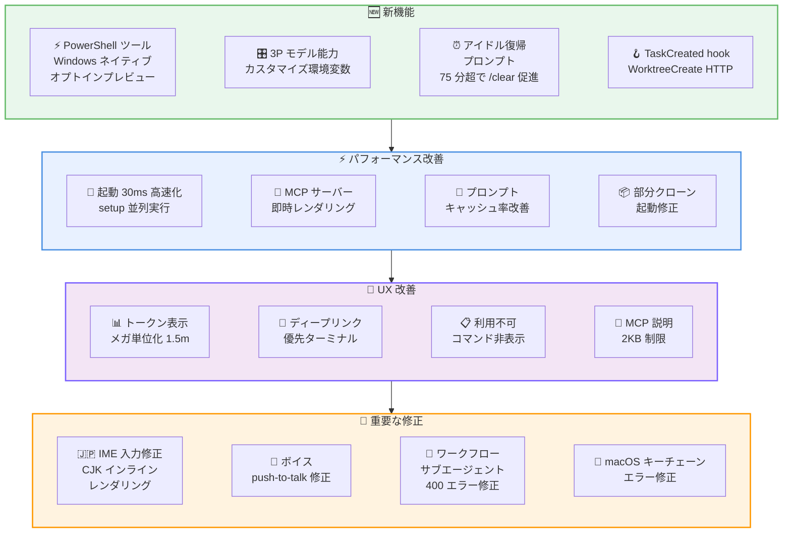
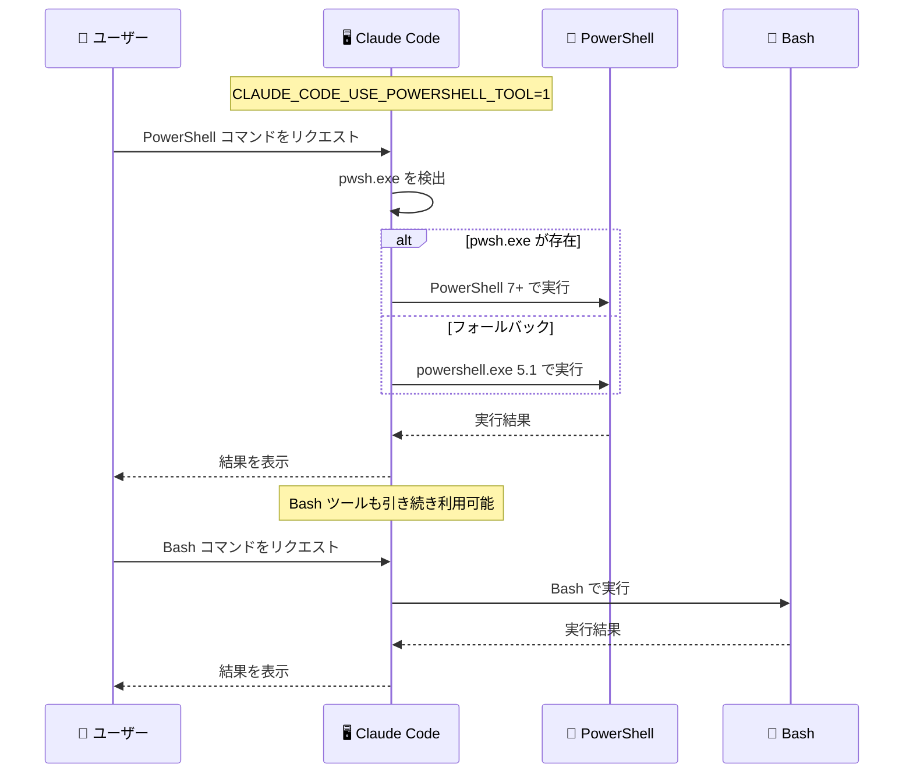
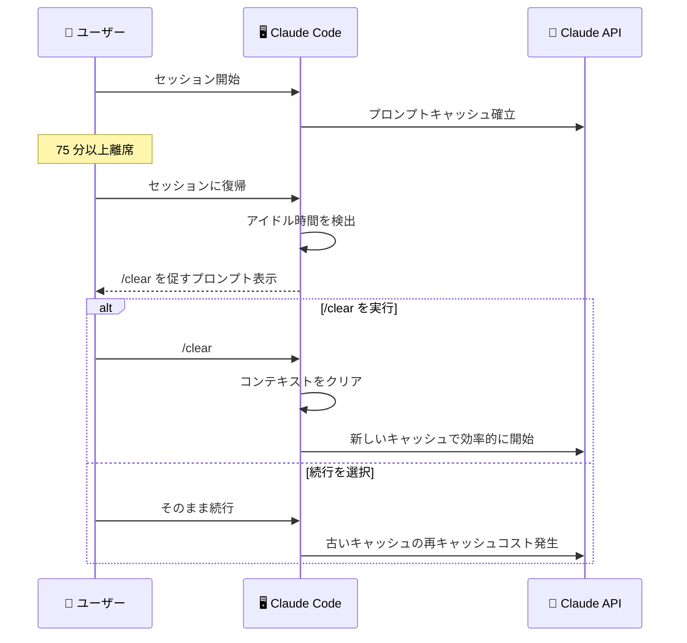

# Claude Code v2.1.84 リリース: Windows PowerShell ツール、アイドル復帰プロンプト、IME 入力修正を含む 40 件超の改善

## メタデータ

| 項目 | 内容 |
|------|------|
| 発表日 | 2026-03-25 |
| ソース | Claude Code Changelog |
| カテゴリ | Tool Update / CLI |
| 公式リンク | https://github.com/anthropics/claude-code/blob/main/CHANGELOG.md |

## 概要

Claude Code v2.1.84 が 2026 年 3 月 25 日にリリースされました。本リリースでは、Windows 向け PowerShell ツールのオプトインプレビュー、3P プロバイダ向けモデル能力カスタマイズ環境変数、ストリーミングアイドル監視のタイムアウト設定、`TaskCreated` hook、`WorktreeCreate` hook の HTTP 対応、チームおよびエンタープライズ管理者向けチャンネルプラグインの許可リスト設定、アイドル復帰プロンプトの 8 つの新機能が追加されました。

改善面では、ディープリンクの優先ターミナル対応、ルールとスキルの `paths:` フロントマターでの YAML グロブリスト対応、MCP ツール説明の 2KB 制限、トークン表示のメガ単位化、起動パフォーマンスの 30ms 改善など 17 件の改善・変更が含まれています。

修正面では、ボイスモードの push-to-talk 修正、IME 入力 (CJK) のインライン表示対応、ワークフローサブエージェントの API 400 エラー修正、MCP ツール/リソースのキャッシュリーク修正、部分クローンリポジトリでの起動パフォーマンス問題など 16 件のバグが修正されています。VSCode 環境ではレート制限の警告バナーも追加されました。

## 詳細

### 背景

Claude Code は Anthropic が提供する CLI ベースの AI 開発支援ツールです。v2.1.84 は v2.1.81 から 4 日後のリリースであり、Windows ネイティブの PowerShell サポート、3P プロバイダ (Bedrock、Vertex、Foundry) 向けのモデル能力カスタマイズ、セッション管理の改善、CJK 入力の修正など、プラットフォーム対応とユーザー体験の向上に重点を置いたリリースです。合計 40 件超の変更が含まれ、特に Windows ユーザーと国際ユーザーにとって大きな改善です。

### 主な変更点

#### 新機能

- **PowerShell ツール (Windows オプトインプレビュー)**: Windows 環境で PowerShell コマンドをネイティブに実行できる新しいツールが追加されました。環境変数 `CLAUDE_CODE_USE_POWERSHELL_TOOL=1` または `settings.json` で有効化できます。`pwsh.exe` (PowerShell 7 以上) を自動検出し、フォールバックとして `powershell.exe` (PowerShell 5.1) を使用します。既存の Bash ツールは引き続き利用可能です
- **3P モデル能力カスタマイズ環境変数**: `ANTHROPIC_DEFAULT_{OPUS,SONNET,HAIKU}_MODEL_SUPPORTS` 環境変数でピン留めしたデフォルトモデルの effort/thinking 能力検出を上書きできるようになりました。`_MODEL_NAME` と `_DESCRIPTION` で `/model` ピッカーのラベルもカスタマイズ可能です
- **`CLAUDE_STREAM_IDLE_TIMEOUT_MS` 環境変数**: ストリーミングアイドル監視のタイムアウト閾値を設定可能になりました (デフォルト 90 秒)
- **`TaskCreated` hook**: `TaskCreate` でタスクが作成された際に発火する新しい hook が追加されました
- **`WorktreeCreate` hook の HTTP 対応**: `type: "http"` をサポートし、レスポンス JSON の `hookSpecificOutput.worktreePath` で作成されたワークツリーのパスを返せるようになりました
- **`allowedChannelPlugins` 管理設定**: チームおよびエンタープライズ管理者がチャンネルプラグインの許可リストを定義できるようになりました
- **`x-client-request-id` ヘッダー**: API リクエストにデバッグ用のリクエスト ID ヘッダーが追加され、タイムアウトの調査が容易になりました
- **アイドル復帰プロンプト**: 75 分以上離席して戻ったユーザーに `/clear` を促すプロンプトが表示されるようになりました。古いセッションでの不要なトークン再キャッシュを削減します

#### 改善・変更

**UX 改善:**

- **ディープリンクの優先ターミナル対応**: `claude-cli://` ディープリンクが、検出リストの先頭のターミナルではなく、ユーザーが設定した優先ターミナルで開くようになりました
- **トークン表示のメガ単位化**: 100 万以上のトークン数が「1512.6k」ではなく「1.5m」と表示されるようになりました
- **スクロールリセットの軽減**: 長いセッションでメッセージウィンドウのコンパクション・グルーピング変更によるスクロール位置のリセットが軽減されました
- **ターミナルフリッカーの軽減**: アニメーションツール進捗がビューポート上部にスクロールした際のターミナルフリッカーが軽減されました
- **issue/PR 参照のリンク化変更**: `owner/repo#123` 形式のみクリッカブルリンクになり、単独の `#123` は自動リンクされなくなりました
- **利用不可スラッシュコマンドの非表示化**: 現在の認証設定で利用できないスラッシュコマンド (`/voice`、`/mobile`、`/chrome`、`/upgrade` など) が非表示になりました
- **スタッツスクリーンショットの高速化**: `/stats` での Ctrl+S スクリーンショットが全ビルドで動作するようになり、16 倍高速化されました

**パフォーマンス改善:**

- **起動の 30ms 高速化**: `setup()` をスラッシュコマンドとエージェントの読み込みと並列実行することで、対話型起動が約 30ms 改善されました
- **MCP サーバー接続時の即時レンダリング**: `claude "prompt"` を MCP サーバーと共に使用する際、全サーバーの接続完了を待たずに REPL が即時レンダリングされるようになりました
- **プロンプトキャッシュ率の改善**: p90 プロンプトキャッシュ率が改善されました
- **グローバルシステムプロンプトキャッシュ**: `ToolSearch` 有効時 (MCP ツール設定ユーザーを含む) でもグローバルシステムプロンプトキャッシュが動作するようになりました

**MCP・設定改善:**

- **ルール/スキルの `paths:` フロントマター**: YAML リスト形式のグロブパターンを受け付けるようになりました
- **MCP ツール説明の 2KB 制限**: MCP ツールの説明とサーバー指示が 2KB に制限され、OpenAPI 生成サーバーによるコンテキスト膨張を防止します
- **MCP サーバーの重複排除**: ローカル設定と claude.ai コネクタの両方で構成された MCP サーバーが重複排除され、ローカル設定が優先されるようになりました
- **バックグラウンド Bash タスクの通知**: 対話型プロンプトで停滞しているバックグラウンド Bash タスクが約 45 秒後に通知を表示するようになりました
- **Remote Control のブロック理由表示**: Remote Control がブロックされた際、汎用メッセージではなく具体的な理由が表示されるようになりました
- **Windows ドライブルート削除の検出改善**: `C:\`、`C:\Windows` などの Windows ドライブルートの危険な削除操作の検出が改善されました

#### バグ修正

**入力・操作関連:**

- **ボイス push-to-talk の修正**: ボイスキーを長押しした際に文字がテキスト入力にリークする問題を修正し、トランスクリプトが正しい位置に挿入されるようになりました
- **上下矢印キーの応答修正**: フッターアイテムにフォーカスがある際に上下矢印キーが反応しない問題を修正しました
- **`Ctrl+U` の修正**: マルチライン入力の行境界で `Ctrl+U` (行頭までの削除) が無操作になる問題を修正し、繰り返し `Ctrl+U` で複数行にわたって削除できるようになりました
- **null アンバインドの修正**: デフォルトのコードバインディング (例: `"ctrl+x ctrl+k": null`) を null でアンバインドした際、コード待機モードに入ってしまう問題を修正し、プレフィックスキーが正しく解放されるようになりました
- **マウスイベントの修正**: マウスイベントがトランスクリプト検索入力にリテラル「mouse」テキストを挿入する問題を修正しました
- **IME 入力の修正**: ネイティブターミナルカーソルがテキスト入力キャレットを追跡するようになり、IME コンポジション (CJK 入力) がインラインでレンダリングされ、スクリーンリーダーが入力位置を追跡できるようになりました

**セッション・API 関連:**

- **ワークフローサブエージェントの修正**: 外部セッションが `--json-schema` を使用し、サブエージェントもスキーマを指定している場合に API 400 エラーが発生する問題を修正しました
- **設定編集パーミッションの修正**: 「Claude にこのセッションの設定編集を許可する」パーミッションオプションが `Edit(.claude)` 許可ルールを持つユーザーで維持されない問題を修正しました
- **macOS キーチェーンエラーの修正**: 一時的なキーチェーン読み取り失敗による macOS での偽の「ログインしていません」エラーを修正しました
- **コールドスタートの競合条件修正**: コアツールがバイパスなしに延期され、`Edit`/`Write` が `InputValidationError` で失敗するコールドスタートの競合条件を修正しました

**パフォーマンス・リソース関連:**

- **大規模ファイルの添付スニペット生成ハング修正**: 大きな編集済みファイルの添付スニペット生成時にハングする問題を修正しました
- **MCP ツール/リソースキャッシュリークの修正**: サーバー再接続時の MCP ツール/リソースのキャッシュリークを修正しました
- **部分クローンリポジトリの起動修正**: 部分クローンリポジトリ (Scalar/GVFS) で大量の blob ダウンロードがトリガーされる起動パフォーマンス問題を修正しました
- **絵文字の背景色修正**: 一部のターミナルでユーザーメッセージバブル内の絵文字の背後に背景色が欠落する問題を修正しました

#### VSCode 固有

- **レート制限警告バナー**: 使用率とリセット時間を含むレート制限警告バナーが追加されました

### 技術的な詳細

本リリースの技術的な注目点は以下の通りです。

- **PowerShell ツールの設計**: PowerShell ツールは Windows ネイティブの CLI 操作を可能にするオプトインプレビュー機能です。`pwsh.exe` (PowerShell 7 以上) を優先的に検出し、見つからない場合は `powershell.exe` (PowerShell 5.1) にフォールバックします。Bash ツールと併存するため、既存のワークフローに影響はありません。プレビュー段階の制限として、オートモード非対応、PowerShell プロファイル非読み込み、サンドボックス非対応、ネイティブ Windows のみ (WSL 非対応)、起動には引き続き Git Bash が必要という点があります。hooks やスキルのフロントマターで `shell: powershell` を指定することで、個別のコマンドやスキルを PowerShell で実行することも可能です。

- **3P モデル能力カスタマイズの仕組み**: Bedrock、Vertex、Foundry などの 3P プロバイダ経由でモデルを使用する場合、Claude Code はモデルの effort/thinking 能力を自動検出しますが、プロバイダ側の制約により正しく検出できないケースがあります。`ANTHROPIC_DEFAULT_{OPUS,SONNET,HAIKU}_MODEL_SUPPORTS` 環境変数を設定することで、この自動検出を上書きできます。`_MODEL_NAME` と `_DESCRIPTION` 環境変数では `/model` ピッカーに表示されるラベルをカスタマイズでき、組織内でのモデル識別が容易になります。

- **アイドル復帰プロンプトの設計思想**: 75 分以上のアイドル後にセッションに戻ると、コンテキストウィンドウ内の古いキャッシュが無効化されている可能性が高く、再キャッシュに余分なトークンコストが発生します。`/clear` を促すプロンプトにより、ユーザーが意識的に新しいセッションを開始することで、不要なトークン消費を削減できます。

- **MCP ツール説明の 2KB 制限**: OpenAPI スキーマから自動生成された MCP サーバーは、非常に長いツール説明を含むことがあり、コンテキストウィンドウを圧迫していました。2KB の制限により、コンテキストの効率的な利用が保証されます。

- **IME コンポジション対応の技術的背景**: ターミナルアプリケーションでの CJK 入力は、ネイティブターミナルカーソルがテキスト入力のキャレット位置を正確に追跡する必要があります。以前のバージョンではカーソル位置が同期されておらず、IME コンポジションウィンドウが誤った位置に表示されたり、スクリーンリーダーが入力位置を認識できない問題がありました。本修正により、日本語、中国語、韓国語の入力がインラインで正しくレンダリングされます。

- **部分クローンリポジトリの起動修正**: Scalar や GVFS を使用した部分クローンリポジトリでは、起動時の git 操作が大量の blob ダウンロードをトリガーし、起動が大幅に遅延していました。git 操作の最適化により、必要最小限の blob のみがフェッチされるようになりました。

## 開発者への影響

### 対象

- Claude Code CLI を日常的に利用している全ての開発者
- Windows 環境で Claude Code を使用しているユーザー (PowerShell ツール)
- Bedrock、Vertex、Foundry 経由でモデルを使用しているユーザー (モデル能力カスタマイズ)
- 長時間セッションを維持しているユーザー (アイドル復帰プロンプト、スクロールリセット軽減)
- CJK 入力 (日本語、中国語、韓国語) を使用しているユーザー (IME 修正)
- MCP サーバーを開発・運用しているユーザー (2KB 制限、キャッシュリーク修正、重複排除)
- ボイスモードを利用しているユーザー (push-to-talk 修正)
- hooks やワークツリーを活用しているユーザー (`TaskCreated` hook、`WorktreeCreate` HTTP 対応)
- チームおよびエンタープライズ管理者 (`allowedChannelPlugins` 設定)
- 部分クローンリポジトリ (Scalar/GVFS) を使用しているユーザー (起動パフォーマンス修正)
- VSCode 拡張機能を利用しているユーザー (レート制限警告バナー)

### 必要なアクション

以下のコマンドで最新バージョンに更新できます。

```bash
# npm でのアップデート
npm update -g @anthropic-ai/claude-code

# 現在のバージョン確認
claude --version
```

特に以下のケースに該当するユーザーは早急なアップデートを推奨します。

- **Windows 環境で PowerShell を使いたい**: `CLAUDE_CODE_USE_POWERSHELL_TOOL=1` を設定して PowerShell ツールを有効化できます
- **日本語や中国語の入力で問題が発生していた**: IME コンポジションがインラインで正しくレンダリングされるようになりました
- **部分クローンリポジトリで起動が遅い**: Scalar/GVFS リポジトリでの大量 blob ダウンロード問題が修正されています
- **MCP サーバーのコンテキスト膨張に悩んでいた**: ツール説明が 2KB に制限され、コンテキスト効率が改善されています
- **長時間セッションでスクロール位置がリセットされる**: メッセージウィンドウの安定性が改善されています
- **macOS で「ログインしていません」エラーが発生する**: キーチェーン読み取り失敗の処理が修正されています
- **ワークフローサブエージェントで API 400 エラーが発生する**: `--json-schema` とサブエージェントスキーマの競合が修正されています

### 移行ガイド

#### PowerShell ツールの有効化

```bash
# 環境変数で有効化
export CLAUDE_CODE_USE_POWERSHELL_TOOL=1
claude
```

または `settings.json` で設定できます。

```json
{
  "env": {
    "CLAUDE_CODE_USE_POWERSHELL_TOOL": "1"
  }
}
```

PowerShell ツールのプレビュー段階の制限事項は以下の通りです。

- オートモード非対応
- PowerShell プロファイル非読み込み
- サンドボックス非対応
- ネイティブ Windows のみ (WSL 非対応)
- 起動には引き続き Git Bash が必要

#### 3P モデル能力カスタマイズ

```bash
# Bedrock の Opus モデルの能力を上書き
export ANTHROPIC_DEFAULT_OPUS_MODEL_SUPPORTS="effort,thinking"
export ANTHROPIC_DEFAULT_OPUS_MODEL_NAME="Custom Opus"
export ANTHROPIC_DEFAULT_OPUS_MODEL_DESCRIPTION="Bedrock 経由のカスタム Opus"

# Sonnet モデルの設定
export ANTHROPIC_DEFAULT_SONNET_MODEL_SUPPORTS="effort"
export ANTHROPIC_DEFAULT_SONNET_MODEL_NAME="Custom Sonnet"
```

#### ストリーミングアイドルタイムアウトの設定

```bash
# タイムアウトを 120 秒に設定 (デフォルトは 90 秒)
export CLAUDE_STREAM_IDLE_TIMEOUT_MS=120000
```

#### ルール/スキルの paths: フロントマター

```yaml
# 旧形式 (引き続きサポート)
paths: "src/**/*.ts"

# 新形式 (YAML リスト)
paths:
  - "src/**/*.ts"
  - "tests/**/*.test.ts"
  - "lib/**/*.js"
```

## コード例

```bash
# v2.1.84 へのアップデート
npm update -g @anthropic-ai/claude-code

# PowerShell ツールを有効にして起動 (Windows)
CLAUDE_CODE_USE_POWERSHELL_TOOL=1 claude

# 3P プロバイダのモデル能力カスタマイズ (Bedrock 例)
export ANTHROPIC_DEFAULT_OPUS_MODEL_SUPPORTS="effort,thinking"
export ANTHROPIC_DEFAULT_OPUS_MODEL_NAME="Bedrock Opus"
export ANTHROPIC_DEFAULT_OPUS_MODEL_DESCRIPTION="Bedrock us-east-1 Opus"
claude

# ストリーミングアイドルタイムアウトの設定
export CLAUDE_STREAM_IDLE_TIMEOUT_MS=120000
claude

# デバッグ用 x-client-request-id の確認
# API リクエストに自動的に付与されるため、タイムアウト調査時に
# サポートチームにリクエスト ID を共有可能

# アイドル復帰時の /clear 実行
# 75 分以上離席後にプロンプトが表示されたら
/clear
```

```json
// settings.json での PowerShell ツール有効化
{
  "env": {
    "CLAUDE_CODE_USE_POWERSHELL_TOOL": "1"
  }
}
```

```json
// allowedChannelPlugins の管理設定例
{
  "allowedChannelPlugins": [
    "plugin-a",
    "plugin-b"
  ]
}
```

```yaml
# スキルフロントマターで YAML リスト形式の paths を使用
---
paths:
  - "src/**/*.ts"
  - "tests/**/*.test.ts"
shell: powershell
---
```

## アーキテクチャ図

### v2.1.84 の主要機能



### PowerShell ツールの動作フロー



### アイドル復帰プロンプトのフロー



## 関連リンク

- [Claude Code Changelog](https://github.com/anthropics/claude-code/blob/main/CHANGELOG.md)
- [Claude Code GitHub リポジトリ](https://github.com/anthropics/claude-code)
- [Claude Code ドキュメント](https://docs.anthropic.com/en/docs/claude-code)
- [PowerShell ツールリファレンス](https://code.claude.com/docs/en/tools-reference#powershell-tool)
- [Claude Code 環境変数リファレンス](https://code.claude.com/docs/en/env-vars)

## まとめ

Claude Code v2.1.84 は、Windows PowerShell サポート、3P モデルカスタマイズ、パフォーマンス改善、国際化対応の 4 つの柱からなる 40 件超の変更を含むリリースです。

最も注目すべき新機能は PowerShell ツールのオプトインプレビューです。Windows ユーザーが PowerShell コマンドをネイティブに実行できるようになり、Git Bash を介さない直接的な Windows 操作が可能になります。`pwsh.exe` (PowerShell 7 以上) を優先的に検出し、`powershell.exe` (5.1) へのフォールバックも備えています。プレビュー段階のため、オートモード非対応やサンドボックス非対応などの制限がありますが、Windows 開発者にとって待望の機能追加です。

3P プロバイダ向けのモデル能力カスタマイズ環境変数 (`ANTHROPIC_DEFAULT_{OPUS,SONNET,HAIKU}_MODEL_SUPPORTS`) は、Bedrock、Vertex、Foundry 経由のモデル利用において、effort/thinking 能力の自動検出が正しく動作しないケースへの対策です。`_MODEL_NAME` と `_DESCRIPTION` による `/model` ピッカーのカスタマイズと合わせ、エンタープライズ環境でのモデル管理が大幅に改善されます。

パフォーマンス面では、起動の 30ms 高速化、MCP サーバー接続時の即時レンダリング、プロンプトキャッシュ率の改善、部分クローンリポジトリの起動修正など、日常的な利用体験を向上させる改善が多数含まれています。特にアイドル復帰プロンプトは、長時間セッションでの不要なトークン消費を削減する実用的な機能です。

国際化の面では、IME コンポジション (CJK 入力) のインラインレンダリング対応が特筆に値します。日本語、中国語、韓国語ユーザーにとって、ターミナルでの入力体験が大幅に改善されます。

修正面では、ボイス push-to-talk、ワークフローサブエージェントの API 400 エラー、macOS キーチェーンエラー、MCP キャッシュリーク、コールドスタート競合条件など 16 件のバグが修正されています。VSCode 環境ではレート制限の警告バナーが追加され、使用量の可視性が向上しました。全ての Claude Code ユーザーにアップデートを推奨します。
