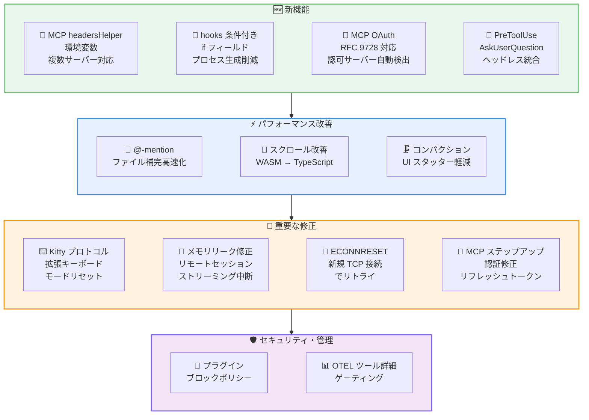
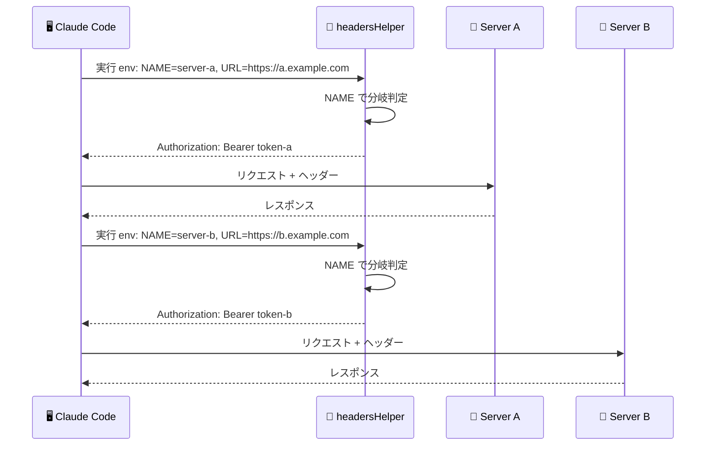
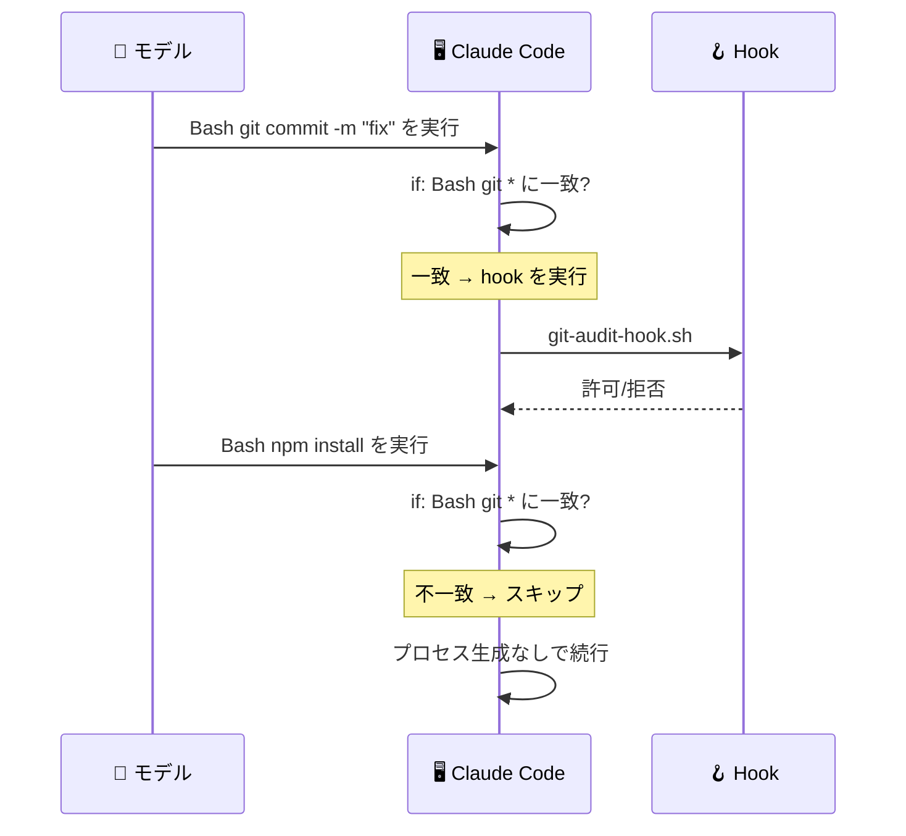

# Claude Code v2.1.85 リリース: MCP OAuth RFC 9728 対応、hooks 条件フィルタ、17 件のバグ修正を含む 30 件超の改善

## メタデータ

| 項目 | 内容 |
|------|------|
| 発表日 | 2026-03-26 |
| ソース | Claude Code Changelog |
| カテゴリ | Tool Update / CLI |
| 公式リンク | https://github.com/anthropics/claude-code/blob/main/CHANGELOG.md |

## 概要

Claude Code v2.1.85 が 2026 年 3 月 26 日にリリースされました。本リリースでは、MCP `headersHelper` スクリプト向けの新しい環境変数 (`CLAUDE_CODE_MCP_SERVER_NAME`、`CLAUDE_CODE_MCP_SERVER_URL`)、hooks の条件付き `if` フィールド、スケジュールタスクのタイムスタンプマーカー、ディープリンクの 5,000 文字対応、MCP OAuth の RFC 9728 Protected Resource Metadata 対応、組織ポリシーによるプラグインブロック、PreToolUse hooks の `AskUserQuestion` サポート、OpenTelemetry ツール詳細のゲーティングなど 9 つの新機能が追加されました。

改善面では、大規模リポジトリでの @-mention ファイル補完パフォーマンス、PowerShell 危険コマンド検出の強化、WASM yoga-layout から純粋な TypeScript 実装への置き換えによるスクロールパフォーマンス改善、大規模セッションでのコンパクション時 UI スタッター軽減の 4 件が含まれています。

修正面では、`/compact` のコンテキスト超過エラー、`/plugin enable` の設定パス不一致、`--worktree` の非 git リポジトリエラー、MCP ステップアップ認証のリフレッシュトークン問題、リモートセッションのメモリリーク、ECONNRESET エラー、SSH/VSCode ターミナルでの生キーシーケンス表示、Ghostty/Kitty/WezTerm での拡張キーボードモード残留など 17 件のバグが修正されています。

## 詳細

### 背景

Claude Code は Anthropic が提供する CLI ベースの AI 開発支援ツールです。v2.1.85 は v2.1.84 から 1 日後のリリースであり、MCP エコシステムの強化 (OAuth RFC 9728 対応、headersHelper 環境変数、ステップアップ認証修正)、hooks の柔軟性向上 (条件フィルタ、PreToolUse の AskUserQuestion 対応)、ターミナル互換性の修正 (Kitty キーボードプロトコル、SSH 環境)、安定性改善 (メモリリーク、ECONNRESET、コンパクション問題) に重点を置いたリリースです。合計 30 件超の変更が含まれ、特に MCP サーバー開発者と hooks を活用するユーザーにとって大きな改善です。

### 主な変更点

#### 新機能

- **MCP headersHelper 環境変数**: `CLAUDE_CODE_MCP_SERVER_NAME` と `CLAUDE_CODE_MCP_SERVER_URL` 環境変数が MCP の `headersHelper` スクリプトに提供されるようになりました。1 つのヘルパースクリプトで複数の MCP サーバーに対応できます
- **hooks 条件付き `if` フィールド**: hooks にパーミッションルール構文 (例: `Bash(git *)`) を使った条件フィルタを追加できるようになりました。条件に一致しない場合はプロセス生成をスキップし、オーバーヘッドを削減します
- **スケジュールタスクのタイムスタンプマーカー**: `/loop` や `CronCreate` でスケジュールされたタスクが発火した際、トランスクリプトにタイムスタンプマーカーが記録されるようになりました
- **画像ペースト時の末尾スペース**: `[Image #N]` プレースホルダーの後に末尾スペースが追加されるようになりました
- **ディープリンクの 5,000 文字対応**: `claude-cli://open?q=...` ディープリンクが最大 5,000 文字をサポートするようになりました。長いプロンプトには「スクロールして確認」の警告が表示されます
- **MCP OAuth RFC 9728 対応**: MCP OAuth が RFC 9728 Protected Resource Metadata ディスカバリーに従い、認可サーバーを自動検出するようになりました
- **組織ポリシーによるプラグインブロック**: `managed-settings.json` で組織ポリシーによりブロックされたプラグインはインストールおよび有効化ができなくなり、マーケットプレイスビューからも非表示になります
- **PreToolUse hooks の AskUserQuestion 対応**: PreToolUse hooks が `AskUserQuestion` に対して `updatedInput` と `permissionDecision: "allow"` を返すことで回答を提供できるようになりました。独自の UI で回答を収集するヘッドレス統合が可能になります
- **OpenTelemetry ツール詳細のゲーティング**: OpenTelemetry の tool_result イベントの `tool_parameters` が `OTEL_LOG_TOOL_DETAILS=1` 環境変数によるゲーティングに変更されました

#### 改善・変更

**パフォーマンス改善:**

- **@-mention ファイル補完の高速化**: 大規模リポジトリでの @-mention ファイルオートコンプリートのパフォーマンスが改善されました
- **PowerShell 危険コマンド検出の強化**: PowerShell における危険なコマンドの検出が改善されました
- **スクロールパフォーマンスの改善**: WASM yoga-layout を純粋な TypeScript 実装に置き換えることで、大規模トランスクリプトでのスクロールパフォーマンスが改善されました
- **コンパクション時の UI スタッター軽減**: 大規模セッションでコンパクションがトリガーされた際の UI スタッターが軽減されました

#### バグ修正

**セッション・コマンド関連:**

- **/compact のコンテキスト超過修正**: 会話が大きくなりすぎてコンパクトリクエスト自体がコンテキストに収まらない場合に `/compact` が「context exceeded」で失敗する問題を修正しました
- **/plugin enable/disable の修正**: プラグインのインストール場所と設定での宣言場所が異なる場合に `/plugin enable` および `/plugin disable` が失敗する問題を修正しました
- **--worktree の非 git リポジトリ対応**: `WorktreeCreate` hook が実行される前に `--worktree` が非 git リポジトリでエラー終了する問題を修正しました
- **プロンプトキューのスタック修正**: 特定のスラッシュコマンド実行後にプロンプトがキューに残り、上矢印キーで取得できない問題を修正しました
- **Remote Control セッションステータス修正**: パーミッション解決後も Remote Control のセッションステータスが「Requires Action」のままになる問題を修正しました

**MCP・認証関連:**

- **deniedMcpServers 設定の修正**: `deniedMcpServers` 設定が claude.ai の MCP サーバーをブロックしない問題を修正しました
- **MCP ステップアップ認証の修正**: リフレッシュトークンが存在する場合に MCP ステップアップ認証が失敗する問題を修正しました。サーバーが `403 insufficient_scope` でスコープ昇格を要求した際、再認可フローが正しくトリガーされるようになりました
- **Python Agent SDK MCP 修正**: `type:'sdk'` の MCP サーバーが `--mcp-config` 経由で渡された場合、起動時にドロップされる問題を修正しました

**ネットワーク・セッション関連:**

- **リモートセッションのメモリリーク修正**: ストリーミングレスポンスが中断された際のリモートセッションのメモリリークを修正しました
- **ECONNRESET エラーの修正**: エッジ接続チャーン時に発生する持続的な ECONNRESET エラーを、リトライ時に新しい TCP 接続を使用することで修正しました

**ターミナル・表示関連:**

- **SSH/VSCode ターミナルでの生キーシーケンス修正**: SSH 接続時や VSCode 統合ターミナルでプロンプトに生のキーシーケンスが表示される問題を修正しました
- **拡張キーボードモードの修正**: Ghostty、Kitty、WezTerm およびその他 Kitty キーボードプロトコル対応ターミナルで、終了後にターミナルが拡張キーボードモードのまま残る問題を修正しました。終了後に Ctrl+C および Ctrl+D が正しく動作するようになりました
- **ストリーミング中のスクロールアップ修正**: ストリーミング中にスクロールアップした際に古いコンテンツが透けて見える問題を修正しました
- **shift+enter/meta+enter の修正**: タイプアヘッドサジェスチョンが shift+enter および meta+enter をインターセプトし、改行挿入の代わりに動作する問題を修正しました
- **diff シンタックスハイライトの修正**: 非ネイティブビルドで diff のシンタックスハイライトが動作しない問題を修正しました
- **マルチモニターの switch_display 修正**: computer-use ツールの `switch_display` がマルチモニター環境で「not available in this session」を返す問題を修正しました
- **OTEL エクスポーター none 設定のクラッシュ修正**: `OTEL_LOGS_EXPORTER`、`OTEL_METRICS_EXPORTER`、`OTEL_TRACES_EXPORTER` が `none` に設定されている場合のクラッシュを修正しました

### 技術的な詳細

本リリースの技術的な注目点は以下の通りです。

- **hooks 条件付き `if` フィールドの設計**: hooks に `if` フィールドを追加することで、特定のツール呼び出しパターンに一致する場合のみ hook を実行できます。パーミッションルール構文 (`Bash(git *)` など) を再利用しており、既存の許可ルールの知識がそのまま活用できます。条件に一致しない場合はプロセス生成自体がスキップされるため、多数の hooks を定義していても実行オーバーヘッドを最小限に抑えられます。

- **MCP OAuth RFC 9728 対応の意義**: RFC 9728 (Protected Resource Metadata) は、OAuth で保護されたリソースが自身のメタデータを公開し、クライアントが認可サーバーを自動検出するための標準仕様です。従来は MCP サーバーごとに認可サーバーの URL を手動設定する必要がありましたが、RFC 9728 対応により、MCP サーバーが `.well-known/oauth-protected-resource` エンドポイントを提供していれば、Claude Code が自動的に認可サーバーを検出します。

- **MCP headersHelper 環境変数の設計思想**: 複数の MCP サーバーに対して異なる認証ヘッダーを提供する場合、従来はサーバーごとに個別の `headersHelper` スクリプトを用意する必要がありました。`CLAUDE_CODE_MCP_SERVER_NAME` と `CLAUDE_CODE_MCP_SERVER_URL` 環境変数により、1 つのスクリプト内でサーバーを識別し、適切なヘッダーを返すことが可能になります。

- **PreToolUse hooks の AskUserQuestion 対応**: ヘッドレス統合 (CI/CD パイプライン、自動化ワークフローなど) では、Claude Code がユーザーに質問を投げた場合に応答する手段がありませんでした。PreToolUse hooks で `AskUserQuestion` ツールをインターセプトし、`updatedInput` で回答を提供できるようになったことで、完全な自動化が可能になります。

- **WASM yoga-layout から TypeScript 実装への移行**: yoga-layout は Facebook が開発した Flexbox レイアウトエンジンで、WASM 版は初期化コストとメモリオーバーヘッドがあります。純粋な TypeScript 実装に置き換えることで、特に大規模トランスクリプト (数千行) でのスクロール操作時のパフォーマンスが大幅に改善されました。

- **Kitty キーボードプロトコルの修正**: Ghostty、Kitty、WezTerm などのモダンターミナルは Kitty キーボードプロトコルをサポートしており、Claude Code 起動時に拡張キーボードモードに切り替わります。以前のバージョンでは終了時にモードが正しくリセットされず、Ctrl+C や Ctrl+D が動作しない状態でターミナルが残る問題がありました。本修正により、終了時に確実にキーボードモードがリセットされます。

- **ECONNRESET 修正のアプローチ**: エッジ接続の切り替え (connection churn) 時に TCP 接続が半開状態になり、持続的な ECONNRESET エラーが発生していました。リトライ時に既存の TCP 接続を再利用せず、新しい TCP 接続を確立することで、この問題を根本的に解決しています。

## 開発者への影響

### 対象

- Claude Code CLI を日常的に利用している全ての開発者
- MCP サーバーを開発・運用しているユーザー (headersHelper 環境変数、OAuth RFC 9728、ステップアップ認証修正)
- hooks を活用しているユーザー (条件付き `if` フィールド、PreToolUse AskUserQuestion 対応)
- SSH 接続や VSCode 統合ターミナルを使用しているユーザー (生キーシーケンス修正)
- Ghostty、Kitty、WezTerm を使用しているユーザー (拡張キーボードモード修正)
- リモートセッションを使用しているユーザー (メモリリーク修正)
- ヘッドレス統合や CI/CD パイプラインを構築しているユーザー (PreToolUse AskUserQuestion 対応)
- 大規模リポジトリで作業しているユーザー (@-mention 補完パフォーマンス改善)
- 大規模セッションを維持しているユーザー (スクロールパフォーマンス改善、コンパクション修正)
- OpenTelemetry を利用しているユーザー (tool_parameters ゲーティング)
- 組織管理者 (プラグインブロックポリシー)
- Python Agent SDK を使用しているユーザー (MCP サーバードロップ修正)

### 必要なアクション

以下のコマンドで最新バージョンに更新できます。

```bash
# npm でのアップデート
npm update -g @anthropic-ai/claude-code

# 現在のバージョン確認
claude --version
```

特に以下のケースに該当するユーザーは早急なアップデートを推奨します。

- **Ghostty、Kitty、WezTerm で終了後に Ctrl+C が効かない**: 拡張キーボードモードのリセットが修正されています
- **SSH 接続でプロンプトに生キーシーケンスが表示される**: ターミナル互換性の問題が修正されています
- **リモートセッションでメモリ使用量が増加し続ける**: ストリーミング中断時のメモリリークが修正されています
- **MCP ステップアップ認証でリフレッシュトークンがある場合に失敗する**: 再認可フローが正しくトリガーされるようになりました
- **ECONNRESET エラーが頻発する**: リトライ時の TCP 接続処理が改善されています
- **/compact が大規模セッションで失敗する**: コンテキスト超過時の処理が修正されています
- **OpenTelemetry で tool_parameters が不要にログされている**: `OTEL_LOG_TOOL_DETAILS=1` でのゲーティングに変更されています

### 移行ガイド

#### hooks 条件付き `if` フィールドの設定

```json
{
  "hooks": {
    "PreToolUse": [
      {
        "if": "Bash(git *)",
        "command": "/path/to/git-audit-hook.sh",
        "timeout": 5000
      }
    ]
  }
}
```

条件に一致しない場合はプロセスが生成されないため、多数の hooks を定義しても性能への影響が最小限です。

#### MCP headersHelper の複数サーバー対応

```bash
#!/bin/bash
# headers-helper.sh - 1 つのスクリプトで複数の MCP サーバーに対応

case "$CLAUDE_CODE_MCP_SERVER_NAME" in
  "production-server")
    echo '{"Authorization": "Bearer prod-token-xxx"}'
    ;;
  "staging-server")
    echo '{"Authorization": "Bearer staging-token-xxx"}'
    ;;
  *)
    echo '{"Authorization": "Bearer default-token-xxx"}'
    ;;
esac

# CLAUDE_CODE_MCP_SERVER_URL も利用可能
# echo "Server URL: $CLAUDE_CODE_MCP_SERVER_URL" >&2
```

#### PreToolUse hooks での AskUserQuestion 自動応答

```json
{
  "hooks": {
    "PreToolUse": [
      {
        "if": "AskUserQuestion",
        "command": "/path/to/auto-answer.sh",
        "timeout": 10000
      }
    ]
  }
}
```

```bash
#!/bin/bash
# auto-answer.sh - ヘッドレス統合用の自動応答

# hook の入力からツール名と質問内容を取得
TOOL_NAME=$(echo "$CLAUDE_HOOK_INPUT" | jq -r '.toolName')
QUESTION=$(echo "$CLAUDE_HOOK_INPUT" | jq -r '.input.question')

# 独自の UI や外部システムから回答を取得
ANSWER="自動応答: はい、続行してください"

# permissionDecision と updatedInput を返す
echo "{\"permissionDecision\": \"allow\", \"updatedInput\": {\"answer\": \"$ANSWER\"}}"
```

#### OpenTelemetry ツール詳細の有効化

```bash
# tool_parameters を OpenTelemetry イベントに含める場合
export OTEL_LOG_TOOL_DETAILS=1
claude
```

デフォルトでは `tool_parameters` は出力されなくなりました。セキュリティやプライバシーの観点から、必要な場合のみ有効化してください。

#### 組織ポリシーによるプラグインブロック

```json
// managed-settings.json
{
  "blockedPlugins": [
    "plugin-name-to-block"
  ]
}
```

ブロックされたプラグインは自動的にマーケットプレイスビューから非表示になり、`/plugin install` や `/plugin enable` も拒否されます。

## コード例

```bash
# v2.1.85 へのアップデート
npm update -g @anthropic-ai/claude-code

# hooks に条件付きフィルタを使用した設定例
# settings.json の hooks セクションに if フィールドを追加
# "if": "Bash(git *)" で git コマンドのみにフィルタリング

# MCP headersHelper 環境変数の確認
# headersHelper スクリプト内で以下の環境変数が利用可能
# CLAUDE_CODE_MCP_SERVER_NAME - サーバー名
# CLAUDE_CODE_MCP_SERVER_URL  - サーバー URL

# ディープリンクで長いプロンプトを送信 (最大 5,000 文字)
# claude-cli://open?q=長いプロンプトテキスト...

# OpenTelemetry でツール詳細を有効化
export OTEL_LOG_TOOL_DETAILS=1
claude

# OTEL エクスポーターを none に設定 (v2.1.85 で修正済み)
export OTEL_LOGS_EXPORTER=none
export OTEL_METRICS_EXPORTER=none
export OTEL_TRACES_EXPORTER=none
claude
```

```json
// hooks 条件付き if フィールドの設定例
{
  "hooks": {
    "PreToolUse": [
      {
        "if": "Bash(git *)",
        "command": "/path/to/git-audit-hook.sh",
        "timeout": 5000
      },
      {
        "if": "AskUserQuestion",
        "command": "/path/to/auto-answer.sh",
        "timeout": 10000
      }
    ]
  }
}
```

```bash
#!/bin/bash
# MCP headersHelper - 複数サーバー対応スクリプト
case "$CLAUDE_CODE_MCP_SERVER_NAME" in
  "server-a") echo '{"Authorization": "Bearer token-a"}' ;;
  "server-b") echo '{"Authorization": "Bearer token-b"}' ;;
  *)          echo '{"Authorization": "Bearer default"}'  ;;
esac
```

## アーキテクチャ図

### v2.1.85 の主要機能



### MCP headersHelper の動作フロー



### hooks 条件付き if フィールドの動作フロー



## 関連リンク

- [Claude Code Changelog](https://github.com/anthropics/claude-code/blob/main/CHANGELOG.md)
- [Claude Code GitHub リポジトリ](https://github.com/anthropics/claude-code)
- [Claude Code ドキュメント](https://docs.anthropic.com/en/docs/claude-code)
- [RFC 9728 - OAuth 2.0 Protected Resource Metadata](https://www.rfc-editor.org/rfc/rfc9728)
- [Claude Code 環境変数リファレンス](https://code.claude.com/docs/en/env-vars)
- [Claude Code hooks リファレンス](https://code.claude.com/docs/en/hooks)

## まとめ

Claude Code v2.1.85 は、MCP エコシステムの強化、hooks の柔軟性向上、ターミナル互換性修正、安定性改善の 4 つの柱からなる 30 件超の変更を含むリリースです。

最も注目すべき新機能は hooks の条件付き `if` フィールドです。パーミッションルール構文 (`Bash(git *)` など) を使って hook の実行条件を指定できるため、特定のツール呼び出しパターンにのみ反応する hook を定義でき、不要なプロセス生成を回避できます。多数の hooks を定義している環境では、パフォーマンスへの影響を大幅に軽減できます。

MCP エコシステムに関しては、3 つの重要な改善があります。`headersHelper` 環境変数により 1 つのスクリプトで複数サーバーの認証に対応できるようになりました。RFC 9728 Protected Resource Metadata 対応により、認可サーバーの自動検出が標準化されました。ステップアップ認証のリフレッシュトークン問題の修正により、スコープ昇格フローが正しく動作するようになりました。

PreToolUse hooks の `AskUserQuestion` 対応は、ヘッドレス統合にとって重要な機能追加です。CI/CD パイプラインや自動化ワークフローで Claude Code がユーザーに質問を投げた際、hook が独自の UI や外部システムから回答を取得して返すことが可能になりました。

パフォーマンス面では、WASM yoga-layout から純粋な TypeScript 実装への移行によるスクロール改善が特筆に値します。大規模トランスクリプトでのスクロール操作が高速化され、コンパクション時の UI スタッターも軽減されています。

修正面では、Ghostty、Kitty、WezTerm などのモダンターミナルで終了後にキーボードモードが正しくリセットされない問題の修正が重要です。これにより Ctrl+C および Ctrl+D が終了後に正常に動作するようになりました。また、リモートセッションのメモリリーク、持続的な ECONNRESET エラー、`/compact` のコンテキスト超過エラーなど、安定性に関する 17 件のバグが修正されています。全ての Claude Code ユーザーにアップデートを推奨します。
