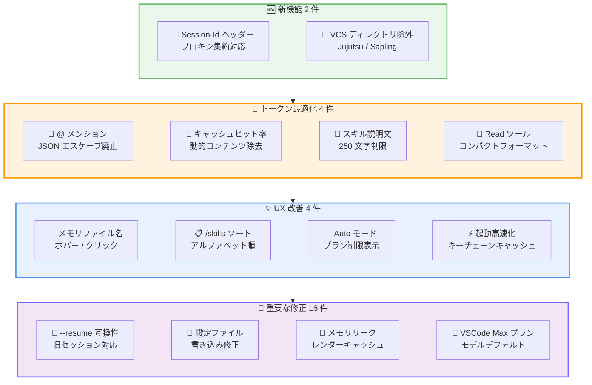
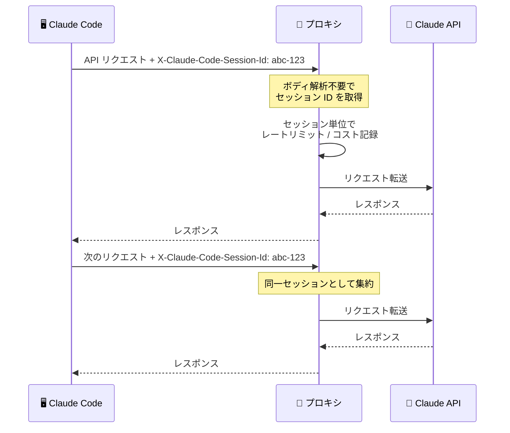
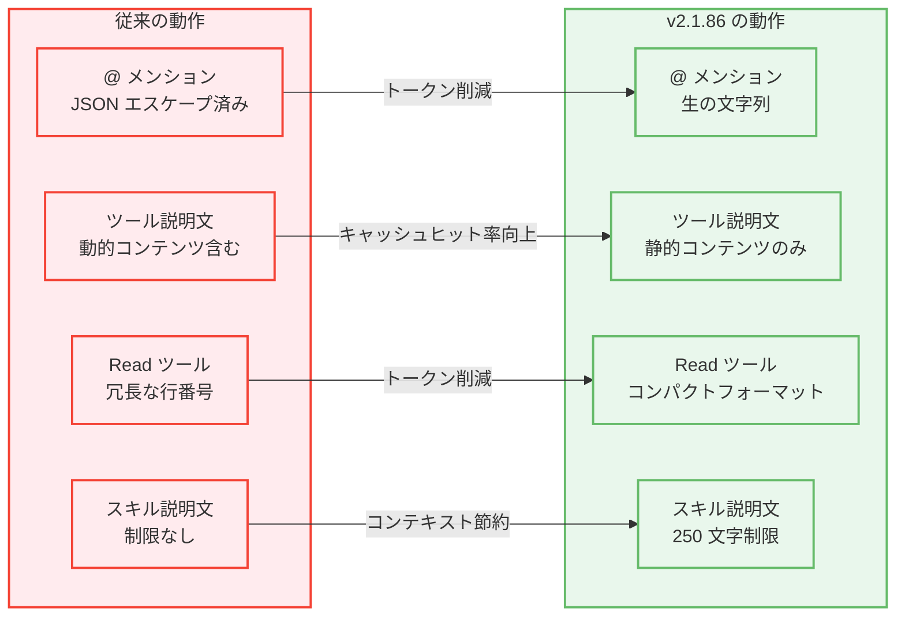

# Claude Code v2.1.86 リリース: セッション ID ヘッダー、VCS ディレクトリ除外、16 件のバグ修正を含む 26 件の改善

## メタデータ

| 項目 | 内容 |
|------|------|
| 発表日 | 2026-03-28 |
| ソース | Claude Code Changelog |
| カテゴリ | Tool Update / CLI |
| 公式リンク | https://github.com/anthropics/claude-code/blob/main/CHANGELOG.md |

## 概要

Claude Code v2.1.86 が 2026 年 3 月 28 日にリリースされました。本リリースでは、API リクエストへの `X-Claude-Code-Session-Id` ヘッダー追加と、Jujutsu / Sapling メタデータディレクトリの除外リスト追加の 2 つの新機能が含まれています。

改善面では、macOS キーチェーンキャッシュの延長によるイベントループストール削減、`@` メンション時の JSON エスケープ廃止によるトークンオーバーヘッド削減、Bedrock / Vertex / Foundry ユーザー向けプロンプトキャッシュヒット率改善、メモリファイル名のホバーハイライトとクリックで開く機能、スキル説明文の 250 文字制限、`/skills` メニューのアルファベット順ソート、Auto モードのプラン制限メッセージ改善、Read ツールのコンパクト行番号フォーマットと重複再読み込み排除の 8 件が含まれています。

修正面では、v2.1.85 以前のセッションでの `--resume` 失敗、プロジェクトルート外ファイル操作の失敗、Windows での設定ファイル破損、`/feedback` でのメモリ不足クラッシュ、`--bare` モードでの MCP ツールドロップ、OAuth ログイン URL のコピー不完全、マスク入力のトークンリーク、マーケットプレイスプラグインスクリプトの Permission denied、複数インスタンス間のモデル表示不整合、スクロール追従の不具合、`/plugin` アンインストールダイアログの動作修正、Enter 押下後のトランスクリプト空白、`ultrathink` ヒント残留、メモリリーク、VSCode 拡張の 2 件を含む 16 件のバグが修正されています。

## 詳細

### 背景

Claude Code は Anthropic が提供する CLI ベースの AI 開発支援ツールです。v2.1.86 は v2.1.85 から 2 日後のリリースであり、トークン使用量の最適化 (`@` メンション時の JSON エスケープ廃止、Read ツールのコンパクト行番号フォーマット、スキル説明文の文字数制限)、安定性の向上 (設定ファイル破損、メモリリーク、`--resume` 失敗の修正)、プロキシ運用の利便性向上 (セッション ID ヘッダー) に重点を置いたリリースです。合計 26 件の変更が含まれ、特にトークン効率の改善と多数の UI / CLI バグ修正が特徴的です。

### 主な変更点

#### 新機能

- **API リクエストへの `X-Claude-Code-Session-Id` ヘッダー追加**: API リクエストに `X-Claude-Code-Session-Id` ヘッダーが含まれるようになりました。プロキシサーバーがリクエストボディを解析せずにセッション単位でリクエストを集約できるようになります
- **Jujutsu / Sapling メタデータディレクトリの除外**: `.jj` と `.sl` が VCS ディレクトリ除外リストに追加されました。Grep やファイルオートコンプリートが Jujutsu や Sapling のメタデータディレクトリに降下しなくなります

#### 改善・変更

**トークン使用量の最適化:**

- **`@` メンション時のトークンオーバーヘッド削減**: ファイルを `@` で参照した際に、ファイル内容が JSON エスケープされなくなり、生の文字列として渡されるようになりました。JSON エスケープによる余分なトークン消費が解消されます
- **プロンプトキャッシュヒット率の改善**: Bedrock、Vertex、Foundry ユーザー向けに、ツール説明文から動的コンテンツを除去することでプロンプトキャッシュのヒット率が改善されました。ツール説明文が毎回変化しなくなるため、キャッシュが有効に機能します
- **スキル説明文の 250 文字制限**: `/skills` リスト内のスキル説明文が 250 文字に制限されるようになりました。コンテキストウィンドウの使用量を削減します
- **Read ツールのコンパクト行番号フォーマット**: Read ツールが行番号のコンパクトフォーマットを採用し、未変更ファイルの重複再読み込みを排除するようになりました。トークン使用量が削減されます

**パフォーマンス改善:**

- **起動時のイベントループストール削減**: 多数の claude.ai MCP コネクターが設定されている場合の起動時イベントループストールが軽減されました。macOS キーチェーンキャッシュの有効期間が 5 秒から 30 秒に延長されています

**UI / UX 改善:**

- **メモリファイル名のインタラクティブ表示**: 「Saved N memories」通知内のメモリファイル名がホバー時にハイライトされ、クリックで開けるようになりました
- **`/skills` メニューのアルファベット順ソート**: `/skills` メニューがアルファベット順にソートされるようになり、スキルの検索が容易になりました
- **Auto モードのプラン制限メッセージ改善**: Auto モードがプラン制限により無効化されている場合、「temporarily unavailable」ではなく「unavailable for your plan」と表示されるようになりました

#### バグ修正

**セッション・コマンド関連:**

- **`--resume` の互換性修正**: v2.1.85 より前に作成されたセッションで `--resume` を使用した際に「tool_use ids were found without tool_result blocks」エラーで失敗する問題を修正しました。旧バージョンで作成されたセッションを中断なく再開できるようになります
- **プロジェクトルート外ファイル操作の修正**: 条件付きスキルやルールが設定されている場合に、`~/.claude/CLAUDE.md` などプロジェクトルート外のファイルに対して Write / Edit / Read が失敗する問題を修正しました
- **`--bare` モードの MCP ツールドロップ修正**: `--bare` モードでインタラクティブセッション時に MCP ツールがドロップされ、ターン途中のメッセージが黙って破棄される問題を修正しました

**設定・パフォーマンス関連:**

- **設定ファイルの不要なディスク書き込み修正**: スキル呼び出しのたびに不要な設定ファイルのディスク書き込みが発生する問題を修正しました。パフォーマンスの低下と Windows での設定ファイル破損を引き起こす可能性がありました
- **`/feedback` のメモリ不足クラッシュ修正**: 非常に長いセッションで大きなトランスクリプトファイルがある場合に `/feedback` を使用するとメモリ不足でクラッシュする問題を修正しました
- **長時間セッションでのメモリリーク修正**: Markdown / ハイライトレンダーキャッシュがコンテンツ文字列全体を保持し続けることによるメモリ増加を修正しました

**認証・入力関連:**

- **OAuth ログイン URL コピーの修正**: `c` ショートカットで OAuth ログイン URL をコピーした際に、完全な URL ではなく約 20 文字のみがコピーされる問題を修正しました
- **マスク入力のトークンリーク修正**: OAuth コードペーストなどのマスク入力で、狭いターミナルで複数行に折り返された場合にトークンの先頭部分が漏洩する問題を修正しました

**プラグイン・マーケットプレイス関連:**

- **マーケットプレイスプラグインスクリプトの Permission denied 修正**: v2.1.83 以降、macOS / Linux で公式マーケットプレイスプラグインスクリプトが「Permission denied」で失敗する問題を修正しました
- **`/plugin` アンインストールダイアログの修正**: `/plugin` アンインストールダイアログで `n` を押した際に、プラグインのデータディレクトリを保持しつつ正しくアンインストールされるようになりました

**UI・表示関連:**

- **複数インスタンス間のモデル表示修正**: 複数の Claude Code インスタンスを実行し、一方で `/model` を使用した場合に、別のセッションのステータスラインに異なるモデルが表示される問題を修正しました
- **スクロール追従の修正**: 長い会話の最下部でホイールスクロールやクリック選択を行った後、新しいメッセージにスクロールが追従しなくなる問題を修正しました
- **Enter 押下後のトランスクリプト空白修正**: クリック後に Enter を押すとレスポンスが到着するまでトランスクリプトが空白になるリグレッションを修正しました
- **`ultrathink` ヒント残留の修正**: キーワードを削除した後も `ultrathink` ヒントが残り続ける問題を修正しました

**VSCode 拡張関連:**

- **VSCode 拡張の「Not responding」表示修正**: 長時間実行中のオペレーション中に拡張が誤って「Not responding」を表示する問題を修正しました
- **VSCode 拡張の Max プランモデルデフォルト修正**: OAuth トークンがリフレッシュされた後 (ログインから 8 時間後)、Max プランユーザーがデフォルトで Sonnet に戻される問題を修正しました

### 技術的な詳細

本リリースの技術的な注目点は以下の通りです。

- **`X-Claude-Code-Session-Id` ヘッダーの設計意図**: プロキシサーバーや API ゲートウェイでリクエストを集約・分析する際、従来はリクエストボディを解析してセッション情報を抽出する必要がありました。HTTP ヘッダーとしてセッション ID を提供することで、ボディの解析が不要になります。レートリミット、コスト配分、使用量モニタリングをセッション単位で実装する際に有用です。TLS 終端前でもヘッダーは参照可能であり、パフォーマンスへの影響を最小限に抑えつつセッション追跡が可能になります。

- **Jujutsu / Sapling VCS の除外**: Jujutsu (.jj) は Git 互換の新しいバージョン管理システムで、Meta が開発した Sapling (.sl) も同様です。これらの VCS はメタデータディレクトリに大量のファイルを格納するため、Grep やファイルオートコンプリートがこれらのディレクトリに降下するとパフォーマンスが低下していました。`.git` と同様に除外リストに追加することで、検索とオートコンプリートの効率が向上します。

- **`@` メンション時の JSON エスケープ廃止の影響**: 従来、`@` でファイルを参照した際にファイル内容が JSON エスケープされていました。JSON エスケープでは改行が `\n`、タブが `\t`、ダブルクォートが `\"` に変換され、特に JSON ファイルや複数行テキストを含むファイルでトークン数が増加していました。生の文字列として渡すことで、エスケープ文字によるトークンオーバーヘッドが排除されます。

- **プロンプトキャッシュヒット率改善の仕組み**: Bedrock、Vertex、Foundry ではプロンプトキャッシュが利用可能ですが、ツール説明文に動的コンテンツ (タイムスタンプ、セッション固有の情報など) が含まれていると、リクエストごとにプロンプトのプレフィックスが変化し、キャッシュがヒットしません。動的コンテンツを除去することで、ツール説明文が安定しプレフィックスマッチングが成功するようになります。これにより API コストの削減とレスポンス速度の向上が期待できます。

- **Read ツールのコンパクト行番号フォーマット**: Read ツールが行番号を付与する際のフォーマットがコンパクトになり、余分なスペースやパディングが削減されました。さらに、未変更のファイルを再度読み込む際に重複するコンテンツを排除する最適化も追加されています。大量のファイルを参照するセッションでは、これらの最適化によりコンテキストウィンドウの使用量が大幅に削減されます。

- **macOS キーチェーンキャッシュ延長の背景**: 多数の claude.ai MCP コネクターが設定されている場合、各コネクターの起動時に macOS キーチェーンへのアクセスが発生します。キーチェーンアクセスは同期的な I/O 操作であり、イベントループをブロックします。キャッシュ有効期間を 5 秒から 30 秒に延長することで、起動時のキーチェーンアクセス回数が大幅に削減され、イベントループのストールが軽減されます。

- **設定ファイルの不要なディスク書き込み問題**: スキルが呼び出されるたびに設定ファイルへのディスク書き込みが発生していた問題は、特に Windows 環境で深刻でした。Windows ではファイルの書き込みロックの動作が異なるため、同時書き込みにより設定ファイルが破損する可能性がありました。また、頻繁なディスク I/O はパフォーマンス全体に影響を与えます。不要な書き込みを排除することで、これらの問題が解消されます。

- **Markdown / ハイライトレンダーキャッシュのメモリリーク**: 長時間セッションで会話が長くなると、Markdown のレンダリング結果やシンタックスハイライトのキャッシュがコンテンツ文字列への参照を保持し続け、ガベージコレクションによる回収が行われませんでした。これにより、セッションの進行に伴いメモリ使用量が単調増加する問題がありました。キャッシュの管理方法を改善し、不要な参照を適切に解放するようになりました。

## 開発者への影響

### 対象

- Claude Code CLI を日常的に利用している全ての開発者
- API プロキシサーバーやゲートウェイを運用しているインフラチーム (セッション ID ヘッダー)
- Jujutsu や Sapling を使用しているバージョン管理システムユーザー (VCS ディレクトリ除外)
- Bedrock、Vertex、Foundry 経由で Claude Code を利用しているユーザー (プロンプトキャッシュヒット率改善)
- 多数の MCP コネクターを設定している macOS ユーザー (起動時ストール削減)
- v2.1.85 より前のバージョンで作成したセッションを再開するユーザー (`--resume` 修正)
- プロジェクトルート外のファイル (`~/.claude/CLAUDE.md` など) を操作するユーザー (Write / Edit / Read 修正)
- Windows 環境で Claude Code を使用しているユーザー (設定ファイル破損修正)
- `--bare` モードでヘッドレス統合を行っているユーザー (MCP ツールドロップ修正)
- VSCode 拡張で Claude Code を使用している Max プランユーザー (モデルデフォルト修正)
- 長時間セッションを維持しているユーザー (メモリリーク修正、`/feedback` クラッシュ修正)
- マーケットプレイスプラグインを macOS / Linux で使用しているユーザー (Permission denied 修正)

### 必要なアクション

以下のコマンドで最新バージョンに更新できます。

```bash
# npm でのアップデート
npm update -g @anthropic-ai/claude-code

# 現在のバージョン確認
claude --version
```

特に以下のケースに該当するユーザーは早急なアップデートを推奨します。

- **v2.1.85 以前のセッションを `--resume` で再開できない**: tool_use / tool_result ブロックの不整合が修正されています
- **Windows で設定ファイルが破損する**: スキル呼び出し時の不要なディスク書き込みが排除されています
- **macOS / Linux でマーケットプレイスプラグインが Permission denied で失敗する**: v2.1.83 以降のリグレッションが修正されています
- **VSCode 拡張で Max プランなのに Sonnet に戻される**: OAuth トークンリフレッシュ後のモデルデフォルト問題が修正されています
- **長時間セッションでメモリ使用量が増加し続ける**: レンダーキャッシュのメモリリークが修正されています
- **OAuth ログイン URL が正しくコピーされない**: `c` ショートカットで完全な URL がコピーされるようになりました
- **`--bare` モードで MCP ツールが利用できない**: インタラクティブセッションでのツールドロップが修正されています

### 移行ガイド

#### `X-Claude-Code-Session-Id` ヘッダーの活用

プロキシサーバーやAPIゲートウェイで Claude Code のリクエストをセッション単位で集約する設定例を以下に示します。

```nginx
# nginx でのセッション単位のレートリミット例
map $http_x_claude_code_session_id $session_limit_key {
    default $http_x_claude_code_session_id;
    ""      $binary_remote_addr;
}

limit_req_zone $session_limit_key zone=claude_session:10m rate=10r/s;
```

```python
# Python プロキシでのセッション単位のコスト集約例
from fastapi import Request

@app.middleware("http")
async def track_session_cost(request: Request, call_next):
    session_id = request.headers.get("X-Claude-Code-Session-Id", "unknown")
    response = await call_next(request)
    # セッション単位でコストを記録
    await record_cost(session_id, response)
    return response
```

#### Jujutsu / Sapling ユーザーの対応

v2.1.86 にアップデートするだけで、`.jj` と `.sl` ディレクトリが自動的に検索対象から除外されます。追加の設定は不要です。

```bash
# アップデート後の確認 - .jj / .sl 配下のファイルが Grep 結果に含まれないことを確認
claude
# セッション内で Grep を実行しても .jj / .sl 配下は検索されない
```

#### プロンプトキャッシュヒット率の確認

Bedrock、Vertex、Foundry ユーザーは、アップデート後にプロンプトキャッシュのヒット率が向上しているか確認できます。

```bash
# Bedrock の場合 - CloudWatch メトリクスでキャッシュヒット率を確認
# Vertex の場合 - Cloud Monitoring でキャッシュ使用状況を確認
# 特別な設定変更は不要 - アップデートするだけでツール説明文が安定化します
```

## コード例

```bash
# v2.1.86 へのアップデート
npm update -g @anthropic-ai/claude-code

# バージョン確認
claude --version

# セッション ID ヘッダーの確認
# プロキシログで X-Claude-Code-Session-Id ヘッダーが含まれていることを確認

# v2.1.85 以前のセッションを安全に再開
claude --resume

# プロジェクトルート外のファイルも操作可能に
# ~/.claude/CLAUDE.md の編集が条件付きスキル設定時でも動作
```

```json
// プロキシでのセッション単位ログ設定例
{
  "logging": {
    "format": "json",
    "fields": {
      "session_id": "${request.headers.X-Claude-Code-Session-Id}",
      "timestamp": "${timestamp}",
      "tokens_used": "${response.usage.total_tokens}"
    }
  }
}
```

## アーキテクチャ図

### v2.1.86 の主要変更カテゴリ



### セッション ID ヘッダーの動作フロー



### トークン最適化の影響範囲



## 関連リンク

- [Claude Code Changelog](https://github.com/anthropics/claude-code/blob/main/CHANGELOG.md)
- [Claude Code GitHub リポジトリ](https://github.com/anthropics/claude-code)
- [Claude Code ドキュメント](https://docs.anthropic.com/en/docs/claude-code)
- [Jujutsu VCS](https://github.com/martinvonz/jj)
- [Sapling SCM](https://sapling-scm.com/)
- [Claude Code 環境変数リファレンス](https://code.claude.com/docs/en/env-vars)

## まとめ

Claude Code v2.1.86 は、トークン使用量の最適化、安定性の向上、プロキシ運用支援の 3 つの柱からなる 26 件の変更を含むリリースです。

最も注目すべき新機能は `X-Claude-Code-Session-Id` ヘッダーの追加です。API プロキシサーバーがリクエストボディを解析せずにセッション単位でリクエストを集約できるようになり、レートリミット、コスト配分、使用量モニタリングの実装が大幅に容易になります。企業環境で Claude Code を運用しているインフラチームにとって特に有用な機能です。

トークン使用量の最適化に関しては、4 つの改善が含まれています。`@` メンション時の JSON エスケープ廃止により余分なトークンが削減されます。Bedrock / Vertex / Foundry ユーザー向けにツール説明文から動的コンテンツを除去することでプロンプトキャッシュのヒット率が向上し、API コスト削減とレスポンス速度向上が期待できます。スキル説明文の 250 文字制限と Read ツールのコンパクト行番号フォーマットも、コンテキストウィンドウの効率的な使用に貢献します。

修正面では 16 件のバグが修正されており、特に以下の 3 件が重要です。v2.1.85 以前のセッションで `--resume` が失敗する問題の修正により、旧バージョンからの移行がスムーズになります。Windows での設定ファイル破損問題の修正は、Windows ユーザーにとって重要な安定性改善です。VSCode 拡張で Max プランユーザーが OAuth トークンリフレッシュ後に Sonnet にデフォルト変更される問題の修正も、日常的な使用体験を大きく改善します。

また、長時間セッションでの Markdown / ハイライトレンダーキャッシュによるメモリリークの修正は、セッションを長時間維持するユーザーにとって重要です。`/feedback` でのメモリ不足クラッシュの修正と合わせて、長時間セッションの安定性が向上しています。全ての Claude Code ユーザーにアップデートを推奨します。
