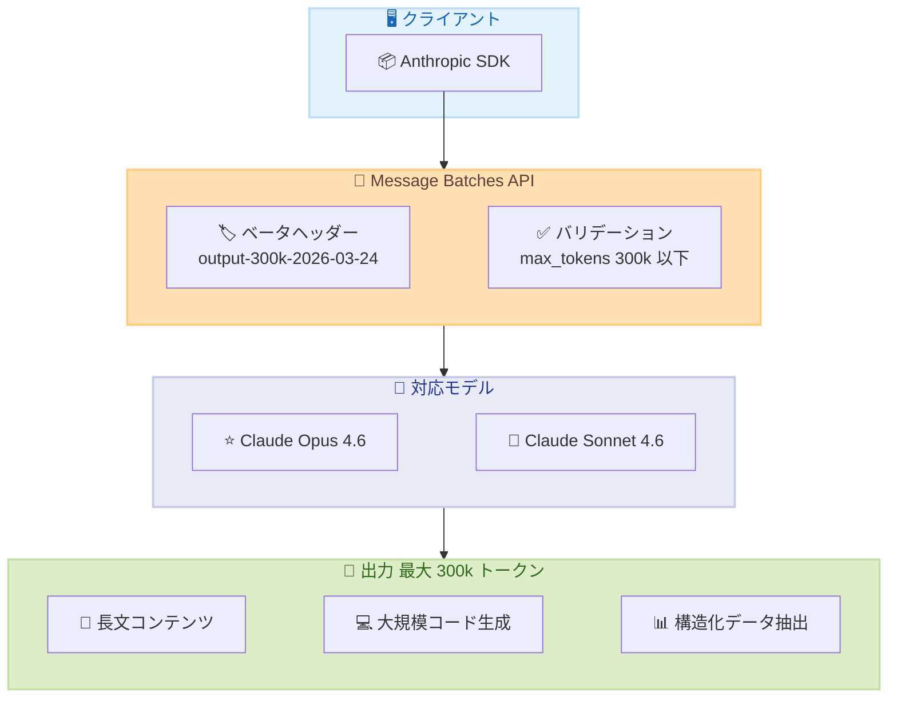
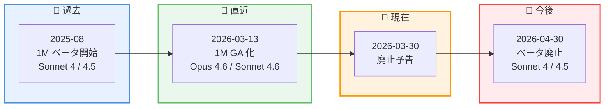

# Batch API の max_tokens 上限 300k 引き上げと 1M コンテキストベータの廃止予告

## メタデータ

| 項目 | 内容 |
|------|------|
| 発表日 | 2026-03-30 |
| ソース | Claude Developer Platform Release Notes |
| カテゴリ | API アップデート |
| 公式リンク | https://platform.claude.com/docs/en/release-notes/overview |

## 概要

Anthropic は 2026 年 3 月 30 日、2 つの重要な API アップデートを発表しました。1 つ目は、Message Batches API における `max_tokens` の上限を 300k トークンに引き上げる Extended Output ベータの提供開始です。Claude Opus 4.6 および Sonnet 4.6 で利用可能で、`output-300k-2026-03-24` ベータヘッダーを指定することで、長文コンテンツや大規模コード生成などのユースケースに対応できます。2 つ目は、Claude Sonnet 4.5 および Sonnet 4 向けの 1M トークンコンテキストウィンドウベータの廃止予告です。2026 年 4 月 30 日以降、これらのモデルで `context-1m-2025-08-07` ベータヘッダーを使用したリクエストは 400 エラーを返すようになります。

## 詳細

### 背景

Message Batches API は、大量のリクエストを非同期で効率的に処理するための API で、標準価格の 50% で利用できるコスト効率の高いソリューションです。従来、`max_tokens` の上限はモデルに応じて 64k から 128k トークンに制限されていましたが、長文生成のニーズに応えるため、Extended Output ベータとして 300k トークンまでの出力が可能になりました。

一方、1M トークンコンテキストウィンドウは 2025 年 8 月にベータとして導入され、2026 年 3 月 13 日に Claude Opus 4.6 と Sonnet 4.6 で GA (正式リリース) となりました。GA 化されたモデルではベータヘッダーが不要になりましたが、Claude Sonnet 4.5 と Sonnet 4 では引き続きベータヘッダーが必要でした。今回、この旧モデル向けベータの廃止が正式に予告されました。

### 主な変更点

1. **Batch API の max_tokens 上限を 300k に引き上げ**: Claude Opus 4.6 と Sonnet 4.6 で、Message Batches API のシングルターン出力の上限が 300k トークンに拡大されました。`output-300k-2026-03-24` ベータヘッダーの指定が必要です
2. **1M コンテキストウィンドウベータの廃止予告**: Claude Sonnet 4.5 と Sonnet 4 の 1M トークンコンテキストウィンドウベータが 2026 年 4 月 30 日に廃止されます。以降は `context-1m-2025-08-07` ベータヘッダーを含むリクエストが 400 エラーを返します

### 技術的な詳細

#### Extended Output ベータ

| 項目 | 内容 |
|------|------|
| ベータヘッダー | `output-300k-2026-03-24` |
| max_tokens 上限 | 300,000 トークン |
| 対応モデル | Claude Opus 4.6、Claude Sonnet 4.6 |
| 対応 API | Message Batches API のみ (同期 Messages API は非対応) |
| プラットフォーム | Claude API のみ (Amazon Bedrock、Vertex AI、Microsoft Foundry は非対応) |
| 価格 | 標準バッチ価格 (標準 API 価格の 50%) |
| 処理時間 | 1 回の 300k トークン生成に 1 時間以上かかる場合あり |

**主なユースケース。**

- 書籍レベルの長文ドラフトや技術ドキュメントの生成
- 大規模な構造化データの抽出
- 大規模なコード生成スキャフォールド
- 長い推論チェーンの実行

#### 1M コンテキストベータ廃止スケジュール

| 項目 | 内容 |
|------|------|
| 廃止対象モデル | Claude Sonnet 4.5、Claude Sonnet 4 |
| 廃止対象ヘッダー | `context-1m-2025-08-07` |
| 廃止日 | 2026 年 4 月 30 日 |
| 廃止後の動作 | 400 エラーを返す |
| 移行先 | Claude Sonnet 4.6 または Claude Opus 4.6 |

## 開発者への影響

### 対象

- Message Batches API で長文出力を必要とする開発者
- Claude Sonnet 4.5 または Sonnet 4 で 1M トークンコンテキストウィンドウを利用している開発者
- 大規模なコード生成や構造化データ抽出のバッチ処理を行っている開発者

### 必要なアクション

**Extended Output ベータを利用する場合。**

- `output-300k-2026-03-24` ベータヘッダーを Batch API リクエストに追加
- 300k トークンの生成には時間がかかるため、24 時間のバッチ処理ウィンドウを考慮したスケジューリングが必要

**1M コンテキストベータの廃止に対応する場合。**

- 2026 年 4 月 30 日までに Claude Sonnet 4.6 または Claude Opus 4.6 へ移行
- 移行先モデルではベータヘッダー不要で 1M トークンコンテキストウィンドウが利用可能
- 標準価格で利用可能 (200k トークン超の入力には Long Context Pricing が適用)

### 移行ガイド

#### 1M コンテキストウィンドウの移行

**変更前 (Sonnet 4.5 / Sonnet 4 でベータヘッダー使用)**:

```python
import anthropic

client = anthropic.Anthropic()

# ベータヘッダーが必要
message = client.beta.messages.create(
    model="claude-sonnet-4-5-20250929",
    betas=["context-1m-2025-08-07"],
    max_tokens=16384,
    messages=[
        {
            "role": "user",
            "content": large_document_text
        }
    ]
)
```

**変更後 (Sonnet 4.6 / Opus 4.6 でベータヘッダー不要)**:

```python
import anthropic

client = anthropic.Anthropic()

# ベータヘッダー不要、標準 API で 1M トークンまで対応
message = client.messages.create(
    model="claude-sonnet-4-6-20260226",
    max_tokens=16384,
    messages=[
        {
            "role": "user",
            "content": large_document_text
        }
    ]
)
```

## コード例

### Extended Output ベータを利用した Batch API リクエスト (Python)

```python
import anthropic
from anthropic.types.beta.messages.batch_create_params import Request
from anthropic.types.beta.message_create_params import MessageCreateParamsNonStreaming

client = anthropic.Anthropic()

# output-300k-2026-03-24 ベータヘッダーを指定して
# 最大 300k トークンの出力を生成
message_batch = client.beta.messages.batches.create(
    betas=["output-300k-2026-03-24"],
    requests=[
        Request(
            custom_id="long-form-request",
            params=MessageCreateParamsNonStreaming(
                model="claude-opus-4-6",
                max_tokens=300000,
                messages=[
                    {
                        "role": "user",
                        "content": "Python Web フレームワークの包括的なチュートリアルを"
                                   "作成してください。基礎から応用まで、コード例を含めて"
                                   "詳細に解説してください。",
                    }
                ],
            ),
        ),
    ]
)

print(f"Batch ID: {message_batch.id}")
print(f"Status: {message_batch.processing_status}")
```

### Extended Output ベータを利用した Batch API リクエスト (curl)

```bash
curl https://api.anthropic.com/v1/messages/batches \
     --header "x-api-key: $ANTHROPIC_API_KEY" \
     --header "anthropic-version: 2023-06-01" \
     --header "anthropic-beta: output-300k-2026-03-24" \
     --header "content-type: application/json" \
     --data \
'{
    "requests": [
        {
            "custom_id": "long-form-request",
            "params": {
                "model": "claude-opus-4-6",
                "max_tokens": 300000,
                "messages": [
                    {
                        "role": "user",
                        "content": "大規模なコードベースの包括的なドキュメントを生成してください。"
                    }
                ]
            }
        }
    ]
}'
```

## アーキテクチャ図

### Extended Output ベータの処理フロー



### 1M コンテキストベータ廃止のタイムライン



## 関連リンク

- [Claude Developer Platform Release Notes](https://platform.claude.com/docs/en/release-notes/overview)
- [Message Batches API - Extended Output](https://platform.claude.com/docs/en/build-with-claude/batch-processing#extended-output-beta)
- [Message Batches API ドキュメント](https://platform.claude.com/docs/en/build-with-claude/batch-processing)
- [Claude Models Overview](https://platform.claude.com/docs/en/about-claude/models/overview#latest-models-comparison)
- [Beta Headers](https://platform.claude.com/docs/en/api/beta-headers)

## まとめ

今回のアップデートでは、2 つの重要な変更が発表されました。Message Batches API の Extended Output ベータにより、Claude Opus 4.6 と Sonnet 4.6 で最大 300k トークンのシングルターン出力が可能になりました。これは同期 Messages API では利用できないバッチ API 専用の機能で、書籍レベルの長文生成や大規模コード生成といったユースケースに対応します。バッチ処理の 50% 割引価格が適用されるため、コスト効率も優れています。

また、Claude Sonnet 4.5 と Sonnet 4 の 1M トークンコンテキストウィンドウベータが 2026 年 4 月 30 日に廃止されます。これらのモデルを利用しているユーザーは、期限までに Claude Sonnet 4.6 または Opus 4.6 へ移行する必要があります。移行先モデルではベータヘッダー不要で 1M トークンコンテキストウィンドウを標準機能として利用でき、API コールもシンプルになります。
