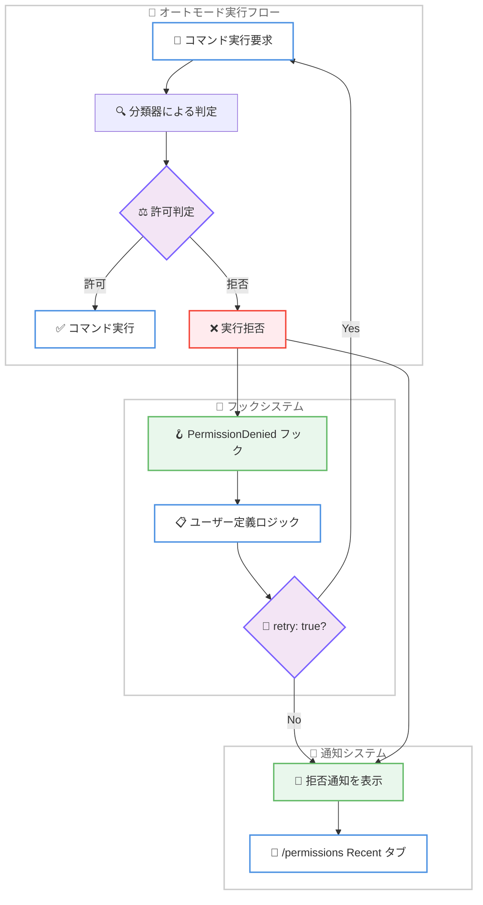

# Claude Code v2.1.88 リリース: 安定性とパフォーマンスの大規模改善、41 件の変更を含むメジャーアップデート

## メタデータ

| 項目 | 内容 |
|------|------|
| 発表日 | 2026-03-30 |
| ソース | Claude Code Changelog |
| カテゴリ | Tool Update / CLI |
| 公式リンク | https://github.com/anthropics/claude-code/blob/main/CHANGELOG.md |

## 概要

Claude Code v2.1.88 が 2026 年 3 月 30 日にリリースされました。本リリースは 41 件の変更 (新機能 4 件、バグ修正 29 件、改善 8 件) を含む大規模なアップデートです。メモリリーク修正や OOM クラッシュ防止などの安定性向上、フリッカーフリーレンダリングの導入、`PermissionDenied` フックの追加、音声モードの複数プラットフォーム修正など、幅広い改善が行われています。

## 詳細

### 背景

Claude Code は Anthropic が提供する CLI ベースの AI 開発支援ツールです。前バージョンの v2.1.87 は Cowork Dispatch のメッセージ配信バグを修正するホットフィックスでしたが、v2.1.88 は長期セッションでの安定性問題やクロスプラットフォームの互換性問題を包括的に解決する大型リリースとなっています。

特に、長時間セッションにおけるメモリリークやキャッシュの不整合、Windows 環境での各種不具合、音声モードの問題など、ユーザーから報告されていた多数の課題が修正されています。

### 主な変更点

#### 新機能 (Added)

以下の新機能が追加されています。

- **フリッカーフリーレンダリング**: 環境変数 `CLAUDE_CODE_NO_FLICKER=1` を設定することで、代替スクリーンを使用したフリッカーフリーレンダリングと仮想スクロールバックが有効になります
- **`PermissionDenied` フック**: オートモードの分類器が拒否した後に発火するフックが追加されました。`{retry: true}` を返すことでモデルにリトライを指示できます
- **サブエージェントの `@` メンション補完**: 名前付きサブエージェントが `@` メンションのタイプアヘッド候補に表示されるようになりました
- `/stats` から追加された 1 件の機能改善

#### バグ修正 (Fixed) - 29 件

修正は大きく以下のカテゴリに分類されます。

**メモリと安定性の修正。**

- 大きな JSON 入力が LRU キャッシュキーとして保持されるメモリリークを修正
- 1 GiB 超のファイルに対する Edit ツール使用時の OOM クラッシュを修正
- 50 MB 超のセッションファイルからメッセージを削除する際のクラッシュを修正
- ツールスキーマのバイト変更に起因するプロンプトキャッシュミスを修正
- ネストされた CLAUDE.md ファイルが長時間セッションで数十回再注入される問題を修正
- `StructuredOutput` のスキーマキャッシュバグにより約 50% の失敗率が発生する問題を修正

**クロスプラットフォーム互換性の修正。**

- Windows で Edit/Write ツールが CRLF を二重化し、Markdown のハードラインブレイク (末尾 2 スペース) を削除する問題を修正
- Windows Terminal Preview 1.25 で Shift+Enter が改行ではなく送信になる問題を修正
- Windows PowerShell 5.1 で `git push` などがエラーと誤報告される問題を修正
- macOS Apple Silicon で音声モードがマイク権限をリクエストしない問題を修正
- Windows の音声モードで "WebSocket upgrade rejected with HTTP 101" エラーが発生する問題を修正

**UI とレンダリングの修正。**

- 長時間セッションでスクロールアップ時にスクロールバックが消える問題を修正
- 折り畳まれた検索/読み取りグループのバッジが並列ツール使用時に重複する問題を修正
- `/btw` の長いレスポンスがクリップされスクロール不可だった問題を修正
- デーヴァナーガリー文字やその他の結合文字テキストがアシスタント出力で切り詰められる問題を修正
- メインスクリーンターミナルでのレイアウトシフト後のレンダリングアーティファクトを修正
- iTerm2 + tmux 環境でのストリーミング中の周期的な UI ジッターを修正
- 送信後にバックグラウンドメッセージ到着時にプロンプトが一時的に消える問題を修正
- 通知の `invalidates` が現在表示中の通知を即座にクリアしない問題を修正

**セッションとデータの修正。**

- `--resume` で古い CLI バージョンや中断された書き込みからのツール結果があるとクラッシュする問題を修正
- "Rate limit reached" の誤表示を修正し、エンタイトルメントエラー時に実際のエラーとアクションのヒントを表示するように改善
- LSP サーバーがクラッシュ後にゾンビ状態になる問題を修正し、次のリクエストで自動再起動するように改善
- フック条件が複合コマンド (`ls && git push`) や環境変数プレフィクス付きコマンド (`FOO=bar git push`) にマッチしない問題を修正
- CJK や絵文字を含むプロンプト履歴が 4 KB 境界で消失する問題を修正
- `/stats` が 30 日以上前の履歴データを失う問題を修正
- `/stats` がサブエージェント/フォークの使用量を除外してトークン数を過少カウントする問題を修正
- セッションを Ctrl+B でバックグラウンド化した際にタスク通知が失われる問題を修正
- SDK エラー結果メッセージの `is_error: true` 設定が正しく行われない問題を修正
- 音声モードのプッシュトゥトーク機能が一部の修飾キーコンボバインドで動作しない問題を修正
- PreToolUse/PostToolUse フックが Write/Edit/Read ツールの `file_path` を絶対パスで提供しない問題を修正

#### 改善 (Changed) - 8 件

- PowerShell ツールのプロンプトをバージョン別 (5.1 vs 7+) の構文ガイダンスで改善
- **思考サマリーのデフォルト無効化**: インタラクティブセッションで思考サマリーがデフォルトで生成されなくなりました。復元するには設定で `showThinkingSummaries: true` を指定してください
- オートモードで拒否されたコマンドが通知表示され、`/permissions` の Recent タブに記録されるように変更
- `/env` が PowerShell ツールのコマンドにも適用されるように変更 (以前は Bash のみ)
- `/usage` で Pro および Enterprise プランの冗長な "Current week (Sonnet only)" バーを非表示に変更
- 折り畳みツールサマリーで ls/tree/du の場合に "Listed N directories" と表示するように変更
- 画像貼り付け時の末尾スペース挿入を削除
- 空のプロンプトに `!command` を貼り付けた際に、手入力の `!` と同様に Bash モードに入るように変更

### 技術的な詳細

#### メモリとキャッシュの最適化

v2.1.88 で修正されたメモリ関連の問題は、長時間セッションでの安定性に直接影響するものです。特に以下の修正が重要です。

1. **LRU キャッシュのメモリリーク**: 大きな JSON 入力がキャッシュキーとして保持され続けることで、セッションが長くなるほどメモリ使用量が増大する問題が解消されました
2. **プロンプトキャッシュミス**: ツールスキーマのバイト列がセッション中に変化することで、キャッシュが無効化されトークン使用量が増加する問題が修正されました
3. **CLAUDE.md の再注入**: ネストされた CLAUDE.md ファイルが繰り返し注入されることで、コンテキストウィンドウが圧迫される問題が解決されました

#### PermissionDenied フックのアーキテクチャ



#### 修正カテゴリの分布


## 開発者への影響

### 対象

- Claude Code CLI を日常的に利用している全ての開発者
- 長時間セッションを実行しているユーザー (メモリリーク修正の恩恵)
- Windows 環境で Claude Code を使用しているユーザー (CRLF、PowerShell、音声モード修正)
- オートモードを活用しているユーザー (`PermissionDenied` フック)
- フックシステムを利用してワークフローをカスタマイズしているユーザー
- 音声モードを利用しているユーザー (macOS、Windows での修正)

### 必要なアクション

以下のコマンドで最新バージョンに更新できます。

```bash
# npm でのアップデート
npm update -g @anthropic-ai/claude-code

# 現在のバージョン確認
claude --version
```

### 移行ガイド

#### 思考サマリーの設定変更

v2.1.88 から、インタラクティブセッションで思考サマリーがデフォルトで生成されなくなりました。従来の動作を維持する場合は、設定に以下を追加してください。

```json
{
  "showThinkingSummaries": true
}
```

#### フリッカーフリーレンダリングの有効化

新しいフリッカーフリーレンダリング機能を試す場合は、環境変数を設定してください。

```bash
export CLAUDE_CODE_NO_FLICKER=1
```

#### PermissionDenied フックの活用

オートモードで拒否されたコマンドに対してカスタムロジックを実行できます。

```json
{
  "hooks": {
    "PermissionDenied": [
      {
        "command": "my-permission-handler",
        "description": "カスタム権限チェック"
      }
    ]
  }
}
```

フックから `{retry: true}` を返すことで、モデルにリトライを指示できます。

## コード例

### PermissionDenied フックの実装例

```bash
#!/bin/bash
# my-permission-handler.sh
# PermissionDenied フックのサンプル実装

# フックからの入力を読み取る
input=$(cat)

# コマンド情報を取得
command=$(echo "$input" | jq -r '.command')

# 特定のコマンドパターンを許可
if echo "$command" | grep -q "^git push"; then
  echo '{"retry": true}'
else
  echo '{"retry": false}'
fi
```

### フリッカーフリーレンダリングの設定

```bash
# .bashrc または .zshrc に追加
export CLAUDE_CODE_NO_FLICKER=1

# 設定後に Claude Code を起動
claude
```

## 関連リンク

- [Claude Code Changelog](https://github.com/anthropics/claude-code/blob/main/CHANGELOG.md)
- [Claude Code GitHub リポジトリ](https://github.com/anthropics/claude-code)
- [Claude Code v2.1.87 リリースノート](./2026-03-29-claude-code-v2-1-87.md)
- [Claude Code v2.1.86 リリースノート](./2026-03-28-claude-code-v2-1-86.md)

## まとめ

Claude Code v2.1.88 は 41 件の変更を含む大規模アップデートであり、特に長時間セッションでの安定性とクロスプラットフォームの互換性が大幅に向上しています。

最も重要な修正として、LRU キャッシュのメモリリーク、1 GiB 超ファイルでの OOM クラッシュ防止、`StructuredOutput` の約 50% 失敗率を引き起こすスキーマキャッシュバグの解消が挙げられます。これらの修正により、長時間の開発セッションでも安定したパフォーマンスが期待できます。

新機能面では、`PermissionDenied` フックによるオートモードの柔軟な権限制御と、`CLAUDE_CODE_NO_FLICKER=1` によるフリッカーフリーレンダリングが追加されました。Windows ユーザーにとっては、CRLF 処理、PowerShell 互換性、音声モードの修正が特に有用です。

なお、思考サマリーがデフォルトで無効化される破壊的変更が含まれているため、従来の動作を維持したい場合は設定の変更が必要です。全てのユーザーに早急なアップデートを推奨します。
