# オーストラリア政府と Anthropic が AI 安全性・研究に関する覚書を締結

## メタデータ

| 項目 | 内容 |
|------|------|
| 発表日 | 2026-03-31 |
| ソース | Anthropic News |
| カテゴリ | パートナーシップ / 政策 |
| 公式リンク | https://www.anthropic.com/news/australia-MOU |

## 概要

Anthropic は 2026 年 3 月 31 日、オーストラリア政府と AI 安全性研究および同国の National AI Plan の目標達成に向けた協力に関する覚書 (MOU) を締結しました。CEO の Dario Amodei がキャンベラを訪問し、Anthony Albanese 首相と会談して正式に合意しました。

本 MOU は、AI Safety Institute との連携、AUD$300 万の研究パートナーシップ、Anthropic Economic Index のデータ共有、データセンターインフラへの投資検討、ディープテックスタートアップ支援プログラムなど、多岐にわたる協力を包含する包括的な合意です。

## 詳細

### 背景

Anthropic は 2026 年 3 月 10 日にシドニーオフィスの開設を発表し、アジア太平洋地域での事業を拡大してきました。オーストラリアでは Claude が英語圏の国の中で最も多様な用途で利用されており、既に Canva、Quantium、Commonwealth Bank of Australia などの主要企業との協力関係を構築しています。

今回の MOU 締結は、シドニー拠点の開設に続くオーストラリア市場への本格的なコミットメントであり、米国、英国、日本に続く AI Safety Institute との協力体制の確立を含む重要な合意です。

### パートナーシップの全体構造

```mermaid
flowchart TD
    subgraph MOU["🤝 Anthropic - オーストラリア政府 MOU"]
        direction TB
        subgraph Safety["🛡️ AI Safety Institute 連携"]
            direction LR
            Capability["📊 モデル能力・<br/>リスクの知見共有"]
            Evaluation["🔍 合同安全性評価"]
            Academic["🎓 学術機関との<br/>共同研究"]
            Capability ~~~ Evaluation ~~~ Academic
        end

        subgraph Research["🔬 研究パートナーシップ AUD$300 万"]
            direction LR
            ANU["🏫 ANU<br/>遺伝子配列解析<br/>コンピューティング教育"]
            Garvan["🧬 Garvan 研究所<br/>ゲノム発見<br/>集団ゲノミクス"]
            Murdoch["❤️ Murdoch 小児研究所<br/>幹細胞医療<br/>小児心臓病"]
            Curtin["📐 Curtin データ<br/>サイエンス研究所<br/>学際的研究"]
            ANU ~~~ Garvan ~~~ Murdoch ~~~ Curtin
        end

        subgraph Economic["📈 経済データ共有"]
            EconIndex["📊 Anthropic Economic Index<br/>AI 導入状況の追跡"]
        end

        subgraph Infra["🏗️ データセンターインフラ"]
            DataCenter["💻 データセンター・<br/>エネルギーインフラへの<br/>投資検討"]
        end

        subgraph Startup["🚀 ディープテックスタートアップ支援"]
            Credits["💳 USD$50,000 API クレジット<br/>VC 支援スタートアップ向け"]
        end
    end

    subgraph Sectors["🏭 対象分野"]
        direction LR
        Resources["⛏️ 天然資源"]
        Agriculture["🌾 農業"]
        Healthcare["🏥 ヘルスケア"]
        FinServ["💰 金融サービス"]
        Resources ~~~ Agriculture ~~~ Healthcare ~~~ FinServ
    end

    MOU --> Sectors

    classDef mou fill:none,stroke:#CCCCCC,stroke-width:2px,color:#666666
    classDef safety fill:#E8EAF6,stroke:#C5CAE9,stroke-width:2px,color:#283593
    classDef research fill:#E9F7EC,stroke:#66BB6A,stroke-width:2px,color:#333333
    classDef economic fill:#FFF3E0,stroke:#FF9800,stroke-width:2px,color:#333333
    classDef infra fill:#E8F1FF,stroke:#4A90E2,stroke-width:2px,color:#333333
    classDef startup fill:#F3E5F5,stroke:#7B61FF,stroke-width:2px,color:#333333
    classDef sectors fill:#FFEBEE,stroke:#F44336,stroke-width:2px,color:#333333

    class MOU mou
    class Safety,Capability,Evaluation,Academic safety
    class Research,ANU,Garvan,Murdoch,Curtin research
    class Economic,EconIndex economic
    class Infra,DataCenter infra
    class Startup,Credits startup
    class Sectors,Resources,Agriculture,Healthcare,FinServ sectors
```

### 主な合意内容

#### 1. AI Safety Institute との連携

オーストラリアの AI Safety Institute と以下の分野で協力します。

- **知見の共有**: 新興モデルの能力やリスクに関する発見の共有
- **合同安全性評価**: AI モデルの安全性に関する共同評価の実施
- **学術共同研究**: オーストラリアの学術機関との研究連携

この取り組みは、Anthropic が米国、英国、日本の AI Safety Institute と既に締結している同様の協力体制を反映したものです。

#### 2. AUD$300 万の研究パートナーシップ

4 つの研究機関との具体的な研究パートナーシップが発表されました。

- **Australian National University (ANU)**: 希少疾患の遺伝子配列解析、コンピューティング教育
- **Garvan Institute of Medical Research**: UNSW との連携によるゲノム発見、Centre for Population Genomics での研究
- **Murdoch Children's Research Institute**: 小児心臓病に対する幹細胞医療の研究
- **Curtin Institute for Data Science**: 学際的なデータサイエンス研究

#### 3. Anthropic Economic Index データ共有

オーストラリア政府に対して Anthropic Economic Index のデータを共有し、経済全体における AI 導入状況を追跡します。特に以下の分野に注力します。

- 天然資源
- 農業
- ヘルスケア
- 金融サービス

#### 4. データセンターインフラ

オーストラリア全土でのデータセンターインフラおよびエネルギーへの投資を検討しています。オーストラリア政府のデータセンターに関する方針に沿った形で進められます。

#### 5. ディープテックスタートアップ支援プログラム

VC の支援を受けたスタートアップに対して、USD$50,000 (AUD$72,000) 相当の API クレジットを提供します。対象分野は以下の通りです。

- 創薬
- 材料科学
- 気候モデリング
- 医療診断

## 開発者への影響

### 対象

- オーストラリアで Claude API を利用している開発者
- ヘルスケア、ゲノミクス、データサイエンス分野の研究者
- オーストラリアのディープテックスタートアップ
- AI 安全性研究に携わる研究者

### 必要なアクション

現時点で開発者に必要な即座のアクションはありません。ただし、以下の機会に注目することを推奨します。

- **スタートアップ向け API クレジットプログラム**: 創薬、材料科学、気候モデリング、医療診断分野のスタートアップは、USD$50,000 の API クレジットの申請を検討
- **研究パートナーシップ**: ANU、Garvan、Murdoch、Curtin の各研究機関と連携する研究者は、新たな共同研究の機会を確認
- **データセンターインフラ**: オーストラリア国内でのインフラ拡充に伴い、レイテンシーやデータレジデンシーの改善が期待される

## 関連リンク

- [公式発表](https://www.anthropic.com/news/australia-MOU)
- [Anthropic がシドニーにオフィスを開設](./2026-03-10-sydney-fourth-office-asia-pacific.md)
- [The Anthropic Institute 設立](./2026-03-11-the-anthropic-institute.md)
- [Anthropic News](https://www.anthropic.com/news)

## まとめ

Anthropic とオーストラリア政府の MOU 締結は、2026 年 3 月 10 日のシドニーオフィス開設発表に続く、同国への本格的なコミットメントを示す重要な合意です。AI Safety Institute との連携は米国、英国、日本に続く 4 か国目となり、Anthropic のグローバルな AI 安全性への取り組みがさらに拡大しました。

AUD$300 万の研究パートナーシップでは、遺伝子配列解析、ゲノム発見、幹細胞医療、データサイエンスといった先端分野での具体的な共同研究が開始されます。Anthropic Economic Index のデータ共有やデータセンターインフラへの投資検討、ディープテックスタートアップ支援と合わせ、オーストラリアにおける AI エコシステムの発展に包括的に貢献する枠組みが整いました。英語圏で最も多様な用途で Claude を活用しているオーストラリアにおいて、今後の展開が注目されます。
