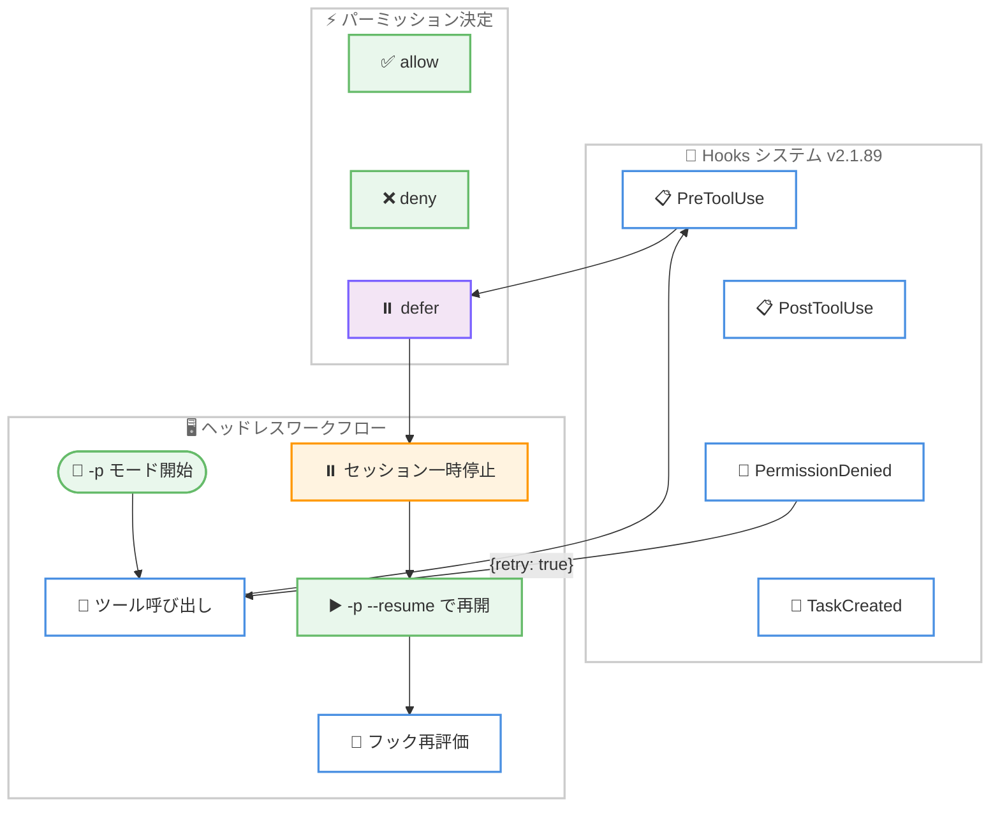

# Claude Code v2.1.89 リリース: Hooks 機能の大幅強化とエイプリルフールの隠し機能

## メタデータ

| 項目 | 内容 |
|------|------|
| 発表日 | 2026-04-01 |
| ソース | Claude Code Changelog |
| カテゴリ | Tool Update / CLI |
| 公式リンク | https://github.com/anthropics/claude-code/blob/main/CHANGELOG.md |

## 概要

Claude Code v2.1.89 が 2026 年 4 月 1 日にリリースされました。本リリースは新機能 5 件、改善 18 件、バグ修正 26 件を含む大規模アップデートです。特に Hooks システムの拡張 (`defer` パーミッション、`PermissionDenied` フック)、`StructuredOutput` スキーマキャッシュバグの修正 (約 50% の失敗率を解消)、長時間セッションにおけるメモリリークの修正、Autocompact のスラッシュループ検出など、安定性とパフォーマンスに関わる重要な改善が多数含まれています。

## 詳細

### 背景

Claude Code は Anthropic が提供する CLI ベースの AI 開発支援ツールです。v2.1.89 は v2.1.87 から数日後のリリースであり、Hooks システムの機能拡張、Auto モードの操作性向上、Windows/PowerShell 環境のサポート強化、そして多数のバグ修正を含む包括的なアップデートとなっています。

前バージョンまでの Hooks システムではツール実行の前後にカスタム処理を挟むことができましたが、ヘッドレスセッションでの一時停止と再開や、Auto モードでの拒否後のリトライといった高度なワークフローには対応していませんでした。本リリースではこれらのユースケースに対応する新しい Hooks イベントとパーミッション決定が追加されています。

### 主な変更点

#### 新機能 (Added)

- **`defer` パーミッション決定の追加**: `PreToolUse` フックに `"defer"` パーミッション決定が導入されました。ヘッドレスセッションでツール呼び出し時に一時停止し、`-p --resume` で再開してフックを再評価できるようになりました。CI/CD パイプラインでの承認フローなどに活用できます
- **フリッカーフリーレンダリング**: `CLAUDE_CODE_NO_FLICKER=1` 環境変数を設定することで、仮想スクロールバックを使用したオルトスクリーンレンダリングに切り替えられます。画面のちらつきを抑えた表示が可能になります
- **`PermissionDenied` フック**: Auto モードの分類器がツール実行を拒否した後に発火するフックです。`{retry: true}` を返すことで、モデルにリトライを指示できます
- **名前付きサブエージェントの @ メンション**: `@` メンションのタイプアヘッド候補にサブエージェント名が表示されるようになりました
- **MCP 接続のノンブロッキング化**: `-p` モードで `MCP_CONNECTION_NONBLOCKING=true` を設定すると MCP 接続待ちを完全にスキップできます。また `--mcp-config` サーバー接続が 5 秒でタイムアウトするようになり、最も遅いサーバーによるブロッキングが解消されました

#### 改善 (Changed)

- **Auto モードの拒否通知改善**: 拒否されたコマンドが通知として表示され、`/permissions` の Recent タブから `r` キーでリトライできるようになりました
- **ツールサマリーの改善**: `ls`/`tree`/`du` コマンドの折りたたみ表示が "Read N files" ではなく "Listed N directories" と正確に表示されるようになりました
- **Bash ツールのファイル変更警告**: フォーマッター/リンターがファイルを変更した際に、以前読み込んだファイルとの整合性に関する警告を表示し、古い情報によるエラーを防止します
- **@ メンションのランキング改善**: ソースファイルが同名の MCP リソースより上位に表示されるようになりました
- **PowerShell の構文ガイダンス**: PowerShell のバージョン (5.1 vs 7+) に応じた適切な構文ガイダンスが提供されるようになりました
- **Edit ツールの要件緩和**: `Bash` で `sed -n` や `cat` を使用して表示したファイルに対して、別途 `Read` を実行せずに `Edit` ツールが使用可能になりました
- **大容量フック出力のディスク保存**: 50K 文字を超えるフック出力はディスクに保存され、ファイルパスとプレビューのみがコンテキストに挿入されるようになりました
- **`cleanupPeriodDays: 0` の拒否**: settings.json で `cleanupPeriodDays: 0` を設定するとバリデーションエラーが発生するようになりました
- **思考サマリーのデフォルト無効化**: インタラクティブセッションで思考サマリーがデフォルトで生成されなくなりました。復元するには settings.json で `showThinkingSummaries: true` を設定してください
- **`TaskCreated` フックイベントのドキュメント化**: `TaskCreated` フックイベントとそのブロッキング動作がドキュメント化されました
- **Ctrl+B でのタスク通知保持**: コマンド実行中に Ctrl+B でバックグラウンド化した際、タスク通知が保持されるようになりました
- **PowerShell のセキュリティ強化**: 二重引用符と空白を含む外部コマンド引数が自動許可ではなくプロンプト確認されるようになりました (PS 5.1 引数分割の強化)
- **`/env` の PowerShell 対応**: `/env` コマンドが PowerShell ツールのコマンドにも適用されるようになりました
- **`/usage` の表示最適化**: Pro および Enterprise プランで冗長な "Current week (Sonnet only)" バーが非表示になりました
- **画像ペーストの改善**: 画像ペースト時に末尾の空白が挿入されなくなりました
- **`!command` のペースト対応**: 空のプロンプトに `!command` をペーストすると、入力時と同様に bash モードに入るようになりました
- **`/buddy` コマンド**: エイプリルフール限定で、コーディング中に見守ってくれる小さなクリーチャーをハッチできる `/buddy` コマンドが追加されました

#### バグ修正 (Fixed)

**重大な修正:**

- **`StructuredOutput` スキーマキャッシュバグ**: 複数のスキーマを使用する際に約 50% の失敗率を引き起こしていたキャッシュバグを修正しました。構造化出力を活用しているワークフローに大きな影響を与えていた問題です
- **メモリリーク**: 長時間セッションで大きな JSON 入力が LRU キャッシュキーとして保持され続けるメモリリークを修正しました
- **Autocompact スラッシュループ**: コンテキストの圧縮後すぐに上限に達し、連続 3 回圧縮を繰り返すスラッシュループを検出・防止するようになりました
- **大規模セッションファイルのクラッシュ**: 50MB を超えるセッションファイルからメッセージを削除する際のクラッシュを修正しました
- **プロンプトキャッシュミス**: 長時間セッション中にツールスキーマのバイトが変化することによるプロンプトキャッシュミスを修正しました
- **ネストされた CLAUDE.md の重複注入**: 多くのファイルを読み込む長時間セッションで、ネストされた CLAUDE.md ファイルが数十回再注入される問題を修正しました

**Hooks 関連の修正:**

- **PreToolUse/PostToolUse フックのパス修正**: Write/Edit/Read ツールの `file_path` が絶対パスとして渡されるようになりました
- **フック `if` 条件のマッチング修正**: 複合コマンドや環境変数プレフィックス付きコマンドが正しくマッチするようになりました

**Windows/PowerShell 関連の修正:**

- **Edit/Write ツールの CRLF 問題**: Windows で CRLF が二重化される問題と、Markdown のハードラインブレイク (末尾 2 スペース) が削除される問題を修正しました
- **PowerShell のエラー報告**: `git push` などのコマンドが stderr に進捗を書き込んだ際に誤って失敗と報告される問題を修正しました (Windows PowerShell 5.1)
- **Shift+Enter の動作修正**: Windows Terminal Preview 1.25 で Shift+Enter が改行ではなく送信になる問題を修正しました

**その他の修正:**

- **Edit/Read のシンボリックリンク解決**: `Edit(//path/**)` と `Read(//path/**)` でルールがリクエストされたパスではなく解決されたシンボリックリンクターゲットをチェックするようになりました
- **音声モードの修正**: プッシュトゥトーク機能が一部の修飾キーの組み合わせで動作しない問題、macOS Apple Silicon でマイク権限が要求されない問題、Windows での "WebSocket upgrade rejected with HTTP 101" エラーを修正しました
- **LSP サーバーのゾンビ状態**: クラッシュ後に LSP サーバーがゾンビ状態になる問題を修正し、次のリクエストで自動再起動するようになりました
- **CJK/絵文字のプロンプト履歴**: CJK 文字や絵文字を含むプロンプト履歴が `~/.claude/history.jsonl` の 4KB 境界に該当する際に無言で破棄される問題を修正しました
- **`/stats` のトークンカウント**: サブエージェントの使用量が除外されていた問題と、30 日を超える履歴データが失われる問題を修正しました
- **`-p --resume` のハング**: 遅延ツール入力が 64KB を超える場合や遅延マーカーが存在しない場合にハングする問題を修正しました
- **`claude-cli://` ディープリンク**: macOS でディープリンクが開かない問題を修正しました
- **MCP ツールエラーの切り捨て**: サーバーがマルチエレメントエラーコンテンツを返す際に最初のコンテンツブロックのみに切り捨てられる問題を修正しました
- **SDK 経由の画像送信時のコンテキスト脱落**: SDK 経由で画像付きメッセージを送信する際にスキルリマインダーやシステムコンテキストが脱落する問題を修正しました
- **`--resume` クラッシュ**: トランスクリプトに古い CLI バージョンまたは中断された書き込みからのツール結果が含まれる場合のクラッシュを修正しました
- **レートリミットメッセージの修正**: API がエンタイトルメントエラーを返した際に誤解を招く "Rate limit reached" メッセージが表示される問題を修正しました
- **折りたたみバッジの重複**: 並列ツール使用時にターミナルスクロールバックで検索/読み取りグループバッジが重複する問題を修正しました
- **通知の即時クリア**: `invalidates` 指定の通知が現在表示中の通知を即座にクリアしない問題を修正しました
- **プロンプト消失**: バックグラウンドメッセージ受信中に送信後プロンプトが一瞬消える問題を修正しました
- **デーバナーガリー文字の切り捨て**: デーバナーガリー文字やその他の結合マーク文字がアシスタント出力で切り捨てられる問題を修正しました
- **レンダリングアーティファクト**: レイアウトシフト後のメインスクリーンターミナルでのレンダリングアーティファクトを修正しました
- **iTerm2/tmux の UI ジッター**: tmux 内の iTerm2 でストリーミング中に周期的な UI ジッターが発生する問題を修正しました
- **1 GiB 超ファイルの OOM クラッシュ**: Edit ツールが非常に大きなファイル (1 GiB 超) に対して使用された際の潜在的な OOM クラッシュを修正しました

### 技術的な詳細

#### Hooks システムの拡張アーキテクチャ



#### Autocompact スラッシュループ検出

v2.1.89 では、コンテキストウィンドウの圧縮 (autocompact) が連続 3 回実行された後すぐにコンテキストが上限に達する状況を検出するメカニズムが追加されました。これにより、圧縮と再充填のスラッシュループが防止され、不必要な API 呼び出しとトークン消費が削減されます。

#### MCP 接続のノンブロッキング化

`-p` モード (プログラマティックモード) で `MCP_CONNECTION_NONBLOCKING=true` を設定すると、MCP サーバーへの接続待ちが完全にスキップされます。また、`--mcp-config` で指定されたサーバー接続にも 5 秒のタイムアウトが設定され、最も遅いサーバーが全体のブロッキング要因になることを防ぎます。

## 開発者への影響

### 対象

- Claude Code CLI を利用する全ての開発者
- Hooks システムを活用した CI/CD パイプラインを構築しているチーム
- `StructuredOutput` を利用した構造化出力ワークフローを持つ開発者
- Windows/PowerShell 環境で Claude Code を使用しているユーザー
- 長時間のコーディングセッションを行うユーザー
- MCP サーバーを利用しているユーザー

### 必要なアクション

以下のコマンドで最新バージョンに更新できます。

```bash
# npm でのアップデート
npm update -g @anthropic-ai/claude-code

# 現在のバージョン確認
claude --version
```

**設定変更の確認が必要な項目:**

- **思考サマリー**: インタラクティブセッションでデフォルト無効化されました。復元するには settings.json に `"showThinkingSummaries": true` を追加してください
- **`cleanupPeriodDays`**: 値が `0` に設定されている場合、バリデーションエラーが発生します。`1` 以上の値に変更してください
- **Hooks の `file_path`**: PreToolUse/PostToolUse フックが絶対パスを受け取るようになったため、相対パスに依存しているフック処理の見直しが必要な場合があります

## 関連リンク

- [Claude Code Changelog](https://github.com/anthropics/claude-code/blob/main/CHANGELOG.md)
- [Claude Code GitHub リポジトリ](https://github.com/anthropics/claude-code)
- [Claude Code v2.1.87](./2026-03-29-claude-code-v2-1-87.md)
- [Claude Code Auto Mode](./2026-03-24-claude-code-auto-mode.md)

## まとめ

Claude Code v2.1.89 は、新機能 5 件、改善 18 件、バグ修正 26 件を含む大規模リリースです。Hooks システムに `defer` パーミッション決定と `PermissionDenied` フックが追加され、ヘッドレスセッションでの承認フローや Auto モードでのリトライ制御など、より高度な自動化ワークフローが構築可能になりました。

安定性の面では、`StructuredOutput` の約 50% の失敗率を引き起こしていたスキーマキャッシュバグ、長時間セッションでのメモリリーク、Autocompact のスラッシュループ、プロンプトキャッシュミス、CLAUDE.md の重複注入など、長時間セッションの信頼性に大きく影響する問題が修正されました。

Windows/PowerShell 環境のサポートも強化され、CRLF の二重化問題、PowerShell バージョン別の構文ガイダンス、引数分割のセキュリティ強化など、Windows ユーザーにとって重要な改善が含まれています。

全ての Claude Code ユーザーに対して `npm update -g @anthropic-ai/claude-code` による早急なアップデートを推奨します。特に `StructuredOutput` を利用しているワークフローや長時間セッションを頻繁に行うユーザーには必須のアップデートです。
