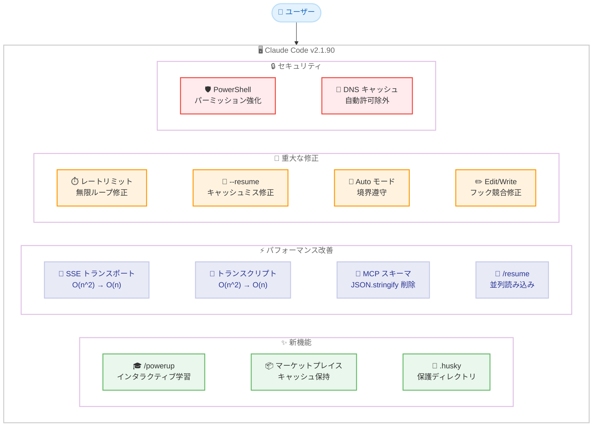

# Claude Code v2.1.90 リリース: /powerup コマンドで学習機能を搭載、パフォーマンスの二次関数的ボトルネックを解消

## メタデータ

| 項目 | 内容 |
|------|------|
| 発表日 | 2026-04-02 |
| ソース | Claude Code Changelog |
| カテゴリ | Tool Update / CLI |
| 公式リンク | https://github.com/anthropics/claude-code/blob/main/CHANGELOG.md |

## 概要

Claude Code v2.1.90 が 2026 年 4 月 2 日にリリースされました。本リリースは新機能 3 件、パフォーマンス改善 4 件、バグ修正 10 件、変更 2 件、削除 1 件を含むアップデートです。特にインタラクティブな学習機能 `/powerup` コマンドの追加、SSE トランスポートとトランスクリプト書き込みの二次関数的ボトルネックの解消、`--resume` のプロンプトキャッシュミス修正、Auto モードのユーザー境界遵守の改善、PowerShell のセキュリティ強化など、ユーザー体験とパフォーマンスに関わる重要な改善が多数含まれています。

## 詳細

### 背景

Claude Code は Anthropic が提供する CLI ベースの AI 開発支援ツールです。v2.1.90 は v2.1.89 の翌日リリースであり、パフォーマンスのボトルネック解消に重点を置いたアップデートとなっています。前バージョンでは Hooks システムの拡張やメモリリーク修正が行われましたが、本バージョンでは長時間セッションでのパフォーマンス低下やレートリミット関連の UX 問題に対処しています。

また、新機能として `/powerup` コマンドが追加され、Claude Code の機能をインタラクティブに学習できるようになりました。初心者から上級者まで、Claude Code の活用スキルを向上させるための教育機能です。

### 主な変更点

#### 新機能 (Added)

- **`/powerup` コマンドの追加**: Claude Code の機能をインタラクティブに学習できるレッスン機能が追加されました。アニメーションデモ付きで、各機能の使い方を実践的に習得できます
- **`CLAUDE_CODE_PLUGIN_KEEP_MARKETPLACE_ON_FAILURE` 環境変数**: `git pull` が失敗した際に既存のマーケットプレイスキャッシュを保持する環境変数が追加されました。オフライン環境で特に有用です
- **`.husky` ディレクトリの保護対象追加**: `acceptEdits` モードにおいて `.husky` ディレクトリが保護対象ディレクトリに追加されました。Husky の Git フック設定が意図せず変更されることを防止します

#### パフォーマンス改善

- **MCP ツールスキーマの JSON.stringify 削除**: キャッシュキー検索時にターンごとに実行されていた MCP ツールスキーマの `JSON.stringify` を排除しました。多数の MCP ツールを使用している環境で顕著なパフォーマンス向上が期待できます
- **SSE トランスポートの線形時間化**: SSE トランスポートが大きなストリームフレームを線形時間で処理するようになりました。以前は二次関数的 (O(n^2)) な処理時間がかかっていたため、大きなレスポンスのストリーミング時に顕著な速度向上が得られます
- **トランスクリプト書き込みの最適化**: 長い会話を持つ SDK セッションで、トランスクリプト書き込みが二次関数的に遅くなる問題が解消されました
- **`/resume` のプロジェクトセッション並列読み込み**: 全プロジェクト表示時にプロジェクトセッションを並列で読み込むようになり、多数のプロジェクトを持つユーザーの読み込み時間が改善されました

#### バグ修正 (Fixed)

**重大な修正:**

- **レートリミットダイアログの無限ループ**: 使用量上限に達した後、レートリミットオプションダイアログが繰り返し自動的に開き続け、最終的にセッションがクラッシュする問題を修正しました
- **`--resume` のプロンプトキャッシュミス**: 遅延ツール、MCP サーバー、またはカスタムエージェントを使用しているユーザーで、`--resume` 時に最初のリクエストでプロンプトキャッシュが完全にミスする問題を修正しました (v2.1.69 からのリグレッション)
- **Edit/Write ツールの "File content has changed" エラー**: `PostToolUse` のフォーマットオンセーブフックが連続する編集の間にファイルを書き換えた際に発生するエラーを修正しました
- **Auto モードのユーザー境界遵守**: Auto モードが「push しないで」「X の前に Y を待って」などの明示的なユーザー境界を無視する問題を修正しました

**Hooks 関連の修正:**

- **`PreToolUse` フックの JSON 出力処理**: stdout に JSON を出力して終了コード 2 で終了する `PreToolUse` フックが、ツール呼び出しを正しくブロックしない問題を修正しました

**UI 関連の修正:**

- **折りたたみバッジの重複表示**: フルスクリーンスクロールバックで CLAUDE.md ファイルがツール呼び出し中に自動読み込みされた際に、折りたたみ検索/読み取りサマリーバッジが複数回表示される問題を修正しました
- **ライトテーマでのホバーテキスト**: ライトターミナルテーマでクリックして展開するホバーテキストがほぼ見えない問題を修正しました
- **パーミッションダイアログの UI クラッシュ**: 不正なツール入力がパーミッションダイアログに到達した際の UI クラッシュを修正しました
- **選択画面のヘッダー消失**: `/model`、`/config` およびその他の選択画面でスクロール時にヘッダーが消える問題を修正しました

**セキュリティ関連の修正:**

- **PowerShell ツールパーミッションチェックの強化**: 末尾の `&` によるバックグラウンドジョブバイパス、`-ErrorAction Break` によるデバッガーハング、アーカイブ展開の TOCTOU (Time-of-Check-Time-of-Use) 脆弱性、パース失敗時の拒否ルール劣化を修正しました

#### 変更 (Changed)

- **`--resume` ピッカーの変更**: `claude -p` や SDK 呼び出しで作成されたセッションが `--resume` ピッカーに表示されなくなりました。手動セッションのみが表示されるため、セッション選択が見やすくなります

#### 削除 (Removed)

- **DNS キャッシュコマンドの自動許可除外**: `Get-DnsClientCache` と `ipconfig /displaydns` が自動許可対象から削除されました。DNS キャッシュにはプライバシーに関わる情報が含まれるため、実行前にユーザーの確認が必要になります

### 技術的な詳細

#### パフォーマンス改善の詳細

v2.1.90 では 3 つの二次関数的ボトルネックが解消されました。

1. **SSE トランスポート**: ストリーミングフレームの結合処理が文字列の再割り当てを繰り返していたため、フレームサイズに対して O(n^2) の処理時間がかかっていました。バッファリング戦略の改善により O(n) に最適化されました

2. **トランスクリプト書き込み**: 長い会話では、各ターンでトランスクリプト全体を書き換えていたため、会話が長くなるほど書き込みが遅くなっていました。差分書き込みまたはインクリメンタルな追記方式に変更されたと推測されます

3. **MCP ツールスキーマのキャッシュキー**: 各ターンで MCP ツールスキーマ全体を `JSON.stringify` してキャッシュキーを計算していた処理が、ハッシュベースまたは参照ベースの比較に最適化されました

#### `/powerup` コマンドの位置づけ



#### `--resume` プロンプトキャッシュミスの修正

v2.1.69 以降、遅延ツール、MCP サーバー、またはカスタムエージェントを使用している環境で `--resume` を実行すると、最初のリクエストでプロンプトキャッシュが完全にミスする問題が発生していました。プロンプトキャッシュミスにより、再開時に全てのコンテキストを再処理する必要があり、レスポンス時間とトークン消費が大幅に増加していました。本修正により、`--resume` 時のキャッシュヒット率が正常に戻り、再開時のパフォーマンスが回復しました。

## 開発者への影響

### 対象

- Claude Code CLI を利用する全ての開発者
- `--resume` を頻繁に使用するユーザー (特に MCP サーバーやカスタムエージェント利用者)
- 長時間セッションを行うユーザー (パフォーマンス改善の恩恵)
- Auto モードを活用しているユーザー
- Windows/PowerShell 環境で Claude Code を使用しているユーザー
- Claude Code の機能を効率的に学習したい初心者ユーザー

### 必要なアクション

以下のコマンドで最新バージョンに更新できます。

```bash
# npm でのアップデート
npm update -g @anthropic-ai/claude-code

# 現在のバージョン確認
claude --version
```

**確認が推奨される項目:**

- **`--resume` のパフォーマンス**: v2.1.69 以降 `--resume` のレスポンスが遅いと感じていた場合、本バージョンで改善されています
- **PowerShell ユーザー**: セキュリティ強化により、一部のコマンドパターンでパーミッション確認の挙動が変わる可能性があります
- **DNS キャッシュコマンド**: `Get-DnsClientCache` と `ipconfig /displaydns` が自動許可されなくなったため、実行時にパーミッション確認が表示されます
- **`/powerup` コマンド**: 新しいインタラクティブ学習機能を試すことで、Claude Code の活用スキルを向上させることができます

## コード例

### /powerup コマンドの使用

```bash
# Claude Code 内で実行
/powerup
```

アニメーションデモ付きのインタラクティブレッスンが開始され、Claude Code の各機能を実践的に学習できます。

### オフライン環境でのマーケットプレイスキャッシュ保持

```bash
# 環境変数を設定して Claude Code を起動
export CLAUDE_CODE_PLUGIN_KEEP_MARKETPLACE_ON_FAILURE=1
claude
```

`git pull` が失敗してもマーケットプレイスキャッシュが保持されるため、オフライン環境でもプラグインを利用し続けることができます。

## 関連リンク

- [Claude Code Changelog](https://github.com/anthropics/claude-code/blob/main/CHANGELOG.md)
- [Claude Code GitHub リポジトリ](https://github.com/anthropics/claude-code)
- [Claude Code v2.1.89](./2026-04-01-claude-code-v2-1-89.md)
- [Claude Code v2.1.87](./2026-03-29-claude-code-v2-1-87.md)

## まとめ

Claude Code v2.1.90 は、新機能 3 件、パフォーマンス改善 4 件、バグ修正 10 件、変更 2 件、削除 1 件を含むリリースです。インタラクティブ学習機能 `/powerup` コマンドの追加により、Claude Code の機能をアニメーションデモ付きで効率的に学習できるようになりました。

パフォーマンス面では、SSE トランスポートとトランスクリプト書き込みの二次関数的ボトルネック (O(n^2)) が線形時間 (O(n)) に最適化され、長時間セッションや大きなストリーミングレスポンスでの速度が大幅に向上しました。また、MCP ツールスキーマのキャッシュキー計算から不要な `JSON.stringify` が排除され、MCP ツールを多用する環境でのパフォーマンスも改善されています。

安定性の面では、レートリミットダイアログの無限ループによるセッションクラッシュ、v2.1.69 からのリグレッションであった `--resume` のプロンプトキャッシュミス、Auto モードがユーザーの明示的な境界を無視する問題など、ユーザー体験に直接影響する重要なバグが修正されました。セキュリティ面では PowerShell のツールパーミッションチェックが強化され、複数のバイパス手法が塞がれています。

全ての Claude Code ユーザーに対して `npm update -g @anthropic-ai/claude-code` による早急なアップデートを推奨します。特に `--resume` を頻繁に使用するユーザーや長時間セッションを行うユーザーにとって、パフォーマンスの改善効果が顕著です。
