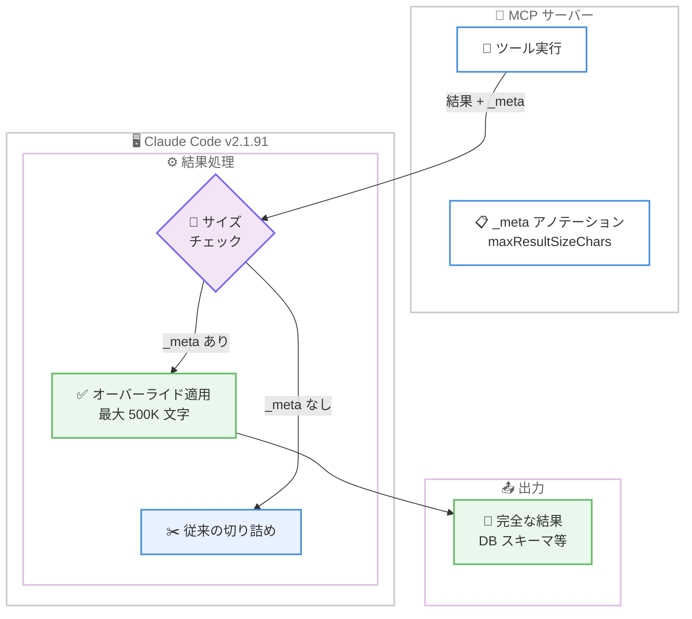

# Claude Code v2.1.91 リリース: MCP ツール結果の 500K 永続化オーバーライド、スキルのシェル実行無効化オプション追加

## メタデータ

| 項目 | 内容 |
|------|------|
| 発表日 | 2026-04-03 |
| ソース | Claude Code Changelog |
| カテゴリ | ツールアップデート |
| 公式リンク | https://github.com/anthropics/claude-code/blob/main/CHANGELOG.md |

## 概要

Claude Code v2.1.91 が 2026 年 4 月 3 日にリリースされました。本リリースは新機能 4 件、バグ修正 5 件、改善 3 件を含むアップデートです。特に MCP ツール結果の永続化オーバーライド機能により、DB スキーマなどの大きな結果を最大 500K 文字まで切り詰めずに受け取れるようになった点が注目されます。また、スキルやプラグインからのインラインシェル実行を無効化する `disableSkillShellExecution` 設定の追加や、プラグインが `bin/` ディレクトリ配下の実行ファイルを Bash ツールから直接呼び出せるようになるなど、拡張性とセキュリティの両面で重要な改善が含まれています。

## 詳細

### 背景

Claude Code は Anthropic が提供する CLI ベースの AI 開発支援ツールです。v2.1.91 は v2.1.90 の翌日リリースであり、MCP (Model Context Protocol) 連携の柔軟性向上とセキュリティ設定の強化に重点を置いたアップデートとなっています。前バージョンではパフォーマンスのボトルネック解消や `/powerup` コマンドの追加が行われましたが、本バージョンでは MCP ツールの結果サイズ制限の緩和、スキルのシェル実行制御、プラグインの実行ファイル対応など、エコシステムの拡張に関わる改善が中心です。

### 主な変更点

#### 新機能 (Added)

- **MCP ツール結果の永続化オーバーライド**: MCP サーバーがツール結果に `_meta["anthropic/maxResultSizeChars"]` アノテーションを付与することで、結果の最大サイズを最大 500K 文字まで拡張できるようになりました。DB スキーマや大規模なデータセットなど、従来は切り詰められていた結果をそのまま受け取ることが可能です
- **`disableSkillShellExecution` 設定**: スキル、カスタムスラッシュコマンド、プラグインコマンドからのインラインシェル実行を無効化する設定が追加されました。セキュリティポリシーの厳しい環境でスキルの動作を制限する場合に有用です
- **ディープリンクの複数行プロンプト対応**: `claude-cli://open?q=` ディープリンクでエンコードされた改行 (`%0A`) が拒否されなくなり、複数行のプロンプトを渡せるようになりました
- **プラグインの `bin/` ディレクトリ対応**: プラグインが `bin/` ディレクトリ配下に実行ファイルを同梱し、Bash ツールからベアコマンドとして呼び出せるようになりました。プラグイン独自の CLI ツールを提供する際に活用できます

#### バグ修正 (Fixed)

- **`--resume` のトランスクリプトチェーン断裂**: 非同期トランスクリプト書き込みがサイレントに失敗した際に会話履歴が失われる問題を修正しました。`--resume` で再開した際の信頼性が向上しています
- **`cmd+delete` のキーバインド**: iTerm2、kitty、WezTerm、Ghostty、Windows Terminal で `cmd+delete` が行頭まで削除しない問題を修正しました
- **リモートセッションのプランモード**: リモートセッションでコンテナ再起動後にプランファイルを見失い、プラン編集時にパーミッションプロンプトが表示されたり、プラン承認モーダルが空になる問題を修正しました
- **`permissions.defaultMode: "auto"` の JSON スキーマバリデーション**: settings.json で `permissions.defaultMode` に `"auto"` を指定した際のバリデーションエラーを修正しました
- **Windows のバージョンクリーンアップ**: Windows でバージョンクリーンアップ時にアクティブバージョンのロールバックコピーが保護されない問題を修正しました

#### 改善 (Changed)

- **`/feedback` コマンドの UX 改善**: `/feedback` が利用不可の場合、スラッシュメニューから消えるのではなく、利用不可の理由を説明するようになりました
- **`/claude-api` スキルガイダンスの強化**: ツールサーフェスの決定、コンテキスト管理、キャッシュ戦略を含むエージェント設計パターンのガイダンスが改善されました
- **パフォーマンス向上**: Bun 環境で `stripAnsi` を `Bun.stripANSI` にルーティングすることで高速化しました
- **Edit ツールの最適化**: `old_string` アンカーが短くなり、出力トークン数が削減されました

### 技術的な詳細

#### MCP ツール結果の永続化オーバーライド

MCP (Model Context Protocol) ではツールの実行結果にサイズ制限があり、大きな結果は切り詰められていました。v2.1.91 では、MCP サーバー側がツール結果の `_meta` フィールドに `anthropic/maxResultSizeChars` を指定することで、最大 500K 文字までの結果をそのまま渡せるようになりました。

```json
{
  "content": [
    {
      "type": "text",
      "text": "... 大規模な DB スキーマ ...",
      "_meta": {
        "anthropic/maxResultSizeChars": 500000
      }
    }
  ]
}
```

この機能は特に以下のユースケースで有用です。

- データベーススキーマの全体取得
- 大規模なコードベースの解析結果
- API レスポンスの全文取得

#### プラグイン `bin/` ディレクトリの仕組み

プラグインが `bin/` ディレクトリ配下に実行ファイルを配置すると、Claude Code の Bash ツールから PATH を通さずにベアコマンドとして直接呼び出せるようになります。これにより、プラグイン開発者は独自の CLI ツールをプラグインに同梱し、Claude Code のワークフロー内でシームレスに利用できます。

```
my-plugin/
├── plugin.json
├── bin/
│   ├── my-tool        # 実行ファイル
│   └── my-analyzer    # 実行ファイル
└── ...
```

## アーキテクチャ図

### MCP ツール結果の永続化オーバーライドフロー



### v2.1.91 変更点の全体像

```mermaid
flowchart TD
    subgraph ClaudeCode["🖥️ Claude Code v2.1.91"]
        subgraph NewFeatures["✨ 新機能"]
            direction LR
            MCPOverride["📋 MCP 結果<br/>500K オーバーライド"]
            DisableShell["🔒 スキルシェル<br/>実行無効化"]
            MultiLine["📝 ディープリンク<br/>複数行対応"]
            PluginBin["📦 プラグイン<br/>bin/ 対応"]
            MCPOverride ~~~ DisableShell ~~~ MultiLine ~~~ PluginBin
        end

        subgraph BugFixes["🐛 バグ修正"]
            direction LR
            Resume["🔄 --resume<br/>チェーン断裂修正"]
            CmdDelete["⌨️ cmd+delete<br/>キーバインド修正"]
            PlanMode["📋 プランモード<br/>リモート修正"]
            Schema["✅ JSON スキーマ<br/>バリデーション修正"]
            Resume ~~~ CmdDelete ~~~ PlanMode ~~~ Schema
        end

        subgraph Improvements["⚡ 改善"]
            direction LR
            Feedback["💬 /feedback<br/>UX 改善"]
            EditTool["✏️ Edit ツール<br/>トークン削減"]
            StripAnsi["🚀 stripAnsi<br/>Bun 高速化"]
            Feedback ~~~ EditTool ~~~ StripAnsi
        end
    end

    User(["👤 ユーザー"]) --> ClaudeCode

    classDef platform fill:none,stroke:#CCCCCC,stroke-width:2px,color:#666666
    classDef layer fill:none,stroke:#E1BEE7,stroke-width:2px,color:#666666
    classDef feature fill:#E9F7EC,stroke:#66BB6A,stroke-width:2px,color:#333333
    classDef fix fill:#FFF3E0,stroke:#FF9800,stroke-width:2px,color:#333333
    classDef improvement fill:#E8EAF6,stroke:#C5CAE9,stroke-width:2px,color:#283593
    classDef user fill:#E3F2FD,stroke:#BBDEFB,stroke-width:2px,color:#1565C0

    class ClaudeCode platform
    class NewFeatures,BugFixes,Improvements layer
    class MCPOverride,DisableShell,MultiLine,PluginBin feature
    class Resume,CmdDelete,PlanMode,Schema fix
    class Feedback,EditTool,StripAnsi improvement
    class User user
```



## 開発者への影響

### 対象

- Claude Code CLI を利用する全ての開発者
- MCP サーバーを開発・利用しているユーザー (結果サイズ制限の緩和)
- プラグイン開発者 (`bin/` ディレクトリ対応)
- セキュリティポリシーの厳しい組織の管理者 (`disableSkillShellExecution` 設定)
- リモートセッションで Claude Code を使用しているユーザー (プランモード修正)
- `--resume` を頻繁に使用するユーザー (トランスクリプトチェーン断裂修正)
- iTerm2、kitty、WezTerm、Ghostty、Windows Terminal を使用しているユーザー (キーバインド修正)

### 必要なアクション

以下のコマンドで最新バージョンに更新できます。

```bash
# npm でのアップデート
npm update -g @anthropic-ai/claude-code

# 現在のバージョン確認
claude --version
```

**確認が推奨される項目:**

- **MCP サーバー開発者**: ツール結果が切り詰められていた場合、`_meta["anthropic/maxResultSizeChars"]` アノテーションを追加することで最大 500K 文字まで結果を返せるようになります
- **セキュリティ管理者**: `disableSkillShellExecution` 設定を有効にすることで、スキルやプラグインからのインラインシェル実行を制限できます
- **プラグイン開発者**: `bin/` ディレクトリに実行ファイルを配置することで、プラグイン独自の CLI ツールを提供できるようになりました
- **`--resume` ユーザー**: 非同期トランスクリプト書き込み失敗時の会話履歴消失が修正されたため、再開時の信頼性が向上しています

## コード例

### MCP ツール結果のオーバーライド設定

MCP サーバー側でツール結果に `_meta` アノテーションを付与する例です。

```typescript
// MCP サーバーのツールハンドラー内
return {
  content: [
    {
      type: "text",
      text: JSON.stringify(databaseSchema),
      _meta: {
        "anthropic/maxResultSizeChars": 500000
      }
    }
  ]
};
```

### disableSkillShellExecution の設定

```json
{
  "disableSkillShellExecution": true
}
```

settings.json に上記を追加することで、スキル、カスタムスラッシュコマンド、プラグインコマンドからのインラインシェル実行が無効化されます。

## 関連リンク

- [Claude Code Changelog](https://github.com/anthropics/claude-code/blob/main/CHANGELOG.md)
- [Claude Code GitHub リポジトリ](https://github.com/anthropics/claude-code)
- [MCP (Model Context Protocol) 仕様](https://modelcontextprotocol.io/)
- [Claude Code v2.1.90](./2026-04-02-claude-code-v2-1-90.md)
- [Claude Code v2.1.89](./2026-04-01-claude-code-v2-1-89.md)

## まとめ

Claude Code v2.1.91 は、新機能 4 件、バグ修正 5 件、改善 3 件を含むリリースです。最大の注目点は MCP ツール結果の永続化オーバーライド機能で、`_meta["anthropic/maxResultSizeChars"]` アノテーションにより最大 500K 文字までの結果を切り詰めずに受け取れるようになりました。DB スキーマや大規模な解析結果など、従来は切り詰めにより情報が欠落していたユースケースで大きな恩恵があります。

セキュリティ面では `disableSkillShellExecution` 設定の追加により、組織のセキュリティポリシーに応じてスキルやプラグインのシェル実行を制限できるようになりました。また、プラグインの `bin/` ディレクトリ対応により、プラグイン開発者は独自の実行ファイルを同梱してシームレスに活用できます。

バグ修正では `--resume` のトランスクリプトチェーン断裂、リモートセッションのプランモード、複数ターミナルエミュレータでの `cmd+delete` キーバインドなど、日常的な使用に影響する問題が解消されています。Edit ツールの `old_string` アンカー短縮による出力トークン削減は、API コスト削減にも貢献する改善です。

全ての Claude Code ユーザーに対して `npm update -g @anthropic-ai/claude-code` による早急なアップデートを推奨します。特に MCP サーバーを利用しているユーザーやプラグイン開発者にとって、機能拡張の恩恵が大きいリリースです。
