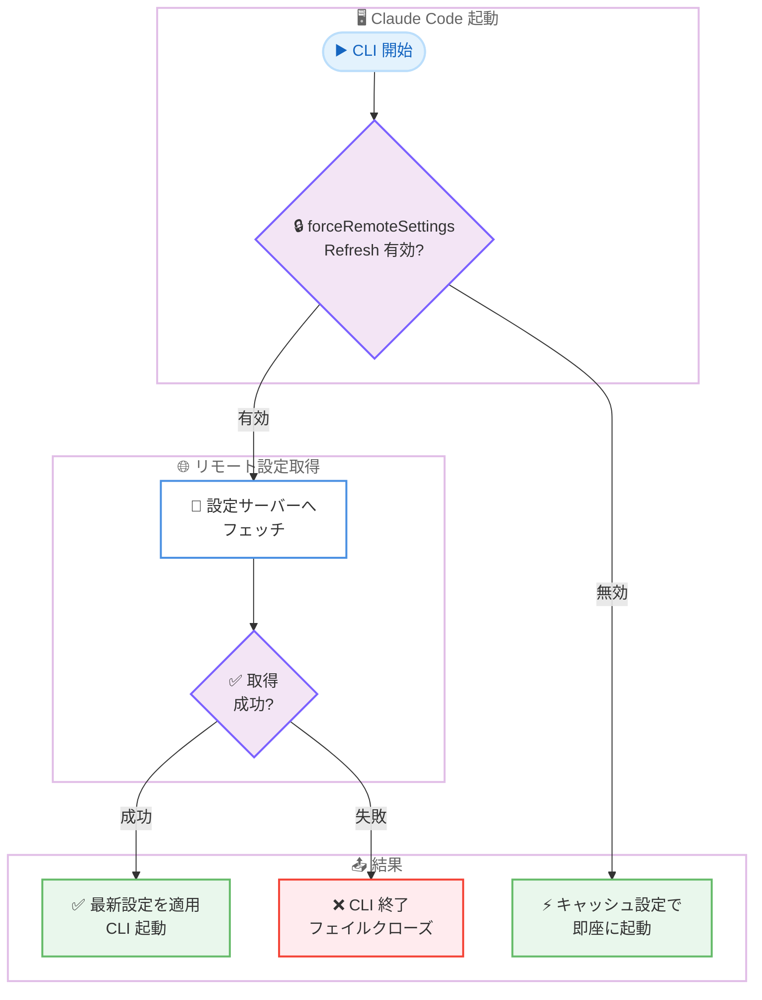
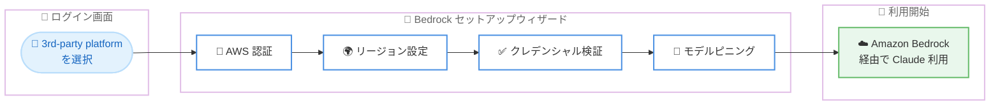
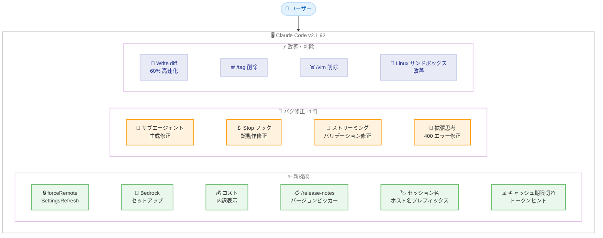

# Claude Code v2.1.92 リリース: Bedrock セットアップウィザード、リモート設定の強制リフレッシュ、コスト表示の詳細化

## メタデータ

| 項目 | 内容 |
|------|------|
| 発表日 | 2026-04-04 |
| ソース | Claude Code Changelog |
| カテゴリ | ツール更新 |
| 公式リンク | https://github.com/anthropics/claude-code/blob/main/CHANGELOG.md |

## 概要

Claude Code v2.1.92 が 2026 年 4 月 4 日にリリースされました。本リリースは新機能 6 件、バグ修正 11 件、改善 1 件、削除 2 件を含む大型アップデートです。特に注目すべきは、ログイン画面から直接 AWS Bedrock の認証・リージョン設定を行えるインタラクティブセットアップウィザードの追加と、リモートマネージド設定の取得を起動時に強制する `forceRemoteSettingsRefresh` ポリシー設定です。サブスクリプションユーザー向けにはモデル別・キャッシュヒット別のコスト内訳表示が追加され、コスト管理の可視性が大幅に向上しました。

## 詳細

### 背景

Claude Code は Anthropic が提供する CLI ベースの AI 開発支援ツールです。v2.1.92 は v2.1.91 の翌日リリースであり、エンタープライズ向けのセキュリティ・設定管理機能の強化と、多数の UI バグ修正に重点を置いたアップデートです。前バージョンでは MCP ツール結果の永続化オーバーライドやスキルのシェル実行無効化オプションが追加されましたが、本バージョンでは Bedrock 連携のオンボーディング改善、フェイルクローズ型のリモート設定管理、コスト可視化の強化など、運用面での利便性向上が中心です。

### 主な変更点

#### 新機能 (Added)

- **`forceRemoteSettingsRefresh` ポリシー設定**: 有効にすると、CLI 起動時にリモートマネージド設定の最新取得を強制し、取得に失敗した場合は起動を中止します (フェイルクローズ方式)。企業のセキュリティポリシーを確実に適用するための機能です
- **Bedrock インタラクティブセットアップウィザード**: ログイン画面で「3rd-party platform」を選択した際にアクセスできるウィザードが追加されました。AWS 認証、リージョン設定、クレデンシャル検証、モデルピニングを対話的にガイドします
- **`/cost` のモデル別・キャッシュヒット別内訳表示**: サブスクリプションユーザー向けに、モデルごとおよびキャッシュヒットごとのコスト内訳が `/cost` コマンドで確認できるようになりました
- **`/release-notes` のインタラクティブバージョンピッカー**: `/release-notes` コマンドがバージョンを対話的に選択できる形式に変更されました
- **Remote Control セッション名のホスト名プレフィックス**: Remote Control のセッション名にホスト名がデフォルトプレフィックスとして使用されるようになりました (例: `myhost-graceful-unicorn`)。`--remote-control-session-name-prefix` オプションで上書き可能です
- **プロンプトキャッシュ期限切れヒント**: Pro ユーザーがプロンプトキャッシュ期限切れ後にセッションに戻った際、次のターンで非キャッシュ送信されるおおよそのトークン数がフッターに表示されるようになりました

#### バグ修正 (Fixed)

- **サブエージェントの生成失敗**: 長時間実行セッション中に tmux ウィンドウが削除またはリナンバリングされた後、「Could not determine pane count」エラーでサブエージェント生成が恒久的に失敗する問題を修正
- **Stop フックの誤動作**: prompt-type Stop フックで小型高速モデルが `ok:false` を返した際にフックが誤って失敗する問題を修正。非 Stop prompt-type フックの `preventContinuation:true` セマンティクスも復元
- **ツール入力バリデーションエラー**: ストリーミング時に配列/オブジェクトフィールドが JSON エンコード文字列として出力された際のバリデーション失敗を修正
- **拡張思考の API 400 エラー**: 拡張思考が実際のコンテンツと並んで空白のみのテキストブロックを生成した際に発生する API 400 エラーを修正
- **フィードバック調査の誤送信**: オートパイロットのキー操作や連続プロンプトの数字衝突による意図しないフィードバック調査送信を修正
- **フルスクリーンモードの「esc to interrupt」ヒント**: テキスト選択が存在する処理中に「esc to interrupt」と「esc to clear」ヒントが同時表示される問題を修正
- **Homebrew インストールの更新プロンプト**: cask のリリースチャネルに合わせた更新プロンプトに修正 (`claude-code` は stable、`claude-code@latest` は latest)
- **`ctrl+e` のカーソル移動**: マルチラインプロンプトで行末にいる際に `ctrl+e` が次の行の末尾にジャンプする問題を修正
- **フルスクリーンモードのメッセージ重複表示**: iTerm2、Ghostty など DEC 2026 サポートのターミナルでスクロールアップ時に同じメッセージが 2 箇所に表示される問題を修正
- **`/clear` トークンヒントの表示**: アイドル復帰時の「/clear to save X tokens」ヒントが累積セッショントークン数ではなく現在のコンテキストサイズを正しく表示するように修正
- **プラグイン MCP サーバーの接続停止**: 未認証の claude.ai コネクタと重複するプラグイン MCP サーバーがセッション開始時に「connecting」状態のまま停止する問題を修正

#### 改善 (Changed)

- **Write ツールの diff 計算速度向上**: 大きなファイルに対する diff 計算が 60% 高速化されました (タブ、`&`、`$` を含むファイルで特に効果的)

#### 削除 (Removed)

- **`/tag` コマンド**: 削除されました
- **`/vim` コマンド**: 削除されました。vim モードの切り替えは `/config` の「Editor mode」から行えます

#### その他

- **Linux サンドボックスの改善**: `apply-seccomp` ヘルパーが npm ビルドとネイティブビルドの両方に同梱され、サンドボックス化されたコマンドでの unix-socket ブロッキングが復元されました

### 技術的な詳細

#### forceRemoteSettingsRefresh の動作フロー

`forceRemoteSettingsRefresh` ポリシーは、企業環境でリモートマネージド設定の適用を確実にするためのフェイルクローズ型メカニズムです。

1. CLI 起動時にリモート設定サーバーへのフェッチを開始
2. フェッチが完了するまで CLI の起動をブロック
3. フェッチが成功すれば最新設定を適用して起動
4. フェッチが失敗した場合は CLI を終了 (フェイルクローズ)

このアプローチにより、古い設定やキャッシュされた設定で動作するリスクを排除し、常に最新のセキュリティポリシーが適用された状態で CLI が動作することを保証します。

#### Bedrock セットアップウィザードの構成

新しいウィザードは以下の 4 ステップで構成されています。

1. **AWS 認証**: AWS クレデンシャルの入力・検証
2. **リージョン設定**: 利用する AWS リージョンの選択
3. **クレデンシャル検証**: 入力情報の正当性確認
4. **モデルピニング**: 使用するモデルの固定設定

#### Write ツールの diff 計算最適化

大きなファイルに対する diff 計算が 60% 高速化されました。特にタブ文字、`&`、`$` を含むファイルで顕著な改善が見られます。これらの文字はエスケープ処理のオーバーヘッドが大きかったため、最適化の恩恵が特に大きくなっています。

## アーキテクチャ図

### forceRemoteSettingsRefresh の起動フロー



### Bedrock セットアップウィザードフロー



### v2.1.92 変更点の全体像



## 開発者への影響

### 対象

- Claude Code CLI を利用する全ての開発者
- Amazon Bedrock 経由で Claude Code を利用するユーザー (セットアップウィザード)
- 企業のセキュリティ管理者 (`forceRemoteSettingsRefresh` ポリシー)
- サブスクリプションユーザー (コスト内訳表示)
- Pro ユーザー (プロンプトキャッシュ期限切れヒント)
- Remote Control 機能を利用しているユーザー (セッション名プレフィックス)
- 長時間セッションで tmux を使用しているユーザー (サブエージェント生成修正)
- フック機能を利用しているユーザー (Stop フック修正)
- Linux 環境のユーザー (サンドボックス改善)
- `/tag` または `/vim` コマンドを使用していたユーザー (コマンド削除)

### 必要なアクション

以下のコマンドで最新バージョンに更新できます。

```bash
# npm でのアップデート
npm update -g @anthropic-ai/claude-code

# Homebrew でのアップデート
brew upgrade claude-code

# 現在のバージョン確認
claude --version
```

**確認が推奨される項目:**

- **企業管理者**: `forceRemoteSettingsRefresh` ポリシーを有効にすることで、リモート設定の適用をフェイルクローズ方式で強制できます。セキュリティポリシーの確実な適用が必要な環境で導入を検討してください
- **Bedrock ユーザー**: ログイン画面から新しいセットアップウィザードを利用することで、AWS 認証からモデルピニングまで対話的に設定できます
- **`/tag` ユーザー**: `/tag` コマンドは削除されました。代替手段を確認してください
- **`/vim` ユーザー**: `/vim` コマンドは削除されました。vim モードの切り替えは `/config` の「Editor mode」から行えます

### 移行ガイド (該当する場合)

#### /tag コマンドの廃止

`/tag` コマンドは v2.1.92 で削除されました。

#### /vim コマンドの廃止

`/vim` コマンドは v2.1.92 で削除されました。vim モードの切り替えは以下の手順で行えます。

1. `/config` コマンドを実行
2. 「Editor mode」セクションで vim モードの有効/無効を切り替え

## コード例

### forceRemoteSettingsRefresh ポリシーの設定

マネージドポリシー設定で `forceRemoteSettingsRefresh` を有効にする例です。

```json
{
  "forceRemoteSettingsRefresh": true
}
```

この設定を有効にすると、CLI は起動時にリモート設定サーバーから最新の設定を取得するまでブロックされます。取得に失敗した場合は CLI が終了し、古い設定での動作を防止します。

### Remote Control セッション名のカスタマイズ

```bash
# デフォルト: ホスト名がプレフィックスとして使用される
# 例: myhost-graceful-unicorn
claude --remote-control

# カスタムプレフィックスを指定
claude --remote-control --remote-control-session-name-prefix "dev-team"
# 例: dev-team-graceful-unicorn
```

## 関連リンク

- [Claude Code Changelog](https://github.com/anthropics/claude-code/blob/main/CHANGELOG.md)
- [Claude Code GitHub リポジトリ](https://github.com/anthropics/claude-code)
- [Amazon Bedrock Claude ドキュメント](https://docs.aws.amazon.com/bedrock/latest/userguide/model-parameters-claude.html)
- [Claude Code v2.1.91](./2026-04-03-claude-code-v2-1-91.md)
- [Claude Code v2.1.90](./2026-04-02-claude-code-v2-1-90.md)

## まとめ

Claude Code v2.1.92 は、新機能 6 件、バグ修正 11 件、改善 1 件、削除 2 件を含む大型リリースです。最大の注目点はエンタープライズ向けの 2 つの機能追加です。`forceRemoteSettingsRefresh` ポリシーによりリモート設定のフェイルクローズ型強制取得が可能になり、企業のセキュリティポリシーを確実に適用できます。また、Bedrock インタラクティブセットアップウィザードにより、AWS Bedrock 経由での Claude Code 利用開始が大幅に簡素化されました。

サブスクリプションユーザー向けには `/cost` コマンドのモデル別・キャッシュヒット別内訳表示が追加され、コスト管理の透明性が向上しています。Pro ユーザーにはプロンプトキャッシュ期限切れ時のトークン数ヒントも追加され、コスト意識の高い運用を支援します。

バグ修正は 11 件と多く、tmux セッションでのサブエージェント生成失敗、Stop フックの誤動作、ストリーミング時のバリデーションエラー、拡張思考の API 400 エラーなど、安定性に関わる重要な修正が含まれています。UI 面でもフルスクリーンモードのメッセージ重複表示やキーバインドの問題が解消されました。

パフォーマンス面では Write ツールの diff 計算が 60% 高速化され、大きなファイルの編集操作がより快適になりました。一方、`/tag` と `/vim` コマンドが削除されたため、これらを使用していたユーザーは代替手段への移行が必要です。

全ての Claude Code ユーザーに対して早急なアップデートを推奨します。特に企業環境で Bedrock を利用しているユーザーやセキュリティポリシーの厳格な適用が求められる組織にとって、大きな恩恵のあるリリースです。
