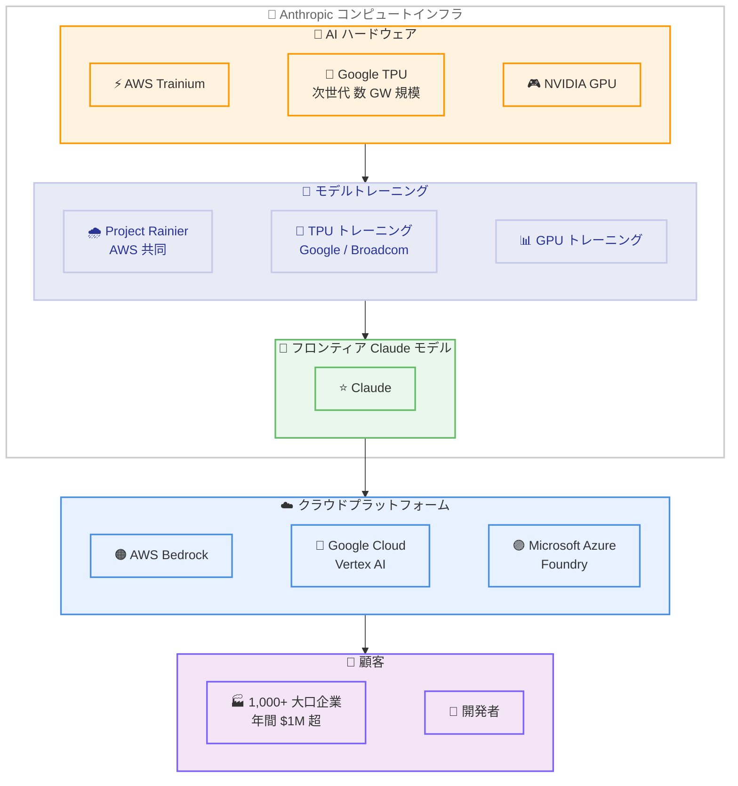

# Anthropic が Google および Broadcom との提携を拡大し、数ギガワット規模の次世代コンピュートを確保

## メタデータ

| 項目 | 内容 |
|------|------|
| 発表日 | 2026-04-06 |
| ソース | Anthropic News |
| カテゴリ | パートナーシップ / インフラ |
| 公式リンク | https://www.anthropic.com/news/google-broadcom-partnership-compute |

## 概要

Anthropic は 2026 年 4 月 6 日、Google および Broadcom と次世代 TPU 容量に関する新たな契約を締結したことを発表しました。数ギガワット規模のコンピュートインフラを 2027 年から稼働させる予定であり、フロンティア Claude モデルの開発と世界中の顧客からの需要に応えるための基盤を大幅に拡充します。

Anthropic の CFO である Krishna Rao 氏は、これを「これまでで最も重要なコンピュートへのコミットメント」と位置づけています。背景には、2026 年に入ってからの急激な成長があり、年間換算収益が 2025 年末の約 90 億ドルから 300 億ドルを超えるまでに拡大しています。また、年間 100 万ドル以上を支出するビジネス顧客は 2 か月足らずで 500 社から 1,000 社以上に倍増しました。

新たなコンピュートインフラの大部分は米国内に設置され、2025 年 11 月に発表した米国のコンピューティングインフラ強化への 500 億ドル投資コミットメントをさらに拡大するものとなります。

## 詳細

### 背景

Anthropic は複数のクラウドプラットフォームおよび AI ハードウェアを活用してモデルのトレーニングと推論を行う戦略を採用しています。2025 年 10 月には Google Cloud との TPU 容量拡大を発表しており、今回の契約はその関係をさらに深化させるものです。

2026 年に入り、Claude の需要は加速的に拡大しています。年間換算収益は 300 億ドルを突破し、2025 年末の約 90 億ドルから 3 倍以上に成長しました。2026 年 2 月の Series G 資金調達発表時点で 500 社以上だった年間 100 万ドル超の支出顧客は、わずか 2 か月で 1,000 社を超えるまでに倍増しています。

### 主な変更点

- **数ギガワット規模の次世代 TPU 容量を確保**: Google および Broadcom との新契約により、2027 年から順次稼働開始
- **Anthropic 史上最大のコンピュートコミットメント**: 急激な顧客基盤の拡大に対応するためのインフラ投資
- **米国内への大規模設置**: 新コンピュートインフラの大部分を米国内に設置し、500 億ドルの米国インフラ投資を拡大
- **年間換算収益 300 億ドル突破**: 2025 年末の約 90 億ドルから急成長
- **大口顧客数が 1,000 社超に倍増**: 年間 100 万ドル以上を支出するビジネス顧客が 2 か月で倍増

### 技術的な詳細

Anthropic は Claude のトレーニングと推論に複数の AI ハードウェアを使用しています。

- **AWS Trainium**: Amazon が提供する AI 専用チップ。AWS は引き続き Anthropic のプライマリクラウドプロバイダーであり、Project Rainier での協力を継続
- **Google TPU**: 今回の契約により次世代 TPU 容量を数ギガワット規模で確保。2025 年 10 月の容量拡大に続く大幅な増強
- **NVIDIA GPU**: 汎用 AI アクセラレーターとして活用

この多様なハードウェア戦略により、ワークロードに最適なチップを選択することが可能になり、顧客に対するパフォーマンスの向上とレジリエンスの強化を実現しています。Claude は、世界三大クラウドプラットフォームである Amazon Web Services (Bedrock)、Google Cloud (Vertex AI)、Microsoft Azure (Foundry) のすべてで利用可能な唯一のフロンティア AI モデルです。

## 開発者への影響

### 対象

- Claude API を利用している全ての開発者および企業
- AWS Bedrock、Google Cloud Vertex AI、Microsoft Azure Foundry 経由で Claude を利用している顧客
- 大規模なワークロードを Claude で処理している企業ユーザー

### 必要なアクション

現時点で開発者に即座のアクションは必要ありません。ただし、以下の点に注目することを推奨します。

- **2027 年以降のインフラ拡充**: 新 TPU 容量の稼働開始に伴い、スループットやレイテンシーの改善が期待される
- **マルチクラウド対応の継続**: Claude は引き続き AWS Bedrock、Google Cloud Vertex AI、Azure Foundry の 3 プラットフォームで利用可能
- **容量拡大による恩恵**: 急成長する需要に対応するインフラ拡充により、サービスの安定性向上が見込まれる

## アーキテクチャ図

## 関連リンク

- [公式発表](https://www.anthropic.com/news/google-broadcom-partnership-compute)
- [Anthropic News](https://www.anthropic.com/news)
- [AWS Bedrock - Claude](https://aws.amazon.com/bedrock/claude/)
- [Google Cloud Vertex AI](https://cloud.google.com/vertex-ai)
- [Microsoft Azure Foundry](https://azure.microsoft.com/products/ai-foundry)

## まとめ

Anthropic と Google および Broadcom の提携拡大は、急速に成長する Claude の需要に対応するための戦略的なインフラ投資です。数ギガワット規模の次世代 TPU 容量を 2027 年から確保することで、フロンティアモデルの開発と顧客への安定したサービス提供を支えます。

年間換算収益が 300 億ドルを突破し、年間 100 万ドル以上を支出する大口顧客が 1,000 社を超えるなど、Anthropic の成長は加速しています。AWS Trainium、Google TPU、NVIDIA GPU という複数の AI ハードウェアを活用するマルチプラットフォーム戦略と、三大クラウドプラットフォーム全てでの展開により、Claude はパフォーマンスとレジリエンスの両面で競争力を維持しています。新インフラの大部分が米国内に設置されることは、2025 年 11 月の 500 億ドル投資コミットメントの実行を裏付けるものでもあります。
