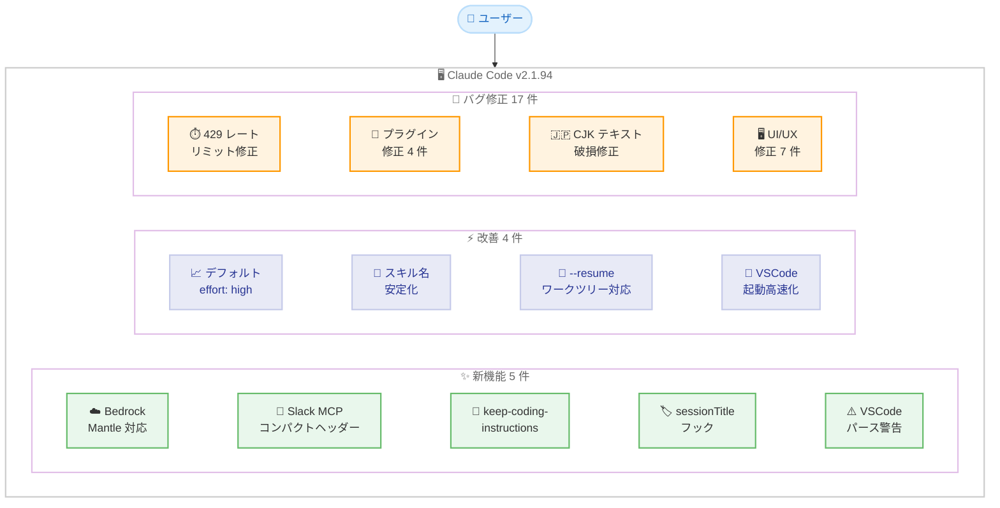
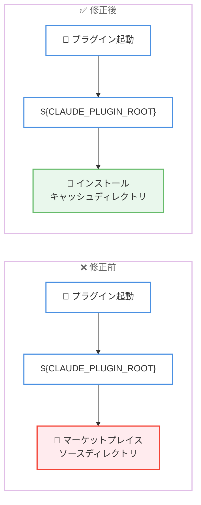

# Claude Code v2.1.94 リリース: Mantle 対応、デフォルトエフォートレベル引き上げ、CJK テキスト破損修正

## メタデータ

| 項目 | 内容 |
|------|------|
| 発表日 | 2026-04-07 |
| ソース | Claude Code Changelog |
| カテゴリ | Claude Code / CLI ツール |
| 公式リンク | https://github.com/anthropics/claude-code/blob/main/CHANGELOG.md |

## 概要

Claude Code v2.1.94 が 2026 年 4 月 7 日にリリースされました。本リリースは新機能 5 件、改善 4 件、バグ修正 17 件を含む大型アップデートです。最も注目すべき変更点は、Amazon Bedrock powered by Mantle への対応 (`CLAUDE_CODE_USE_MANTLE=1`)、API キー・Bedrock/Vertex/Foundry・Team・Enterprise ユーザーのデフォルトエフォートレベルが medium から high に引き上げられたこと、そして CJK テキストがストリーミング時に U+FFFD に破損する問題の修正です。プラグイン関連の修正も多数含まれており、フック・スキル・`CLAUDE_PLUGIN_ROOT` に関する安定性が大幅に向上しました。

## 詳細

### 背景

Claude Code は Anthropic が提供する CLI ベースの AI 開発支援ツールです。v2.1.94 は v2.1.92 からの継続的なアップデートであり、新しいインフラストラクチャ統合 (Mantle)、デフォルト動作の改善、プラグインエコシステムの安定化、UI/UX の多数の修正に重点を置いたリリースです。特にプラグイン関連では、フックの無視・ファイルパス解決・スキル名の安定性に関する修正が集中しており、プラグイン開発者にとって重要なリリースとなっています。

### 主な変更点

#### 新機能 (Added)

- **Amazon Bedrock powered by Mantle 対応**: 環境変数 `CLAUDE_CODE_USE_MANTLE=1` を設定することで、Mantle を通じた Bedrock 接続が利用可能になりました。新しいインフラストラクチャ統合オプションです
- **Slack MCP send-message のコンパクトヘッダー**: Slack MCP の send-message ツール呼び出し時に、クリック可能なチャンネルリンクを含むコンパクトな `Slacked #channel` ヘッダーが表示されるようになりました
- **`keep-coding-instructions` フロントマターフィールド**: プラグインの出力スタイルで `keep-coding-instructions` フロントマターフィールドがサポートされるようになりました
- **`hookSpecificOutput.sessionTitle` フック**: `UserPromptSubmit` フックでセッションタイトルを設定できる `hookSpecificOutput.sessionTitle` が追加されました
- **[VSCode] settings.json パースエラーの警告バナー**: `settings.json` ファイルのパースに失敗した場合に警告バナーが表示されるようになり、パーミッションルールが適用されていないことをユーザーに通知します

#### 改善 (Changed)

- **デフォルトエフォートレベルの引き上げ**: API キー、Bedrock/Vertex/Foundry、Team、Enterprise ユーザーのデフォルトエフォートレベルが medium から high に変更されました。`/effort` コマンドで個別に調整可能です
- **プラグインスキルの呼び出し名の安定化**: `"skills": ["./"]` で宣言されたプラグインスキルが、ディレクトリのベースネームではなくスキルのフロントマター `name` を呼び出し名として使用するようになりました。これにより、インストール方法に依存しない安定した名前が保証されます
- **`--resume` の改善**: 同じリポジトリの他のワークツリーからのセッションを `cd` コマンドを表示する代わりに直接再開できるようになりました
- **[VSCode] コールドオープン時のサブプロセス削減**: セッション開始時のサブプロセス作業が削減され、起動パフォーマンスが向上しました

#### バグ修正 (Fixed)

- **429 レートリミット応答後のエージェント停止**: 長い Retry-After ヘッダーを含む 429 レートリミット応答後にエージェントが固まっているように見える問題を修正。エラーがサイレントに待機するのではなく即座に表示されるようになりました
- **macOS でのコンソールログイン失敗**: ログインキーチェーンがロックされている、またはパスワードが同期していない場合に macOS でコンソールログインが「Not logged in」でサイレントに失敗する問題を修正。エラーが表示されるようになり、`claude doctor` が修正方法を診断します
- **プラグインスキルフックの無視**: YAML フロントマターで定義されたプラグインスキルフックがサイレントに無視される問題を修正
- **プラグインフックの "No such file or directory" エラー**: `CLAUDE_PLUGIN_ROOT` が設定されていない場合にプラグインフックが「No such file or directory」で失敗する問題を修正
- **`${CLAUDE_PLUGIN_ROOT}` のパス解決**: ローカルマーケットプレイスプラグインの起動時に `${CLAUDE_PLUGIN_ROOT}` がインストールキャッシュではなくマーケットプレイスソースディレクトリに解決される問題を修正
- **スクロールバックの diff 重複表示**: 長時間セッションでスクロールバックに同じ diff が繰り返し表示され、空白ページが出現する問題を修正
- **マルチラインプロンプトのインデント**: トランスクリプトでマルチラインのユーザープロンプトの折り返し行が `>` キャレットの下ではなくテキストの下にインデントされるよう修正
- **Shift+Space の入力**: 検索入力で Shift+Space がスペース文字ではなくリテラルの "space" を挿入する問題を修正
- **tmux 内でのハイパーリンク**: xterm.js ベースのターミナル (VS Code、Hyper、Tabby) 内の tmux でハイパーリンクをクリックすると 2 つのブラウザタブが開く問題を修正
- **オルトスクリーンのレンダリングバグ**: スクロール中にコンテンツの高さが変更されるとゴーストラインが蓄積するオルトスクリーンのレンダリングバグを修正
- **`FORCE_HYPERLINK` 環境変数の無視**: `settings.json` の `env` で設定した `FORCE_HYPERLINK` 環境変数が無視される問題を修正
- **ネイティブターミナルカーソルのタブ追従**: ダイアログで選択されたタブにネイティブターミナルカーソルが追従しない問題を修正。スクリーンリーダーやマグニファイアがタブナビゲーションを追跡できるようになりました
- **Bedrock での Sonnet 3.5 v2 呼び出し**: `us.` 推論プロファイル ID を使用することで Bedrock での Sonnet 3.5 v2 呼び出しを修正
- **SDK/print モードの中断時の応答保存**: ストリーム中断時に部分的なアシスタント応答が会話履歴に保持されるよう修正
- **CJK テキストの破損**: stream-json の入出力でチャンク境界が UTF-8 シーケンスを分割した際に CJK やその他のマルチバイトテキストが U+FFFD に破損する問題を修正
- **[VSCode] ドロップダウンメニューの選択ミス**: マウスがリスト上にある状態でタイピングや矢印キーを使用した際にドロップダウンメニューが誤った項目を選択する問題を修正

### 技術的な詳細

#### デフォルトエフォートレベルの変更

エフォートレベルは Claude Code がタスクに費やす計算リソースの量を制御するパラメータです。本リリースで、無料ユーザー以外の全ユーザー (API キー、Bedrock/Vertex/Foundry、Team、Enterprise) のデフォルトが medium から high に変更されました。これにより、デフォルト状態でより深い分析と高品質な応答が得られるようになります。

エフォートレベルは `/effort` コマンドで個別に調整可能です。

```
/effort low    # 軽量な応答
/effort medium # 従来のデフォルト
/effort high   # 新しいデフォルト - より深い分析
```

#### CJK テキスト破損の修正

stream-json の入出力処理において、チャンク境界が UTF-8 マルチバイトシーケンスの途中で分割された場合、CJK 文字 (日本語、中国語、韓国語) やその他のマルチバイト文字が U+FFFD (置換文字) に破損する問題が修正されました。これは日本語を含む多言語環境で Claude Code を使用しているユーザーにとって特に重要な修正です。

#### プラグインエコシステムの安定化

本リリースでは、プラグインに関連する複数の修正が行われました。

1. **フックの無視修正**: YAML フロントマターで定義されたスキルフックが正しく認識されるようになりました
2. **パス解決の修正**: `${CLAUDE_PLUGIN_ROOT}` がマーケットプレイスソースではなく正しいインストールキャッシュディレクトリに解決されるようになりました
3. **`CLAUDE_PLUGIN_ROOT` 未設定時の修正**: 環境変数が未設定の場合でもフックが正常に動作するようになりました
4. **スキル名の安定化**: フロントマターの `name` フィールドが呼び出し名として使用され、インストール方法に依存しない名前が保証されるようになりました

#### アクセシビリティの改善

ダイアログ内のタブナビゲーションにおいて、ネイティブターミナルカーソルが選択されたタブに追従するようになりました。これにより、スクリーンリーダーやスクリーンマグニファイアを使用するユーザーがタブの切り替えを正確に追跡できるようになります。

## アーキテクチャ図

### v2.1.94 変更点の全体像



### プラグインパス解決の修正フロー



## 開発者への影響

### 対象

- Claude Code CLI を利用する全ての開発者
- API キー、Bedrock/Vertex/Foundry、Team、Enterprise ユーザー (デフォルトエフォートレベル変更)
- Amazon Bedrock 経由で Mantle を利用するユーザー (Mantle 対応)
- プラグイン開発者 (フック・スキル名・パス解決の修正)
- 日本語・中国語・韓国語環境のユーザー (CJK テキスト破損修正)
- スクリーンリーダーを使用するユーザー (アクセシビリティ改善)
- tmux を xterm.js ベースのターミナルで使用するユーザー (ハイパーリンク修正)
- VS Code 拡張機能のユーザー (パース警告、ドロップダウン修正、起動高速化)
- macOS ユーザー (コンソールログイン修正)

### 必要なアクション

以下のコマンドで最新バージョンに更新できます。

```bash
# npm でのアップデート
npm update -g @anthropic-ai/claude-code

# Homebrew でのアップデート
brew upgrade claude-code

# 現在のバージョン確認
claude --version
```

**確認が推奨される項目:**

- **全ユーザー (無料以外)**: デフォルトエフォートレベルが high に変更されました。従来の medium に戻したい場合は `/effort medium` で調整できます
- **Mantle ユーザー**: `CLAUDE_CODE_USE_MANTLE=1` を環境変数に設定することで Bedrock powered by Mantle を利用できます
- **プラグイン開発者**: スキルの呼び出し名がフロントマター `name` に基づくよう変更されました。既存のプラグインでスキル名の不一致がないか確認してください
- **CJK 環境のユーザー**: ストリーミング時のテキスト破損が修正されました。以前発生していた文字化け問題が解消されています

### 移行ガイド (該当する場合)

#### デフォルトエフォートレベルの変更

API キー、Bedrock/Vertex/Foundry、Team、Enterprise ユーザーのデフォルトエフォートレベルが medium から high に変更されました。

- **影響**: デフォルトでより多くのトークンを消費する可能性があります
- **対応**: 従来の動作を維持したい場合は `/effort medium` を実行するか、設定で固定してください

#### プラグインスキル名の変更

`"skills": ["./"]` で宣言されたプラグインスキルの呼び出し名が、ディレクトリのベースネームからフロントマターの `name` フィールドに変更されました。

- **影響**: 既存のスキル呼び出しが一致しなくなる可能性があります
- **対応**: フロントマターの `name` フィールドが正しく設定されていることを確認してください

## コード例

### Mantle 対応の有効化

```bash
# 環境変数で Mantle を有効化
export CLAUDE_CODE_USE_MANTLE=1

# Claude Code を起動
claude
```

### エフォートレベルの調整

```bash
# セッション内でエフォートレベルを確認・変更
/effort        # 現在のレベルを表示
/effort medium # 従来のデフォルトに戻す
/effort high   # 新しいデフォルト
/effort low    # 軽量モード
```

### UserPromptSubmit フックでセッションタイトルを設定

```json
{
  "hooks": {
    "UserPromptSubmit": [
      {
        "command": "echo '{\"sessionTitle\": \"My Custom Title\"}'",
        "type": "command"
      }
    ]
  }
}
```

## 関連リンク

- [Claude Code Changelog](https://github.com/anthropics/claude-code/blob/main/CHANGELOG.md)
- [Claude Code GitHub リポジトリ](https://github.com/anthropics/claude-code)
- [Amazon Bedrock Claude ドキュメント](https://docs.aws.amazon.com/bedrock/latest/userguide/model-parameters-claude.html)
- [Claude Code v2.1.92](./2026-04-04-claude-code-v2-1-92.md)
- [Claude Code v2.1.91](./2026-04-03-claude-code-v2-1-91.md)

## まとめ

Claude Code v2.1.94 は、新機能 5 件、改善 4 件、バグ修正 17 件を含む大型リリースです。最も注目すべき変更は 3 つあります。

第一に、Amazon Bedrock powered by Mantle への対応が追加されました。`CLAUDE_CODE_USE_MANTLE=1` を設定するだけで新しいインフラストラクチャ経由での接続が可能になります。

第二に、API キー・Bedrock/Vertex/Foundry・Team・Enterprise ユーザーのデフォルトエフォートレベルが medium から high に引き上げられました。これにより、デフォルト状態でより深い分析と高品質な応答が期待できます。コスト面が気になる場合は `/effort medium` で従来の設定に戻すことが可能です。

第三に、プラグインエコシステムの安定性が大幅に向上しました。YAML フロントマターのフック無視、`CLAUDE_PLUGIN_ROOT` のパス解決エラー、スキル名の不安定性など、プラグイン開発・利用に影響する 4 件の問題が修正されています。

日本語・中国語・韓国語ユーザーにとって特に重要な修正として、stream-json のチャンク境界で UTF-8 マルチバイトシーケンスが分割された際の CJK テキスト破損 (U+FFFD) が解消されました。

UI/UX 面では、429 レートリミット応答後のエージェント停止、tmux 内でのハイパーリンク二重オープン、オルトスクリーンのゴーストライン、スクロールバックの diff 重複表示など、多数の問題が修正されています。アクセシビリティの改善として、スクリーンリーダーがタブナビゲーションを追跡できるようになりました。

全ての Claude Code ユーザーに対して早急なアップデートを推奨します。特に CJK 環境のユーザー、プラグイン開発者、Bedrock/Mantle ユーザーにとって恩恵の大きいリリースです。
