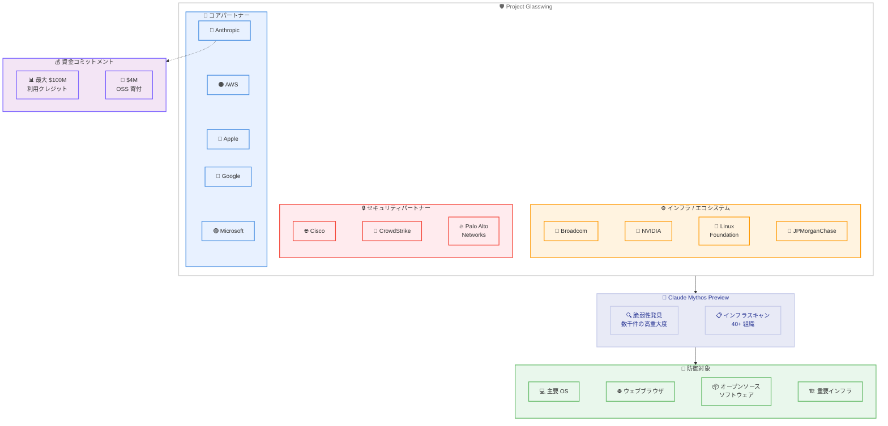

# Anthropic が Project Glasswing を発表 -- Claude Mythos Preview による防御的サイバーセキュリティの新時代

## メタデータ

| 項目 | 内容 |
|------|------|
| 発表日 | 2026-04-07 |
| ソース | Claude API Release Notes / Anthropic |
| カテゴリ | セキュリティ / AI モデル |
| 公式リンク | https://www.anthropic.com/glasswing |

## 概要

Anthropic は 2026 年 4 月 7 日、防御的サイバーセキュリティに特化した新イニシアチブ「Project Glasswing」を発表しました。このプロジェクトでは、未公開のフロンティアモデル「Claude Mythos Preview」を招待制のゲーテッドリサーチプレビューとして提供し、世界で最も重要なソフトウェアインフラのセキュリティ強化を目指します。

Project Glasswing には AWS、Apple、Broadcom、Cisco、CrowdStrike、Google、JPMorganChase、Linux Foundation、Microsoft、NVIDIA、Palo Alto Networks など 12 の主要パートナーが参画しており、さらに 40 以上の組織が重要インフラのスキャンにアクセスを付与されています。Anthropic は最大 1 億ドルの利用クレジットと、オープンソースセキュリティ組織への 400 万ドルの直接寄付をコミットしています。

## 詳細

### 背景

サイバー犯罪による世界的な経済損失は年間約 5,000 億ドルに達しており、ソフトウェアの脆弱性発見と防御は現代のデジタルインフラにおいて最も重要な課題の 1 つです。2016 年の初回 DARPA Cyber Grand Challenge から 10 年が経過し、フロンティア AI モデルは脆弱性の発見と悪用において最も熟練した人間のレベルに匹敵する段階に到達しました。

この状況において、攻撃者よりも防御者が先に AI を活用できる環境を構築することが急務となっています。Project Glasswing は「AI 時代のサイバーセキュリティにおいて、防御者に持続的な優位性を与える」ことを目的として設計されました。

### 主な変更点

- **Claude Mythos Preview の限定提供**: 汎用的な未公開フロンティアモデルを防御的サイバーセキュリティ用途に招待制で提供
- **12 社の主要パートナーによる連携**: AWS、Apple、Broadcom、Cisco、CrowdStrike、Google、JPMorganChase、Linux Foundation、Microsoft、NVIDIA、Palo Alto Networks が参画
- **40 以上の組織へのアクセス拡大**: 重要ソフトウェアインフラのスキャンのために追加組織にアクセスを付与
- **最大 1 億ドルの利用クレジット**: Anthropic が Mythos Preview の利用クレジットをコミット
- **400 万ドルのオープンソース支援**: オープンソースセキュリティ組織への直接寄付

### 技術的な詳細

Claude Mythos Preview は、Anthropic が開発した汎用フロンティアモデルであり、ソフトウェア脆弱性の発見と悪用において、最も熟練した人間を除くほぼ全ての専門家を上回る能力を持っています。

- **脆弱性発見実績**: 主要な OS およびウェブブラウザのすべてにおいて、数千件の高重大度脆弱性を発見
- **対象範囲**: 全主要 OS (Windows、macOS、Linux) および主要ウェブブラウザを含む重要ソフトウェア
- **アクセス方式**: ゲーテッドリサーチプレビューとして招待制で提供。一般公開 API での利用は現時点では不可
- **用途制限**: 防御的サイバーセキュリティ作業に限定。ローンチパートナーが防御目的で活用

## 開発者への影響

### 対象

- セキュリティ研究者およびサイバーセキュリティ企業
- 重要インフラを運用する企業のセキュリティチーム
- オープンソースプロジェクトのメンテナーおよびセキュリティ担当者
- Claude API を利用している開発者 (将来的な一般提供の可能性)

### 必要なアクション

現時点で一般の開発者に即座のアクションは必要ありません。ただし、以下の点に注目することを推奨します。

- **招待制アクセス**: Claude Mythos Preview は現在招待制のゲーテッドリサーチプレビューとして提供されており、一般の Claude API からはアクセスできません
- **パートナー経由での活用**: セキュリティ企業や重要インフラ運用者は、パートナー組織を通じたアクセスの可能性を確認してください
- **今後の展開に注目**: Mythos Preview の一般提供や、防御的セキュリティツールとしての統合が今後発表される可能性があります

## アーキテクチャ図

## 関連リンク

- [Project Glasswing 公式ページ](https://www.anthropic.com/glasswing)
- [Claude API Release Notes](https://platform.claude.com/docs/en/release-notes/overview)
- [Anthropic News](https://www.anthropic.com/news)

## まとめ

Project Glasswing は、AI 時代のサイバーセキュリティにおいて防御者に持続的な優位性を与えるための画期的なイニシアチブです。Claude Mythos Preview は、主要な OS やウェブブラウザを含む重要ソフトウェアにおいて数千件の高重大度脆弱性を発見する能力を実証しており、防御的セキュリティの新たな基準を確立しようとしています。

AWS、Apple、Google、Microsoft をはじめとする 12 社のパートナーと 40 以上の組織が参画し、最大 1 億ドルの利用クレジットと 400 万ドルのオープンソース支援という大規模な資金コミットメントが伴う本プロジェクトは、年間約 5,000 億ドルに上るサイバー犯罪被害への対抗策として、業界全体での協調的な取り組みを象徴しています。現時点では招待制のリサーチプレビューに限定されていますが、今後の一般展開や防御ツールとしての統合に注目が集まります。
