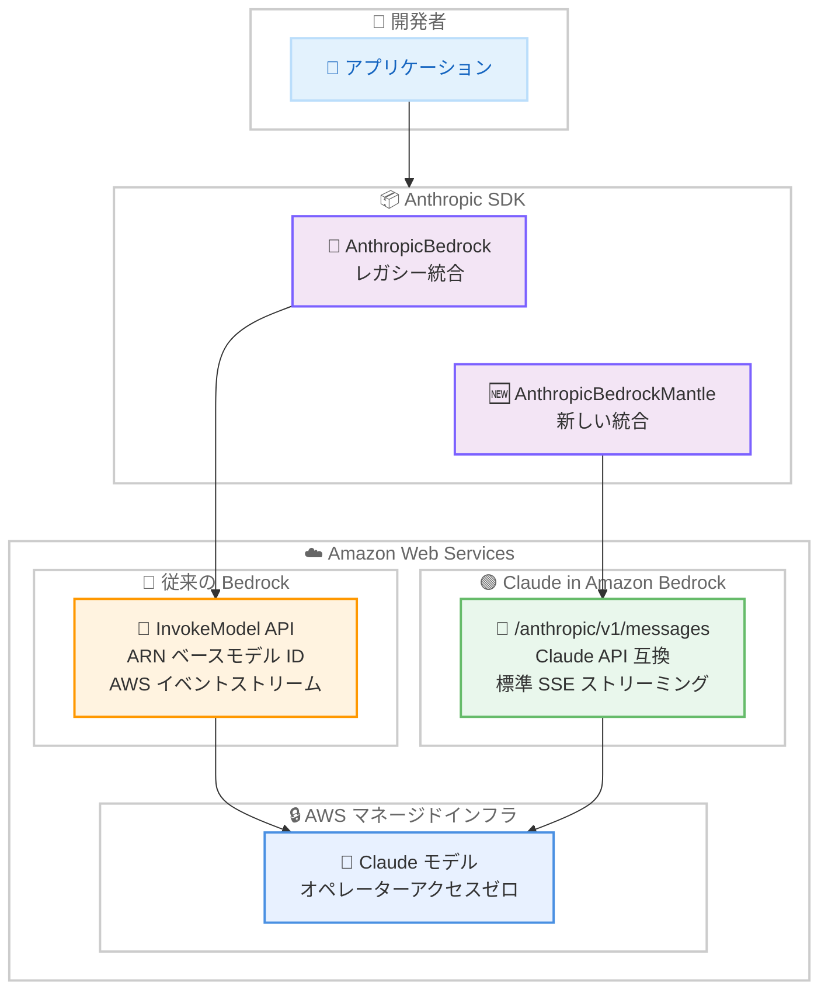

# Messages API が Amazon Bedrock でリサーチプレビューとして利用可能に

## メタデータ

| 項目 | 内容 |
|------|------|
| 発表日 | 2026-04-07 |
| ソース | Claude API Release Notes |
| カテゴリ | API / プラットフォーム |
| 公式リンク | https://platform.claude.com/docs/en/release-notes/overview |

## 概要

Anthropic は 2026 年 4 月 7 日、Messages API を Amazon Bedrock 上でリサーチプレビューとして提供開始したことを発表しました。新しいエンドポイント `/anthropic/v1/messages` により、Anthropic のファーストパーティ Claude API と同一のリクエスト形式を AWS マネージドインフラ上で利用できるようになります。

これまで Amazon Bedrock で Claude を利用するには、AWS 独自の `InvokeModel` API や Converse API を使用する必要がありましたが、今回の新エンドポイントにより、Anthropic API と同じコード構造で直接 Bedrock 経由のリクエストが可能になります。オペレーターアクセスゼロ (Anthropic スタッフがインフラにアクセスできない) の AWS セキュリティ境界内で動作するため、セキュリティ要件の厳しいアプリケーションにも適しています。

## 詳細

### 背景

Amazon Bedrock は Claude モデルを提供する主要プラットフォームの 1 つですが、従来の統合方法では AWS 固有の API 形式 (`InvokeModel` API、ARN ベースのモデル識別子、AWS イベントストリームエンコーディング) を使用する必要がありました。開発者は Anthropic の直接 API 向けに書かれたコードを Bedrock 向けに変換するアダプターコードの作成が必要であり、2 つのプラットフォーム間での移植性に課題がありました。

今回の「Claude in Amazon Bedrock」は、この課題を根本的に解決する新しい統合方式です。Anthropic のファーストパーティ API と同じリクエストシェイプを AWS マネージドインフラ上で直接利用できるため、コード変更を最小限に抑えたプラットフォーム移行が可能になります。

### 主な変更点

- **新エンドポイント `https://bedrock-mantle.{region}.api.aws/anthropic/v1/messages`**: Anthropic API と同一のリクエスト形式を使用
- **標準 SSE ストリーミング対応**: 従来の AWS イベントストリームエンコーディングではなく、標準的な Server-Sent Events を使用
- **オペレーターアクセスゼロ**: Anthropic スタッフによるインフラへのアクセスが一切なく、全てが AWS セキュリティ境界内で動作
- **`us-east-1` リージョンで利用可能**: リサーチプレビューとして US East (N. Virginia) リージョンのみで提供
- **専用 AWS アカウントが必要**: アイソレーションのため、リサーチプレビューでは専用アカウントが必要
- **アクセス申請制**: Anthropic アカウントエグゼクティブへの問い合わせが必要

### 技術的な詳細

新しい「Claude in Amazon Bedrock」は、従来の Bedrock 統合 (レガシー) と以下の点で異なります。

**認証方式** (3 つのパスをサポート):

- **Bedrock サービスロール (推奨)**: AWS マネージドキーを使用した最も安全な長期アクセス
- **IAM 引き受けロール**: ID フェデレーション経由のアクセス (最大 12 時間セッション)
- **Bearer トークン**: IAM ロールなしの短期アクセス (最大 12 時間、非推奨)

**サポートされる機能**:

- Messages API (`/v1/messages`)
- プロンプトキャッシング
- 拡張思考 (Extended Thinking)
- ツール使用 (クライアント定義ツール)
- 引用 (Citations)
- 構造化出力 (Structured Outputs)
- リージョン内推論 (リクエストが単一 AWS リージョン内に留まる)

**サポートされない機能**:

- Anthropic 定義ツール (Web Search、Web Fetch、Remote MCP、Memory、Files API、Computer Use、Skills、Code Execution)
- Agent API
- Message Batches API
- `/v1/users` エンドポイント

**クォータ**:

- デフォルト: 200 万入力トークン/分 (TPM)
- 最大 400 万入力 TPM まで追加承認なしでリクエスト可能
- RPM 制限は AWS 側で管理

**データ保持**:

- 全推論データは AWS ストレージに 30 日間保持
- ゼロデータ保持 (ZDR) オプトアウトは本オファリングでは利用不可

## 開発者への影響

### 対象

- Amazon Bedrock 経由で Claude を利用している開発者および企業
- Anthropic API と Bedrock の両方でコードの移植性を求めている開発者
- AWS セキュリティ境界内での Claude 利用が必要なエンタープライズ顧客
- 従来の `InvokeModel` API からの移行を検討している開発者

### 必要なアクション

1. **アクセスの申請**: Anthropic アカウントエグゼクティブに連絡してリサーチプレビューへのアクセスをリクエスト
2. **専用 AWS アカウントの準備**: `us-east-1` リージョンに専用の AWS アカウントを作成
3. **許可リスト登録の待機**: アカウント ID を提出後、Bedrock Marketplace チームによる許可リスト登録 (通常 24 時間以内)
4. **SDK の更新**: Anthropic SDK の Bedrock 対応パッケージをインストール

### 移行ガイド

従来の Bedrock 統合 (`AnthropicBedrock` / `InvokeModel`) から新しい統合 (`AnthropicBedrockMantle`) への移行は、主にクライアント初期化の変更で対応できます。

**変更が必要な箇所**:

- クライアントクラス: `AnthropicBedrock` から `AnthropicBedrockMantle` へ変更
- エンドポイント: 自動的に `bedrock-mantle.{region}.api.aws` を使用
- モデル ID: AWS から提供されるモデル ID を使用 (ARN ベースではなく `anthropic.` プレフィックス付き)

**変更が不要な箇所**:

- リクエストボディの構造 (messages、max_tokens 等)
- レスポンスの処理ロジック
- ストリーミングの処理 (標準 SSE に自動対応)

## コード例

### 従来の Bedrock 統合 (レガシー)

```python
from anthropic import AnthropicBedrock

# 従来の Bedrock クライアント (InvokeModel API を使用)
client = AnthropicBedrock(aws_region="us-west-2")

message = client.messages.create(
    model="global.anthropic.claude-opus-4-6-v1",
    max_tokens=1024,
    messages=[{"role": "user", "content": "Hello, Claude"}],
)
print(message.content[0].text)
```

### 新しい Claude in Amazon Bedrock (Messages API)

```python
from anthropic import AnthropicBedrockMantle

# 新しい Bedrock Mantle クライアント (Messages API を直接使用)
client = AnthropicBedrockMantle(aws_region="us-east-1")

message = client.messages.create(
    model="CLAUDE_MODEL_ID",
    max_tokens=1024,
    messages=[{"role": "user", "content": "Hello, Claude"}],
)
print(message.content[0].text)
```

### curl での直接リクエスト

```bash
curl https://bedrock-mantle.us-east-1.api.aws/anthropic/v1/messages \
  --aws-sigv4 "aws:amz:us-east-1:bedrock-mantle" \
  --user "$AWS_ACCESS_KEY_ID:$AWS_SECRET_ACCESS_KEY" \
  -H "x-amz-security-token: $AWS_SESSION_TOKEN" \
  -H "content-type: application/json" \
  -H "anthropic-version: 2023-06-01" \
  -d '{
    "model": "CLAUDE_MODEL_ID",
    "max_tokens": 1024,
    "messages": [
      {"role": "user", "content": "Hello, Claude"}
    ]
  }'
```

## アーキテクチャ図



## 関連リンク

- [Claude API Release Notes](https://platform.claude.com/docs/en/release-notes/overview)
- [Claude in Amazon Bedrock ドキュメント](https://platform.claude.com/docs/en/build-with-claude/claude-in-amazon-bedrock)
- [Claude on Amazon Bedrock - レガシー統合](https://platform.claude.com/docs/en/build-with-claude/claude-on-amazon-bedrock)
- [Anthropic Client SDK](https://platform.claude.com/docs/en/api/client-sdks)
- [AWS Bedrock](https://aws.amazon.com/bedrock/)

## まとめ

Messages API の Amazon Bedrock リサーチプレビューは、Anthropic のファーストパーティ API と同一のリクエスト形式を AWS マネージドインフラ上で利用可能にする重要なアップデートです。新エンドポイント `/anthropic/v1/messages` と `AnthropicBedrockMantle` クライアントにより、開発者はアダプターコードなしで Claude API のコードを Bedrock 上で直接実行できるようになります。

オペレーターアクセスゼロの AWS セキュリティ境界内で動作するため、セキュリティ要件の厳しいエンタープライズ環境にも適しています。現時点では `us-east-1` リージョンのみでの提供かつアクセス申請制ですが、プロンプトキャッシング、拡張思考、ツール使用、構造化出力など主要な機能をサポートしており、Anthropic 定義ツールや Batches API を除く多くのユースケースに対応可能です。従来の Bedrock 統合からの移行もクライアント初期化の変更が中心であり、リクエストボディやレスポンス処理のロジックはそのまま流用できます。
