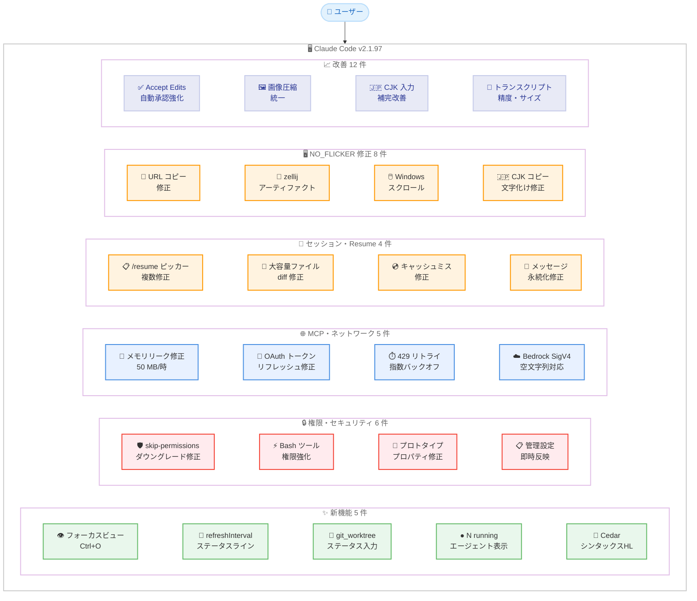
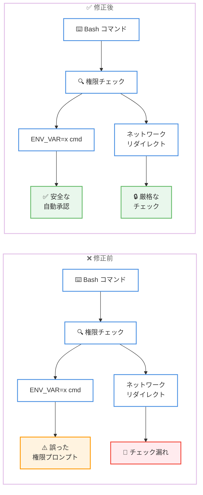

# Claude Code v2.1.97 リリース: フォーカスビュー、権限強化、NO_FLICKER 改善

## メタデータ

| 項目 | 内容 |
|------|------|
| 発表日 | 2026-04-08 |
| ソース | Claude Code Changelog |
| カテゴリ | Claude Code / メジャーリリース |
| 公式リンク | https://github.com/anthropics/claude-code/blob/main/CHANGELOG.md |

## 概要

Claude Code v2.1.97 が 2026 年 4 月 8 日にリリースされました。本リリースは新機能 5 件、改善 12 件、バグ修正 27 件を含む大規模なメジャーアップデートです。最も注目すべき変更点は、`NO_FLICKER` モードにおけるフォーカスビュー (`Ctrl+O`) の追加、権限・セキュリティ関連の 6 件の修正による大幅な堅牢化、MCP メモリリーク (約 50 MB/時) の修正、`/resume` ピッカーの複数の問題解消、そして NO_FLICKER モードにおける 8 件のバグ修正です。Accept Edits モードや自動モードの権限自動承認の改善、429 リトライの指数バックオフ適用など、日常的な使用体験を大きく向上させるリリースとなっています。

## 詳細

### 背景

Claude Code は Anthropic が提供する CLI ベースの AI 開発支援ツールです。v2.1.97 は v2.1.94 からの継続的なアップデートであり、UI の新機能 (フォーカスビュー)、権限システムの堅牢化、MCP 接続の安定性向上、`/resume` セッション復旧の信頼性改善、そして NO_FLICKER モードの成熟化に重点を置いたリリースです。修正件数 27 件という規模は近年のリリースの中でも特に大きく、多くの領域にわたる品質改善が行われています。

### 主な変更点

#### 新機能 (Added)

- **フォーカスビュー** (`Ctrl+O`): `NO_FLICKER` モードで利用可能な新しい表示モードです。プロンプト、1 行のツールサマリー (edit の diffstats 付き)、最終応答のみを表示することで、長いセッションでも重要な情報に集中できます
- **`refreshInterval` ステータスライン設定**: ステータスラインコマンドを N 秒ごとに再実行する設定が追加されました。動的な情報 (ビルド状態、テスト結果など) をリアルタイムで表示できます
- **`workspace.git_worktree` ステータスライン JSON 入力**: 現在のディレクトリがリンクされた git worktree 内にある場合、ステータスライン JSON 入力に `workspace.git_worktree` が設定されるようになりました
- **`/agents` のライブインジケーター**: `/agents` コマンドでエージェントタイプの横に `N running` インジケーターが表示されるようになり、実行中のサブエージェントインスタンス数を確認できます
- **Cedar ポリシーファイルのシンタックスハイライト**: `.cedar` および `.cedarpolicy` ファイルに対するシンタックスハイライトが追加されました

#### 権限・セキュリティの修正 (Fixed - Permissions & Security)

- **`--dangerously-skip-permissions` のサイレントダウングレード修正**: 保護パスへの書き込みを承認した後、`--dangerously-skip-permissions` がサイレントに accept-edits モードにダウングレードされる問題を修正しました
- **Bash ツール権限の強化**: 環境変数プレフィックスやネットワークリダイレクトに関するチェックが厳格化され、一般的なコマンドでの誤ったプロンプト表示も削減されました
- **JavaScript プロトタイププロパティ名の権限ルール修正**: `toString` などの JavaScript プロトタイププロパティに一致する名前の権限ルールにより、`settings.json` がサイレントに無視される問題を修正しました
- **管理設定の allow ルール即時反映**: 管理者が削除した managed-settings の allow ルールが、プロセス再起動まで有効なまま残る問題を修正しました
- **`permissions.additionalDirectories` のセッション中反映**: settings の `permissions.additionalDirectories` 変更がセッション中に適用されない問題を修正しました
- **`--add-dir` と `additionalDirectories` の競合修正**: `settings.permissions.additionalDirectories` からディレクトリを削除した際、`--add-dir` で渡された同じディレクトリへのアクセスまで取り消される問題を修正しました

#### MCP・ネットワークの修正 (Fixed - MCP & Networking)

- **MCP HTTP/SSE メモリリーク修正**: サーバー再接続時に約 50 MB/時のバッファが解放されない問題を修正しました。長時間セッションでのメモリ使用量が大幅に改善されます
- **MCP OAuth トークンリフレッシュ修正**: `oauth.authServerMetadataUrl` が再起動後のトークンリフレッシュ時に正しく参照されない問題を修正しました。ADFS などの IdP で影響がありました
- **429 リトライの指数バックオフ適用**: サーバーが小さな `Retry-After` 値を返した場合、全リトライが約 13 秒で消費されてしまう問題を修正。指数バックオフが最小値として適用されるようになりました
- **レートリミットアップグレードオプションの消失修正**: コンテキスト圧縮後にレートリミットのアップグレードオプションが消える問題を修正しました
- **Bedrock SigV4 認証の空文字列対応**: `AWS_BEARER_TOKEN_BEDROCK` や `ANTHROPIC_BEDROCK_BASE_URL` が空文字列に設定されている場合 (GitHub Actions で未設定の入力に発生) に SigV4 認証が失敗する問題を修正しました

#### セッション・Resume の修正 (Fixed - Session & Resume)

- **`/resume` ピッカーの複数問題修正**: `--resume <name>` で読み取り専用になる問題、Ctrl+A リロードで検索がクリアされる問題、空リストがナビゲーションを飲み込む問題、タスクステータステキストが会話サマリーを置き換える問題、プロジェクト間の古さの問題を一括修正しました
- **大容量ファイルの edit diff 消失修正**: `--resume` 時に 10 KB を超えるファイルの edit diff が表示されない問題を修正しました
- **`--resume` キャッシュミスと入力消失修正**: 添付メッセージがトランスクリプトに保存されないことによるキャッシュミスと、mid-turn 入力の消失を修正しました
- **作業中メッセージの永続化修正**: Claude が作業中に入力されたメッセージがトランスクリプトに永続化されない問題を修正しました

#### フック・サブエージェントの修正 (Fixed - Hooks & Subagents)

- **`Stop`/`SubagentStop` フックの長時間セッション対応**: 長時間セッションでプロンプトタイプ `Stop`/`SubagentStop` のフックが失敗する問題を修正。フック評価 API エラー時に "JSON validation failed" ではなく実際のメッセージが表示されるようになりました
- **サブエージェントの作業ディレクトリリーク修正**: worktree 隔離または `cwd:` オーバーライドを持つサブエージェントが、親セッションの Bash ツールに作業ディレクトリをリークする問題を修正しました
- **圧縮時の重複トランスクリプト修正**: prompt-too-long リトライ時にマルチ MB のサブエージェントトランスクリプトファイルが重複して書き込まれる問題を修正しました

#### プラグインの修正 (Fixed - Plugins)

- **`claude plugin update` の最新版検出修正**: git ベースのマーケットプレイスプラグインで、リモートに新しいコミットがあるにもかかわらず "already at the latest version" と報告される問題を修正しました
- **スラッシュコマンドピッカーの YAML ブーリアン修正**: プラグインのフロントマター `name` が YAML のブーリアンキーワード (例: `true`、`false`、`yes`、`no`) の場合にスラッシュコマンドピッカーが壊れる問題を修正しました

#### NO_FLICKER モードの修正 (Fixed - NO_FLICKER mode)

- **URL コピー時のスペース挿入修正**: `NO_FLICKER` モードで折り返された URL をコピーすると改行位置にスペースが挿入される問題を修正しました
- **zellij 内でのスクロールアーティファクト修正**: zellij 内で `NO_FLICKER` モード実行時のスクロールレンダリングアーティファクトを修正しました
- **MCP ツール結果ホバー時のクラッシュ修正**: `NO_FLICKER` モードで MCP ツール結果にホバーした際のクラッシュを修正しました
- **API リトライ時のメモリリーク修正**: `NO_FLICKER` モードで API リトライが古いストリーミングステートを残すメモリリークを修正しました
- **Windows Terminal でのマウスホイールスクロール修正**: `NO_FLICKER` モードでの遅いマウスホイールスクロールを修正しました
- **短いターミナルでのステータスライン修正**: 24 行未満のターミナルでカスタムステータスラインが表示されない問題を修正しました
- **Warp でのキーボードショートカット修正**: `NO_FLICKER` モードで Warp の Shift+Enter および Alt/Cmd+矢印ショートカットが動作しない問題を修正しました
- **Windows での CJK/Unicode テキスト文字化け修正**: NO_FLICKER モードでコピー時に韓国語・日本語・Unicode テキストが文字化けする問題を修正しました

#### 改善 (Improved)

- **Accept Edits モードの自動承認強化**: 安全な環境変数やプロセスラッパーがプレフィックスされたファイルシステムコマンドを自動承認するようになりました (例: `LANG=C rm foo`、`timeout 5 mkdir out`)
- **自動モードのサンドボックスネットワークアクセス承認**: 自動モードとバイパスパーミッションモードでサンドボックスネットワークアクセスプロンプトが自動承認されるようになりました
- **macOS サンドボックス改善**: `sandbox.network.allowMachLookup` が macOS で正しく適用されるようになりました
- **画像圧縮の統一**: 貼り付けおよび添付された画像が、Read ツールで読み取った画像と同じトークンバジェットに圧縮されるようになりました
- **CJK 入力でのスラッシュコマンド補完**: 日本語・中国語の句読点の後でもスラッシュコマンドや `@` メンション補完がトリガーされるようになり、`/` や `@` の前にスペースが不要になりました
- **Bridge セッションのリポジトリ情報表示**: Bridge セッションで claude.ai のセッションカードにローカル git リポジトリ、ブランチ、作業ディレクトリが表示されるようになりました
- **フッターレイアウト改善**: Focus、通知などのインジケーターがモードインジケーター行に留まり、下に折り返さなくなりました
- **コンテキスト残量警告の改善**: 永続的な行ではなく、一時的なフッター通知として表示されるようになりました
- **Markdown ブロック引用の表示改善**: 折り返し行にも連続した左バーが表示されるようになりました
- **セッショントランスクリプトサイズ削減**: 空のフックエントリのスキップと、保存される編集前ファイルコピーのキャッピングにより、トランスクリプトサイズが削減されました
- **トランスクリプト精度の向上**: ブロックごとのエントリがストリーミングプレースホルダーではなく最終トークン使用量を保持するようになりました
- **Bash ツール OTEL トレーシング改善**: トレーシング有効時にサブプロセスが W3C `TRACEPARENT` 環境変数を継承するようになりました

#### 変更 (Changed)

- **`/claude-api` スキルの更新**: Claude API に加えて Managed Agents もカバーするようになりました

### 技術的な詳細

#### フォーカスビューの仕組み

フォーカスビューは `NO_FLICKER` モード専用の新しい表示モードです。`Ctrl+O` でトグルでき、以下の 3 つの要素のみを表示します。

1. **プロンプト**: ユーザーが入力した質問・指示
2. **ツールサマリー**: 各ツール呼び出しの 1 行サマリー (ファイル編集の場合は diffstats 付き)
3. **最終応答**: Claude の最終的な回答

中間的なツール呼び出しの詳細出力、思考プロセス、中間結果などは非表示になるため、長いセッションでも結果に集中できます。

#### 権限システムの堅牢化

本リリースでは権限システムに 6 件の重要な修正が行われました。特に注目すべき点は以下の通りです。

1. **`--dangerously-skip-permissions` の保護**: 保護パスへの書き込み承認後にモードがサイレントにダウングレードされる脆弱性が修正されました
2. **Bash ツールの権限強化**: 環境変数プレフィックスとネットワークリダイレクトのチェックが厳格化されました
3. **プロトタイプ汚染対策**: `toString` 等の JavaScript プロトタイププロパティと同名の権限ルールが設定を破壊する問題が修正されました
4. **動的設定反映**: `permissions.additionalDirectories` や managed-settings の変更がプロセス再起動なしで反映されるようになりました

#### MCP メモリリーク修正

MCP HTTP/SSE 接続において、サーバー再接続のたびに約 50 MB/時のバッファが蓄積していた問題が修正されました。長時間実行されるセッションでは数 GB 規模のメモリ消費につながる可能性があり、特に複数の MCP サーバーを接続している環境では重大な影響がありました。

#### 429 リトライの指数バックオフ

従来、サーバーが小さな `Retry-After` 値 (例: 1 秒) を返した場合、リトライが約 13 秒で全て消費されてしまう問題がありました。本リリースでは指数バックオフが最小値として適用されるようになり、リトライ間隔が適切に拡大されます。これにより、レートリミットからの回復がより確実になりました。

## アーキテクチャ図

### v2.1.97 変更点の全体像



### 権限チェック強化のフロー



## 開発者への影響

### 対象

- Claude Code CLI を利用する全ての開発者
- `NO_FLICKER` モードを使用するユーザー (フォーカスビュー、8 件のバグ修正)
- セキュリティを重視する環境のユーザー (権限システムの堅牢化)
- MCP サーバーを長時間接続するユーザー (メモリリーク修正)
- `--resume` を頻繁に使用するユーザー (ピッカー修正、diff 修正)
- フック・サブエージェントを活用する開発者 (Stop フック修正、作業ディレクトリリーク修正)
- プラグイン開発者 (update コマンド修正、YAML ブーリアン修正)
- Bedrock / GitHub Actions ユーザー (SigV4 空文字列対応)
- Windows Terminal / Warp / zellij ユーザー (NO_FLICKER 修正)
- 日本語・韓国語ユーザー (CJK コピー文字化け修正、スラッシュコマンド補完改善)

### 必要なアクション

以下のコマンドで最新バージョンに更新できます。

```bash
# npm でのアップデート
npm update -g @anthropic-ai/claude-code

# Homebrew でのアップデート
brew upgrade claude-code

# 現在のバージョン確認
claude --version
```

**確認が推奨される項目:**

- **NO_FLICKER ユーザー**: フォーカスビュー (`Ctrl+O`) を試してみてください。長いセッションでの作業効率が向上します
- **権限設定の確認**: `toString` 等のプロトタイププロパティ名を権限ルール名に使用していた場合、`settings.json` がサイレントに無視されていた可能性があります。設定が正しく適用されているか確認してください
- **MCP 接続ユーザー**: メモリリークが修正されたため、長時間セッションでのメモリ使用量が改善されます
- **Bedrock + GitHub Actions ユーザー**: `AWS_BEARER_TOKEN_BEDROCK` や `ANTHROPIC_BEDROCK_BASE_URL` が空文字列として設定される環境での認証失敗が修正されました
- **プラグイン開発者**: `claude plugin update` が git ベースのプラグインの新しいコミットを正しく検出するようになりました

### 移行ガイド (該当する場合)

#### Accept Edits モードの動作変更

安全な環境変数やプロセスラッパーがプレフィックスされたコマンド (例: `LANG=C rm foo`、`timeout 5 mkdir out`) が自動承認されるようになりました。セキュリティポリシー上、全てのファイルシステムコマンドの手動承認が必要な場合は、権限設定を見直してください。

#### ステータスラインの `refreshInterval` 設定

動的なステータスライン情報が必要な場合、新しい `refreshInterval` 設定を活用できます。

## コード例

### フォーカスビューの使用

```bash
# NO_FLICKER モードを有効にして Claude Code を起動
NO_FLICKER=1 claude

# セッション内で Ctrl+O を押してフォーカスビューをトグル
# フォーカスビュー: プロンプト + ツールサマリー + 最終応答のみ表示
```

### ステータスラインの refreshInterval 設定

```json
{
  "statusLine": {
    "command": "git log --oneline -1 && echo \"Branch: $(git branch --show-current)\"",
    "refreshInterval": 30
  }
}
```

### permissions.additionalDirectories の設定

```json
{
  "permissions": {
    "additionalDirectories": [
      "/home/user/shared-libs",
      "/home/user/config"
    ]
  }
}
```

### GitHub Actions での Bedrock 環境変数の安全な設定

```yaml
# GitHub Actions で空文字列が設定される問題の回避
# v2.1.97 以降は空文字列が適切にハンドルされるため、
# 以下のような条件分岐は不要になりました
env:
  AWS_BEARER_TOKEN_BEDROCK: ${{ secrets.AWS_BEARER_TOKEN_BEDROCK }}
  ANTHROPIC_BEDROCK_BASE_URL: ${{ secrets.ANTHROPIC_BEDROCK_BASE_URL }}
```

### sandbox.network.allowMachLookup の設定

```json
{
  "sandbox": {
    "network": {
      "allowMachLookup": [
        "com.apple.security.keychain"
      ]
    }
  }
}
```

## 関連リンク

- [Claude Code Changelog](https://github.com/anthropics/claude-code/blob/main/CHANGELOG.md)
- [Claude Code GitHub リポジトリ](https://github.com/anthropics/claude-code)
- [Claude Code v2.1.94](./2026-04-07-claude-code-v2-1-94.md)
- [Claude Code v2.1.92](./2026-04-04-claude-code-v2-1-92.md)
- [Claude Code v2.1.91](./2026-04-03-claude-code-v2-1-91.md)

## まとめ

Claude Code v2.1.97 は、新機能 5 件、改善 12 件、バグ修正 27 件を含む大規模メジャーリリースです。変更は大きく 6 つの領域にわたります。

第一に、`NO_FLICKER` モードにフォーカスビュー (`Ctrl+O`) が追加されました。プロンプト、ツールサマリー (diffstats 付き)、最終応答のみを表示する集約ビューにより、長いセッションでも重要な情報に素早くアクセスできます。

第二に、権限・セキュリティ関連で 6 件の重要な修正が行われました。`--dangerously-skip-permissions` のサイレントダウングレード、Bash ツールの権限チェック漏れ、JavaScript プロトタイププロパティ名による `settings.json` の無視など、セキュリティに直結する問題が解消されています。

第三に、MCP・ネットワーク関連で 5 件の修正が行われました。特に HTTP/SSE 接続の約 50 MB/時のメモリリーク修正は、長時間セッションの安定性に大きく貢献します。429 リトライの指数バックオフ適用により、レートリミットからの回復も改善されました。

第四に、`/resume` セッション復旧機能が大幅に改善されました。ピッカーの 5 つの問題が一括修正され、10 KB 超ファイルの diff 消失やキャッシュミスの問題も解消されています。

第五に、NO_FLICKER モードで 8 件のバグ修正が行われました。URL コピー時のスペース挿入、zellij でのアーティファクト、Windows での CJK テキスト文字化け、メモリリークなど、多くの環境固有の問題が解消されています。

第六に、Accept Edits モードの自動承認強化、CJK 入力でのスラッシュコマンド補完改善、画像圧縮の統一、トランスクリプト精度の向上など、12 件の改善により日常的な使用体験が向上しています。

全ての Claude Code ユーザーに対して早急なアップデートを推奨します。特にセキュリティ面の修正は重要であり、権限設定を使用している環境では速やかな適用が望まれます。
