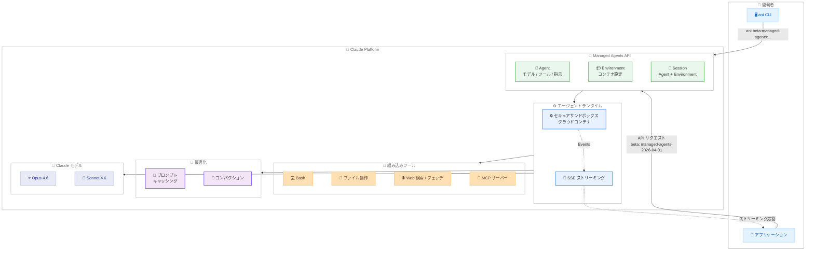
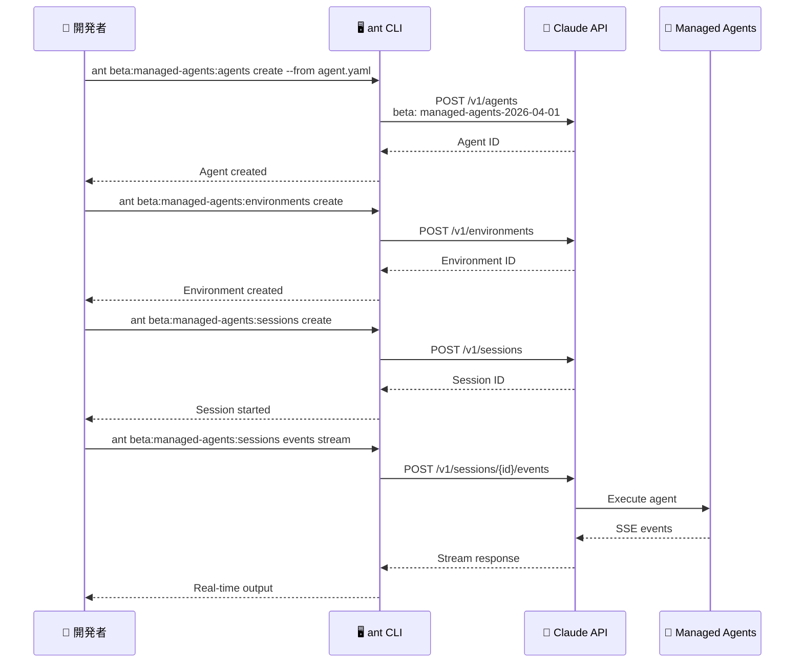

# Claude Managed Agents パブリックベータと ant CLI のローンチ

## メタデータ

| 項目 | 内容 |
|------|------|
| 発表日 | 2026-04-08 |
| ソース | Claude API Release Notes |
| カテゴリ | API / プラットフォーム |
| 公式リンク | https://platform.claude.com/docs/en/release-notes/overview |

## 概要

Anthropic は 2026 年 4 月 8 日、Claude プラットフォームに 2 つの重要な機能を同時にリリースしました。1 つ目は **Claude Managed Agents** のパブリックベータで、Claude を自律的なエージェントとして実行するためのフルマネージドハーネスです。セキュアなサンドボックス環境、組み込みツール、Server-Sent Events (SSE) ストリーミングを備え、開発者がインフラを自前で構築することなくエージェントを運用できます。

2 つ目は **ant CLI** で、Claude API を操作するためのコマンドラインクライアントです。リソースの操作、レスポンスのフィルタリング、YAML ファイルによる API リソースのバージョン管理、そして Claude Code とのネイティブ統合を提供します。これら 2 つの発表により、Anthropic はエージェント開発のワークフロー全体をカバーするプラットフォームへと進化しています。

## 詳細

### 背景

Claude API は従来、Messages API を中心としたステートレスなリクエスト / レスポンスモデルで動作しており、エージェント的な振る舞いを実現するには開発者側でループ処理、ツール実行、コンテキスト管理、サンドボックス環境の構築などを自前で行う必要がありました。2025 年後半から 2026 年にかけて、ツール使用 (Tool Use)、コード実行 (Code Execution)、Web 検索、MCP コネクタなど個別のツールが順次リリースされてきましたが、これらを統合的に管理するマネージドな実行環境は存在しませんでした。

また、Claude API の操作は主に SDK 経由で行われており、リソースの確認やデバッグにはコードの記述が必要でした。API リソースをバージョン管理する標準的な方法もなく、チーム間での共有や CI/CD への統合に課題がありました。

今回のリリースは、これらの課題を解決するものです。Managed Agents はエージェント実行基盤をフルマネージドで提供し、ant CLI は API 操作とリソース管理のための専用ツールを提供します。

### 主な変更点

#### Claude Managed Agents

- **フルマネージドエージェントハーネス**: クラウドコンテナ内でセキュアなサンドボックス環境を提供し、Claude を自律エージェントとして実行
- **組み込みツール**: Bash、ファイル操作、Web 検索 / フェッチ、MCP サーバーを標準搭載
- **SSE ストリーミング**: Server-Sent Events によるリアルタイムのイベントストリーミング
- **4 つのコア概念**: Agent、Environment、Session、Events の 4 つのリソースでエージェントのライフサイクルを管理
- **プロンプトキャッシングとコンパクション**: 組み込みのパフォーマンス最適化機能
- **リサーチプレビュー機能**: outcomes、multiagent、memory (別途アクセス申請が必要)
- **ブランディングガイドライン**: 「Claude Agent」は許可、「Claude Code Agent」は不許可

#### ant CLI

- **マルチプラットフォーム対応**: Homebrew (macOS)、curl (Linux/WSL)、`go install` によるインストール
- **直感的なコマンド体系**: `ant <resource>[:<subresource>] <action> [flags]` 形式
- **多彩な出力フォーマット**: auto、json、jsonl、yaml、pretty、raw、explore (TUI) の 7 種類
- **レスポンスフィルタリング**: `--transform` フラグで GJSON パスによるフィルタリング / 整形
- **ファイル参照**: `@path` 構文でファイル内容をインライン展開
- **リソースのバージョン管理**: YAML ファイルでエージェント、環境、デプロイメントを管理
- **Claude Code 統合**: Claude Code が ant CLI をネイティブに理解
- **デバッグ機能**: `--debug` フラグで HTTP リクエスト / レスポンスを検査

### 技術的な詳細

#### Managed Agents のアーキテクチャ

Managed Agents は 4 つのコア概念で構成されます。

**Agent**: エージェントの定義 (モデル、システムプロンプト、ツール設定など) を保持するリソースです。

**Environment**: エージェントが実行されるクラウドコンテナ環境です。ファイルシステム、ネットワークアクセス、MCP サーバー接続などの実行環境を定義します。

**Session**: Agent と Environment の組み合わせで作成されるステートフルな実行セッションです。セッション内で会話の状態が維持されます。

**Events**: セッションに送信されるユーザーメッセージやシステムイベントです。SSE ストリーミングでレスポンスを受信します。

**ワークフロー**:

1. Agent を作成 (モデル、ツール、指示を定義)
2. Environment を作成 (コンテナ環境を設定)
3. Session を開始 (Agent + Environment で実行コンテキストを作成)
4. Events を送信 (ユーザー入力やイベントを送信)
5. SSE でレスポンスをストリーミング受信

**ベータヘッダー**: 全エンドポイントで `managed-agents-2026-04-01` ベータヘッダーが必要です。

**レート制限**:

| 操作 | 制限 |
|------|------|
| 作成操作 (create) | 60 リクエスト/分/組織 |
| 読み取り操作 (read) | 600 リクエスト/分/組織 |

**サポート機能**:

- 長時間実行タスクのサポート
- クラウドインフラによるスケーラブルな実行
- 最小限のインフラ管理
- ステートフルセッション管理
- 組み込みプロンプトキャッシングとコンパクション

#### ant CLI のコマンド体系

**認証**: `ANTHROPIC_API_KEY` 環境変数で API キーを設定します。

**コマンド構造**: `ant <resource>[:<subresource>] <action> [flags]`

- リソースはコロンでサブリソースを指定可能
- ベータリソースは `beta:` プレフィックスで自動的にベータヘッダーを送信

**出力フォーマット**:

| フォーマット | 説明 |
|-------------|------|
| `auto` | ターミナル環境に応じて自動選択 |
| `json` | JSON 形式 |
| `jsonl` | JSON Lines 形式 |
| `yaml` | YAML 形式 |
| `pretty` | 人間が読みやすい整形出力 |
| `raw` | 生のレスポンスボディ |
| `explore` | TUI によるインタラクティブ閲覧 |

**シェル補完**: bash、zsh、fish、PowerShell に対応しています。

## 開発者への影響

### 対象

- Claude API を使用してエージェントアプリケーションを構築している開発者
- 自律型 AI エージェントの運用インフラを検討しているチーム
- Claude API のリソースをコマンドラインから操作・管理したい開発者
- CI/CD パイプラインに Claude API リソース管理を統合したいチーム
- Claude Code と Claude API を併用している開発者

### 必要なアクション

1. **Managed Agents を試す場合**:
   - ベータヘッダー `managed-agents-2026-04-01` をリクエストに追加
   - Agent、Environment、Session のリソースを作成してワークフローを構築
   - SSE ストリーミングに対応したクライアント実装を準備

2. **ant CLI を導入する場合**:
   - プラットフォームに応じたインストール方法で CLI をセットアップ
   - `ANTHROPIC_API_KEY` 環境変数を設定
   - シェル補完を有効化して生産性を向上

3. **既存のエージェント実装を移行する場合**:
   - 自前のエージェントループ、サンドボックス、ツール管理を Managed Agents に置き換えることを検討
   - Managed Agents のレート制限 (60 creates/min、600 reads/min) を考慮した設計に調整

### 移行ガイド

自前のエージェント実装から Managed Agents への移行は、段階的に進めることを推奨します。

**ステップ 1**: ant CLI をインストールし、API リソースの操作に慣れる

**ステップ 2**: 小規模なエージェントタスクで Managed Agents を試行し、既存実装との性能・挙動を比較

**ステップ 3**: 検証結果を踏まえ、本番ワークロードの移行計画を策定

**変更が不要な箇所**:

- Messages API を直接使用する既存のステートレスなアプリケーション
- ツール定義やレスポンスの処理ロジック (Managed Agents 内部で同じ API を使用)

## コード例

### Managed Agents: エージェントの作成と実行 (Python)

```python
import anthropic

client = anthropic.Anthropic()

# 1. Agent を作成
agent = client.beta.managed_agents.agents.create(
    model="claude-opus-4-6-20260205",
    name="research-agent",
    instructions="You are a research assistant. Use web search and file operations to gather and organize information.",
    tools=[
        {"type": "bash"},
        {"type": "file_operations"},
        {"type": "web_search"},
        {"type": "web_fetch"},
    ],
    betas=["managed-agents-2026-04-01"],
)
print(f"Agent created: {agent.id}")

# 2. Environment を作成
environment = client.beta.managed_agents.environments.create(
    agent_id=agent.id,
    betas=["managed-agents-2026-04-01"],
)
print(f"Environment created: {environment.id}")

# 3. Session を開始
session = client.beta.managed_agents.sessions.create(
    agent_id=agent.id,
    environment_id=environment.id,
    betas=["managed-agents-2026-04-01"],
)
print(f"Session started: {session.id}")

# 4. Events を送信して SSE でレスポンスを受信
with client.beta.managed_agents.sessions.events.stream(
    session_id=session.id,
    agent_id=agent.id,
    messages=[{"role": "user", "content": "Search for the latest AI safety research papers and summarize the key findings."}],
    betas=["managed-agents-2026-04-01"],
) as stream:
    for event in stream:
        if hasattr(event, "type"):
            print(f"[{event.type}] ", end="")
        if hasattr(event, "text"):
            print(event.text, end="", flush=True)
```

### ant CLI: インストールと基本操作

```bash
# macOS - Homebrew でインストール
brew install anthropic/tap/ant

# Linux/WSL - curl でインストール
curl -fsSL https://cli.anthropic.com/install.sh | sh

# Go でインストール
go install github.com/anthropics/ant-cli@latest

# 認証設定
export ANTHROPIC_API_KEY="sk-ant-..."

# シェル補完の有効化 (zsh の例)
ant completion zsh > "${fpath[1]}/_ant"

# モデル一覧を取得
ant models list

# メッセージ送信
ant messages create --model claude-opus-4-6-20260205 --max-tokens 1024 \
  --messages '[{"role": "user", "content": "Hello, Claude"}]'

# JSON 出力で特定フィールドを抽出
ant messages create --model claude-opus-4-6-20260205 --max-tokens 1024 \
  --messages '[{"role": "user", "content": "Hello"}]' \
  --output json --transform "content.0.text"

# ファイル内容をインライン展開して送信
ant messages create --model claude-opus-4-6-20260205 --max-tokens 4096 \
  --messages '[{"role": "user", "content": "Review this code: @src/main.py"}]'

# ベータリソース (Managed Agents) の操作
ant beta:managed-agents:agents list
ant beta:managed-agents:agents create --from agent.yaml

# デバッグモード (HTTP リクエスト/レスポンスを表示)
ant messages create --model claude-opus-4-6-20260205 --max-tokens 256 \
  --messages '[{"role": "user", "content": "Test"}]' --debug

# YAML ファイルでリソースをバージョン管理
ant beta:managed-agents:agents create --from agent.yaml
ant beta:managed-agents:environments create --from environment.yaml
```

### ant CLI: リソース定義の YAML ファイル例

```yaml
# agent.yaml - エージェント定義
name: research-agent
model: claude-opus-4-6-20260205
instructions: |
  You are a research assistant.
  Use web search and file operations to gather and organize information.
tools:
  - type: bash
  - type: file_operations
  - type: web_search
  - type: web_fetch
```

### ant CLI: explore モード (TUI) での閲覧

```bash
# TUI でインタラクティブにレスポンスを閲覧
ant models list --output explore

# 特定のモデル情報を YAML で表示
ant models get claude-opus-4-6-20260205 --output yaml
```

## アーキテクチャ図

### Managed Agents のワークフロー



### ant CLI のコマンドフロー



## 関連リンク

- [Claude API Release Notes](https://platform.claude.com/docs/en/release-notes/overview)
- [Claude Managed Agents Overview](https://platform.claude.com/docs/en/managed-agents/overview)
- [ant CLI Reference](https://platform.claude.com/docs/en/api/sdks/cli)
- [Claude API Client SDKs](https://platform.claude.com/docs/en/api/client-sdks)
- [Tool Use Overview](https://platform.claude.com/docs/en/agents-and-tools/tool-use/overview)
- [MCP Connector](https://platform.claude.com/docs/en/agents-and-tools/mcp-connector)

## まとめ

Claude Managed Agents と ant CLI の同時リリースは、Anthropic のプラットフォーム戦略における大きな転換点です。Managed Agents はエージェント実行に必要なインフラ (サンドボックス、ツール統合、セッション管理、パフォーマンス最適化) をフルマネージドで提供し、開発者がエージェントのロジックに集中できる環境を実現します。Agent、Environment、Session、Events の 4 つのコア概念による明確なリソースモデルと、SSE ストリーミングによるリアルタイムなイベント配信が特徴です。

ant CLI は Claude API の操作を大幅に効率化するコマンドラインツールで、7 種類の出力フォーマット、GJSON パスによるレスポンスフィルタリング、YAML ファイルでのリソースバージョン管理など、開発者ワークフローに直結する機能を提供します。ベータリソースの `beta:` プレフィックスによる自動ヘッダー送信や、Claude Code とのネイティブ統合も注目に値します。

これら 2 つの機能は相互補完的であり、ant CLI で Managed Agents のリソースを YAML ファイルとして定義・管理し、バージョン管理システムで追跡できます。全エンドポイントにベータヘッダー `managed-agents-2026-04-01` が必要な点と、レート制限 (作成 60 回/分、読み取り 600 回/分) に留意しつつ、段階的な導入を検討してください。
